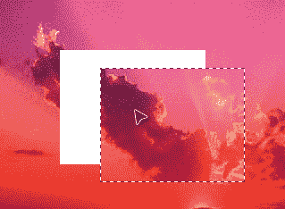
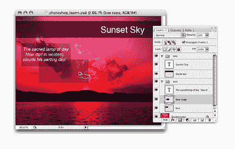
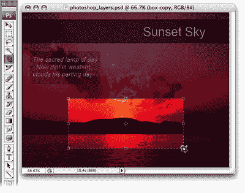
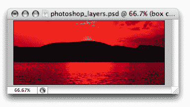
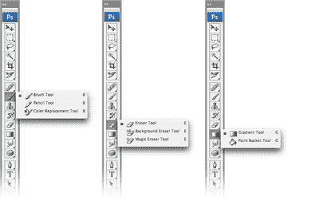
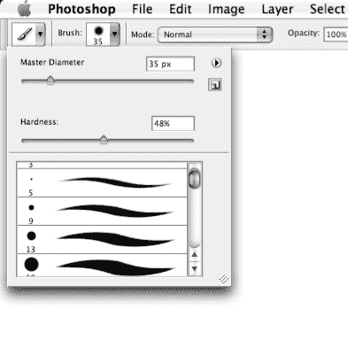
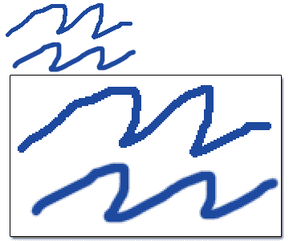
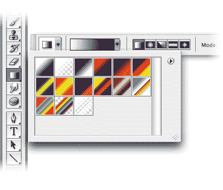
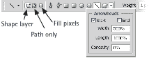
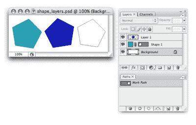

# Photoshop 入门:更多工具

> 原文：<https://www.sitepoint.com/getting-started-photoshop-4/>

***移动工具***

移动工具(V)移动选定区域或整个层。使用大多数其他工具时，您可以通过按住 Ctrl 键(Mac 上的 Command 键)来临时调用移动工具。

*移动和复制快捷键*
对于大多数工具来说，按住 Ctrl-Alt(Mac 上的 Command-Option)并拖动选定区域会暂时调用移动工具，允许您快速移动和复制选定的图层。

您也可以在使用移动工具时按住 Alt 键(Mac 上的 Option 键)来复制图层，如下图所示。

***裁剪工具***

裁剪工具(C)用于修剪图像。使用裁剪工具创建选区，然后双击选区的中心，或按 enter 键，将图像裁剪到选区的大小。

要取消而不进行裁剪，请选择另一个工具或按 Esc 键。

*框外裁剪*
你可以使用裁剪工具来调整画布的大小。扩展文档窗口，使其大于图像区域，并创建一个包含图像并延伸到图像“外部”灰色区域的裁剪选区。应用此裁剪将调整您的画布大小，以包括那些扩展的边界，使您的画布更大。

***绘画工具***

除了其非凡的照片编辑能力，多才多艺的 Photoshop 还提供绘图和绘画工具，允许您创建自己的形状和背景。

**刷**

画笔工具(B)适用于软边绘画或绘图。通过在画布上单击并拖动鼠标来绘制笔画。您可以在窗口顶部的选项栏中更改笔刷大小和其他设置。

**铅笔**

铅笔工具(B)适用于硬边绘图或绘画，并具有与画笔工具相似的选项来设置其大小、不透明度等。铅笔工具通常用于在放大的图像上绘制和编辑单个像素。

**橡皮擦**

橡皮擦工具(E)从画布中移除像素。您可以从选项栏的“模式”下拉菜单中选择铅笔、画笔或块模式。

*锯齿 vs 反锯齿*
与画笔工具不同，铅笔工具的边缘是锯齿的。术语“锯齿”是指对象的边缘是“锯齿状的”，而反锯齿对象的边缘是“平滑的”在这里显示的两个示例中，每个示例中的顶部形状是使用铅笔工具创建的，而底部形状是使用画笔工具创建的。请注意这些曲线边缘的“锯齿状”差异。当我们讨论文本工具时，我们将更仔细地研究反走样。

**油漆桶**

油漆桶工具(G)用平面颜色填充选区。要使用油漆桶工具，请在要填充的区域单击一下。如果所选区域不在选区内，油漆桶工具将填充所单击区域附近所有颜色相似的像素。

**坡度**

渐变工具(G)用两种或多种颜色的混合填充选区，称为渐变。您可以轻松创建自己的渐变，或者使用 Photoshop 中任何可用的预设渐变。

通过点击渐变工具右侧的小三角形来显示渐变预设和工具。通过设置所需的颜色，选择渐变样式，然后在要填充的区域上单击并拖动光标来应用渐变。

我发现我最常使用的是前两种渐变——前景到背景的渐变和前景到透明的渐变。前者会把你的前景色融入你的背景色，后者会把你的前景色融入透明的背景，给人一种“淡出”的效果。

***文字工具***

文字工具(T)，名副其实，创建文字层。这个工具很容易使用——只需选择文本工具，点击画布，然后开始输入！您也可以单击并拖动以创建一个矩形文本区域，该区域将强制文本在其边界内换行。您可以使用窗口顶部的选项栏来更改字体大小、颜色和其他文本属性。

当文本工具处于活动状态时，您可以将光标移出文本区域。光标将从“文本插入”光标变为“移动”光标，您可以四处移动文本层。

值得注意的是，当文本工具处于活动状态时，您不能使用键盘快捷键来访问其他工具。现在看来，这似乎是一件显而易见的事情，但它不会总是如此明显——尤其是当你的文本因为你一直在尝试使用快捷键而神秘地开始喷射奇怪的字符时！

若要结束使用文本工具，请按 Ctrl-Enter(在 Mac 上按 Command-Return)。然后，您可以恢复您的常规键盘快捷方式！

***形状工具***

您可以通过单击并拖动 Photoshop 的矩形、圆角矩形、椭圆、多边形、线条和自定义形状工具(U)来创建形状。

每个形状工具的特定选项显示在选项栏中，您可以通过单击自定义形状按钮右侧的箭头来访问其他选项。例如,“线”工具具有显示箭头以及控制这些箭头的形状和大小的选项，如下例所示。

如果查看每个形状的选项，您会注意到有三种不同的方法可以用来创建形状:

您的形状将被创建为一个纯色层覆盖着一个矢量形状的面具。迷茫？把蒙版想象成一张深色的纸，上面剪了一个洞(你的形状),这样颜色就能透过这个洞。要改变颜色，双击图层面板中的颜色块，如下例所示。要更改矢量形状遮罩，请使用矢量编辑工具。

*   **作为路径**–你的形状将在路径面板中被创建为一个路径，如上面的例子所示(其中路径被命名为工作路径)。
*   **作为填充像素**–你的形状将在当前选择的图层上创建。我创建了一个新层，然后在上面的例子中的层 1 上使用填充像素选项创建了一个形状。

**进入页面:**[1](/getting-started-photoshop)|[2](/getting-started-photoshop-2/)|[3](/getting-started-photoshop-3/)|[4](/getting-started-photoshop-4/)|[5](/getting-started-photoshop-5/)|[6](/getting-started-photoshop-6/)

如果你喜欢读这篇文章，你会爱上[可学的](https://learnable.com?utm_source=sitepoint&utm_medium=link&utm_campaign=learnablelink)；向大师们学习新技能和技术的地方。会员可以即时访问 SitePoint 的所有电子书和互动在线课程[Photoshop 基础](https://learnable.com/courses/foundations-of-photoshop-2712?utm_source=sitepoint&utm_medium=link&utm_campaign=learnablelink)。

对本文的评论已经关闭。对 Photoshop 有疑问？为什么不在我们的[论坛](https://www.sitepoint.com/forums/forumdisplay.php?8-Graphics?utm_source=sitepoint&utm_medium=link&utm_campaign=forumlink)上问呢？

## 分享这篇文章