# Photoshop 入门

> 原文：<https://www.sitepoint.com/getting-started-photoshop-5/>

## Photoshop 入门

不管你是平面设计领域的新手，或者你是一名摄影师，你想增强你的照片，你最终都会遇到使用 Adobe Photoshop 的需要。记得当我第一次开始的时候，我回忆起我是多么害怕所有可用的菜单和功能。我不知道我将如何开始知道如何通过 Photoshop 工作，并创建专业质量，令人眼花缭乱的工作。几年后，我每天都使用 Photoshop，我的行动更像是反射，我可以毫不犹豫地完成大多数任务。我不会骗你。你不可能一夜之间从入门到专业，但是你可以感到欣慰的是，每个人都必须从某个地方开始。

## 了解 Photoshop 的使用方法

对每样东西的位置有一个大致的概念是很好的，这样你就可以在 Photoshop 界面中找到自己的工作方式。首先，我将列出一些术语，以及在 Photoshop 中可以找到它们的位置。

### 1.炙单

这是你的选项，图像调整和过滤器。当您在 Photoshop 中运行滤镜时，可以在“滤镜”菜单下的这一部分找到它们。
**2。选项栏**

当您选择了一个工具时，此菜单最常用。它允许您调整为活动工具指定的设置。

### 2.工具箱

默认情况下，它位于屏幕的左侧，包含程序中所有可用的不同工具。如果一个工具在右下角有一个黑色的三角形，那么在子菜单中还有其他与该工具相关的工具。你所要做的就是点击并保持你的鼠标在工具上来显示子菜单。

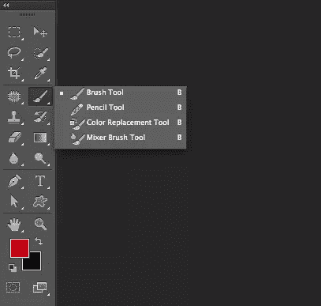

## 学习 Photoshop 时可能会听到的术语

学习 Photoshop 的时候，你可能在看视频教程，看书，或者在网上看博客教程，讲的是如何在 Photoshop 里做一些事情。大多数作者都假设读者对使用 Photoshop 的基本术语有一个大致的了解。

### 嵌板

这是指 Photoshop 中的每个窗口，其中包含对文档不同方面的控制。很好的例子是颜色面板、图层面板、路径面板，以及除了工具箱以外的任何在实际 Photoshop 文档旁边打开的东西。面板的伟大之处在于，您可以按照自己的意愿来排列它们。您可以将任何面板与另一组面板停靠在一起，以便整合您的工作区。这对于使用笔记本电脑或小显示器的人来说尤其方便。你所要做的就是点击并拖动任何面板的标题标签到另一个面板上。底部面板将以蓝色显示，让您知道您可以将此面板与另一组面板对接。松开鼠标，现在你将在一个小窗口中拥有多个面板。

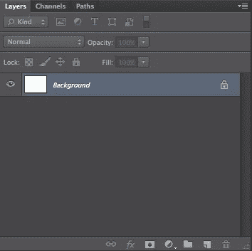

一个好的经验法则是对接相似的项目。我倾向于将色板、颜色、风格和颜色放在一起。然后，我将图层、通道和路径对接在一起。我还将画笔和画笔预设停靠在一起，并将字符和段落面板停靠在一起。

### 文档窗口

这是您在 Photoshop 中处理的实际图像或文件。这也指 Photoshop 中任何其他打开的文档。您可以在 Photoshop 中一次打开多个图像。

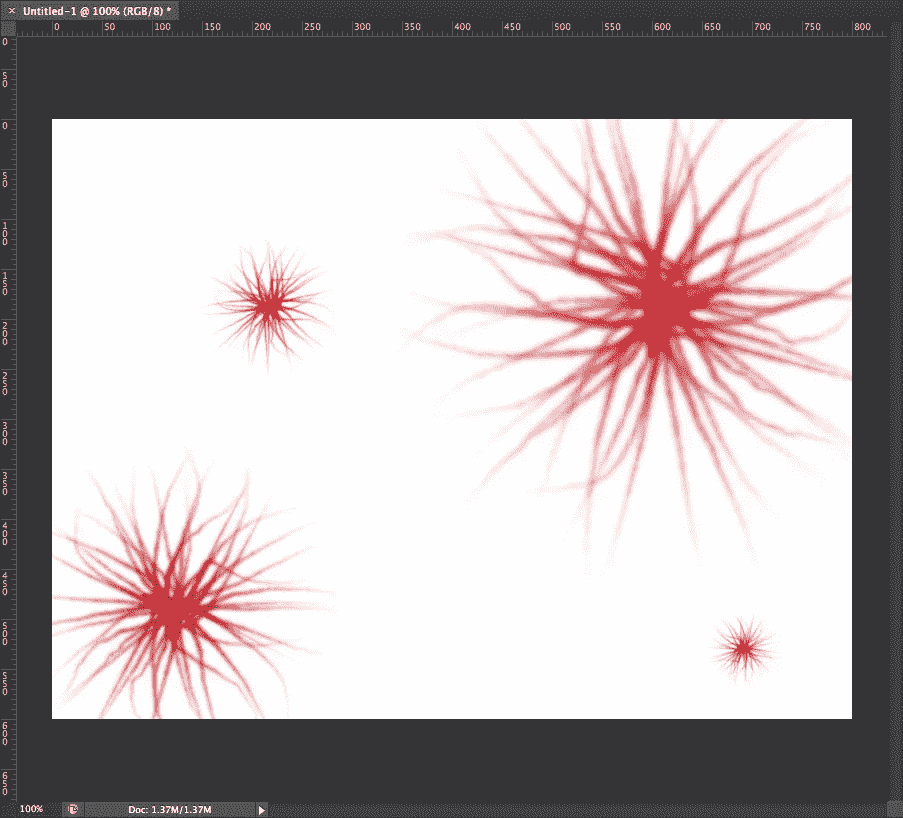

### 对话框

这是指当您在 Photoshop 中选择“选择使用滤镜”或某些选项时打开的弹出框。对话框通常包含您刚刚选择的过滤器或操作的选项和设置。

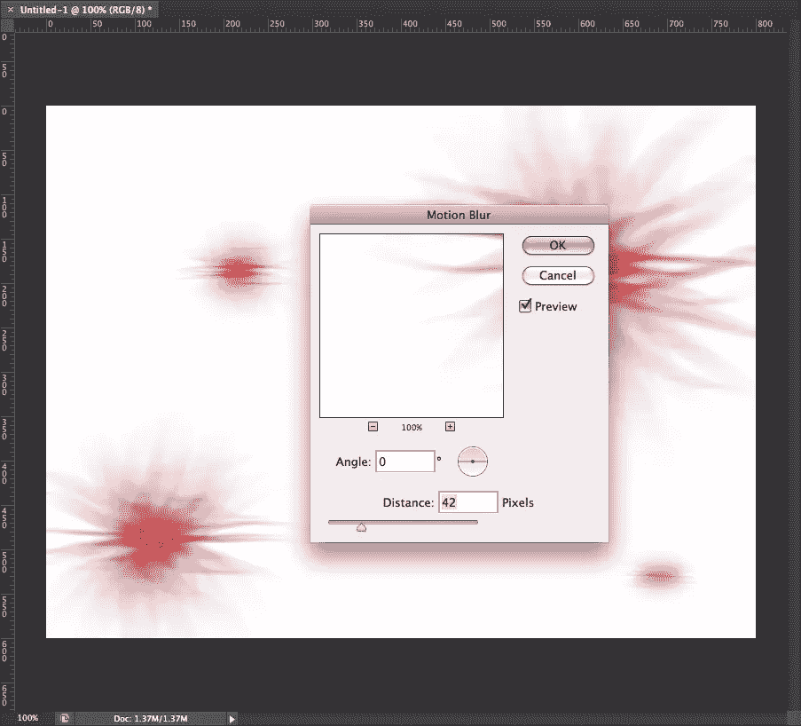

## 适应周围的环境

Adobe 喜欢让事情按你喜欢的方式设置变得简单。他们集成了一个叫做工作空间的功能。工作区允许您按照自己喜欢的方式设置 Photoshop 面板。您可以按照自己喜欢的方式安排工作区，并将其保存为预设。

Photoshop 已经提供了适合不同专业人士的工作空间预设。预设是基本要素，设计，绘画，摄影，3D，运动和 CS5 的新。您可以轻松保存自己的预设。只需按照您喜欢的方式安排您的面板和工作空间。您可以关闭某些不经常使用的面板，如果有您想要激活的面板，但您看不到它们，您可以快速使它们可见。只需转到窗口>然后选择您想要使其可见的面板。一旦您获得了您想要的一切，单击工作区列表旁边的双箭头，并选择 New Workspace。

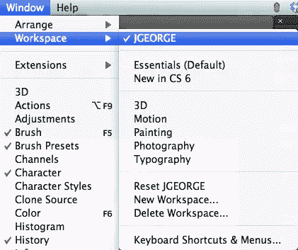

将弹出一个对话框，允许您命名您的工作区，以便以后可以激活它。您还可以选择记住您的键盘快捷键和菜单设置。这使您能够获得所需的最大灵活性，并且只需点击一个按钮就可以切换工作区。这加快了你的工作流程，节省了你的时间，因为你不需要不断地打开和关闭面板，移动它们，重新排列它们，等等。

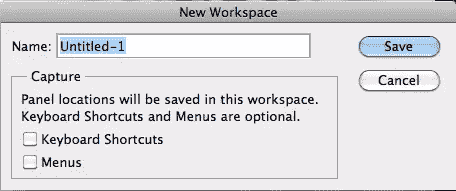

## 新文档

只需进入文件>新建打开一个空白文档。一个对话框会出现几个选项。您可以为文档选择自定义文件大小、分辨率和颜色模式。如果你是 Photoshop 的新手，那么你会想知道这些是什么，它们意味着什么。

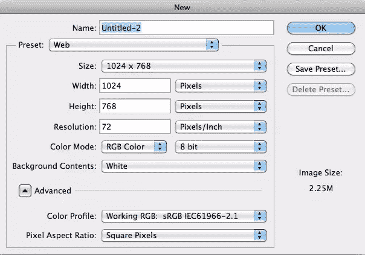

## 宽度和高度

文档的宽度和高度很重要。您可以选择使用英寸、像素、厘米、毫米、磅、十二点活字或列。像素是组成图像的最小颜色信息块。如果你是为网页设计，你很可能会选择像素，因为尺寸是以像素为单位的。英寸在印刷设计中很有用，因为你指的是文档的物理尺寸。

厘米、毫米、磅和十二点活字也用于印刷，但不再广泛使用。

## 解决

文档的分辨率和大小同样重要。你为网络所做的工作通常是以每英寸 72 像素来完成的。这是大多数显示器显示图像的分辨率。如果您设计的作品是用于打印目的，例如商业摄影，或者您想要打印的任何东西，例如照片、名片、传单和小册子，那么您应该选择 300ppi。这样密度更大，图像更清晰。

## 颜色模式

你的颜色模式很重要，因为就像分辨率一样，你的颜色模式将取决于你想要的结果。最常用的颜色模式是 RGB 和 CMYK。Lab 颜色、位图和灰度是颜色模式的其他选项。LAB 模式用于许多专业色彩校正，您可以在此颜色模式下完成一些在其他模式下难以完成的工作。这通常是为已经很好地理解 Photoshop 的更高级的用户准备的，因为 LAB 颜色模式是完全不同的动物。

### RGB

RGB 颜色模式由 3 个颜色通道组成-红色、绿色和蓝色。RGB 主要用于网页设计和屏幕或显示器。为了显示图像，显示器的颜色由红、绿和蓝光组成，因此 RGB 模式是最适合和最逼真的工作模式。记住所有的显示器都是不同的，这很好。一台显示器显示的蓝色可能与下一台显示器略有不同，并且这两台显示器都可能与下一台显示器不同。

### 用于印刷的四分色

CMYK 模式主要用于打印。CMYK 代表青色、品红色、黄色和黑色。这些是在大多数传统打印机中构成图像的墨水颜色。你会发现有趣的是，青色、品红色和黄色的不同组合会形成红色、绿色和蓝色。在 Photoshop 中进行设计时，一定要记住 CMYK 模式下的图像看起来与在显示器上打印的图像不完全一样。设计师们已经为这个问题奋斗了多年。高端专业人士会使用一些颜色校准工具，但使用一种叫做校样的东西仍然是一个好主意。

校样是您要打印的图像或设计的打印样本。您将它与显示器上的预期工作进行比较，并根据验证结果对设计进行调整。您的设计在您的计算机上看起来可能很完美，但是当它被打印出来时，它比预期的更黄。在最终印刷被批准之前，您将调整您的颜色以补偿额外的黄色，您甚至可以订购第二个校样。

有些印刷商对你的作品收取硬拷贝的费用，有些人可能会认为不值得额外的花费。这真的取决于你的项目，因为你可能会订购 10，000 本，如果它们都被毁了，那么你必须承担成本，或者你可以多花 10 美元，以防万一。

## 新文档预设

除了分辨率和颜色模式之外，Photoshop 使生活变得更加简单，并整合了文档预设，因此您不必记住所有文档的尺寸。一个很好的例子是，如果你制作了许多平板电脑屏幕的模型，而你不想记住 ipad 屏幕、三星 Galaxy、ipod touch 和十几个其他设备的尺寸。您可以一次输入尺寸，并将其保存为预设。Photoshop 已经整合了一些现成的预设，如纸张大小和正常的网站大小。

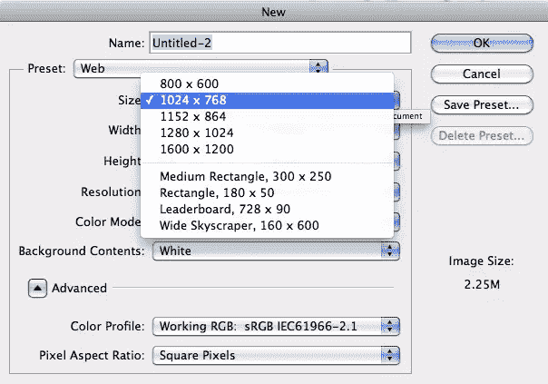

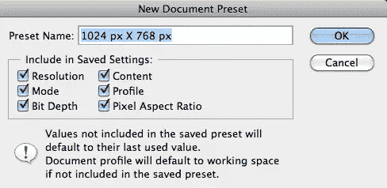

## 层

Photoshop 最重要的一个方面就是图层功能。图层是你可以叠加图片，混合图片，添加颜色，去掉颜色，合并图层等等。在下面的例子中，文档由 3 层组成:黑色背景层，设置为强光混合模式的中间纹理层，然后是顶部的文字层。层如何堆叠将极大地决定你的作品的外观。

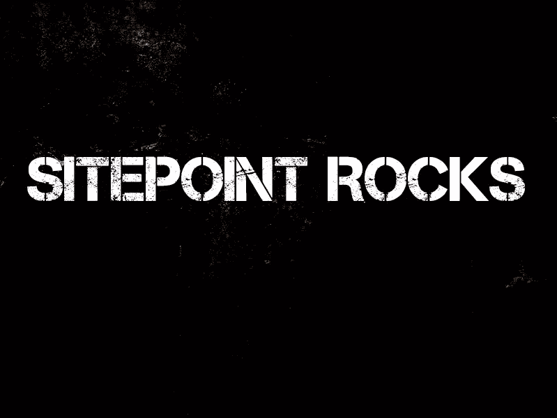

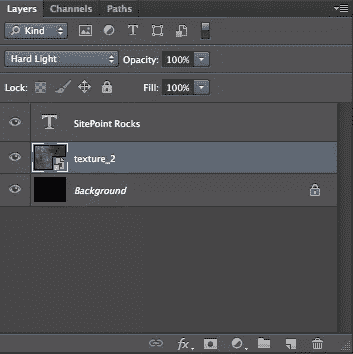

## 快捷指令

要创建一个新层，请按 Command/Ctrl +N 创建一个新层。就我个人而言，我使用图层面板，有一些按键可以节省时间，让生活变得更容易。若要在活动层下创建新层，请在点按“新建层”图标时按住 command/ctrl 键。您可以通过进入“窗口”>“工作区”>“键盘快捷键和菜单”来创建自己的自定义键盘快捷键。

## 不透明

图层的不透明度是指你能透过它看到多少。0%的不透明度意味着你可以看穿它。50%不透明度意味着它是 50%透明的。100%的不透明度意味着你根本看不透它。要降低特定图层的不透明度，只需输入您想要的不透明度数值。例如，如果您想要所选图层的不透明度为 30%，请点击 3 键。你想怎么做就怎么做。通过快速轻按两个数字，您可以使层具有两位数的不透明度。例如，如果您想要图层的不透明度为 45%，您可以快速点击 4-5。在下面的例子中，两个圆都在它们自己的图层上，并且设置为 50%不透明度。

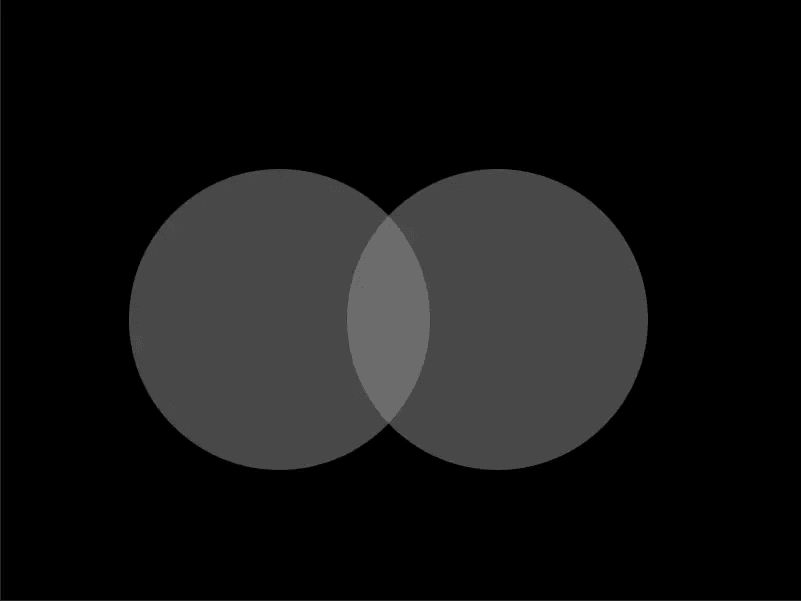

要按顺序选择多个层，请按住 shift 键并单击所需的层。如果要选择特定的层，请按住 command/ctrl 并单击每个层。当选择多个层时，您可以一次移动所有这些层的内容。除非未选中它们，否则它们被视为已连接。

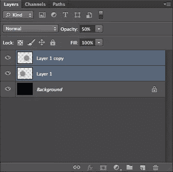

组织图层的一个好方法是将它们组合在一起。选中多个图层，转到图层>新建>图层组。你可以给这个组起任何你想要的名字，所有的层都在这个文件夹里。您可以单击文件夹旁边的三角形来展开其内容。通过使用文件夹图标选择图层组，可以一次移动整个图层组。您也可以通过单击“图层”面板底部的链接图标来链接图层。当各层连接在一起时，它们会一起移动。

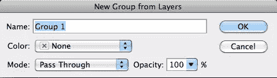

你可以把一层一层的堆叠起来。有时，当您处理完多个图层时，合并它们可能会有所帮助。这被称为合并层。你可以选择多个图层，然后按下 command/ctrl+E 键。

要复制层，请按 command/ctrl+ J。

## 工具

Photoshop 里有很多工具供你使用。我将从左到右，从上到下介绍它们。下面是一张图表。

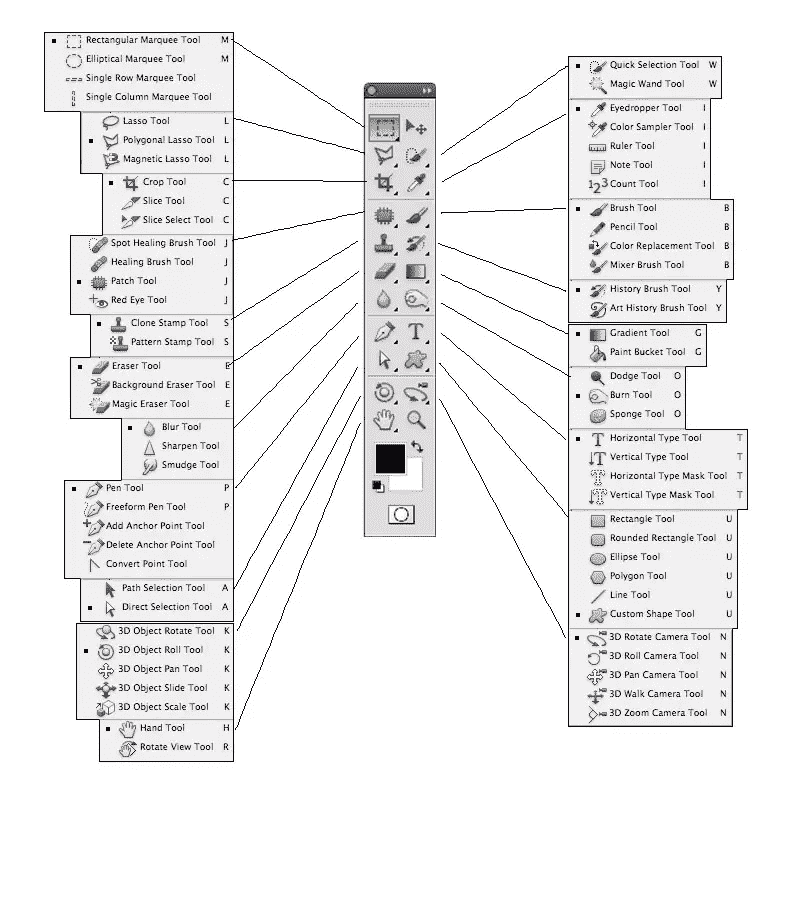

### 1.选取框工具

矩形–在 Photoshop 文档中选择矩形选区。使用任何选择工具，您都可以按住 shift 键添加到选择中，按住 option/alt 键从选择中减去。您也可以羽化您的部分，这会模糊您的选区和图像其余部分之间的过渡。

椭圆–这允许您进行圆形选择，矩形选框工具的相同规则也适用于椭圆选框工具。

单行–此工具从左到右进行 1px 水平选择，跨越文档的总宽度。这对于为您的网站创建 1px 重复模式非常有用。

单列–此工具从左到右进行 1px 垂直选择，跨越文档的总高度。这对于为您的网站创建 1px 重复模式非常有用。

### 2.移动工具

移动工具就是这样做的。您可以选择当前层上的任何内容，并将其移动到屏幕上的不同位置。如果你已经做了一个选择，你可以移动选择，它会把它从层的其余部分切掉。您也可以告诉 Photoshop 自动选择图层或组，但当您试图工作时，这可能会很烦人。

### 3.套索工具

套索工具-这个工具可以让你在图层上的任何东西周围进行松散的选择。它具有与选框工具相同的选项。

多边形套索工具——这个工具允许你进行选择，但是它是以一种严格的线性方式进行选择的。换句话说，你可以为你的选择画直线。

磁性套索工具——这是一个方便的选择工具，允许你在图像的边界上拖动鼠标，它可以确定边缘的位置，并以固定的间隔放置锚点。这应该给你一个密切和相对可控的选择。

### 4.快速选择工具

快速选择工具根据对象的边界进行选择。就像它的名字一样，它可以快速地做出选择，你可以简单地拖动你想要选择的区域。

魔棒工具–魔棒工具根据您点击鼠标的位置进行选择。与其他选择工具一样，按住 shift 添加到选择中，按住 option/alt 从选择中减去。“连续”选项决定您是希望仅选择该专色，还是希望在整个图像中选择该颜色信息。

### 5.裁剪工具

“裁剪”工具允许您将图像裁剪到所需的比例。您可以输入一个设定的比率，例如 3 x 5 的比率，或者您也可以为裁剪的图像确定一个固定的大小和分辨率。

切片工具–切片工具允许您将图像或图形切片，以便在 web 上使用。它基本上类似于裁剪工具，但用于网络。一旦你把你的图片切片，你就可以一次把它们导出到网上。

切片选择工具–这允许您选择特定的切片并编辑其边界。这允许您在导出切片之前进行适当的调整。

### 6.吸管工具

吸管工具允许您从任何图像中取样颜色，以便您可以在工作中使用它。您可以控制它采样的颜色区域，以便它采样一个精确的像素，或者它可以采样一个范围的像素。此外，您可以对当前层或所有层进行采样。

颜色采样器工具-这允许你在你的图像中采样多达 4 个区域的颜色，这样你就可以得到关于这些颜色的信息。像吸管工具一样，您可以确定它采样的像素范围。

标尺工具——标尺工具会告诉您两点之间的距离，但它也可以帮助您拉直照片。

注释工具–注释工具允许您向 Photoshop 文档添加注释。这对于协作来说非常好，并且确实有助于组织和简化工作流程。您可以将笔记导出为 pdf 版本的文件，这对参与项目但没有 Photoshop 的人来说很方便。

计数工具–计数工具允许您在计数时在图像中的对象上放置一个可视标记，并对其进行跟踪。您也可以有多个计数组，这意味着您可以在同一图像中跟踪多种类型的对象。

### 7.斑点修复刷

斑点愈合刷是一个伟大的工具，消除图像的文物和污点。它只需简单地点击一下鼠标，就可以对周围区域进行采样，并消除异常。如果您将其设置为内容感知，您可以删除更大范围的不需要的内容。

修复画笔工具——修复画笔允许你刷掉图像中不想要的瑕疵和区域。您单击 option/alt 键来选择某些

修补工具–修补工具是一个很棒的工具，你可以用它来做一个类似套索工具的选区。选择完成后，您可以单击并拖动它到您希望填充它的区域，当您释放它时，它会用您指定的内容修补它。

红眼工具——红眼工具是一个快速简单的工具，它允许你点击图像中有红眼的部分，并立即移除它们。如果眼睛外面有红色部分，可能会造成不良影响。

### 8.画笔工具

画笔工具是你的武器库中最重要的工具之一。在 Photoshop 中，你可能会比其他任何工具更多地使用画笔工具，尤其是在润饰图像时。您可以更改画笔的大小、硬度、形状、纹理、不透明度、流动、使用时的行为等等。

铅笔工具–铅笔工具允许您在 Photoshop 画布上绘画，就像使用一支真正的铅笔一样。

混合笔刷工具——混合笔刷是一个非常棒的工具，它可以让你模拟真实的媒体，比如绘画，以及将颜色和真实效果混合。这是一种在 Photoshop 里面绘画的自然方式，并且通过 Photoshop CS5，有许多硬毛刷可以用来模拟传统画笔的行为。

### 9.克隆图章工具

克隆图章工具用于从另一个区域克隆或复制图像信息。按住 option/alt 键并点按以对图像的某个区域进行采样。然后，单击图像，用您采样的颜色和图像信息进行笔刷。

图案图章工具–图案图章工具使您能够使用画笔类型的工具在文档上绘制图案或纹理。

### 10.历史画笔工具

使用此工具，您可以将图像状态或快照绘制到不同的图层中。这允许您从另一个项目状态引入细节。

艺术历史画笔工具-这与历史画笔的作用相同，但添加了不同设置和参数的风格化效果。

### 11.橡皮擦工具

橡皮擦工具从文档中删除像素信息。它允许您删除不需要的内容。您可以使用画笔，就像 Photoshop 中任何其他与画笔相关的工具一样，您可以指定画笔。您可以调整笔刷的不透明度和硬度。

背景橡皮擦工具——背景橡皮擦工具是一个去除图像背景的好工具。简单地点击并拖动橡皮擦沿着图像及其背景的边界，它将删除背景。尽管这不是一个完美的提取方法，而且需要反复试验。

魔术橡皮擦工具–魔术橡皮擦根据您单击要移除的区域，移除图像背景的一部分。它做得很好，但有时它删除了不必要的区域，这需要大量的试验和错误。

### 12.渐变工具

渐变工具允许您创建两种或多种颜色的混合。您可以确定混合的角度、不透明度、混合的颜色数量以及渐变中的步骤顺序。

油漆桶工具–油漆桶工具将根据公差设置用颜色填充一个区域。它将连续填充，或者您可以将其设置为填充该颜色范围内的任何区域。

### 13.涂抹工具

涂抹工具的工作原理类似于画笔，但它会涂抹像素，并允许您随意移动像素。它允许您轻松地混合和转换颜色。

锐化工具–锐化工具使您能够通过手动绘画来锐化图像区域。这给了你很多的控制和精确的图像锐化。

模糊工具–模糊工具允许您模糊图像的部分，这有助于图像之间的过渡。像锐化工具一样，它的行为就像一个刷子，给你精确的定位。

### 14.减淡工具

减淡工具可以让你在图像的不同色调范围内画出高光。

加深工具——加深工具允许你在阴影中绘画，加深图像中不同的色调范围。

海绵工具——海绵工具允许你增加或减少图像的饱和度。你可以像画笔一样使用它，在精确的区域绘画。

### 15.钢笔工具

使用钢笔工具，您可以在图稿中绘制路径。印刷设计师使用钢笔工具在对象周围绘制路径，以便在项目中使用它们。许多印刷设计软件(如 Quark 和 InDesign)允许您使用 Photoshop 中嵌入的剪辑路径，这样您的照片周围就没有背景。

自由笔工具——自由笔工具是一种绘图工具，可以让您手动绘制路径，并沿路径添加锚点。这是一种手工绘制路径的自然方式，可能对使用绘图板的用户最有利。

添加锚点工具–此工具允许您通过使用此工具并直接单击路径本身来向路径添加锚点。

删除锚点工具–此工具允许您从路径中删除不需要的锚点。这让你的道路保持干净，没有太多的点。

转换点工具–此工具允许您选择一个路径，并将其从直线路径转换为圆形路径，或者从圆形路径转换为直线路径。

### 16.文字工具(水平文字工具)

这是在 Photoshop 中创建文字的主要工具。

垂直文字工具–垂直文字工具允许您垂直键入，而不是传统的水平方法。

水平文字蒙版工具和垂直文字蒙版工具——这些工具可以让你从一种字体制作蒙版，如果你知道你想马上栅格化文字，这可以帮你节省一两步。如果您想要由颜色或纹理组成的可编辑文字，您可以简单地使用普通文本的剪切路径，它将同样工作，同时仍然是可编辑的。

### 17.路径选择工具

路径选择工具使您能够一次选择整个路径。这使您可以移动整个路径，而不仅仅是一个点。

直接选择工具–直接选择工具允许您选择路径中的一个或多个锚点，以便您可以移动它们或改变它们的排列。

### 18.形状工具

这些工具包括矩形、圆角矩形、椭圆、多边形、线条工具和自定义形状工具。它们允许您根据路径或矢量形状图层绘制自定义形状，为您提供清晰的线条。

### 19.3D 工具

Photoshop 中的 3D 工具允许您在 3D 空间中操作对象。

### 20.相机工具

使用 3D 时，相机工具允许您改变相机视图的位置。允许您在场景中平移或旋转。

### 21.手工工具

手形工具可让您移动到图像的任何区域，而不会意外地在层上的对象层周围拖动。只要按住空格键，就可以随时快速切换到手工具。

旋转视图工具——旋转视图工具非常方便，因为它允许您旋转整个画布，并将其置于任何 360°旋转位置。要将其恢复到普通视图，只需单击选项栏中的重置视图按钮。

### 22.缩放工具

缩放工具用于放大和缩小文档。当有人想要放大图像的特定部分时，通常会使用它。你可以简单地点击并拖动选择的图像，它会放大该区域。

## 常见任务

### 掩饰

要制作一个面具，你有几种不同的选择。蒙版允许您将图像、修饰图像、混合效果和合成图像混合成一张令人信服的照片。

快速蒙版

快速面膜做起来真的很简单。只需按 Q 键调出快速蒙版模式，在这里你可以使用画笔工具在你想要选择的区域绘画。这些区域将以透明的红色显示。当你完成后，你可以再次点击 Q 键，你会看到你的快速蒙版是一个活跃的选择。只需单击“图层”面板中的图层蒙版图标，即可将您的选区转换为该图层的蒙版。

真实图层蒙版

单击“图层”面板中的图层蒙版图标创建一个新的图层蒙版。你将使用画笔工具在你的面具上绘画。黑色隐藏图像，显示下面的图层，白色显示图像，隐藏下面的内容。

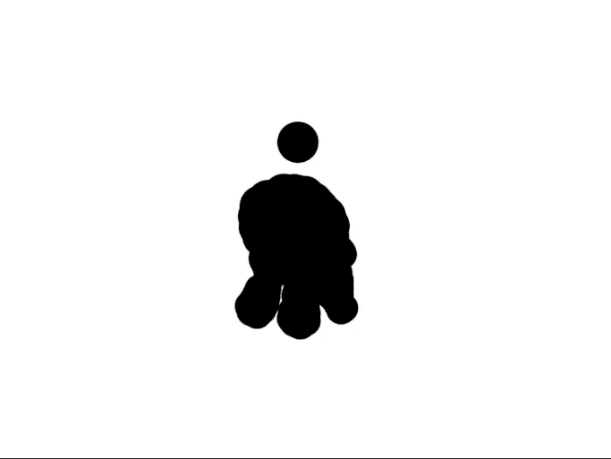

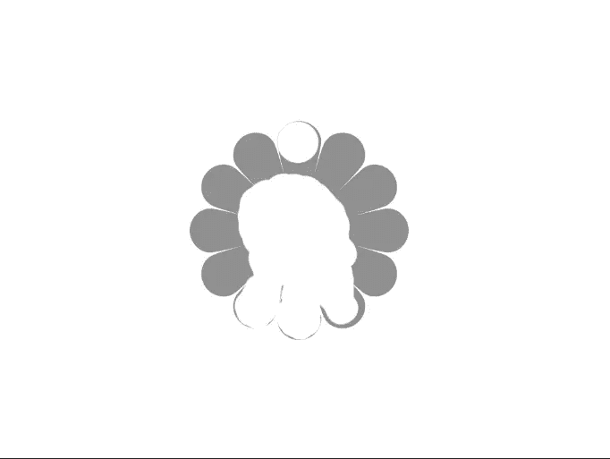

### 选择

您可以通过多种方式创建选择。一种方法是使用魔棒工具，点击图像的某个区域进行选择。您可以在单击新区域时按住 shift 键添加到选区中，在单击区域时按住 alt/option 键可以从选区中减去。

快速选择工具是一个很棒的工具，因为它可以在你点击并拖动图像区域时快速选择它们。您可以快速选择人物和对象。就像魔棒工具一样，当你点击一个新的区域时按住 shift 可以增加选区，当你点击一个区域时按住 alt/option 可以减少选区。您可以使用选框工具进行选择。矩形选框工具创建矩形或正方形选区，椭圆选框工具创建椭圆形或圆形选区。您可以使用套索工具、多边形套索工具和磁性套索工具手动进行选择。这些工具将允许您进行自定义选择。一旦您使用这些工具中的任何一个进行了选择，如果您在 Photoshop 顶部的选项栏中单击“调整蒙版”，您可以调整您的选择，其中一个输出选项是“使用图层蒙版新建图层”。这给了你一个高度精炼的面具，你可以为自己的目的而调整。

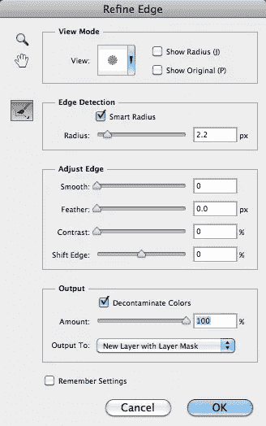

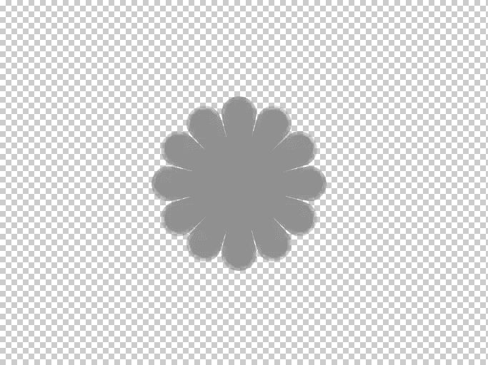

## 结论

第一次开始使用 Photoshop 可能会令人望而生畏，但学习基础知识和熟悉程序可以让事情变得快速而简单。和任何事情一样，熟能生巧，所以只要稍加练习，你很快就会习惯这个界面。了解 Photoshop 会做什么和不会做什么(没有什么是 Photoshop 做不到的)将有助于您快速高效地编辑图像和创建数字作品。

如果你喜欢读这篇文章，你会喜欢[可学的](https://learnable.com/)；向大师们学习新技能和技术的地方。会员可以即时访问 SitePoint 的所有电子书和交互式在线课程，如 Photoshop 的[基础](https://learnable.com/courses/foundations-of-photoshop-2712)。

## 分享这篇文章