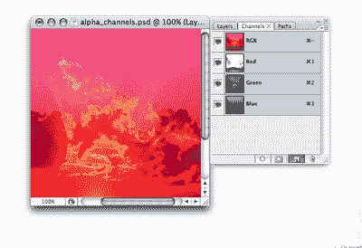
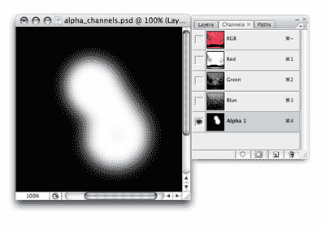
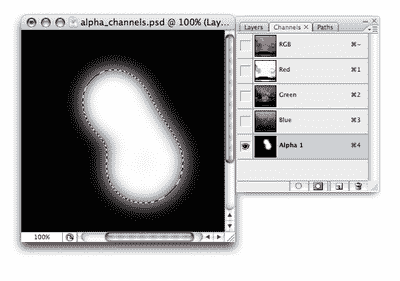
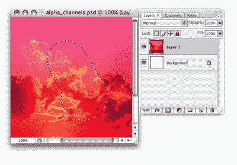
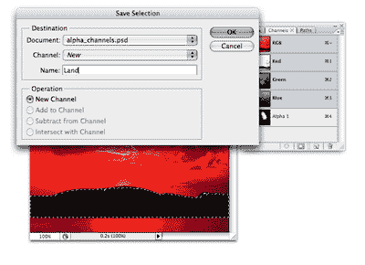
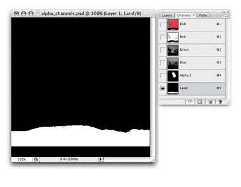
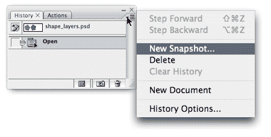

# Photoshop 入门:Alpha 通道和选区

> 原文：<https://www.sitepoint.com/getting-started-photoshop-6/>

**阿尔法频道和选择**

您可以使用 alpha 通道来创建选择并存储它们以备后用。如果你打开通道面板，你会看到几个通道，显示方式与层面板中的层相似。默认情况下，您会看到颜色通道，它表示每种颜色在文档中所占的比例。您可以单击调色板底部的“创建新通道”图标来创建自己的 alpha 通道。

然后，您可以使用 Photoshop 的任何绘画或绘图工具来创建代表选区的灰度图像，白色区域代表选定区域，黑色区域代表取消选定区域，灰色区域代表选区中的透明度。

要将 alpha 通道杰作变成选区，只需按住 Ctrl 并点按通道的缩略图(如果您在 Mac 上，请按住 Command 并点按)。

要返回到正常的图像视图，点击层调色板标签，并选择任何层。您的选择仍然可见。

您还可以从现有的选择中创建自己的 alpha 通道，这是一个非常有用的功能！例如，假设您已经创建了一个岛屿轮廓的选择，如下例所示。您有一种感觉，您会经常重新选择这个岛，但是您不希望每次都重新创建选择。没问题！选择完成后，使用选择>保存选择。将选择命名为“Land”(在本例中)，然后单击“确定”。

如果你去通道面板，你会看到一个新的选择在列表的底部，名为土地在下面的图像-这是你保存的选择。现在，您可以根据需要多次重新加载您的土地选择！

**历史调色板**

历史调色板是你进行时间旅行的钥匙(至少在 Photoshop 中)。它列出了您最近所做的步骤，并允许您通过将图像回滚到之前的状态来撤消您的操作。通过选择“编辑”>“首选项”>“性能”(在 Mac 上为“Photoshop”>“首选项”>“性能”),并更改“历史状态”文本框中的值，可以设置存储在内存中的步数。

像 Photoshop 的大多数其他工具一样，历史记录调板有一组有用的键盘快捷键，可用于快速访问:

*   ctrl-Z(Mac 上的 Command-Z)允许您撤销和重做上一步。
*   Ctrl-Alt-Z (Command-Option-Z)在“历史记录”调板中后退。
*   Shift-Alt-Z (Shift-Option-Z)在历史记录调板中向前移动。

因为只有有限数量的历史状态可用，所以在某些情况下，您可能希望保存文档的“快照”,以便以后需要时可以恢复到该状态。为此，单击历史调色板右上角的小三角形，然后选择新建快照…您可以存储整个文档、当前图层或合并图层的快照。

**当 Photoshop 停止工作时**

哇哦。Photoshop 停止工作？那听起来肯定不太有希望！在你惊慌之前，让我解释一下。鉴于它提供了众多强大的功能和神奇的工具，难怪有时 Photoshop 会耗尽自己。它可能开始表现得有点不稳定，甚至可能在启动时死机、崩溃或自动退出。如果您发现自己处于这种情况，首先要做的是重置首选项文件。首选项文件(在 PC 上可以通过“编辑”>“首选项”来自定义，在 Mac 上可以通过“Photoshop”>“首选项”来自定义)包含 Photoshop 设置，通常会损坏。

首选项文件的位置取决于您使用的操作系统和 Photoshop 版本。对于 Photoshop CS3，首选项文件被命名为 Adobe Photoshop CS3 Prefs.psp，其他版本的 Photoshop 的首选项文件将具有类似的名称。

*备份您的首选项文件*
通过复制并粘贴到 Photoshop settings 文件夹以外的位置来备份您的首选项文件是个好主意。然后，如果 Photoshop 正在使用的首选项文件损坏，您可以将备份拷贝回 settings 文件夹以替换损坏的文件，而不会丢失任何设置。

要重置首选项文件，请找到当前首选项文件，删除它(当 Photoshop 关闭时)，然后重新启动 Photoshop-它将使用默认设置重新创建首选项文件。[Creativepro.com 提供了一个详细的教程](http://www.creativepro.com/story/feature/17478.html/)，解释了如何找到和替换你的偏好文件，并包括不同版本的 Photoshop 的偏好文件名。

如果 Photoshop 继续运行，请在按住 Shift-Ctrl-Alt 键(在 Mac 上为 Shift-Command-Option)的同时重新启动它，并在询问您是否希望删除 Photoshop 设置文件时单击“确定”。不幸的是，这也将删除您的自定义动作、工具和其他设置，但好消息是，它应该可以修复您的 Photoshop 问题。

##### 摘要

本章概述了 Photoshop 和 Fireworks 界面以及常用工具，还解释了一些基本任务，如创建新文档和为 Web 存储文件。您还快速浏览了方便的键盘快捷键和其他节省时间的技巧。即使你以前没有使用过 Photoshop，你现在已经有了处理我们将在本书余下部分讨论的例子所需的工具。

**进入页面:**[1](/getting-started-photoshop)|[2](/getting-started-photoshop-2/)|[3](/getting-started-photoshop-3/)|[4](/getting-started-photoshop-4/)|[5](/getting-started-photoshop-5/)|[6](/getting-started-photoshop-6/)

如果你喜欢读这篇文章，你会爱上[可学的](https://learnable.com?utm_source=sitepoint&utm_medium=link&utm_campaign=learnablelink)；向大师们学习新技能和技术的地方。会员可以即时访问 SitePoint 的所有电子书和互动在线课程[Photoshop 基础](https://learnable.com/courses/foundations-of-photoshop-2712?utm_source=sitepoint&utm_medium=link&utm_campaign=learnablelink)。

对本文的评论已经关闭。对 Photoshop 有疑问？为什么不在我们的[论坛](https://www.sitepoint.com/forums/forumdisplay.php?8-Graphics?utm_source=sitepoint&utm_medium=link&utm_campaign=forumlink)上问呢？

## 分享这篇文章