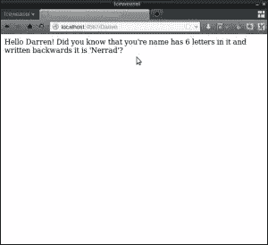
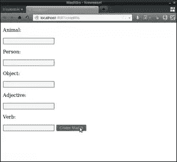

# Ruby 入门，II:字符串和其他

> 原文：<https://www.sitepoint.com/getting-started-ruby-ii-strings-things/>

在本系列的最后一部分中，我们了解了 Ruby 编程语言并编写了我们的第一个程序。我们还使用 IRB 进行了实验，并使用 Sinatra 将我们的程序放到了网络上。在这篇文章中，我们将看看字符串和它们的方法，以及使用变量来存储信息。

## 弦理论

Ruby 中的字符串是字母(或者更准确地说是“字符”)的集合。可以通过在引号内写入一组字符来创建字符串文字:

```
"hello"
```

您也可以使用单引号:

```
'hi there'
```

如果您想在字符串文字中使用引号，您可以使用另一种类型的引号，如下所示:

```
"It's done like this"
```

或者，如果您愿意，您可以使用`\`字符对*和*的引号进行转义，如下所示:

```
'Here\'s another way to do it'
```

在上一篇文章中，我提到 Ruby 中的所有东西都是一个*对象*。对象可以执行称为方法的操作。有几种方法可以让对象执行某个方法，但最常用的是点符号，如下所示:

```
object.method
```

让我们使用 irb 来试验一些字符串对象和方法——打开一个终端控制台，使用以下命令启动 IRB:

```
$ irb
```

现在让我们试着调用字符串对象“hello”上的`length`:

```
> "hello".length
=> 5
```

这是长度方法，你可以看到，它告诉我们字符串中有多少个字符。

## 变量

变量在编程语言中很常见。它们是将对象存储在内存中以备后用的一种方式。在 Ruby 中，我们可以很容易地使用`=`操作符将变量赋给一个对象，如下例所示:

```
name = "Darren"
```

变量`name`现在指的是字符串对象“Darren Jones”。这意味着我可以对变量调用方法，而不必每次都键入字符串:

```
>  name.length
=> 6
```

现在我们已经将我的名字存储为一个变量，让我们再尝试几个可以在 string 对象上使用的方法。我们可以倒着写:

```
> name.reverse
=> "nerraD"
```

…用大写字母书写:

```
> name.upcase
=> "DARREN"
```

….或小写字母:

```
> name.downcase
=> "darren"
```

还有许多其他的字符串方法。你可以通过调用字符串上的`methods`方法来找出它们是什么(没错，有一个“方法”可以找出一个对象的方法是什么！)

```
> name.methods
=> [:<=>, :==, :===, :eql?, :hash, :casecmp, :+, :*, :%, :[], :[]=, :insert, :length, :size, :bytesize, :empty?, :=~, :match, :succ, :succ!, :next, :next!, :upto, :index, :rindex, :replace, :clear, :chr, :getbyte, :setbyte, :byteslice, :to_i, :to_f, :to_s, :to_str, :inspect, :dump, :upcase, :downcase, :capitalize, :swapcase, :upcase!, :downcase!, :capitalize!, :swapcase!, :hex, :oct, :split, :lines, :bytes, :chars, :codepoints, :reverse, :reverse!, :concat, :<<, :prepend, :crypt, :intern, :to_sym, :ord, :include?, :start_with?, :end_with?, :scan, :ljust, :rjust, :center, :sub, :gsub, :chop, :chomp, :strip, :lstrip, :rstrip, :sub!, :gsub!, :chop!, :chomp!, :strip!, :lstrip!, :rstrip!, :tr, :tr_s, :delete, :squeeze, :count, :tr!, :tr_s!, :delete!, :squeeze!, :each_line, :each_byte, :each_char, :each_codepoint, :sum, :slice, :slice!, :partition, :rpartition, :encoding, :force_encoding, :b, :valid_encoding?, :ascii_only?, :unpack, :encode, :encode!, :to_r, :to_c, :>, :>=, :<, :<=, :between?, :nil?, :!~, :class, :singleton_class, :clone, :dup, :taint, :tainted?, :untaint, :untrust, :untrusted?, :trust, :freeze, :frozen?, :methods, :singleton_methods, :protected_methods, :private_methods, :public_methods, :instance_variables, :instance_variable_get, :instance_variable_set, :instance_variable_defined?, :remove_instance_variable, :instance_of?, :kind_of?, :is_a?, :tap, :send, :public_send, :respond_to?, :extend, :display, :method, :public_method, :define_singleton_method, :object_id, :to_enum, :enum_for, :equal?, :!, :!=, :instance_eval, :instance_exec, :__send__, :__id__]
```

有不少奇怪的，但其中一些是做什么的应该很明显，如果不是，你可以通过阅读[文档](http://ruby-doc.org/core-2.0/String.html)来了解。

## 砰！方法

有些方法实际上不会改变对象本身。比如我们来看看`reverse`的方法。正如您可能猜到的那样，这将字符串向后写，就像这样:

```
> name.reverse
 => "nerraD"
```

现在来看看存储为变量`name`的对象:

```
> name
 => "Darren"
```

对象没有改变。`reverse`方法返回了一个与`name`相反的字符串，但它实际上并没有改变`name`本身。

还有一种字符串方法叫做`reverse!`(它的结尾有一个感叹号或者‘bang’)。这是一个“爆炸方法”的例子，在 Ruby 中，这意味着“小心，这个方法可能很危险”。在`reverse!`的情况下，这意味着它将修改调用该方法的字符串，正如您在下面的示例中所看到的:

```
> name.reverse!
=> "nerraD"
name
=> "nerraD"
```

现在存储为`name`的字符串已经被修改好了。大多数字符串方法都有“bang equivalent ”,例如也有`upcase!`和`downcase!`方法。

## 链接方法

你不必一次应用一种方法。您可以将这些方法一个接一个地链接在一起。例如，如果我想用大写字母倒写你的名字，你可以像这样将`reverse`和`upcase`方法链接在一起:

```
> name = "Darren"
=> "Darren"
> name.reverse.upcase
=> "NERRAD"
```

这些方法是按照从左到右的顺序应用的(虽然在这种情况下没关系，但在其他情况下可能会这样)。

## 插入文字

插值是将 Ruby 代码插入字符串的一种简洁方式。这是通过将`#{ these symbols }`中的代码放在一个字符串中来实现的，如下所示:

```
"Welcome to my program, #{name}"
=> "Welcome to my program, Darren"
"Do you know that you're name backwards is #{name.reverse.downcase.capitalize}?"
=> "Do you know that you're name backwards is Nerrad?"
```

注意:该字符串必须是双引号字符串。单引号字符串不执行插值。

## 更大的计划

现在我们已经在 IRB 中摆弄了一些字符串，是时候写一个真正的 Ruby 程序了。创建一个名为“greeter.rb”的文件，并输入以下代码:

```
puts "Please enter your name:"
name = gets.chomp
puts "Hello #{name}! Did you know that you're name has #{name.length} letters in it and written backwards it is '#{name.reverse.downcase.capitalize}'?"
```

我们在[的上一篇](https://www.sitepoint.com/getting-started-ruby)中看到了`puts`的方法。我们在第一行中使用它向终端输出字符串“Please enter your name:”。在第二行，我们引入了一个叫做 gets 的新方法。这将暂停程序并等待来自用户的*输入*(通过按回车键终止)。这将存储在一个名为`name`的变量中。这将是一个字符串，我们对它应用一个叫做`chomp`的方法。`chomp`从字符串末尾删除按回车键创建的字符。然后我们可以使用字符串插值和一些我们刚刚学过的字符串方法来显示这个人的姓名信息。

如果您通过在终端中键入`ruby greeter.rb`来运行该程序，您应该会看到类似下面的内容:

```
$ ruby greeter.rb 
Please enter your name:
Darren
Hello Darren! Did you know that you're name has 6 letters in it and written backwards it is 'Nerrad'?
```

## Madlibs 程序

我们的下一个程序是游戏 [Madlibs](http://madlibs.com) 的一个简单实现，用户输入一些事物的名称，它们被放在一起组成一个(可能)幽默的短语。将以下代码输入到名为“madlibs.rb”的文件中:

```
puts "Please enter an animal:"
animal = gets.chomp
puts "Please enter an type of person:"
person = gets.chomp
puts "Please enter an object:"
object = gets.chomp
puts "Please enter an adjective:"
adjective = gets.chomp
puts "Please enter a verb:"
verb = gets.chomp
puts "The #{adjective} #{animal} started to #{verb} because the #{person} ran away with the #{object}"
```

这段代码使用多个`gets`语句从用户那里获取大量数据，并将每条信息设置为不同的变量。然后使用字符串插值来显示句子中输入的信息。如果您尝试使用命令`ruby madlibs.rb`运行它，您应该会看到类似下面的内容:

```
$ ruby madlibs.rb 
Please enter an animal:
cow
Please enter an type of person:
prince
Please enter an object:
banana
Please enter an adjective:
fuzzy
Please enter a verb:
cry
The fuzzy cow started to cry because the prince ran away with the banana
```

玩得开心点！

## 在线大计划

现在让我们使用 [Sinatra](http://www.sinatrarb.com/) 来创建我们刚刚创建的两个程序的 web 版本。大部分代码都是一样的，但是我们从用户那里获得输入的方式在网络上是不同的。有两种在网上获取数据的方法——从 URL 字符串或从表单。我们将通过从 URL 中获取这个人的名字来重新创建欢迎程序。将以下代码保存在名为“web_greeter.rb”的文件中:

```
require 'sinatra'

get '/:name' do
  name = params[:name]
  "Hello #{name}! Did you know that you're name has #{name.length} letters in it and written backwards it is '#{name.reverse.downcase.capitalize}'?"
end
```

这里我们有另一个路由处理程序，就像我们在上一篇文章中使用的一样，但是这个字符串包含了一个叫做*的参数*。这些是 URL 中的特殊标记，可以有任何值。在 URL 中输入的值保存在`params`散列中。这是一个特殊的容器，它保存用户输入的任何值，就像保存变量一样(我们将在后面的文章中了解更多关于散列的内容)。

例如，如果我在浏览器中输入 URL‘http://localhost:4567/Darren’,`params[:name]`的值将是“Darren”。如果我在浏览器中输入‘http://localhost:4567/Daz’,`params[:name]`的值将是“Daz”。

`params`后方括号中的值必须与路由处理程序中命名参数中使用的值相匹配。这允许您使用任意多的命名参数。

要尝试这一点，在终端中键入`ruby web_greeter.rb`，然后访问[http://localhost:4567/Darren](http://localhost:4567/Darren)，您应该会在浏览器中看到一条类似于下面截图所示的消息。尝试在 URL 中输入不同的名称，以检查它是否有效。

[](https://www.sitepoint.com/wp-content/uploads/2013/09/Screenshot2.png)

## 网络资料库

对于 Madlibs web 程序，我们将使用一个 HTML 表单来输入数据。输入以下代码，并将其另存为 web_madlibs.rb:

```
require 'sinatra'

get '/madlibs' do
  erb :questions
end

post '/madlibs' do
  animal = params[:animal]
  person = params[:person]
  object = params[:object]
  adjective = params[:adjective]
  verb = params[:verb]
  "The #{adjective} #{animal} started to #{verb} because the #{person} ran away with the #{object}"
end

__END__

@@questions
<!doctype html>
<html>
  <header>
    <title>Madlibs</title>
  </header>
  <body>
    <form method="POST" action="/madlibs">
      <p>Animal:</p>
      <input name="animal">
      <p>Person:</p>
      <input name="person">
      <p>Object:</p>
      <input name="object">
      <p>Adjective:</p>
      <input name="adjective">
      <p>Verb:</p>
      <input name="verb">
      <input type="submit" value="Create Madlib">
    </form>
  </body>
</html>
```

这是我们迄今为止创建的最复杂的程序，但是如果我们把它分成几个部分，它并不像看起来那么糟糕。

第一部分是一个非常简单的路由处理器。这表明，如果用户访问路线“/madlibs”，那么我们将使用 ERB 显示一个名为“问题”的视图。

ERB 代表“嵌入式 Ruby ”,是一个用于生成动态 HTML 的模板引擎。视图是由浏览器显示的一段 HTML 代码。在这个例子中，我们使用了*内嵌视图*，这意味着你将它们写在文件底部的`__END__`声明之后。视图的名称以`@@`开头。在这里，我们创建了一个名为“问题”的视图，它实际上只是一个显示带有一些输入字段的表单的 HTML。表单的重要部分是两个属性`method="POST" action="/madlibs"`。这告诉 Sinatra 使用 HTTP `POST`动词将表单发送到路由'/madlibs '。

然后，我们使用这些信息创建一个路由处理程序来处理表单提交时发生的事情。注意，第二个路由处理程序使用了动词‘post’而不是‘get’——这是因为它只处理已经发布的路由(就像我们表单中的那个)。

在 route 处理程序之后的块中，我们编写代码来处理从表单提交的信息。这再次存储在`params`散列中。每个输入字段都包含一个`name`属性，该属性告诉 Sinatra 将该字段中输入的值保存在 params hash 中的什么位置。

因此，在属性为`name="animal"`的输入字段中输入的值将存储在`params[:animal]`中。在路由处理程序中，我们将每条信息存储为一个变量，然后使用与我们之前编写的程序中相同的字符串插值来显示我们的 Madlib。

要尝试这样做，按住“Ctrl”和“C ”,如果服务器还在运行，就把它关掉。然后通过在终端中键入`ruby web_madlibs.rb`来启动服务器再次运行。如果您在浏览器中访问[http://localhost:4567/mad libs](http://localhost:4567/madlibs)，您应该会看到一个类似于下面截图中的表单:

[](https://www.sitepoint.com/wp-content/uploads/2013/09/Screenshot3.png)

享受填写表格和创建一些有趣的 Madlibs 的乐趣！

## 这是所有的乡亲

在本系列的下一部分，我们将通过研究数字和控制逻辑来获得数学知识。与此同时，请仔细阅读我们到目前为止所介绍的内容，并确保在下面留下任何问题或评论。

## 分享这篇文章