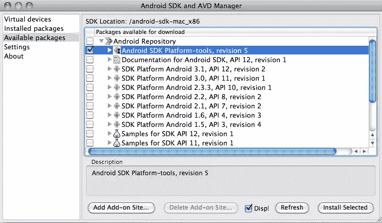
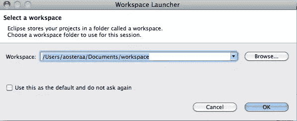
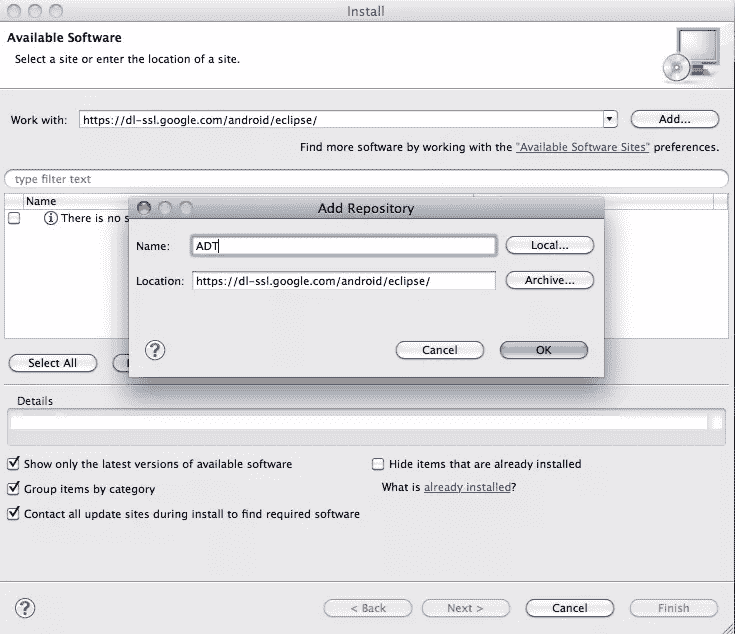

# Android 入门

> 原文：<https://www.sitepoint.com/getting-started-with-android/>

自从我在 2010 年 4 月购买了我的 HTC Desire，我想知道更多关于它是如何做的，嗯，它做了什么。我知道是 Java，但不知道这一切是怎么来的。这篇文章是写给绝对初学者的，所以请不要期望对方会成为超级明星。

### 你需要什么

*   安卓设备
*   电脑，Mac OS X 或 Windows
*   互联网连接
*   耐心

### 你会学到什么

*   安装 Android SDK
*   安装 Eclipse Java IDE
*   配置 Eclipse 和 SDK 协同工作
*   为开发配置您的 Android
*   如何轻松截图
*   从这里去哪里？

### 安装 SDK

从[开发者网站](http://developer.android.com/sdk/index.html)下载 Android SDK。当你安装/解压后，记得你把它放在哪里。

### 安装平台工具

打开安装 SDK 的文件夹，然后进入 Tools 文件夹，打开 Android。这将打开 AVD 管理器。单击可用的包，然后选择整个存储库，或者选择特定的并简单地选择 SDK 平台工具。如果你安装了所有的东西，这就是你需要耐心的地方，因为下载和安装整个库需要一段时间。

### 安装 Eclipse IDE

IDE 的选择很少，最流行的是 Eclipse。你可以从 Eclipse 下载它。Google 推荐 Eclipse Classic，但是无论是 Eclipse for Java 还是 Eclipse for RCP 和 RAP 开发者都可以。注意，我个人选择了 Java 安装。

### 配置 Eclipse 以使用 SDK

这需要密切关注，因为很容易走错路。这也需要耐心，因为你需要下载相当多的内容。下载后，解压 Eclipse 并从该目录打开 Eclipse 应用程序。指定你希望你的工作空间在哪里，我个人来说，我只是用默认的。

现在我们需要 Eclipse 的 ADT 插件。在 Eclipse 中，转到帮助安装新软件。放入“https://dl-SSL . Google . com/Android/eclipse/”，命名为 ADT 之类明显的东西。

完成后，选择开发者工具并点击下一步。它将确认要安装的四个项目，DDMS (Dalvik 调试监控服务)，开发工具，层次结构查看器和 Traceview。点击下一步，接受许可条款，然后完成。完成后，您需要重启 Eclipse。

最后一步是将 Eclipse 指向 Android SDK。在 OS X 上进入 Eclipse 偏好设置，⌘，或者 Window 偏好设置，在左边选择 Android，然后浏览到 SDK 文件夹。

### 为开发配置您的 Android

最简单的部分。进入设置应用程序并检查 USB 调试框。

### 如何截图

不像 iPhone 那样只需按两个按钮，在 Android 上截图要痛苦得多，或许这也是人们走这么远的原因之一。当然，你总是可以根你的设备，但是我们将在后面讨论这个

埋在你在 android 中安装 SDK 的地方深处——SDK-*/tools/你会发现一个名为 DDMS 的 app。从设备菜单中选择屏幕捕捉。省省吧。就是这样。截图的工作量很大。我个人建议给你的手机找个软件来做这件事。

### 从这里去哪里？

如果你已经完成了指南，还想继续学习，还有其他方法。继续在 BuildMobile 上关注我们，在 Twitter 上关注我们，或者在 T2 脸书关注我们，或者订阅我们的 RSS 订阅。如果你喜欢的话，以上都可以。

买一本书。有很多很棒的 Android 开发书籍，印刷材料是补充在线学习的绝佳方式。

加入在线社区

*   [安卓开发者小组](http://groups.google.com/group/android-developers)
*   [SitePoint 论坛](https://www.sitepoint.com/forums/)
*   查看脸书机器人小组

有很多开发团队可能就在你所在的地区附近，所以一定要考虑去参加活动。定期参加和组织这些活动的人们生活在他们选择的技术中，呼吸着他们选择的技术。你可以交到朋友，学到很多东西，甚至可能找到一个导师。

## 分享这篇文章