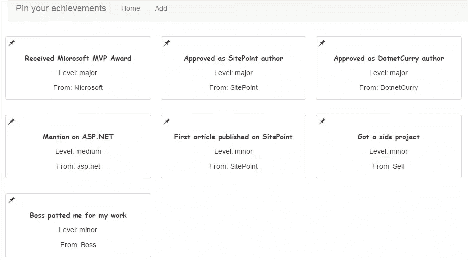

# 使用 TypeScript 开始使用 Angular 2

> 原文：<https://www.sitepoint.com/getting-started-with-angular-2-using-typescript/>

> **本文基于 Angular 2 的 alpha 版本，该版本现已过时。**最新教程请见文章 [Angular 2 教程:用 Angular CLI 创建 CRUD App](https://www.sitepoint.com/angular-2-tutorial/)。

Angular 的当前稳定版本(即 Angular 1.x)是使用 ES5 的特性构建的，旨在在大多数浏览器上工作，包括 IE 的一些旧版本。该框架必须创建自己的模块系统，抽象掉一些语言特性，并提供一个高度抽象和基于配置的接口来工作。

Angular 1 的所有好东西在 Angular 2 中仍然可用，但框架更简单。Angular 2 构建时考虑了 ES6(和 ES7)的特性、Web 组件，并以 evergreen 浏览器为目标。

[TypeScript](https://www.sitepoint.com/typescript-tutorial-for-beginners/) 是一个类型化的 JavaScript 超级集，由微软构建和维护，并由 AngularJS 团队选择用于开发。类型的存在使得用 TypeScript 编写的代码不容易出现运行时错误。最近，对 ES6 的支持有了很大的改进，也增加了一些 ES7 的功能。

在本文中，我们将看到如何使用 Angular 2 和 TypeScript 来构建一个简单的应用程序。由于 Angular 2 仍处于 alpha 版本，所以本文中显示的代码片段的语法可能会在稳定版本发布之前发生变化。[本文开发的代码可以在 GitHub](https://github.com/sitepoint-editors/PinYourAchievements-Angular2-TypeScript/) 上获得。

## 角度基础 2

Angular 2 在设计时就考虑到了简单性。该团队删除了 Angular 1 的许多食谱，这些食谱让我们思考“我们为什么要这样做？”(如果你想知道去掉了什么，建议你看一下这个名为 [Angular 2.0 核心会话的视频，作者是 Igor 和 Tobias](https://www.youtube.com/watch?v=gNmWybAyBHI) )。现在，框架由一小组构建块和一些要遵循的约定组成。

Angular 2 中的构造块包括:

1.  **组件:**组件类似于 Angular 1 中的指令。它是用 Web 组件的特性构建的。每个组件都有一个视图和一个逻辑。它可以与服务交互以实现其功能。服务可以被“依赖注入”到组件中。任何必须在组件中使用的东西都必须是组件实例的公共成员。组件使用属性绑定来检查值的变化，并对这些变化进行操作。组件可以处理事件，事件处理程序是组件的类中定义的公共方法。
2.  **服务:**服务是一个简单的 ES6 类，带有一些用于依赖注入的注释。

与 Angular 1 一样，Angular 2 使用依赖注入来获取对象的引用。由于`scope`已经从框架中移除，我们没有运行摘要循环。所以，我们在无角世界工作时，不需要一直叫`scope.$apply`。Angular 2 使用 [Zone.js](https://github.com/angular/zone.js/) 来启动改变，这个库知道什么时候行动。

Angular 2 应用程序从一个组件开始，应用程序的其余部分被分成几个组件，加载到根组件中。

如果你想了解更多关于 Angular 2 的基础知识，请查看 [Victor Savkin 关于 Angular 2](http://victorsavkin.com/post/118372404541/the-core-concepts-of-angular-2) 中核心概念的博文。

## 安装

在撰写本文时，Angular 2 仍处于 alpha 阶段，因此框架和围绕它的资源仍然是原始的。他们将经历一系列的变化，在准备生产的时候会变得更好。

Angular 2 和 TypeScript 提供了大量的种子项目。我认为埃拉德·卡茨的这个作品可以作为一个很好的练习起点。首先，如果您想继续学习本教程，请克隆这个存储库。然后，按照`readme`文件中提到的说明安装并运行 seed 项目。

存储库:

*   包含使用 TypeScript 的基本 Angular 2 应用程序
*   使用 JSPM/系统 JS 加载页面上的依赖项
*   参考使用 [TSD](http://definitelytyped.org/tsd/) 的库的打字稿定义文件，并在名为`angular2.temp.d.ts`的本地文件中定义 Angular 2 的缺失定义
*   在 Angular 中调用 Express REST API
*   使用 Gulp 将 TypeScript 代码传输到 ES5 并启动 Node.js 服务器
*   包含位于 scripts 文件夹中的源 TypeScript 文件，而 public 文件夹用于存储传输的文件。

## 如何压住自己的成绩

### 构建 Express APIs

现在您已经知道 Angular 2 是什么，并且已经克隆了 seed 项目，让我们修改它。我们将构建一个简单的应用程序来将您的成就钉在板上。首先，让我们添加 Express APIs 来获取和添加成就。当我分叉存储库并修改 seed 项目以添加基本的 Express APIs 时，您将看到一个端点服务于所有成就的现有列表。要发布新的成就，我们需要添加一个端点。

为了完成第一个任务，打开`server.js`文件并添加以下代码片段:

```
app.post('/api/achievements', function(request, response){
    achievements.push(JSON.parse(request.body));
    response.send(achievements);
});
```

由于 Angular 2 的`Http` API 仍然非常原始，它以纯文本的形式发布数据。因此，让我们添加一个`bodyParser`中间件来从请求体中读取文本:

```
app.use(bodyParser.text({
   type: 'text/plain'
}));
```

### 修改启动组件和路由

`index.html`文件是应用程序的起点。这个文件的主体部分加载了`bootstrap`脚本并创建了`my-app`组件。这个组件又将其他组件加载到应用程序中。`bootstrap.ts`文件使用主组件引导 AngularJS 应用程序。正如您所看到的，由其他模块导出的所需的可注入内容被传递到该函数中。这使得这些模块导出的服务和指令对`my-app`的所有子组件都可用。我们将在应用程序中使用一个`form`，为此我们需要将模块`angular2/forms`导出的`formInjectables`添加到可注入列表中:

```
import {formInjectables} from 'angular2/forms';
bootstrap(MyApp, [routerInjectables, httpInjectables, formInjectables, AchievementsService]);
```

项目的启动组件位于`app`文件夹中。该组件应用了两个注释:

1.  **组件:**保存组件的配置属性，如选择器、属性名、事件名和可注入组件的列表。选择器的值可以与 HTML 标记上使用的字符串相同，不需要区分大小写
2.  **视图:**视图注释加载组件的视图部分所需的数据。它包括一个 HTML 模板(可以是内联的或者是一个模板 URL)和一个组件需要的指令列表

下面，你可以看到相关的代码:

```
@Component({
  selector: 'my-app'
})
@View({
  templateUrl: _settings.buildPath + '/components/app/app.html',
  directives: [RouterLink, RouterOutlet]
})
```

`my-app`组件必须为应用程序定义路线，并提供一个占位符来加载子视图。可以在`MyApp`类内部使用`Router`服务来定义路线。下面的代码片段定义了应用程序所需的两条路线:

```
export class MyApp {
  constructor(@Inject(Router) router: Router) {
    router.config([
      { path: '', as: 'home', component: Home },
      { path: '/add', as: 'add', component: Add }
    ]);
  }
}
```

由于还没有添加组件`add`,如果您现在尝试运行应用程序，将会面临一些问题。我们需要在 components 文件夹中创建一个新文件夹，并将其命名为`add`。然后，我们在这个文件夹中添加两个文件:`add.ts`和`add.html`。最后，将下面的代码片段添加到`add.ts file`(我们稍后会添加更多代码):

```
import {Component, View} from 'angular2/angular2';
import { _settings } from '../../settings'
import {FormBuilder, Validators, formDirectives, ControlGroup} from 'angular2/forms';
import {Inject} from 'angular2/di';
import {Router} from 'angular2/router';
import {AchievementsService} from '../../services/achievementsService';

@Component({
  selector: 'add',
  injectables: [FormBuilder]
})
@View({
	templateUrl: _settings.buildPath + '/components/add/add.html',
  directives:[formDirectives]
})
export class Add {
}
```

该组件的视图将有一个接受输入的表单，以保存为一个新的成就。因此，将以下 HTML 添加到该页面:

```
<div>Add New Achievement</div>
<br />
<form>
  <div class="input-group">
    <span>Title</span>
    <input type="text" id="title" class="form-control" />
  </div>
  <div class="input-group">
    <span>Type</span>
    <input type="text" id="type" class="form-control" />
  </div>
  <div class="input-group">
    <span>From</span>
    <input type="text" id="from" class="form-control" />
  </div>
  <div>&nbsp;</div>
  <div class="input-group">
    <input type="submit" value="click" class="btn btn-primary" />
    <input type="reset" value="Reset" class="btn" >
  </div>
</form>
```

在视图中，我们需要创建页面间导航的链接。属性组件帮助我们做到这一点。我们需要将组件的名称分配给属性，它将负责根据之前为组件配置的路径构建链接。

```
<ul class="nav navbar-nav">
  <li>
    <a router-link="home">Home</a>
  </li>
  <li>
    <a router-link="add">Add</a>
  </li>
</ul>
```

我们在根组件中需要的最后一段 HTML 代码是一个`route-outlet`元素。这是在视图间导航时子组件将被加载的地方。

```
<router-outlet></router-outlet>
```

### 列举所有的成就

现在，让我们修改 home 组件，以钉在墙上的框的形式显示所有成就的列表。我们将使用 [Bootstrap](http://getbootstrap.com/) 来设计这个页面。Bootstrap 的 CSS 已经从 CDN 加载到`index.html`中。

在处理 UI 之前，让我们创建一个服务，向 Express.js API 发送 Ajax 请求，以便与数据进行交互。我们在 services 文件夹下有一个名为`dummyService`的文件。将其重命名为`achievementsService`，并将文件中的类重命名为`AchievementsService`。将以下代码添加到该文件中。这段代码为服务设置了依赖注入，并添加了一个从服务获取所有成果的方法:

```
import {Component, View} from 'angular2/angular2';
import { Inject} from 'angular2/di';
import {Http} from 'angular2/http';

export class AchievementsService {
  constructor( @Inject(Http) private http: Http) {
  }

  getAllAchievements(): any {
    var path = '/api/achievements';
    return this.http.get(path);
  }
}
```

类的方法不返回承诺，而是可观察到的。后者是具有内置功能的对象，可以在发生变化时发出通知。home 组件需要一个`AchievementsService`和`NgFor`指令的对象来检索和显示成就列表。

要继续项目，用以下代码替换`home.ts`中的代码:

```
import {Component, View, NgFor} from 'angular2/angular2';
import { _settings } from '../../settings'
import {AchievementsService} from '../../services/achievementsService';
import {Inject} from 'angular2/di';

@Component({
  selector: 'home',
  injectables: [AchievementsService]
})
@View({
  templateUrl: _settings.buildPath + "/components/home/home.html",
  directives: [NgFor]
})
export class Home {
  achievements: Array;

  constructor( @Inject(AchievementsService) private achievementsService: AchievementsService) {
    achievementsService.getAllAchievements()
      .map(r => r.json())
      .subscribe(a => {
        this.achievements = a;
      });
  }
}
```

在上述代码片段中添加的 subscribe 回调在 observable 发送通知后被调用。区域了解可观察对象如何工作，并在可观察对象设置值后更新 UI。文件`home.html`中的标记非常简单，如下所示:

```
<div class="row">
  <div *ng-for="#achievement of achievements" class="thumbnail col-md-3 col-sm-3 col-lg-3">
    <span class="glyphicon glyphicon-pushpin"></span>
    <div class="caption">
      <strong>{{achievement.title}}</strong>
    </div>
    <p class="text-center">Level: {{achievement.type}}</p>
    <p class="text-center">From: {{achievement.from}}</p>
  </div>
</div>
```

除了包含`ng-for`的`div`元素上的两个特殊字符之外，上面的代码片段看起来都很熟悉。这些符号的含义是:

*   `ng-for`前面的星形符号表示元素内部的内容将被注册为[模板](http://webcomponents.org/articles/introduction-to-template-element/)
*   记录变量成就前面的散列符号使它成为一个局部变量。它可以在模板内部用于数据绑定

让我们保存这些更改并运行应用程序。你会看到方框形式的成就列表。



### 添加新成就

我们需要有一个`form`接受成就的细节，并在提交时将这些细节发送到 Express 服务器。将下面的方法添加到`AchievementsService`中，向服务器发送数据:

```
addAnAchievement(newAchievement) {
  var path = '/api/achievements';
  return this.http.post(path, JSON.stringify(newAchievement));
}
```

`add`组件视图将执行以下任务:

*   接受表单中的值并将其发送到 Express 服务器
*   成功插入值后，将用户重定向到主屏幕

在 Angular 2 中，可以通过多种方式创建和管理表单。它们可以是模板驱动的、模型驱动的和数据驱动的。讨论这些方法的更多细节超出了本文的范围，但是如果您感兴趣，在这个项目中我们将使用模型驱动的方法。虽然在本文中我们不会使用验证，但是您会很高兴知道 Angular 2 中的表单也支持验证。

在模型驱动的方法中，我们需要创建一个绑定在表单上的模型对象，并声明性地将其附加到表单上。表单中的字段被绑定到模型对象的属性。模型对象的值被传递给服务以将其发送给服务器。

您需要执行的下一步是打开文件`add.ts`并在`Add`类中添加以下代码:

```
addAchievementForm: any;

constructor( @Inject(FormBuilder) private formBuilder: FormBuilder,
    @Inject(Router) private router: Router,
    @Inject(AchievementsService) private achievementsService: AchievementsService) {
  this.addAchievementForm = formBuilder.group({
    title: [''],
    type: [''],
    from: ['']
  });
}

addAchievement() {
  this.achievementsService.addAnAchievement(this.addAchievementForm.value)
    .map(r => r.json())
    .subscribe(result => {
      this.router.parent.navigate('/');
    });
}
```

必须在表单上使用类的属性`addAchievementForm`。使用`ng-control`指令将这个对象的属性附加到表单内部的控件上。方法`addAchievement`使用表单模型对象将屏幕上输入的值传递给服务器，并在收到响应后将用户发送到主屏幕。

您可能已经注意到，我们不处理 HTTP 请求的错误情况。这是因为这个特性在 HTTP API 中还不可用，但是将来肯定会变得更好。

现在，打开文件`app.html`并修改表单元素，如下所示:

```
<form (ng-submit)="addAchievement()" [ng-form-model]="addAchievementForm">
```

在上面的代码片段中，`ng-submit`周围的括号表示这是一个事件。当用户提交`form`时，分配给它的函数将被调用。`ng-form-model`指令周围的方括号表示该值被绑定到组件实例的一个属性。

现在唯一未完成的更改是将模型对象的字段附加到输入控件上。以下代码片段显示了修改后的标题输入文本框，并相应地修改了其他控件:

```
<input type="text" id="title" ng-control="title" class="form-control" />
```

最后，保存所有的更改并运行应用程序。你现在应该可以添加新的成就了。

## 结论

Angular 2 囊括了当前前端世界最新最伟大的技术。此外，通过使用 TypeScript 编写代码，它提高了开发人员的工作效率。正如我们所看到的，这个框架是完全重写的，可以帮助你以更简单的方式做很多事情。由于该框架仍处于 alpha 阶段，我建议您不要在生产应用程序中使用它。耐心等待，看看 AngularJS 团队如何塑造它的宝宝。

## 分享这篇文章