# Corona 入门:构建您的第一个 Corona 应用

> 原文：<https://www.sitepoint.com/getting-started-with-corona-building-your-first-corona-app/>

早些时候，在[Corona 入门:同时为多个平台和市场构建应用](https://www.sitepoint.com/getting-started-with-corona-building-apps-for-multiple-platforms-and-markets-simultaneously/ "Getting Started With Corona: Building Apps for Multiple Platforms and Markets Simultaneously")中，我们介绍了使用 Corona 开发的好处，以及安装和配置 SDK。如果你还没有读过，从头开始会让你对科罗娜有更透彻的了解。现在，让我们继续探索 Corona 并构建我们的第一个应用程序。与本文相关的所有文件都位于 [code.zip](https://www.sitepoint.com/?attachment_id=4400) 中。

### 探索日冕

Corona 的安装程序在桌面上添加了一个 **Corona 模拟器**图标。双击这个图标，你会看到(在 Windows 平台上)图 9 的**电晕模拟器**窗口被一个许可协议对话框覆盖。

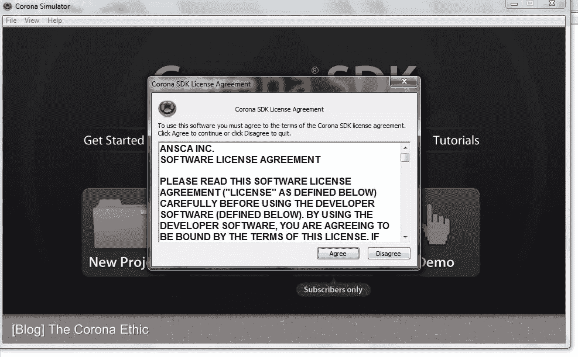

图 9:接受许可协议继续。

点击**同意**按钮接受许可协议。(随后运行 Corona 时，您将看不到许可协议。)图 10 显示了产生的**登录**对话框。

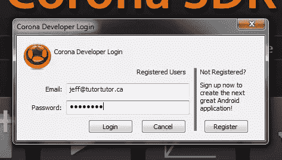

图 10:输入您之前注册的电子邮件地址和密码。

输入您之前用来下载 Corona SDK 的电子邮件地址和密码(参见图 2 ),然后单击**登录**。Corona 验证这些信息，并在图 11 的对话框中显示一条接受消息。(随后运行 Corona 时，您将看不到**登录**或图 11 的对话框。)

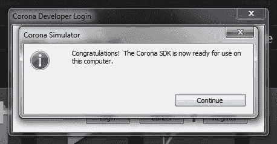

图 11:点击继续。

点击**继续**按钮。出现如图 12 所示的对话框。

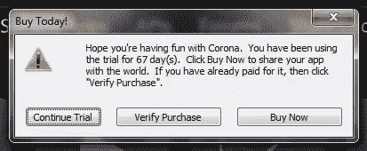

图 12:点击“继续试用”

点击**继续试验**按钮，完整查看**电晕模拟器**窗口(见图 13)并选择行动方案。

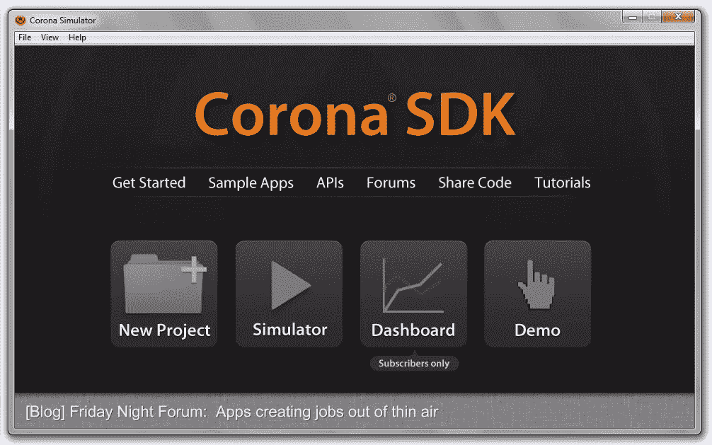

图 13:以可点击链接的形式提供了几个选项。

**电晕模拟器**窗口呈现一个带有**文件**、**视图**和**帮助**菜单的菜单栏:

*   **文件**显示用于创建新项目、打开现有项目、修改首选项和退出模拟器的菜单项。
*   **视图**显示用于访问各种演示的菜单项。
*   **Help** 显示用于访问在线文档、选择示例项目等的菜单项。

此窗口还显示以下链接:

*   **入门**带您进入 Ansca Mobile 的“Corona 入门”网页，在这里您可以找到 SDK 的介绍性信息和各种教程的链接。
*   **示例应用**显示一个对话框，让您打开一个示例应用，并立即在设备模拟器窗口中查看其输出。
*   **API**带您进入 Ansca Mobile 的“API 参考”页面，在这里您可以了解 Corona 提供的许多 API。
*   **论坛**带您进入 Ansca Mobile 的“社区”页面，在这里您可以提出问题并获得答案(或回答他人的问题)。
*   **共享代码**带您进入 Ansca Mobile 的“共享您的代码”页面，在这里您可以与其他开发者共享您的代码，并访问他们为您的应用提供的代码。
*   **教程**带您进入 Ansca Mobile 的“教程”页面，在这里您可以浏览教您如何完成各种任务的教程。
*   **新项目**显示一个对话框，让您创建一个新的 Corona 项目。
*   **模拟器**显示一个对话框，让你选择并打开一个`main.lua`文件，然后在当前模拟的设备(如 iPad)上运行这个文件。
*   **Dashboard** 提供用户专属服务，用于推广您的应用，并获取您的应用在下载量等方面的统计数据。

除了图 13 所示的窗口，Corona 在启动时还会显示一个**电晕模拟器输出**窗口。该窗口显示控制台输出，如图 14 所示。

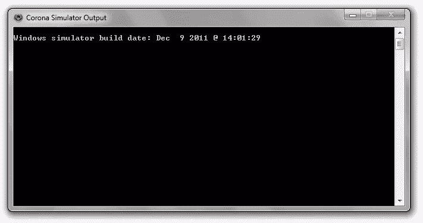

图 14:您可以将应用程序中的控制台消息输出到控制台窗口中(可能是为了调试)。

### HelloWorld

Corona 包括几个示例项目，您可以尝试学习用 Lua 编写应用程序和使用 Corona 的各种 API。例如，`GettingStarted`目录包含一个描述`HelloWorld`样本项目的`HelloWorld`子目录。

从**文件**菜单中选择**打开项目**，导航到`HelloWorld`目录，选择该目录的`main.lua`源文件，即可打开`HelloWorld`(所有 Corona 项目都必须有一个`main.lua`源文件)。或者，您可以点击**电晕模拟器**窗口上的**示例应用**链接。如果您选择后一个选项，您将会看到如图 15 所示的对话框。

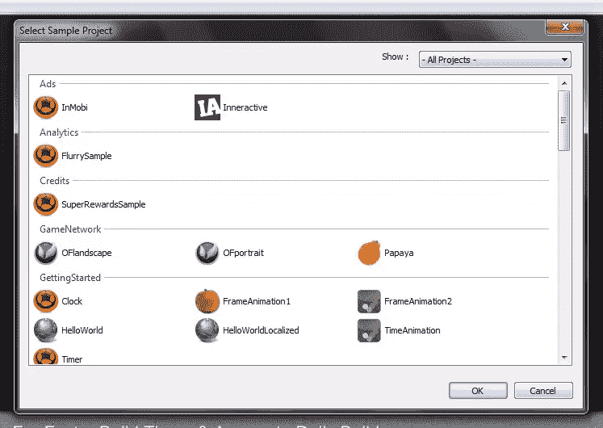

图 15:使用这个对话框来选择一个样本项目。

向下滚动，直到在**开始**部分看到 **HelloWorld** 。选择 **HelloWorld** 并点击 **OK** 。您将立即在图 16 所示的模拟设备窗口中看到这个应用程序。

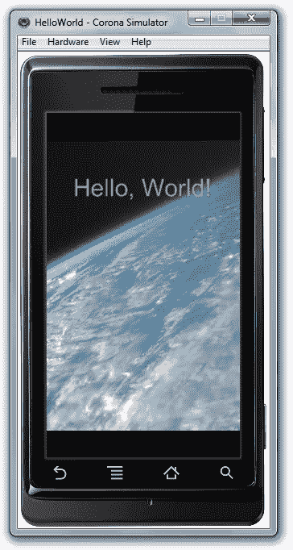

图 HelloWorld 应用程序在地球的背景图像上显示文本。

图 16 所示的窗口取代了图 13 所示的窗口。

图 16 显示了在 Droid 设备上运行的 **HelloWorld** 。要查看它在另一个设备上的外观，选择**查看**菜单、**查看为**菜单项，并从弹出菜单中选择所需的设备。参见图 17。

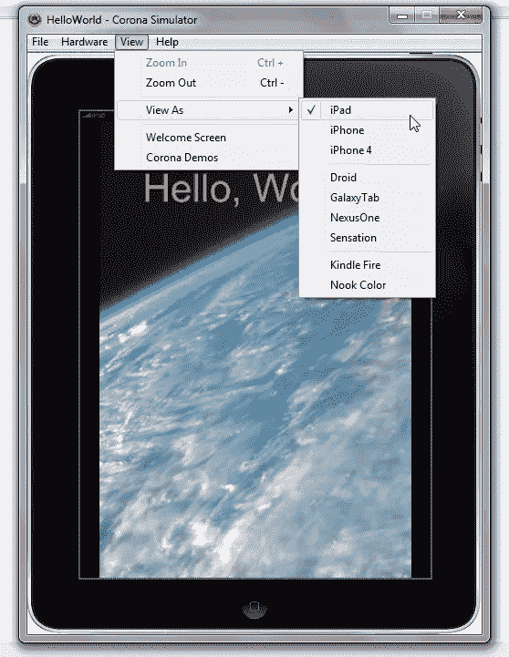

图 17:使用弹出菜单来查看你的应用在不同设备上的样子。

图 16 和 17 所示的**文件**菜单显示了一个在编辑器中打开的**菜单项，让你检查应用程序的`main.lua`源文件的内容。清单 2 展示了 **HelloWorld** 的这些内容。**

```
--
-- Abstract: Hello World sample app, using native iOS font
-- To build for Android, choose an available font, or use native.systemFont
--
-- Version: 1.2
--
-- Sample code is MIT licensed, see <a href="http://developer.anscamobile.com/code/license" target="_blank">http://developer.anscamobile.<wbr>com/code/license</wbr></a>
-- Copyright (C) 2010 ANSCA Inc. All Rights Reserved.

local background = display.newImage( "world.jpg" )

local myText = display.newText( "Hello, World!", 0, 0, native.systemFont, 40 )
myText.x = display.contentWidth / 2
myText.y = display.contentWidth / 4
myText:setTextColor( 255,110,110 )
```

**清单 2(如上):****hello world**的`main.lua`源文件的内容类似于 ActionScript 或 JavaScript。

清单 2 首先显示了几行，每一行都以“`--`”字符开始。每个连字符对表示一个*注释*的开始；不可执行的文本文档。您指定注释以便其他人可以理解您的代码，提供版权信息，等等。像大多数编程语言一样，Lua 忽略注释。

接下来，声明一个名为`background`的局部变量。一个*局部变量*是以保留字`local`为前缀的变量；有一个*作用域*(可见性)，限于声明变量的控制结构、函数或文件的主体；一旦退出其作用域，它就不复存在。相比之下，*全局变量*没有`local`前缀；它的范围是整个程序，只要程序运行，它就存在。

* * *

提示:你应该尽可能地使用局部变量，因为它们提供了比全局变量更快的访问速度。此外，它们还可以帮助您避免用不必要的名称扰乱全球环境。

* * *

作为声明的一部分，`background`被分配了一个对表对象的引用，该表对象描述了基于 JPEG 文件`world.jpg`的内容加载的图像。这个对象是由`newImage()`创建并加载图像的，它恰好是一个名为`display`的特殊表的函数*字段*(属性)。`newImage()`返回后，加载的图像显示在模拟设备窗口中。

* * *

**注意:**一个*表*是 Lua 的基本类型之一，也是 Lua 唯一的数据结构。它可以用来表示数组、字典(即哈希表)、树、记录(具有充当变量或函数的字段)以及其他项目。考虑下面的例子:

```
employee = { name = "Jeff" }
```

在这个例子中，我创建了一个名为`employee`的表。这个面向记录的表包含一个名为`name`的字段变量。包含`Jeff`的字符串已经被分配给`name`。我可以通过两种方式之一访问该字段的值，如下所示:

```
local mnName1 = employee("name")
local myName2 = employee.name
```

第二条语句揭示了由句点字符后跟字段名组成的语法规则，使字段访问看起来更像对象。

* * *

`display`表包含几个以`new`为前缀的函数(称为*工厂函数*或*构造函数*),让您创建各种类型的可显示对象。你可以通过浏览器点击 Ansca Mobile 的[文档页面](http://developer.anscamobile.com/content/display-objects)了解更多关于这些功能的信息，并找出`display`还包含什么。

接下来，清单 2 声明了一个名为`myText`的局部变量，并为由`newText()`创建和返回的文本表分配了一个引用。该工厂函数将“`Hello, World!`”标识为要显示的文本，最初将该文本的左上角定位在(0，0)-显示屏的左上角，并指定该文本将使用设备的本机字体以 40 磅的大小绘制。

* * *

**注意:**因为对`newText()`的调用跟在对`newImage()`的调用之后，所以文本被绘制在图像之上。如果对 `newImage()`的调用跟随在对`newText()`的调用之后，图像将被绘制在文本上，导致文本不可见。

* * *

清单 2 最后配置了文本，修改左上角以反映显示的水平中间和显示的第二象限的顶部，并指定红色作为文本的颜色。

* * *

**注:**在`myText:setTextColor(255,110,110)`中`myText`和`setTextColor`之间的冒号字符是指定`myText.setTextColor(myText, 255, 110, 110)`的语法糖速记。将`myText`作为第一个参数来标识要设置文本颜色的表格。

Corona 不支持面向对象意义上的对象，而是通过使用表和语法糖来模仿对象。虽然您可以认为冒号语法描述了对`myText`对象的`setTextColor()`方法调用，但实际上您只是在调用特定表上的函数。

* * *

图像和文本对象被隐式添加到 Corona 的*阶段*，这是一个特殊的*组*(容器)，代表设备屏幕并包含可显示的对象。每个可显示内容都被附加到组中，并在先前添加的可显示内容之后显示。产生的层次结构创建了一个 z 顺序，其中后来添加的可显示内容出现在早先添加的可显示内容之上(例如，文本出现在图像之上)。

### HelloWorld2

熟悉 Lua 和 Corona APIs 的一个好方法是修改一个现有的样本，比如 **HelloWorld** 。因为你可能不想弄乱 **HelloWorld** 的`main.lua`文件中的源代码，所以让我们创建一个重复的项目，它的`main.lua`内容可以被修改。

首先返回到图 13 所示的**电晕模拟器**窗口。通过从模拟设备窗口的**视图**菜单中选择**欢迎屏幕**来完成该任务(参见图 17)。

现在，单击**新项目**链接，您应该会看到如图 18 所示的对话框。

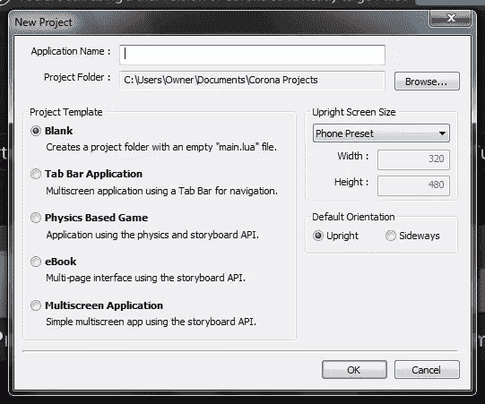

图 18: Corona 为五种常见类型的项目提供了模板。

Corona 需要项目的名称。它还允许您为想要创建的项目类型(例如电子书)选择模板，并提供其他设置。

在**应用名称**文本框中输入 **HelloWorld2** ，保持图 18 所示的默认设置，按 **OK** 。在我的 Windows 7 平台上，我观察到如图 19 所示的两个窗口。

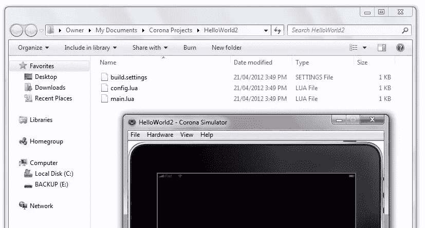

图 19:一个新的 Corona 项目由 build.settings、config.lua 和 main.lua 文件组成。

Corona 为 **HelloWorld2** 项目创建一个项目目录。在我的平台上，这个目录位于`C:UsersOwnerDocumentsCorona ProjectsHelloWorld2`。Corona 还会在`HelloWorld2`中创建`build.settings`、`config.lua`和骨骼`main.lua`文件。

* * *

**注意:** `build.settings`包含构建项目的指令，`config.lua`提供动态内容缩放等运行时配置信息。访问 Ansca 的[配置选项](http://developer.anscamobile.com/content/configuring-projects)页面，了解关于这些文件的更多信息。

* * *

在 Windows 记事本或另一个文本编辑器中打开`main.lua`,您将看到清单 3 所示的框架内容。

```
-----------------------------------------------------------------------------------------
--
-- main.lua
-- -----------------------------------------------------------------------------------------
-- Your code here
```

**清单 3(如上):**用您自己的代码替换的框架模板。

用清单 2 的`main.lua`内容替换清单 3 的框架代码。您还必须将位于`HelloWorld`项目目录(在我的平台上是`C:Program Files (x86)AnscaCorona SDKSample CodeGettingStartedHelloWorld`)中的 PNG 和 JPEG 文件复制到 **HelloWorld2** 的项目目录中。完成后，从模拟设备窗口的**文件**菜单中选择**重新启动**。您应该会看到如图 16 所示的输出。

#### 探索基本功能

Corona 提供了几个提供有用功能的基本功能。例如，`print()`让你输出一个字符串到**电晕模拟器输出**窗口，这对调试很有用。此外，您可以调用`type()`来返回一个字符串，该字符串标识作为参数传递的变量或其他表达式的类型。(Lua 是一种动态类型语言，其中值——和*而不是*变量——都有类型。变量采用当前赋予它的任何值的类型。)

我们来玩玩这些函数。将下面两行添加到`main.lua`的末尾(添加之前，其内容应该如清单 2 所示),并保存这些更改:

```
print(type("ABC"))
print(type(myText))
```

从模拟装置窗口的**文件**菜单中选择**重启**。你应该观察到**电晕模拟器输出**窗口中连续几行出现的**串**和**表**。参见图 20。

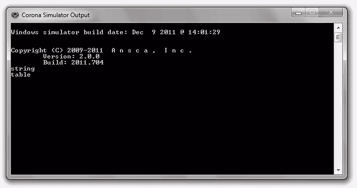

图 20:Corona 模拟器输出窗口显示通过 print()输出的所有消息。

您通常会用到的另外两个基本函数是`tonumber()`和`tostring()`。前一个函数试图将其参数转换为数字，而后一个函数将其参数转换为字符串。例如，`tostring(25)`将数字`25`转换成由字母`2`和`5`组成的字符串。相反，`tonumber("25")`将字符串`25`转换为数字`25`。通过将以下陈述附加到`main.lua`来证明这一点:

```
print(type(tostring(25)))
print(type(tonumber("25")))
```

当您重新启动模拟器时，您应该观察到**字符串**和**数字**在不同的行上。

将表格对象转换为字符串会产生不同的输出。您可以通过在`main.lua`后添加下面一行来亲自查看:

```
print("Display object: " .. tostring(myText))
```

这个函数调用包括一个表达式，该表达式将表对象的字符串表示连接到字符串。(Lua 通过“`..`”操作符表示字符串连接。)

当您重新启动模拟器时，您应该观察到类似如下的输出:

```
Display object: table: 00DDEAF0
```

输出包括一个用十六进制表示的 32 位值，它唯一地标识显示对象(或任何其他类型的表)。

#### 浏览其他显示对象

`display.newImage()`和`display.newText()`函数调用返回添加到 stage 容器中并在模拟设备窗口上可见的图像和文本显示对象。Corona 还支持其他显示对象，包括矩形和圆形。(矩形和圆形属于被称为*矢量对象*的显示对象类别。)

考虑矩形。您可以通过指定`display.newRect(left, top, width, height)`向舞台添加一个矩形，在这里您将数字(表示从设备左上角原点[0，0]测量的屏幕坐标)传递给`left`和`top`，并将指定矩形宽度和高度的数字传递给`width`和`height`。

我们来实验一下！将以下代码添加到`main.lua`并重新启动模拟器:

```
local myRect = display.newRect(50, 50, display.contentWidth/2, 50)
myRect.alpha = 0.5
myRect:setFillColor(0, 0, 255)
```

第一行创建一个宽度为屏幕一半的矩形。宽度是通过读取`display`的`contentWidth`属性的值获得的，该属性对于所有显示对象都是通用的。我已经指定了值，将矩形放置在“ **Hello，World！**“消息。

第二行访问另一个公共属性:`alpha`。该属性决定了对象的*不透明度*(对象阻挡了多少背景)，范围从 0(透明)到 1.0(不透明)。我已经指定了 0.5 (50%)，这样你仍然可以看到被覆盖的部分" **Hello，World！**“消息。

最后一行调用`setFillColor()`函数(使用冒号缩写语法)来指定矩形内部的颜色。我选择了纯蓝作为这种颜色。

图 21 显示了受此代码影响的模拟设备窗口部分。

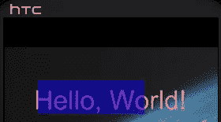

图 21:一个半透明的蓝色矩形被放置在部分文本上。

#### 探索事件处理

Corona 允许您将事件侦听器附加到显示对象，这些事件侦听器可以响应由各种用户操作(如触摸某个项目)生成的事件。侦听器可以表示为一个函数或一个表。在这两种情况下，监听器都是通过描述事件的表来调用的。

通过使用两个参数调用显示对象的`addEventListener()`函数来附加一个侦听器，第一个参数是命名事件的字符串，第二个参数是侦听器本身。当您不再需要侦听器时，您可以通过使用相同的参数调用`removeEventListener()`来删除它。

例如，Corona 允许您响应触摸事件，当用户以某种方式触摸显示对象时会发生该事件(您可以通过将鼠标光标移动到显示对象上并按下鼠标左键来触发该事件)。以下代码向您展示了如何创建一个基于函数的监听器，并将其注册到之前创建的`myRect`对象，以响应这类事件:

```
local listener = function(event)
   print (event.name.." has occurred")
   myRect:setFillColor(math.random(0, 256), math.random(0, 256), math.random(0,256)) 
end 

myRect:addEventListener("touch", listener)

```

这段代码首先声明了一个匿名(未命名)函数，该函数只有一个名为`event`的参数。该函数通过读取事件的`name`属性获得事件的名称，然后将该名称(**触摸**)后跟“【T4 已发生】T5”打印到**电晕模拟器输出**窗口。

接下来，该函数将矩形的当前颜色更改为随机生成的颜色，其中每个红色、绿色和蓝色分量被分配一个从 0 到 255(包括 0 和 255)之间随机选择的值。

最后，触摸监听器通过`addEventListener()`连接到`myRect`矩形显示对象。

### 结论

虽然 Corona 的内容比我在这两篇简短的介绍性文章中所能涵盖的要多得多，但我希望所介绍的内容能够让您开始对该产品能够帮助您实现的目标感到兴奋。你从这里去哪里？我有五点建议:

1.  探索 SDK 中包含的其他示例。
2.  浏览 Ansca Mobile 的[网站](http://www.anscamobile.com/)上的[资源](http://developer.anscamobile.com/resources/)部分。请特别注意 API 参考和提供的各种文档。
3.  学习 Lua 语言。在写这篇文章的时候，我在 http://www.gieson.com/corona/发现了一个关于 Lua 和 Corona APIs 的很棒的资源。你可能也想看看 [Lua 5.0 参考手册](http://www.lua.org/manual/5.0/manual.html)。
4.  虽然您可以使用 Corona 模拟器来学习 Lua，但是您可能更喜欢使用专门为此目的定制的更方便的工具(例如，您可能希望通过交互式命令窗口进行探索)。访问[http://www.lua.org/download.html](http://www.lua.org/download.html)为您的平台下载 Lua 软件。
5.  编写一个简单的游戏或另一种应用程序。如果你对使用 Corona 开发游戏感兴趣，你可能想看看 [Corona SDK 移动游戏开发:初学者指南](http://www.amazon.com/Corona-Game-Development-Beginners-Guide/dp/1849691886/ref=sr_1_2?s=books&ie=UTF8&qid=1329600665&sr=1-2)

差不多就是这样。现在是时候加入乐趣并兑现您的应用程序创意了。

## 分享这篇文章