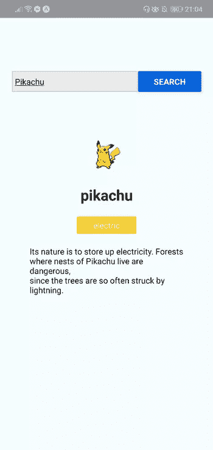
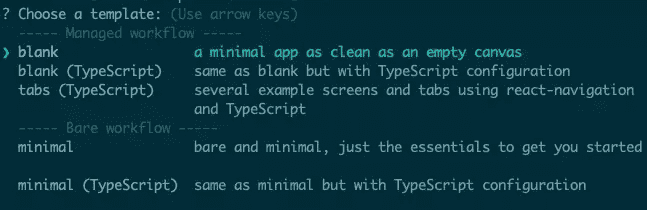
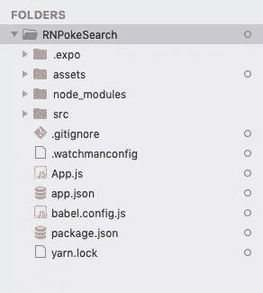
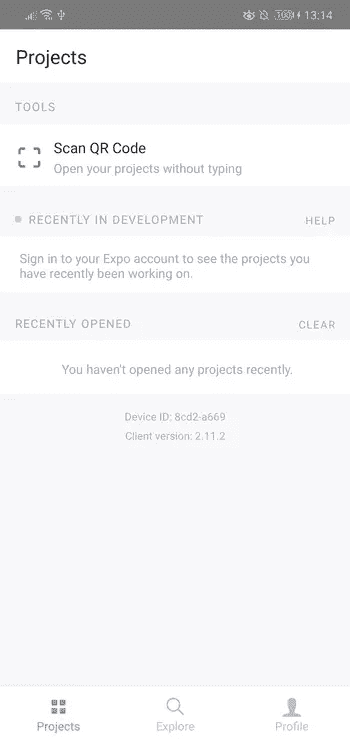
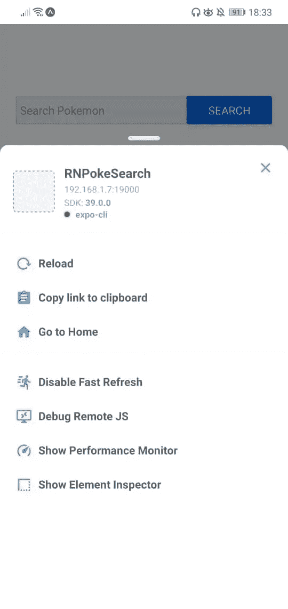

# React Native 入门

> 原文：<https://www.sitepoint.com/getting-started-with-react-native/>

随着智能手机的日益普及，开发人员正在寻找构建移动应用的解决方案。对于具有 web 背景的开发人员来说，诸如 Cordova 和 Ionic、React Native、NativeScript 和 Flutter 等框架允许我们用我们已经熟悉的语言创建移动应用程序:HTML、XML、CSS 和 JavaScript。

在本指南中，我们将进一步了解 React Native。你会学到入门的基本知识。具体来说，我们将涵盖以下内容:

*   反应原生是什么
*   世博会是什么
*   如何使用 Expo 建立一个 React 本地开发环境
*   如何使用 React Native 创建应用程序

## 先决条件

本教程假设您有 web 开发背景。要想自信地阅读本教程，最起码要了解 HTML、CSS 和 JavaScript。您还应该知道如何在您的操作系统上安装软件，以及如何使用命令行。我们还将使用一些 ES6 语法，所以如果你也知道基本的 ES6 语法会有所帮助。React 知识是有帮助的，但不是必需的。

## 什么是 React Native？

React Native 是一个框架，用于构建可以在 Android 和 iOS 上运行的应用。它允许你使用 JavaScript 和 React 创建真正的本地应用。这与 Cordova 等框架不同，在 Cordova 中，您使用 HTML 来构建 UI，然后 UI 将显示在设备的集成移动浏览器(WebView)中。React Native 内置了编译成本机 UI 组件的组件，而您的 JavaScript 代码是通过虚拟机执行的。这使得 React Native 比 Cordova 更具性能。

React Native 的另一个优点是它能够访问本机设备特性。有许多插件可以用来访问本机设备功能，如[相机](https://github.com/react-native-community/react-native-camera)和[各种设备传感器](https://github.com/react-native-sensors/react-native-sensors)。如果你需要一个还没有实现的特定于平台的特性，你也可以[构建你自己的原生模块](https://reactnative.dev/docs/native-modules-ios)——尽管这需要你对你想要支持的原生平台有相当的了解(Android 的 Java 或 Kotlin，iOS 的 Objective C 或 Swift)。

如果你来到这里，你是新的反应，你可能会想知道这是什么。 [React](https://reactjs.org/) 是一个用于构建用户界面的网页 JavaScript 库。如果你熟悉 MVC，它基本上就是 MVC 中的视图。React 的主要目的是允许开发者构建可重用的 UI 组件。这些组件的例子包括按钮、滑块和卡片。React Native 采用了构建可重用 UI 组件的想法，并将其引入到移动应用程序开发中。

## 什么是世博会？

来这里之前，你可能听说过世博会。在官方的 React Native 文档中甚至提到了它，所以你可能想知道它是什么。

简而言之，Expo 允许您构建 React 原生应用程序，而无需最初设置开发环境时遇到的麻烦。它只需要在你的机器上安装 Node，在你的设备或模拟器上安装 Expo 客户端应用程序。

但这只是 Expo 最初的销售方式。事实上，远不止如此。Expo 实际上是一个平台，让您可以使用 React Native 更快地构建 Android 和 iOS 应用程序的工具、库和服务。Expo 附带了一个 SDK，其中包含了您在移动应用程序开发平台中可以找到的大多数 API:

*   [摄像机](https://docs.expo.io/versions/latest/sdk/camera)
*   [图像拾取器](https://docs.expo.io/versions/latest/sdk/imagepicker)
*   [脸书](https://docs.expo.io/versions/latest/sdk/facebook)
*   [谷歌登录](https://docs.expo.io/versions/latest/sdk/google-sign-in)
*   [地点](https://docs.expo.io/versions/latest/sdk/location)
*   [地图视图](https://docs.expo.io/versions/latest/sdk/map-view)
*   [权限](https://docs.expo.io/versions/latest/sdk/permissions)
*   [推送通知](https://docs.expo.io/push-notifications/sending-notifications/)
*   [视频](https://docs.expo.io/versions/latest/sdk/video/)

如果您开始使用 Expo 构建 React 原生应用程序，这些只是您可以获得的现成 API 中的一小部分。当然，如果您使用标准的 React 本机设置开发应用程序，这些 API 也可以通过本机模块获得。

## 平原反应本土还是世博？

真正的问题是选择哪一个——plain React Native 还是 Expo？答案真的没有对错。这完全取决于背景和你的需求。但是我想可以肯定的是，您正在阅读本教程，因为您想快速开始使用 React Native。所以我建议你从世博开始。它快速、简单、易于设置。您可以直接开始修改 React 本机代码，并在几个小时内感受一下它所提供的功能。

但是当你开始掌握不同的概念，以及对不同的本地特性的需求增加时，你可能会发现 Expo 有点限制。是的，它有许多可用的本机特性，但并不是所有可用于标准 React 本机项目的本机模块都受支持。

*注意:像 [unimodules](https://blog.expo.io/flutter-unimodules-bb66b9bf21de) 这样的项目开始缩小标准 React 本地项目和 Expo 项目之间的差距，因为它允许开发人员创建适用于 React 本地和 ExpoKit 的本地模块。*

## 设置 React 本机开发环境

要快速上手 React Native，推荐的方法是设置 [Expo](https://expo.io/) 。

设置 Expo 的唯一先决条件是您需要在您的机器上安装 Node.js。要做到这一点，你可以前往官方的[节点下载页面](https://nodejs.org/en/download/)并为你的系统获取相关的二进制文件，或者你可以[使用版本管理器](https://www.sitepoint.com/quick-tip-multiple-versions-node-nvm/)，它允许你安装多个版本的节点并在它们之间随意切换。

安装 Node.js 之后，安装 Expo CLI。这用于创建、服务、打包和发布项目:

```
npm install -g expo-cli 
```

接下来，安装 Yarn，Expo 的首选包管理器:

```
npm install -g yarn 
```

真的就是这么回事！下一步是为[安卓](https://play.google.com/store/apps/details?id=host.exp.exponent)或 [iOS](https://itunes.apple.com/us/app/expo-client/id982107779?mt=8) 下载世博客户端 App。请注意，这是您在开发过程中运行 Expo 应用程序的唯一方式。当你准备好发布应用程序时，你可以按照[这个指南为 iOS 和 Android 创建独立的二进制文件](https://docs.expo.io/versions/latest/distribution/building-standalone-apps/)，这些文件可以提交给苹果应用商店和谷歌 Play 商店。

## 我们将会建造什么

现在，您的开发环境已经设置好了，我们可以看看我们将要创建的应用程序—神奇宝贝搜索应用程序。它将允许用户在输入框中键入神奇宝贝的名称，然后从外部 API 获取神奇宝贝的详细信息并显示给用户。

这是完成后的样子:



和以往一样，你可以在我们的 [GitHub repo](https://github.com/sitepoint-editors/RNPokeSearch2) 中找到源代码。

### 引导应用程序

在您的终端上，执行以下命令，使用 Expo 创建一个新的 React 本地项目:

```
expo init RNPokeSearch 
```

在*管理的工作流程*下，选择*空白*。默认情况下，这将使用 Yarn 安装依赖项。



你可能会问这个*管理工作流*和*裸工作流*是什么。这是 Expo 支持的两种类型的工作流。有了托管工作流，您只需处理 JavaScript，Expo 会为您管理一切。而在*的裸工作流*中，你可以完全控制原生代码。它为您提供了与 React Native CLI 相同的自由，但是还增加了 Expo 的库和服务。如果您想了解更多关于 Expo 工作流程的信息，您可以访问[这一托管 vs 裸介绍页面](https://docs.expo.io/introduction/managed-vs-bare/)。

就像在 web 环境中一样，您可以安装库来轻松地在 React Native 中实现不同种类的功能。一旦项目被创建，我们需要安装几个依赖项:[口袋妖怪](https://github.com/sindresorhus/pokemon)和 [axios](https://github.com/axios/axios) 。前者用于验证搜索框中输入的文本是否是真实的神奇宝贝名称，而 axios 用于向我们正在使用的 API 发出 HTTP 请求，即 [PokeAPI](https://pokeapi.co/) :

```
yarn add pokemon axios 
```

### React 本机项目目录结构

在我们继续编码之前，让我们先看看用 Expo 创建的 React 原生项目的目录结构:



以下是您需要记住的最重要的文件和文件夹的分类:

*   `App.js`:主项目文件。这是您开始开发应用程序的地方。您对此文件所做的任何更改都会反映在屏幕上。
*   `src`:作为主文件夹，存储与应用本身相关的所有源代码。请注意，这不包括在 Expo CLI 创建的默认项目中。该文件夹的名称可以是任何名称。有些人也用`app`。
*   `assets`:这是图标、闪屏等应用资产存放的地方。
*   `package.json`:添加您为此项目安装的库的名称和版本。
*   `node_modules`:存储您安装的库的位置。注意，在您安装这两个库之前，它已经包含了很多文件夹。这是因为 React Native 也有自己的依赖项。对于您安装的所有其他库也是如此。

现在不要介意其余的文件夹和文件，因为我们在刚开始时不需要它们。

### 运行应用程序

现在，您可以通过执行下面的命令来运行应用程序。确保您已经为您的手机安装了相应的 Expo 客户端( [Android](https://play.google.com/store/apps/details?id=host.exp.exponent) 或 [iOS](https://apps.apple.com/us/app/expo-client/id982107779) )，并且在安装之前它已经与您的电脑连接到了同一网络。如果你没有可以测试的 Android 或 iOS 设备，你可以使用 [Android Studio 模拟器](https://docs.expo.io/workflow/android-studio-emulator/)或 [iOS 模拟器](https://docs.expo.io/workflow/ios-simulator/)，这样你就可以在你的机器上运行应用程序:

```
yarn start 
```

一旦它开始运行，就会显示一个二维码:


打开您的世博客户端应用程序，在项目选项卡中点击*扫描二维码*。这将在您的 Android 或 iOS 设备上打开应用程序。如果你有一个模拟器正在运行，你可以按`i`在 iOS 模拟器上运行它，或者按`a`在 Android 模拟器上运行它。



如果你在一个真实的设备上测试，摇动它，开发者菜单就会出现。



确保*快速刷新*已启用。这允许您自动重新加载对组件所做的更改。

## 编写应用程序

Expo 有许多内置组件，您可以使用它们来完成您想要的功能。简单地浏览一下 [API 文档](https://docs.expo.io/versions/latest/)，你会找到关于如何实现你所需要的东西的信息。在大多数情况下，您要么需要一个特定的 UI 组件，要么需要一个与您计划使用的服务协同工作的 SDK。通常情况下，您的工作流程会是这样的:

1.  寻找一个实现您想要的现有包。
2.  安装它。
3.  链接它。只有当你在 Expo 的裸工作流上并且你已经安装的包有一个相应的本地依赖时，这才是必要的。
4.  在你的项目中使用它。

现在，您已经设置了您的环境并了解了一些工作流，我们准备开始编写应用程序。

首先，让我们把我们需要的文件整理出来。这些是`src/Main.js`，还有`src/components/Pokemon.js`。`Main`组件将保存显示搜索输入和查询 API 的代码，而`Pokemon`组件将用于显示返回的神奇宝贝数据:

```
mkdir -p src/components
touch src/Main.js
touch src/components/Pokemon.js 
```

向两个文件添加一些虚拟内容:

```
// src/Main.js
import React, { Component } from 'react';

export default class Main extends Component {
  render() {
    return null;
  }
} 
```

```
// src/components/Pokemon.js
import  React  from  'react';

const  Pokemon  =  ()  =>  null; 
```

接下来，用以下代码替换`App.js`文件的内容:

```
import React from 'react';
import Main from './src/Main';

function App() {
  return <Main />;
}

export default App; 
```

上述代码中的第一行代码导入 React。当你想要创建一个组件的时候，你需要导入这个类。

第二行是我们导入定制`Main`组件的地方。我们稍后会填充它，但是现在，要知道这是我们放置大部分代码的地方。

之后，我们通过创建一个新函数来创建组件。这个函数所做的就是返回`Main`组件。

最后，我们导出该类，以便 Expo 可以导入和呈现它。

接下来，在`src/Main.js`文件中添加以下内容:

```
// src/Main.js
import React, { Component } from 'react';
import {
  SafeAreaView,
  View,
  Text,
  TextInput,
  Button,
  Alert,
  StyleSheet,
  ActivityIndicator,
} from 'react-native'; 
```

第二行导入 React Native 中内置的组件。每个人都是这样做的:

*   `SafeAreaView`:用于渲染设备安全区域边界内的内容。这会自动添加一个填充来包装其内容，这样它就不会呈现在设备的摄像头凹口和传感器外壳区域。
*   `View`:一个基本的 UI 构建模块。这主要用作所有其他组件的包装器，因此它们的结构可以让您轻松地设置样式。就当是相当于`<div>`吧。如果你想使用 Flexbox，你必须使用这个组件。
*   `Text`:用于显示文本。
*   `TextInput`:用于输入文本的 UI 组件。该文本可以是纯文本、电子邮件、密码或数字键盘。
*   `Button`:显示特定平台按钮。这个组件基于它运行的平台看起来是不同的。如果是安卓，就用材质设计。如果是 iOS，就用 Cupertino。
*   `Alert`:显示警告和提示。
*   `ActivityIndicator`:显示加载动画指示器。
*   `StyleSheet`:用于定义组件样式。

接下来，导入我们之前安装的库:

```
import axios from 'axios';
import pokemon from 'pokemon'; 
```

以及用于显示神奇宝贝数据的自定义`Pokemon`组件:

```
import Pokemon from "./components/Pokemon"; 
```

*注意:如果 Expo 无法解析`Pokemon`(或任何其他)组件，请尝试重启服务器。*

因为获取所需的神奇宝贝数据需要发出两个 API 请求，所以我们必须将 API 的基本 URL 设置为常量:

```
const POKE_API_BASE_URL = 'https://pokeapi.co/api/v2'; 
```

接下来，定义组件类并初始化其状态:

```
export default class Main extends Component {
  constructor(props) {
    super(props)

    this.state = {
      isLoading: false, // decides whether to show the activity indicator or not
      searchInput: '', // the currently input text
      name: '', // Pokémon name
      pic: '', // Pokémon image URL
      types: [], // Pokémon types array
      desc: '', // Pokémon description
    };
  }

  render() {
    return null;
  }
} 
```

在上面的代码中，我们定义了应用程序的主要组件。你可以通过定义一个 ES6 类并让它扩展 React 的`Component`类来做到这一点。这是在 React 中定义组件的另一种方式。在`App.js`文件中，我们创建了一个*功能组件*。这次我们要创建一个基于*类的组件*。

两者的主要区别在于功能组件仅用于表示目的。功能组件不需要保持自己的状态，因为它们需要的所有数据都是通过 props 传递给它们的。另一方面，基于类的组件维护它们自己的状态，并且通常是它们将数据传递给功能组件。请注意，这是在 React 中创建组件的传统方式。更现代的方法是坚持使用功能组件，并使用[状态挂钩](https://reactjs.org/docs/hooks-state.html)来管理状态——尽管在本教程中，我们只是为了保持简单，坚持使用基于类的组件。

如果你想了解更多关于功能组件和基于类的组件之间的区别，请阅读教程“[React](https://medium.com/@Zwenza/functional-vs-class-components-in-react-231e3fbd7108)中的功能组件和类组件”。

回到代码，我们正在初始化组件内部的状态。您将其定义为一个普通的 JavaScript 对象。任何进入状态的数据都应该负责改变组件所呈现的内容。在这种情况下，我们输入`isLoading`来控制活动指示器的可见性，输入`searchInput`来跟踪搜索框中的输入值。

这是一个需要记住的重要概念。React Native 的内置组件，甚至您创建的自定义组件，都接受控制以下内容的属性:

*   屏幕上显示的内容(数据源)
*   他们如何呈现它(结构)
*   它看起来像什么(样式)
*   当用户与它交互时要执行什么操作(功能)

我们将在下一节更详细地讨论这些属性。现在，我们知道这些属性的值通常是通过状态更新的。

其余的状态值用于神奇宝贝数据。用您希望以后存储的相同类型的数据来设置初始值是一个很好的做法——因为这也可以作为文档。

### 结构化和样式化组件

让我们回到组件类定义。当你扩展 React 的`Component`类时，你必须定义一个`render()`方法。它包含了返回组件 UI 的代码，由我们之前导入的 React 本地组件组成。

每个组件都有自己的一套道具。这些基本上是传递给组件的属性，用于控制组件的特定方面。在下面的代码中，大部分都有`style` prop，用来修改一个组件的样式。您可以将任何数据类型作为道具传递。比如`TextInput`的`onChangeText`道具是一个函数，而`Pokemon`中的`types`道具是一个对象数组。稍后在`Pokemon`组件中，你会看到道具是如何被使用的。

用以下内容替换`Main.js`中的`render()`方法:

```
render() {
  const { name, pic, types, desc, searchInput, isLoading } = this.state; // extract the Pokémon data from the state

  return (
    <SafeAreaView style={styles.wrapper}>  <View style={styles.container}>  <View style={styles.headContainer}>  <View style={styles.textInputContainer}>  <TextInput
              style={styles.textInput}
              onChangeText={(searchInput) => this.setState({ searchInput })}
              value={this.state.searchInput}
              placeholder="Search Pokémon"
            />  </View>  <View style={styles.buttonContainer}>  <Button
              onPress={this.searchPokemon}
              title="Search"
              color="#0064e1"
            />  </View>  </View>  <View style={styles.mainContainer}>  {isLoading && <ActivityIndicator size="large" color="#0064e1" />}  {!isLoading && (
            <Pokemon name={name} pic={pic} types={types} desc={desc} />
          )}  </View>  </View>  </SafeAreaView>
  );
} 
```

分解上面的代码，我们首先提取状态数据:

```
const { name, pic, types, desc, searchInput, isLoading } = this.state; 
```

接下来，我们返回组件的 UI，它遵循以下结构:

```
SafeAreaView.wrapper;
  View.container;
    View.headContainer;
      View.textInputContainer;
        TextInput;
      View.buttonContainer;
        Button;
    View.mainContainer;
      ActivityIndicator;
        Pokemon; 
```

上述结构针对使用 Flexbox 进行了优化。继续在文件底部定义组件样式:

```
const styles = StyleSheet.create({
  wrapper: {
    flex: 1,
  },
  container: {
    flex: 1,
    padding: 20,
    backgroundColor: '#F5FCFF',
  },
  headContainer: {
    flex: 1,
    flexDirection: 'row',
    marginTop: 100,
  },
  textInputContainer: {
    flex: 2,
  },
  buttonContainer: {
    flex: 1,
  },
  mainContainer: {
    flex: 9,
  },
  textInput: {
    height: 35,
    marginBottom: 10,
    borderColor: '#ccc',
    borderWidth: 1,
    backgroundColor: '#eaeaea',
    padding: 5,
  },
}); 
```

在 React Native 中，您通过使用`StyleSheet.create()`并传入包含您的样式的对象来定义样式。这些样式定义基本上是 JavaScript 对象，它们遵循与您通常的 CSS 样式相同的结构:

```
element: {
  property: value;
} 
```

`wrapper`和`container`被设置为`flex: 1`，这意味着它将占用全部可用空间，因为它们没有兄弟。React Native 默认为`flexDirection: 'column'`，这意味着它将垂直布局 flex 项目。


相比之下，(`flexDirection: 'row'`)横向布局项目。


对于`headContainer`来说是不同的，因为即使它被设置为`flex: 1`，它也有`mainContainer`作为它的兄弟。这意味着`headContainer`和`mainContainer`将共享同一个空间。`mainContainer`被设置为`flex: 9`，因此它将占据大部分可用空间(约 90%)，而`headContainer`将仅占据约 10%。

让我们继续讨论`headContainer`的内容。它有`textInputContainer`和`buttonContainer`作为它的子节点。它被设置为`flexDirection: 'row'`，这样它的子节点将被水平布局。同样的原则也适用于空间共享:`textInputContainer`占据了可用水平空间的三分之二，而`buttonContainer`只占据了三分之一。

当你有 CSS 背景的时候，其余的样式就不言自明了。只需记住省略`-`并将下面的字符设为大写即可。例如，如果您想要设置`background-color`，那么 React 本地等价物是`backgroundColor`。

注意:React Native 并不支持网络上所有的 CSS 属性。例如，不支持像浮动或表格属性这样的东西。您可以在[视图](https://reactnative.dev/docs/view-style-props)和[文本](https://reactnative.dev/docs/text-style-props)组件的文档中找到支持的 CSS 属性列表。有人还编写了一个 [React 原生样式备忘单](https://github.com/vhpoet/react-native-styling-cheat-sheet)，在文档中有一个样式部分，用于您想要使用的特定 React 原生组件。例如，下面是可以用于[图像](https://reactnative.dev/docs/image#style)组件的样式属性。

### 事件处理和更新状态

现在让我们分解一下`TextInput`和`Button`组件的代码。在这一节中，我们将讨论事件处理、发出 HTTP 请求以及在 React Native 中更新状态。

让我们从检查`TextInput`的代码开始:

```
<TextInput
  style={styles.textInput}
  onChangeText={(searchInput) => this.setState({ searchInput })}
  value={this.state.searchInput}
  placeholder="Search Pokémon"
/> 
```

在上面的代码中，我们设置了当用户在组件中输入内容时执行的函数。像这样处理事件类似于它们在 DOM 中的处理方式:您只需将事件名作为一个属性传递，并将其值设置为您希望执行的函数。在这种情况下，我们内联它，因为我们只是更新状态。用户输入的值会自动作为参数传递给所提供的函数，因此您所要做的就是用该值更新状态。不要忘记将`TextInput`的值设置为状态变量的值。否则，用户输入的值不会在他们键入时显示出来。

接下来，我们继续讨论`Button`组件。在这里，我们正在监听`onPress`事件:

```
<Button onPress={this.searchPokemon} title="Search" color="#0064e1" /> 
```

一旦按下，就会执行`searchPokemon()`功能。将该函数添加到`render()`方法的正下方。这个函数使用`async...await`模式，因为执行 HTTP 请求是一个异步操作。您也可以使用 Promises，但是为了保持代码简洁，我们将坚持使用 async/await。如果你不熟悉这项技术，请务必阅读“[现代 JS](https://www.sitepoint.com/flow-control-callbacks-promises-async-await/) 中的流量控制”。

```
// src/Main.js
import React, { Component } from 'react';
...
export default class Main extends Component {
  ...

  render() { ... }

  searchPokemon = async () => {
    try {
      const pokemonID = pokemon.getId(this.state.searchInput); // check if the entered Pokémon name is valid

      this.setState({
        isLoading: true, // show the loader while request is being performed
      });

      const { data: pokemonData } = await axios.get(
        `${POKE_API_BASE_URL}/pokemon/${pokemonID}`
      );
      const { data: pokemonSpecieData } = await axios.get(
        `${POKE_API_BASE_URL}/pokemon-species/${pokemonID}`
      );

      const { name, sprites, types } = pokemonData;
      const { flavor_text_entries } = pokemonSpecieData;

      this.setState({
        name,
        pic: sprites.front_default,
        types: this.getTypes(types),
        desc: this.getDescription(flavor_text_entries),
        isLoading: false, // hide loader
      });
    } catch (err) {
      Alert.alert('Error', 'Pokémon not found');
    }
  };
}

const styles = StyleSheet.create({ ... }); 
```

分解上面的代码，我们首先检查输入的神奇宝贝名称是否有效。如果它是有效的，[国家 Pokedex ID](https://pokemondb.net/pokedex/national) (如果你打开链接，这是在神奇宝贝名字上面的数字)被返回，我们提供它作为 HTTP 请求的参数。该请求是使用 axios 的`get()`方法发出的，对应于一个 HTTP GET 请求。一旦数据可用，我们提取我们需要的并更新状态。

下面是`getTypes()`函数。它所做的只是将神奇宝贝类型的`slot`和`type`属性重新分配给`id`和`name`:

```
getTypes = (types) =>
  types.map(({ slot, type }) => ({
    id: slot,
    name: type.name,
  })); 
```

下面是`getDescription()`函数。这找到了第一个英文版本的`flavor_text`:

```
getDescription = (entries) =>
    entries.find((item) => item.language.name === 'en').flavor_text; 
```

将它们添加到`searchPokemon`函数之后，就像这样:

```
import React, { Component } from 'react';
...
export default class Main extends Component {
  ...

  render() { ... }

  searchPokemon = async () => { ... };
  getTypes = (types) => types.map( ... );
  getDescription = (entries) => entries.find( ... );
}

const styles = StyleSheet.create({ ... }); 
```

### 神奇宝贝组件

既然我们的应用程序正在从 API 中获取数据，那么是时候扩展我们之前剔除的`Pokemon`组件了，这样我们就可以显示这些数据了。打开`src/components/Pokemon.js`文件，将内容替换为以下内容:

```
import React from 'react';
import { View, Text, Image, FlatList, StyleSheet } from 'react-native';

const Pokemon = ({ name, pic, types, desc }) => {
  if (!name) {
    return null;
  }

  return (
    <View style={styles.mainDetails}>  <Image source={{ uri: pic }} style={styles.image} resizeMode="contain" />  <Text style={styles.mainText}>{name}</Text>  <FlatList
        columnWrapperStyle={styles.types}
        data={types}
        numColumns={2}
        keyExtractor={(item) => item.id.toString()}
        renderItem={({ item }) => (
          <View style={[styles[item.name], styles.type]}>  <Text style={styles.typeText}>{item.name}</Text>  </View>
        )}
      />  <View style={styles.description}>  <Text>{desc}</Text>  </View>  </View>
  );
};

//
const styles = StyleSheet.create({
  mainDetails: {
    padding: 30,
    alignItems: 'center',
  },
  image: {
    width: 100,
    height: 100,
  },
  mainText: {
    fontSize: 25,
    fontWeight: 'bold',
    textAlign: 'center',
  },
  description: {
    marginTop: 20,
  },
  types: {
    flexDirection: 'row',
    marginTop: 20,
  },
  type: {
    padding: 5,
    width: 100,
    alignItems: 'center',
  },
  typeText: {
    color: '#fff',
  },
  normal: {
    backgroundColor: '#8a8a59',
  },
  fire: {
    backgroundColor: '#f08030',
  },
  water: {
    backgroundColor: '#6890f0',
  },
  electric: {
    backgroundColor: '#f8d030',
  },
  grass: {
    backgroundColor: '#78c850',
  },
  ice: {
    backgroundColor: '#98d8d8',
  },
  fighting: {
    backgroundColor: '#c03028',
  },
  poison: {
    backgroundColor: '#a040a0',
  },
  ground: {
    backgroundColor: '#e0c068',
  },
  flying: {
    backgroundColor: '#a890f0',
  },
  psychic: {
    backgroundColor: '#f85888',
  },
  bug: {
    backgroundColor: '#a8b820',
  },
  rock: {
    backgroundColor: '#b8a038',
  },
  ghost: {
    backgroundColor: '#705898',
  },
  dragon: {
    backgroundColor: '#7038f8',
  },
  dark: {
    backgroundColor: '#705848',
  },
  steel: {
    backgroundColor: '#b8b8d0',
  },
  fairy: {
    backgroundColor: '#e898e8',
  },
});

export default Pokemon; 
```

在上面的代码中，我们首先检查了`name`是否有一个 falsy 值。如果有，我们简单地返回`null`，因为没有什么要呈现的。

我们还使用了两个新的内置 React 本地组件:

*   `Image`:用于显示来自互联网或文件系统的图像
*   `FlatList`:用于显示列表

正如我们前面看到的，我们传入神奇宝贝数据作为这个组件的道具。我们可以像从对象中提取单个属性一样提取这些属性:

```
const Pokemon = ({ name, pic, types, desc }) => {
    // ..
}; 
```

组件`Image`需要将`source`传递给它。`source`既可以是来自文件系统的图像，也可以是来自互联网的图像。前者要求使用`require()`包含图像，而后者要求将图像 URL 用作传递给它的对象的`uri`属性值。

`resizeMode`允许您[控制图像如何根据其容器调整大小](https://reactnative.dev/docs/image#resizemode)。我们使用了`contain`，这意味着它将调整图像的大小，使其适合其容器，同时仍然保持其纵横比。注意，容器就是`Image`组件本身。我们已经将它的`width`和`height`设置为`100`，因此图像将被调整到这些尺寸。如果原始图像的宽度大于高度，将使用`100`的`width`，而`height`将相应调整以保持纵横比。如果原始图像尺寸较小，它将简单地保持其原始尺寸:

```
<Image source={{ uri: pic }} style={styles.image} resizeMode={"contain"} /> 
```

接下来是`FlatList`组件。它用于呈现项目列表。在这种情况下，我们使用它来渲染神奇宝贝的类型。这需要`data`，它是一个包含要呈现的项目的数组，以及`renderItem`，它是负责呈现列表中每个项目的函数。可以像在功能组件中访问 props 一样访问当前迭代中的项目:

```
<FlatList
  columnWrapperStyle={styles.types}
  data={types}
  numColumns={2}
  keyExtractor={(item) => item.id.toString()}
  renderItem={({ item }) => (
    <View style={[styles[item.name], styles.type]}>  <Text style={styles.typeText}>{item.name}</Text>  </View>
  )}
/> 
```

在上面的代码中，我们还提供了以下属性:

*   `columnWrapperStyle`:用于指定各列的样式。在这种情况下，我们希望内联呈现每个列表项，所以我们指定了`flexDirection: 'row'`。
*   `numColumns`:列表中每行要呈现的最大列数。在这种情况下，我们指定了`2`，因为一个口袋妖怪最多只能有两种类型。
*   `keyExtractor`:用于提取每个项目的密钥的功能。如果您将一个`key`属性传递给每个列表项的最外层组件，那么您实际上可以省略这个属性。

现在，您可以在您的设备或仿真器上测试应用程序了:

```
yarn start 
```

在终端上，如果你想在 Android 模拟器上运行应用程序，可以按`a`，如果你想在 iOS 模拟器上运行应用程序，可以按`i`。

还请注意，神奇宝贝的名字必须以大写字母开头——例如，“皮卡丘”，而不是“皮卡丘”。

## 结论和下一步措施

就是这样！在本教程中，您已经学习了如何使用 Expo 设置 React 本地开发环境。您还学习了如何创建您的第一个 React 本机应用程序。

要了解更多信息，请查看以下资源:

*   [官方反应本土文件](https://reactnative.dev/docs/getting-started)
*   [世博会官方文件](https://docs.expo.io/versions/latest/)
*   [牛逼反应原生](https://github.com/jondot/awesome-react-native)
*   [掌握 React Native](https://www.sitepoint.com/premium/books/mastering-react-native)

而且别忘了，你可以在这个 [GitHub repo](https://github.com/sitepoint-editors/RNPokeSearch2) 上找到本教程使用的源代码。

## 分享这篇文章