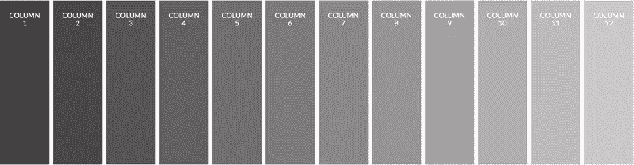
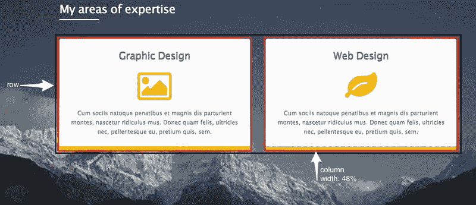
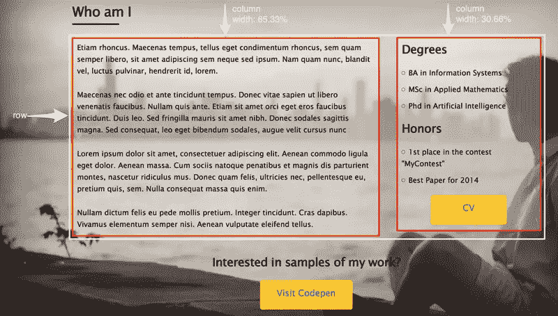

# 简单的 CSS 样板 Skeleton 入门

> 原文：<https://www.sitepoint.com/getting-started-with-skeleton-simple-css-boilerplate/>

12 月初， [Skeleton](http://getskeleton.com/) 发布了新的更新版本。事实上，这是近两年半以来的首次更新。对于我们这些过去使用过 Skeleton 并且喜欢它的简单性的人来说，这是个好消息！

在本文中，我将向您介绍这个轻量级 CSS 框架。我将开始简单介绍它，并展示它的主要特点。然后，我将向您展示如何在一个真实的项目中使用它，这将基于我已经建立的一个[演示页面](http://codepen.io/SitePoint/pen/PwmjYp)。

## 什么是骷髅？

如上所述，Skeleton 是由 [Dave Gamache](https://twitter.com/dhg) 创建的一个轻量级 CSS 框架(或者样板文件，如果你喜欢这个定义的话)。更确切地说，是两个 CSS 文件:流行的`normalize.css`文件和`skeleton.css`文件。后者包含框架的风格，限制在 400 行左右的未压缩代码。

Skeleton 最重要的部分是它的网格系统，我将在本文后面进行分析。此外，该框架为常见的 HTML 组件(如按钮、列表、表格和表单)提供了基本样式。

要获得最新版本的 Skeleton，您可以访问网站并下载压缩文件夹。另一个选择是分叉[GitHub 库](https://github.com/dhg/Skeleton/)。

下载并解压缩压缩文件夹后，您的文件结构如下所示:

```
Skeleton/
├── css/
│     ├── normalize.css
│     └── skeleton.css
├── images/
│     └── favicon.png
└── index.html
```

类似于像 [Bootstrap](http://getbootstrap.com/) 和[基金会](http://foundation.zurb.com/)这样的框架，Skeleton 也使用移动优先的方法。然而，正如所讨论的，它不包括那些框架提供的大量组件；它只包含一些基本的 CSS 规则，帮助你启动你的开发过程。

值得一提的是，Skeleton 在包括 IE9+在内的所有最新浏览器中功能齐全。最后，你也可以选择[、萨斯](https://github.com/whatsnewsaes/Skeleton-Sass)、T2 或者更少的骨骼扩展。

## 版本:最新版本与先前版本

目前的版本和以前的版本有很多不同之处。下表总结了最重要的差异:

| 特征 | V2.0.2(当前版本) | 1.2 版(先前版本) |
| :-: | :-: | :-: |
| CSS 文件 | Two | three |
| 移动优先的方法？ | 是 | 不 |
| 格子 | 12 列流体网格 | 16 列固定网格 |
| 印刷单位 | 雷姆 | 像素 |

## 格子

Skeleton 的最新版本定义了一个移动优先的 12 列流体网格，由行和列组成，与所有 CSS 网格一样。



行必须放在包装器中，包装器的`max-width`值可以是 960px。要创建包装器，您需要定义一个`div`元素并对其应用`container`类。如果你熟悉 [Bootstrap 的网格](https://www.sitepoint.com/understanding-bootstrap-grid-system/)，你可能知道 Bootstrap 使用相同的类名来定义它的包装器。

骨架中包装元素的宽度根据屏幕大小而变化。在任何情况下，正如已经提到的，它不能超过 960px。下表显示了其可能的值:

| Viewport Width | 集装箱宽度 |
| :-: | :-: |
|  | 100% |
| ≥400 像素 | 85% |
| ≥550 像素 | 80% |

列嵌套在行内。每行最多可扩展到 12 个。要设置一个列，你必须定义一个`div`元素并给它分配两个类。首先，添加负责指定列宽的类。为了实现这一点，你可以使用从`one`到`twelve`或者`one-third`、`two-thirds`和`one-half`的任何类。

第二个类负责设置列边距。可能的类别有`columns`和`column`。如果你用第一个选项定义列宽(例如，使用`two`类)，你应该使用`columns`类(而不是`column`)作为第二个类。例外情况是当使用`one`类时，它同样可以与`columns`或`column`类结合使用。

虽然其他框架支持嵌套行，但 Skeleton 建议不要在列中嵌套行。此外，Skeleton 的网格系统为偏移列提供了额外的类。偏移类(如`offset-by-two`)允许您通过添加一个`margin-left`属性来增加列间距。

## 公用事业

如前所述，除了结构良好的网格，Skeleton 还提供了额外的预定义样式。例如，有一个`button`类，它允许您将锚(`a`)元素样式化为按钮。还可以选择使用`button-primary`类给按钮一个浅蓝色的`background-color`。

另一个例子是，如果你想让一个元素向左或向右浮动，你可以给它添加`u-pull-left`或`u-pull-right`类。你也可以使用`u-cf`助手类来清除浮动。

这些只是与 Skeleton 捆绑在一起的实用程序类的几个例子。

## 使用骨架

现在是时候在一个演示项目中使用 Skeleton 的强大特性[了。我们将探索三个不同的例子。](http://codepen.io/SitePoint/pen/PwmjYp)

下图显示了我们的`header`元素在小屏幕及以上(≥ 550px)的理想布局。请注意，我们将该行分成了两个大小相等的列。然而，对于超小屏幕(



这是 HTML:

```
<header>
  <div class="container">
    ...
    <section class="services">
        ...
      <div class="row">
        <div class="one-half column">
          ...
        </div>
        <div class="one-half column">
          ...
        </div>
      </div>
    </section>
  </div>
</header>
```

在这一点上，我们应该记得 Skeleton 支持移动优先的方法。这意味着当浏览器窗口的`width`小于 550px 时，将执行以下代码片段:

```
.column,
.columns {
    width: 100%;
}
```

这确保了列将被堆叠。接下来，当窗口的宽度超过 549px 时，Skeleton 的网格会激活，导致我们的列占据了行宽度的 50%(如类名`one-half`所示)。当然，我们的布局是基于 Skeleton 的默认断点的，我们可以选择改变它。

*注意:不使用`one-half`、`column`类对作为类名，我们可以使用`six`、`columns`对，这将产生相同的结果。*

让我们看看第二个例子。

下面是我们的`section.about`在视口尺寸超过 549px 时的布局。



注意，第一列占据了该行`width`的三分之二，第二列占据了三分之一。同样，对于超小屏幕，我们的列是堆叠的，宽度为 100%。

以及相关代码:

```
<section class="about">
  <div class="container">
    ...
    <div class="row bottom">
        <div class="two-thirds column">
          ...
        </div>
        <div class="one-third column">
          ...
        </div>    
    </div>
    ...
  </div>
</section>
```

*注意:不使用`two-thirds`、`column`和`one-third`、`column`对作为类名，我们可以分别使用`eight`、`columns`和`four`、`columns`对，结果相同。*

让我们看看最后一个例子。

下面是我们想要如何构造我们的`footer`元素:


在这种情况下，目标行由一列组成。这大约占行宽的 65.33%。我们也想让它居中。出于这个原因，我们使用了`offset-by-two`助手类。

相应的代码可以在下面找到:

```
<section class="contact">
  <div class="container">
    ...
    <div class="row">
      <div class="offset-by-two eight columns">
        <ul>
            <!-- list here... -->
        </ul>
      </div>                  
    </div>
    ...
  </div>
</section>
```

下面是 CodePen 上的嵌入式演示:

参见 [CodePen](http://codepen.io) 上 SitePoint ( [@SitePoint](http://codepen.io/SitePoint) )的钢笔[骨架布局示例](http://codepen.io/SitePoint/pen/PwmjYp/)。