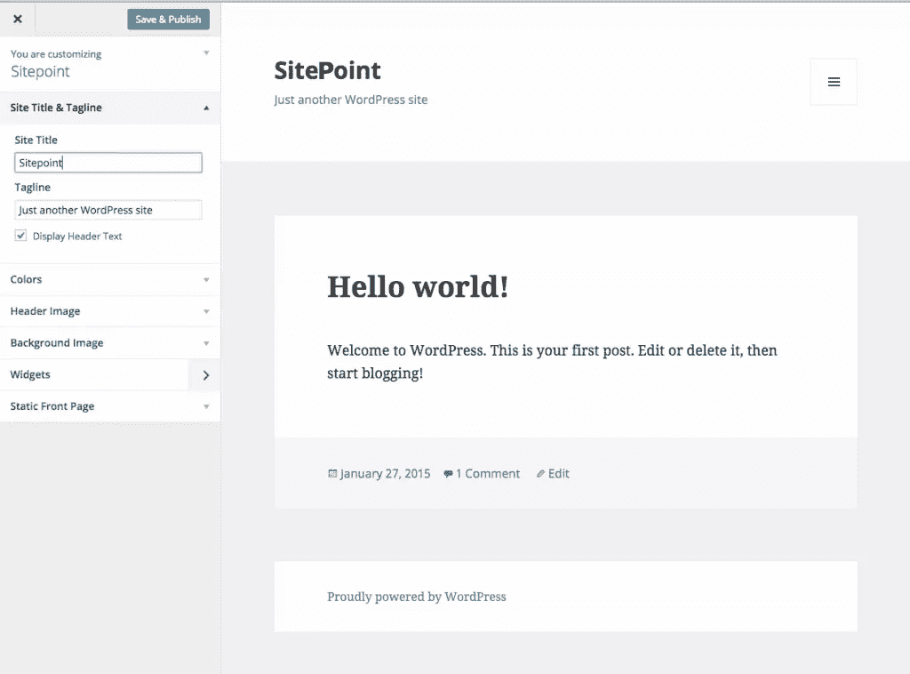
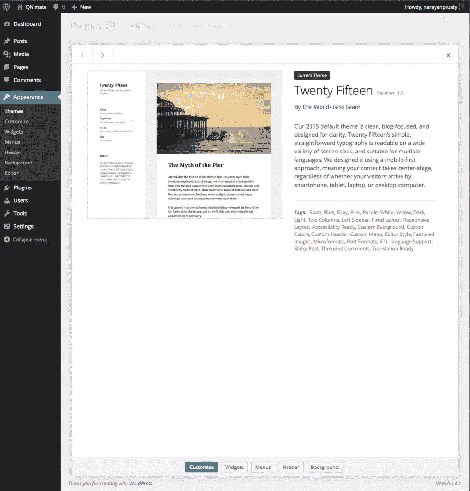
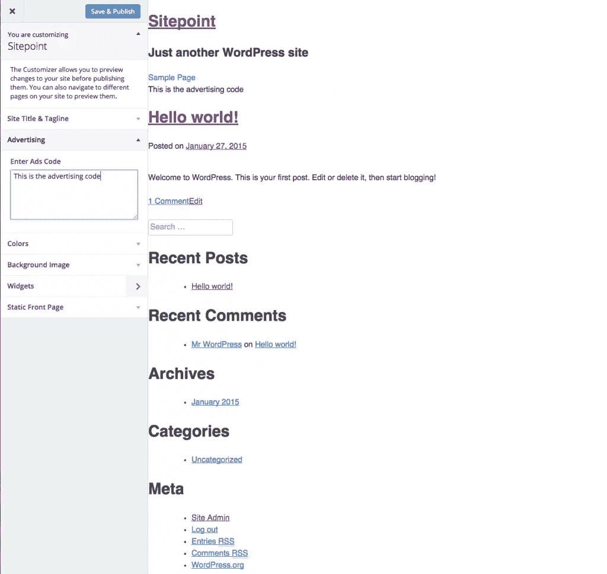

# WordPress 主题定制 API 入门

> 原文：<https://www.sitepoint.com/getting-started-with-the-wordpress-theme-customization-api/>

WordPress 主题定制 API 允许开发者轻松地为他们的主题启用“定制页面”。从 3.4 版本开始支持主题定制 API。WordPress.org 法典委员会建议开发者在主题定制页面中提供主题定制选项，而不是在主题选项页面中提供选项。



允许用户改变你的主题的外观，通过 WordPress 主题定制页面编辑或添加设置到你的主题，将会使你的主题易于使用，看起来更专业。在本教程中，我将从用户的角度向您展示什么是主题定制，以及如何使用 WordPress 主题定制 API 来控制定制器页面。

这篇文章假设你熟悉 WordPress 主题和插件开发的基础。

## 什么是主题定制 API？

主题定制 API 允许开发者在 WordPress 仪表盘外观菜单中的定制部分建立控件和设置选项。主题定制屏幕(或主题定制器页面)允许站点管理员修改主题的设置、配色方案、小部件、标题和徽标等一些常见的例子。它还提供了这些变化的实时预览。



*在上图中，蓝色的“定制”按钮将我们带到主题定制页面*

以前，开发人员会为用户提供一个主题选项页面来调整他们的主题，这远不是用户友好的，因为用户在做出更改后必须刷新他们的站点才能看到这些更改生效。

## 主题定制器页面上的默认控件

安装在 WordPress 3.4 和更高版本中的每一个 WordPress 主题都在主题定制页面上提供了一些默认的设置和控件，比如站点标题、标语、背景颜色、背景图片、小部件和静态首页。您不必添加任何代码来支持这些基本的定制设置和控件。

## 了解章节、设置和控制

区段代表一组设置。定义新的设置和控件时，必须将它们添加到节中。您还可以向默认部分添加新的设置和控制。

设置代表主题的定制选项。

控件是主题定制页面上的 HTML 表单元素，它允许管理员更改实时预览的设置。控件链接到单个设置和单个部分。

让我们看看如何创建一个部分，设置和控制放置在我们的主题广告。

### 创建一个部分

你需要使用`$customizer_object->add_section`方法来创建一个新的截面。

下面是创建名为`ads`的部分的代码

```
function sitepoint_customize_register($wp_customize) 
{
	$wp_customize->add_section("ads", array(
		"title" => __("Advertising", "customizer_ads_sections"),
		"priority" => 30,
	));
}

add_action("customize_register","sitepoint_customize_register");
```

`priority`定义截面的位置。

下面是默认部分的名称: *title_tagline* 、 *colors* 、 *header_image* 、 *background_image* 、 *nav* 和 *static_front_page* 。

### 创建设置

你需要使用`$customizer_object->add_setting`方法来创建一个新的设置。

下面是创建名为`ads_code`的设置的代码

```
function sitepoint_customize_register($wp_customize) 
{
	$wp_customize->add_setting("ads_code", array(
		"default" => "",
		"transport" => "postMessage",
	));
}

add_action("customize_register","sitepoint_customize_register");
```

`transport`参数支持两个值`refresh`和`postMessage`。

`refresh`表示当点击**保存&发布**按钮并刷新保存主题定制页面后，更改将生效。

但是`postMessage`表明变化将实时发生，因为它发生了。对于实时变化，我们也需要写一些 JavaScript。稍后我们会看到更多的细节。在这种情况下，直到站点管理员点击**保存&发布**按钮，站点访问者才能看到更改。

### 创建控件

当你创建一个控件时，我们会使用`$customizer_object->add_control($controller_object)`方法来创建一个新的设置。

让我们显示一个控件来显示一个文本区域，将广告代码作为我们的输入。

```
function sitepoint_customize_register($wp_customize) 
{
	$wp_customize->add_control(new WP_Customize_Control(
		$wp_customize,
		"ads_code",
		array(
			"label" => __("Enter Ads Code", "customizer_ads_code_label"),
			"section" => "ads",
			"settings" => "ads_code",
			"type" => "textarea",
		)
	));
}

add_action("customize_register","sitepoint_customize_register");
```

有各种控制器对象，这取决于您需要哪种类型的控制。这里我们使用了`WP_Customize_Control`，它用于显示输入字段，如文本区域、文本、复选框、单选按钮和颜色。其他的控制器对象有[WP _ Customize _ Color _ Control](http://codex.wordpress.org/Class_Reference/WP_Customize_Color_Control)、[WP _ Customize _ Upload _ Control](http://codex.wordpress.org/Class_Reference/WP_Customize_Upload_Control)和[WP _ Customize _ Image _ Control](http://codex.wordpress.org/Class_Reference/WP_Customize_Image_Control)分别用于颜色输入、文件上传和图像输入。

### 输出设置值

回显设置值的方式取决于`add_settings`函数的`transport`参数。

如果`transport`的参数值是`refresh`，那么这就是在你的主题中回应`ads_code`设置值的代码。

```
?>
	<div id="ads_box">
		<?php
			echo get_theme_mod("ads_code");
		?>
	</div>
<?php
```

`get_theme_mod`用于检索主题定制 API 的设置值。

如果`transport`参数是`postMessage`,那么您也需要使用上面的代码进行回显。但是要实现实时预览，您需要编写一些 JavaScript，以便在 admin 更改设置值时获取新值。

在你的主题目录中创建一个 JavaScript 文件。我将把它称为`theme-customizer.js`

接下来，添加以下代码:

```
(function($){
	wp.customize("ads_code", function(value) {
		value.bind(function(newval) {
			$("#ads_code").html(newval);
		} );
	});
})(jQuery);
```

以下是将上述脚本入队的代码:

```
function sitepoint_customizer_live_preview()
{
	wp_enqueue_script("sitepoint-themecustomizer", get_template_directory_uri() . "/theme-customizer.js", array("jquery", "customize-preview"), '',  true);
}

add_action("customize_preview_init", "sitepoint_customizer_live_preview");
```

这里，我们将脚本放入主题定制器屏幕中，这样站点访问者就不会看到正在发生的变化。



### 最后的想法

主题定制 API 已经开发得很好了，所有新的主题都应该实现它。如果你正在创建一个高级主题，那么就没有办法逃避它。您可以在定制器页面中提供以前使用设置 API 时使用的所有类型的设置。

请随意在下面加入您对这个 API 的体验的评论。

## 分享这篇文章