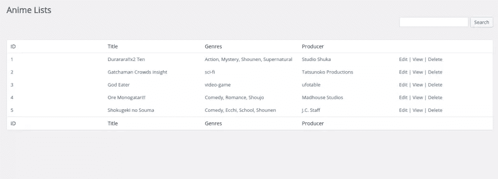
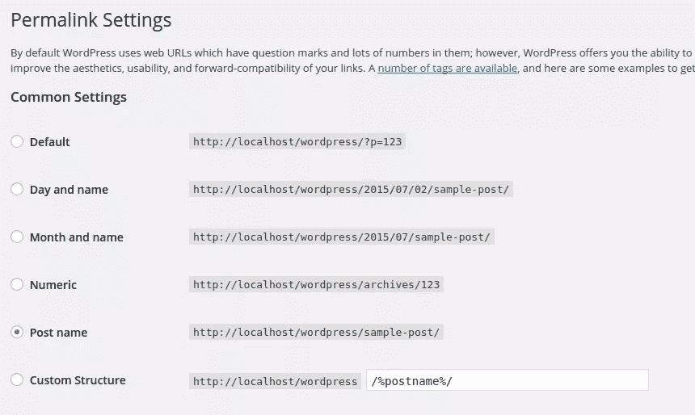
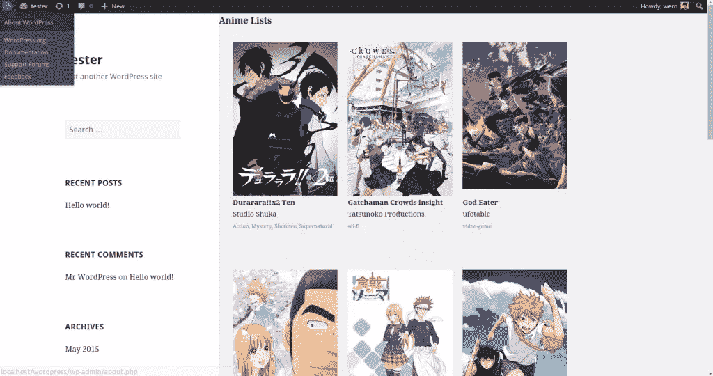

# WordPress MVC 入门

> 原文：<https://www.sitepoint.com/getting-started-with-wordpress-mvc/>

在 WordPress 中，当创建插件时，我们经常不得不坚持使用普通的 PHP。这导致 PHP 和 HTML 代码混杂在一个页面中，这不是一个好的做法。关注点分离是一个设计原则，它表明我们应该将程序分成不同的部分，即逻辑和表示。在本教程中，我们将看看这个问题的一个解决方案:WordPress MVC。这是一个为 WordPress 增加 MVC 支持的插件，所以我们可以用 MVC 的方式编写我们的插件。

## 什么是 MVC？

在我们继续之前，重要的是我们都在同一页上。如果您已经知道什么是 MVC，请随意跳到下一节。

好吧，那么什么是 MVC 呢？MVC 代表模型视图控制器。**模型**代表我们的应用程序使用的数据。它是与数据库进行对话的部分。**视图**处理表示。这是我们放入 HTML 代码和基本表示逻辑的地方。最后是**控制器**，其主要工作是将这两者联系在一起。示例包括验证和净化用户输入。它主要负责控制应用程序的整体流程。

## 安装和设置

WP MVC 是一个插件，我们需要安装它来让 MVC 和 WordPress 一起工作。你可以[在这里](https://WordPress.org/plugins/wp-mvc/)下载插件，并像你通常在 WordPress 中安装插件一样安装它。一旦完成，登录 WordPress 并从你的插件页面激活它。

## 用 MVC 方式构建插件

在我们继续之前，我会给你一个我们将在本教程中构建的简要概述。我们将建立一个插件，将列出所有的动画，是在网站的管理方面创建的。就像这个网站所做的一样。在管理方面，我们将有一个界面，我们可以添加，列表，编辑或删除动画表演。在公共方面，我们将在特定页面的网格视图中呈现它们。

现在我们准备构建一个新的插件。你可以通过导航到安装 WP MVC 插件的路径来做到这一点。

```
cd path/to/plugins/wp-mvc 
```

然后给`wpmvc`文件添加执行权限。这是我们将用来生成新插件的文件。

```
chmod +x wpmvc 
```

接下来，我们现在可以生成一个新的插件。为此，请执行以下命令。

```
./wpmvc generate plugin AnimeList 
```

这将在你的 WordPress 安装目录下创建一个新的插件。对我来说，它创建了一个`anime-list`目录。打开目录，然后打开`anime_list_loader.php`文件。这个文件包含了激活或停用插件时执行的函数。由于我们将需要保存大量的自定义数据，我们将不得不创建一个自定义表，而不是使用[选项 API](https://codex.WordPress.org/Options_API) 来存储数据库中的东西。为此，我们必须添加在插件激活时创建新表的代码。在`activate`方法中添加以下代码。

```
global $wpdb;

$sql = '
CREATE TABLE '. $wpdb->prefix . 'animelists (
  id int(11) NOT NULL auto_increment,
  title varchar(255) NOT NULL,
  poster varchar(255) NOT NULL,
  plot TEXT NOT NULL,
  genres TEXT default NULL,
  PRIMARY KEY  (id)
)';

dbDelta($sql); 
```

在上面的代码中，我们使用一个原始的 SQL 查询创建了一个包含 id、标题、海报、情节和流派字段的表。然后使用`dbDelta`函数来执行 SQL 查询。

接下来，在`deactivate`法下，我们要收拾自己的烂摊子。下面的代码从 WordPress 数据库中删除表格。

```
require_once ABSPATH.'wp-admin/includes/upgrade.php';

global $wpdb;

$sql = 'DROP TABLE ' . $wpdb->prefix . 'anime_lists';
$wpdb->query($sql); 
```

通常这不是你想做的方式。一些用户可能仍然需要你的插件已经获得的数据。即使他们关闭了你的插件。但是为了简单起见，我们不会在这里处理它。

现在是从 WordPress 管理页面激活你的新插件的好时机。如果一切正常，应该已经在你的 WordPress 数据库中创建了一个`wp_anime_lists`表。

接下来，执行以下命令:

```
./wpmvc generate scaffold AnimeList AnimeList 
```

上面的命令为您指定的模型生成视图、控制器和模型。第一个`AnimeList`是插件的名称，第二个是模型的名称。注意，wpmvc 在这里使用了一种命名约定。模型应该总是单数形式，而表格应该是复数形式。模型名称中的每个大写字母都意味着应该用下划线分隔。模型的名称应该基于表的名称。所以使用上面的规则，如果表的名称是`anime_lists`，模型应该被命名为`AnimeList`。下划线被转换成驼色，复数被转换成单数。

接下来，打开`add.php`文件和`app/views/admin/anime_lists/`下的`edit.php`，添加以下代码:

```
<h2>Add Anime List</h2>

<?php echo $this->form->create($model->name); ?>
<?php echo $this->form->input('title'); ?>
<?php echo $this->form->input('poster'); ?>
<?php echo $this->form->input('plot'); ?>
<?php echo $this->form->input('genres'); ?>
<?php echo $this->form->input('producer'); ?>
<?php echo $this->form->end('Add'); ?> 
```

在`edit.php`文件上:

```
<h2>Edit Anime List</h2>

<?php echo $this->form->create($model->name); ?>
<?php echo $this->form->input('title'); ?>
<?php echo $this->form->input('poster'); ?>
<?php echo $this->form->input('plot'); ?>
<?php echo $this->form->input('genres'); ?>
<?php echo $this->form->input('producer'); ?>
<?php echo $this->form->end('Update'); ?> 
```

我们上面所做的是创建添加新的动画节目和编辑现有的动画节目的表单。这利用了内置于 wpmvc 中的[表单助手](http://wpmvc.org/documentation/helpers/core_helpers/)。为了分解它，首先我们创建一个新的表单，然后提供模型的名称作为它的参数。在这种情况下，模型的名称是`AnimeList`。

```
<?php echo $this->form->create($model->name); ?> 
```

接下来，我们使用`input`方法输出已经添加到表中的每一列。该方法将字段名作为其第一个参数。默认情况下，wpmvc 通过检查数据类型来确定它将输出什么类型的字段。所以如果数据类型是`varchar`，就会输出一个文本输入。如果数据类型是`text`，它将输出一个文本区等等。

```
<?php echo $this->form->input('title'); ?>
<?php echo $this->form->input('poster'); ?>
<?php echo $this->form->input('plot'); ?>
<?php echo $this->form->input('genres'); ?>
<?php echo $this->form->input('producer'); ?> 
```

如果要使用另一种输入类型，可以指定一个包含输入类型的数组作为第二个参数:

```
<?php echo $this->form->input('is_awesome', array('type' => 'checkbox')); ?> 
```

最后，我们使用`end`方法关闭表单。这将按钮的标签作为它的参数。

```
<?php echo $this->form->end('Add'); ?> 
```

在这一点上，我们现在可以添加一些动漫节目。WP MVC 自动处理在 WordPress 仪表盘上添加一个以模型名称命名的新菜单。在这种情况下，新菜单的名称应该是“动画列表”。在那里，您可以使用“添加新项目”子菜单开始添加新项目。

接下来，我们需要更新列出现有项目的代码。您可以在以下路径中找到它:

```
app/controllers/admin/admin_anime_lists_controller.php 
```

默认情况下，它包含以下代码:

```
<?php

class AdminAnimeListsController extends MvcAdminController {

    var $default_columns = array('id', 'name');

}

?> 
```

这导致为表中的每一行返回一个错误，因为我们在`anime_lists`表中没有`name`字段。要解决这个问题，我们所要做的就是使用`wp_anime_lists`表上的字段:

```
var $default_columns = array('id', 'title', 'genres', 'producer'); 
```

更新文件后，结果应该如下所示:



现在我们可以继续网站面向公众的一面。

在我们继续之前，重要的是要知道每次我们使用命令行生成模型、控制器和视图时。WP MVC 也会为该模型分配一个新页面。所以对于`AnimeLists`模型，它创建了`anime_lists`页面。不要忘记在 Apache 配置中启用`mod_rewrite`，添加 WordPress `.htaccess`文件，并设置 permalinks 设置以使用 post name。



为了方便起见，下面是我正在使用的`.htaccess`文件:

```
# BEGIN WordPress
<IfModule mod_rewrite.c>
RewriteEngine On
RewriteBase /WordPress/
RewriteRule ^index\.php$ - [L]
RewriteCond %{REQUEST_FILENAME} !-f
RewriteCond %{REQUEST_FILENAME} !-d
RewriteRule . /WordPress/index.php [L]
</IfModule>

# END WordPress
```

完成后，您现在可以检查是否可以访问该页面。默认情况下，你不会在那里看到任何东西。这就是我们要做的。

```
http://localhost/WordPress/anime_lists/ 
```

首先，打开`app/controllers/anime_lists_controller.php`文件。这是用于`anime_lists`页面的控制器。默认情况下，它应该包含以下代码:

```
<?php

class AnimeListsController extends MvcPublicController {

}

?> 
```

如果您想坚持使用从基础公共控制器(`MvcPublicController`)添加的缺省值，这是没问题的。但是如果您想稍微定制一些东西，您必须用下面的代码覆盖`index`方法:

```
public function index() {

    $params = $this->params;
    $params['per_page'] = 6;
    $collection = $this->model->paginate($params);
    $this->set('objects', $collection['objects']);
    $this->set_pagination($collection);

} 
```

我们上面所做的是通过使用`$this->params`来获取基本控制器中提供的默认参数。然后我们将它赋给一个变量，这样我们就可以覆盖默认值。默认情况下，控制器每页从数据库中选择 10 个项目。如果我只想选择 6，我可以通过将`per_page`参数设置为 6:

```
$params['per_page'] = 6; 
```

这就是我们需要定制的全部内容。剩下的代码只是在模型中使用`paginate`方法创建一个集合。然后使用这个集合来传递“对象”(动画显示)，然后将分页设置到视图中。

```
$collection = $this->model->paginate($params);
$this->set('objects', $collection['objects']);
$this->set_pagination($collection); 
```

现在打开负责呈现`anime_lists`页面的视图。在`app/views/anime_lists/index.php`。打开后，添加以下代码:

```
<h2>Anime Lists</h2>

<div id="anime-shows">
    <?php foreach ($objects as $object): ?>

        <?php 
        $this->render_view('_item', array('locals' => array('object' => $object))); 
        ?>

    <?php endforeach; ?>
</div>

<div id="pagination">
    <?php echo $this->pagination(); ?>
</div> 
```

这将遍历我们之前从控制器传递的所有对象。在循环内部，我们呈现了显示每个对象细节的视图。`render_view`方法将视图的名称作为第一个参数，将我们想要传入的数据作为第二个参数。

```
<?php 
$this->render_view('_item', array('locals' => array('object' => $object))); 
?> 
```

最后，我们输出分页。

```
<?php echo $this->pagination(); ?> 
```

接下来，打开同一目录下的`_item.php`文件，然后添加以下代码:

```
<div class="anime-show">
    <div class="anime-poster-container">
        <a href="<?php echo mvc_public_url(array('controller' => 'anime_lists', 'id' => $object->id)); ?>">
            poster; ?>" class="anime-poster">
        </a>
    </div>
    <div>
        <strong><?php echo $object->title; ?></strong>
    </div>
    <div>
        <?php echo $object->producer; ?>
    </div>
    <div class="genre">
        <?php echo $object->genres; ?>
    </div>
</div> 
```

这显示了每个对象的详细信息。从上面的代码中可以看出，我们可以从`$object`变量中直接访问每个字段。我们还使用了一个名为`mvc_public_url`的辅助函数来生成一个 URL，该 URL 指向每个对象的单独页面。该方法使用一个数组，该数组包含控制器的名称和对象的 ID。

```
<?php 
echo mvc_public_url(array('controller' => 'anime_lists', 'id' => $object->id)); 
?> 
```

这将生成一个类似于以下内容的 URL:

```
http://localhost/WordPress/anime_lists/2/ 
```

接下来，我们还必须更新单个对象页面。为此，打开`show.php`文件。仍然在同一个目录下。

```
<p>
    <?php 
    echo $this->html->link('&#8592; All Anime Lists', array('controller' => 'anime_lists')); 
    ?>
</p>
<div id="anime-show">
    <div class="anime-poster-container">
        poster; ?>" class="anime-poster">
    </div>
    <div>
        <strong><?php echo $object->title; ?></strong>
    </div>
    <div>
        <?php echo $object->producer; ?>
    </div>
    <div class="genre">
        <?php echo $object->genres; ?>
    </div>
    <div class="plot">
        <?php echo $object->plot; ?>
    </div>
</div> 
```

这里没多大区别。这与前面视图中的输出基本相同。只是这次我们也输出剧情。

```
<div class="plot">
    <?php echo $object->plot; ?>
</div> 
```

我们还添加了一个到主`anime_lists`页面的链接:

```
<?php 
echo $this->html->link('&#8592; All Anime Lists', array('controller' => 'anime_lists')); 
?> 
```

让事物看起来稍微顺眼一点。让我们为网站面向公众的一面添加一些 css。您可以在`app/public/css`目录中添加样式表。只需将文件命名为`anime-lists.css`并添加以下代码:

```
#anime-shows {
    overflow: auto;
    padding: 20px;
}

.anime-show {
    float: left;
    width: 227px;
    margin: 10px;
    height: 470px;
    font-size: 15px;
}

.anime-poster-container {
    height: 332px;
    overflow: hidden;
}

#anime-show {
    padding: 20px;
    width: 500px;
}

.plot {
    margin-top: 10px;
    font-size: 16px;
}

.genre {
    color: gray;
}

#pagination {
    padding: 20px;
}

#pagination .page-numbers {
    padding: 0 10px;
}
```

为了使用我们刚刚创建的样式表。在插件的`app/config`目录下创建一个`bootstrap.php`文件。然后我们添加以下代码:

```
<?php
add_action( 'wp_enqueue_scripts', 'animelists_enqueue_scripts' );

function animelists_enqueue_scripts($options) {
    wp_register_style('animelists_style', mvc_css_url('anime-list', 'anime-lists.css'));
    wp_enqueue_style('animelists_style');
} 
```

上面的代码看起来应该很熟悉。这就是我们通常在 WordPress 中添加自定义脚本和样式的方式。只是这次我们使用了另一个名为`mvc_css_url`的辅助函数。这个函数使用插件的机器友好名称(提示:复制插件的文件夹名称)和样式表的文件名。

一旦你完成了，你已经在管理端添加了一些项目。最终输出应该如下所示:



你可以在这个 GitHub Repo 上查看这个插件[中使用的代码。](https://github.com/anchetaWern/sitepoint_codes/tree/master/anime-list)

## 结论

就是这样！在本教程中，你已经学习了如何在 WordPress 中通过创建一个插件来实现 MVC。在本教程中，我们只是触及了皮毛。请务必查看 WP MVC 文档以了解更多信息。你呢？你知道或者使用任何其他的 WordPress 的 MVC 解决方案吗？请在评论中告诉我们。

## 分享这篇文章