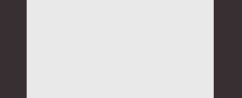
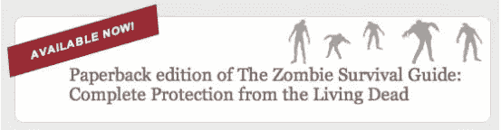
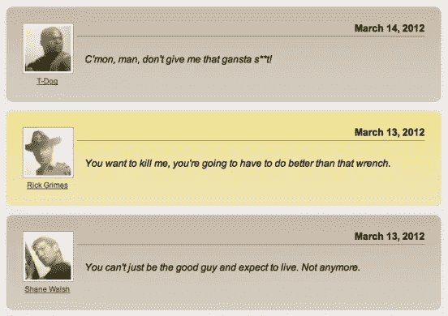
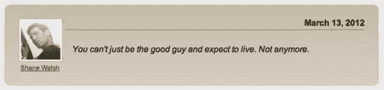
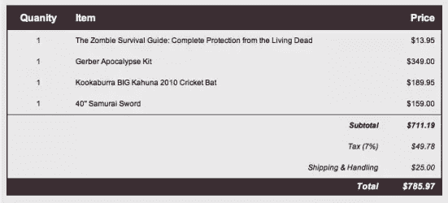
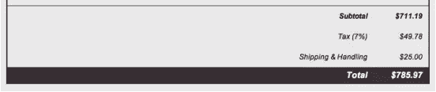
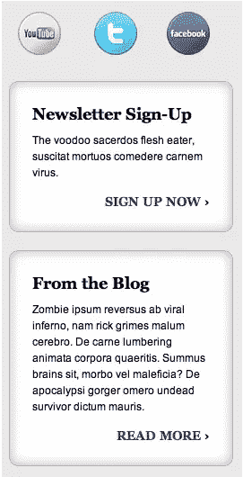

# 了解 CSS3 选择器:结构化伪类

> 原文：<https://www.sitepoint.com/getting-to-know-css3-selectors-structural-pseudo-classes/>

现在的前端开发者不仅仅需要了解如何编写 CSS，我们需要知道如何高效地编写它。“高效”的含义取决于您的项目和环境。

也许你有一个团队，团队中有几个成员在使用 CSS，你需要一种有效的方式来一起工作。或者，也许你有一个巨大的企业网站，你需要你的 CSS 优化速度。您甚至可以使用限制访问 HTML 的遗留系统，这意味着您需要高效的选择器来有效地设计没有 id 或类的元素。你甚至可能会面临所有这些情况甚至更多。

无论你对 CSS 的目标是什么，达到目标的最好方法是了解你的选择，这意味着理解你可以使用的所有选择器。在这个由两部分组成的系列中，我将着眼于 CSS3 中的新选择器，从[结构伪类](https://www.w3.org/TR/css3-selectors/#structural-pseudos)开始。

## 什么是伪类？

CSS [伪类](https://www.w3.org/TR/css3-selectors/#pseudo-classes)的目标元素不能用[组合子](https://reference.sitepoint.com/css/combinators)或简单的选择器如`id`或`class`来定位。您可以使用伪类根据元素的属性、状态和相对位置来选择元素。例如，您可能已经熟悉了链接状态的[伪类](https://www.w3.org/TR/css3-selectors/#dynamic-pseudos):

```
:link 
:visited 
:hover 
:active 
:focus
```

CSS3 引入了许多新的伪类，包括根据元素在文档树中的位置以及与其他元素的关系来定位元素的结构化伪类。这里有一个结构化伪类的列表，您将在本文中看到这些例子。

```
:root 
:only-child 
:empty 
:nth-child(n) 
:nth-last-child(n) 
:first-of-type 
:last-of-type 
:only-of-type 
:nth-of-type(n) 
:nth-last-of-type(n) 
:first-child 
:last-child
```

在我们看细节之前，让我们简单地了解一下你对伪类使用的语法。

## 伪类语法

伪类的语法使用冒号(`:`)后跟伪类名:

`:pseudo-class {}`

如果您想要将特定元素(`e`)作为目标，您可以将该元素附加到伪类语法的开头:

`e:pseudo-class {}`

您甚至可以在`id`和`class`选择器旁边使用伪类，如下所示:

```
#id:pseudo-class {} .class:pseudo-class {}
```

## 数值

一些 CSS3 伪类基于元素在文档树中的特定位置来定位元素。您可以用括号中的数值(`n`)附加到伪类名来指示位置:

`:pseudo-class(n) {}`

(`n`)的值可以是整数，以指示元素在文档树中的位置。以下示例针对符合伪类规则的第三个元素:

`:pseudo-class(3) {}`

您还可以指定数字公式，例如“每隔五个元素”，它表示为(`5n`)的值:

`:pseudo-class(5n) {}`

此外，您可以指定一个偏移公式(允许负值；默认值为零)通过加上(`+`)或减去(`-`)偏移值:

`:pseudo-class(5n+1) {}`

这些新的选择器还允许您通过关键字 odd 和 even 按照文档树顺序定位元素。例如，如果您要将奇数编号的元素作为目标，请使用以下内容:

`:pseudo-class(odd) {}`

## 让伪类发挥作用

现在您已经看到了一般的语法，让我们更详细地看看一些新的选择器，并看看通过使用它们可以实现的样式效果的例子。

### :根

[`:root`](https://www.w3.org/TR/css3-selectors/#root-pseudo) 伪类的目标是根元素 html 元素。考虑以下页面的基本标记:

```
<!DOCTYPE html> 
    <head> 
        <title>Getting to Know CSS3 Selectors</title> 
    </head> 
    <body> 
    </body> 
</html>
```

如果您想将主背景色应用于此页面，并使用不同的背景色来显示“容器”，您可以只使用 CSS 而不使用新的标记，如下所示:

```
:root{ 
    background-color: rgb(56,41,48); 
} 
body { 
    background-color: rgba(255, 255, 255, .9); 
    margin: 0 auto; 
    min-height: 350px; 
    width: 700px; 
}
```

在这个例子中，我通过`:root`将背景色应用于`html`元素，并通过[类型选择器](https://www.w3.org/TR/css3-selectors/#type-selectors)将样式应用于`body`。这导致了如下所示的简单视觉布局。



### :独生子女

[`:only-child`](https://www.w3.org/TR/css3-selectors/#only-child-pseudo) 伪类的目标元素是其父元素的唯一子元素。这意味着父元素只包含一个其他元素。`:only-child`伪类不同于`:root`伪类，后者采用了`html`元素。您可以使用`:only-child` 通过将伪类语法附加到元素(`e`)来定位任何元素，如下所示:

`e:only-child {}`

例如，您可能有一个文本块，在其中促销一个新项目:

`<h2><b>Available Now!</b> Paperback edition of The Zombie Survival Guide: Complete Protection from the Living Dead</h2>`

如果您想将文本“Available Now”样式化为标注，您可以使用`:only-child`来定位`b`元素，它是`h2`的唯一子元素。图 2 显示了您将使用的代码。

```
h2 { 
    background: rgb(255, 255, 255) url(zombies.png) no-repeat 97% 4%; 
    border: 1px solid rgba(125, 104, 99, .3); 
    border-radius: 10px; 
    color: rgb(125,104,99); 
    font: normal 20px Georgia, "Times New Roman", Times, serif; 
    padding: 20px 20px 20px 60px; 
    position: relative; 
    width: 450px; 
} 
b:only-child { 
    background-color: rgb(156,41,48); 
    color: rgb(255,255,255); 
    display: block; 
    font: bold 12px Arial, Helvetica, sans-serif; 
    font-weight: bold; 
    letter-spacing: 1px; 
    padding: 10px; 
    text-align: center; 
    text-transform: uppercase; 
    -moz-transform: translate(-70px) 
        rotate(-5deg) matrix(1, -0.2, 0, 1, 0, 0); 
    -moz-transform-origin: 50px 0; 
    -webkit-transform: translate(-70px) 
        rotate(-5deg) matrix(1, -0.2, 0, 1, 0, 0); 
    -webkit-transform-origin: 50px 0; 
    -o-transform: translate(-70px) 
       rotate(-5deg) matrix(1, -0.2, 0, 1, 0, 0); 
    -o-transform-origin: 50px 0; 
    -ms-transform: translate(-70px) 
        rotate(-5deg) matrix(1, -0.2, 0, 1, 0, 0); 
    -ms-transform-origin: 50px 0; 
    transform: translate(-30px) 
        rotate(-5deg) matrix(1, -0.2, 0, 1, 0, 0); 
    transform-origin: 50px 0 0; 
    width: 150px; 
}
```

这个 CSS 产生了如下所示的可视标注，它不需要任何添加到 HTML 中的`id`或`class`属性。



### :空的

[`:empty`](https://www.w3.org/TR/css3-selectors/#empty-pseudo) 伪类的目标元素没有任何子元素或任何文本——一个空元素，如:

`<p></p>`

就我个人而言，我想不出在什么情况下我会允许一个空元素出现在一个站点上，但这并不意味着没有边缘情况。就语法而言，您可以针对每个空元素单独使用伪类:

```
:empty { 
    background-color: red; 
}
```

或者，如在`:only-child`伪类的例子中，您可以将特定的元素作为目标，如`td`:

```
td:empty { 
    background-color: red; 
}
```

### :第 n 个子代

这是我介绍的第一个利用前面描述的数值的伪类。`:nth-child`伪类的目标是与父元素中位置相关的子元素。例如，一个博客评论列表，用交替的背景色可能看起来很漂亮。



这个例子中的 HTML 只是一个有序列表，如下所示。

```
<ol> 
    <li> 
        <p>March 14, 2012</p> 
        <a href="http://nocommonsense.com"></a> 
        <p><a href="http://nocommonsense.com">T-Dog</a></p> 
        <p>C'mon, man, don't give me that gansta s**t!</p> 
    </li> 
    <li> 
        <p>March 13, 2012</p> 
        <a href="http://itsallblackandwhite.com"></a> 
        <p><a href="http://itsallblackandwhite.com">Rick Grimes</a></p> 
        <p>You want to kill me, you're going to have to do better than that wrench.</p> 
    </li> 
    <li> 
        <p>March 13, 2012</p> 
        <a href="http://becameawalker.com"></a> 
        <p><a href="http://becameawalker.com">Shane Walsh</a></p> 
        <p>You can't just be the good guy and expect to live. Not anymore.</p> 
    </li> 
</ol>
```

为了样式化这个标记，我首先用一个简单的类型选择器来定位列表项，如下所示:

```
li { 
    background-color: rgba(194, 181, 158, .5); 
    background-image: -webkit-gradient(linear, 
        left top, left bottom, 
        from(rgba(194, 181, 158, .7)), 
        to(rgba(194, 181, 158, 0))); 
    background-image: -moz-linear-gradient(top, 
        rgba(194, 181, 158, .7), 
        rgba(194, 181, 158, 0)); 
    background-image: -o-linear-gradient( 
        rgba(194, 181, 158, .7), 
        rgba(194, 181, 158, 0)); 
    border: 1px solid rgb(194, 181, 158); 
    border-radius: 10px; 
    margin: 15px 0; 
    padding: 25px; 
}
```

然后，使用`:nth-child()`伪类，我将偶数编号的列表项作为目标:

```
li:nth-child(even){ 
    background-color: rgba(242, 224, 131, .5); 
    background-image: -webkit-gradient(linear, 
        left top, left bottom, 
        from(rgba(242, 224, 131, .7)), 
        to(rgba(242, 224, 131, 0))); 
    background-image: -moz-linear-gradient(top, 
        rgba(242, 224, 131, .7), 
        rgba(242, 224, 131, 0)); 
    background-image: -o-linear-gradient( 
        rgba(242, 224, 131, .7), 
        rgba(242,224, 131, 0)); 
    border: 1px solid rgb(242, 224, 131); 
}
```

### :第 n 个最后一个孩子

[`:nth-last-child(n)`](https://www.w3.org/TR/css3-selectors/#nth-last-child-pseudo) 伪类就像`:nth-child(n)`一样工作，除了顺序是相对于最后一个子元素而不是第一个子元素来确定的。使用相同的博客评论示例，考虑每个列表项中的内容:

```
<li> 
    <p>March 14, 2012</p> 
    <a href="http://nocommonsense.com"></a> 
    <p><a href="http://nocommonsense.com">T-Dog</a></p> 
    <p>C'mon, man, don't give me that gansta s**t!</p> 
</li>
```

组成评论的每个段落元素都需要有独特的风格，图像也是如此。



对于评论者名称和链接，我使用带有数值的`:nth-last-child(n)`伪类来定位列表项中的倒数第二段:

```
p:nth-last-child(2) { 
    clear: left; 
    float: left; 
    font-size: 12px; 
    margin-top: 5px; 
    text-align: center; 
    width: 80px; 
}
```

### :一流的

[`:first-of-type`](https://www.w3.org/TR/css3-selectors/#first-of-type-pseudo) 伪类的目标是父元素中第一个特定类型的元素。在博客评论示例中，我可以将日期内容作为列表项中的第一段:

```
<li> 
    <p>March 14, 2012</p> 
    <a href="http://nocommonsense.com"></a> 
    <p><a href="http://nocommonsense.com">T-Dog</a></p>
    <p>C'mon, man, don't give me that gansta s**t!</p> 
</li>
```

使用`:first-of-type`，我将第一段(包含日期)的样式设置为右对齐，并带有底部边框:

```
p:first-of-type { 
    border-bottom: 1px solid rgba(56,41,48, .5); 
    float: right; 
    font-weight: bold; 
    padding-bottom: 3px; 
    text-align: right; 
    width: 560px; 
}
```

### :类型的最后一个

顾名思义， [`:last-of-type`](https://www.w3.org/TR/css3-selectors/#last-of-type-pseudo) 伪类的目标是父元素中的最后一个元素类型。在博客示例中，我可以将最后一段的评论文本的样式设置为:

```
<li> 
    <p>March 14, 2012</p> 
    <a href="http://nocommonsense.com"></a> 
    <p><a href="http://nocommonsense.com">T-Dog</a></p> 
    <p>C'mon, man, don't give me that gansta s**t!</p> 
</li>
```

你可以看到我是如何使用`:last-of-type`来设计最后一段的。下面是我使用的 CSS:

```
p:last-of-type { 
    font-style: italic; 
    margin: 50px 10px 10px 100px; 
}
```

### :仅类型的

`:only-of-type`伪类的目标是父元素中唯一的子元素。继续博客评论的例子，您可以使用这个选择器来定位头像:

```
<li> 
    <p>March 14, 2012</p> 
    <a href="http://nocommonsense.com"></a> 
    <p><a href="http://nocommonsense.com">T-Dog</a></p> 
    <p>C'mon, man, don't give me that gansta s**t!</p> 
</li>
```

CSS:

```
img:only-of-type{ 
    background-color: rgb(255, 255,255); 
    border: 1px solid rgba(56,41,48, .5); 
    float: left; 
    padding: 3px; 
}
```

### :第 n 种类型(n)

[`:nth-of-type(n)`](https://www.w3.org/TR/css3-selectors/#nth-of-type-pseudo) 伪类的工作方式类似于我介绍过的其他基于数字的伪类。这个伪类根据特定元素类型相对于父元素的位置来定位它。您可以在这里显示的简单购物车视图中看到一个效果示例。



这个购物车的 HTML 在一个表格中。请记住，表格可以用于数据，但请避免用于布局。

```
<table cellspacing="0"> 
    <tr> 
        <th>Quantity</th> 
        <th>Item</th> 
        <th>Price</th> 
    </tr> 
    <tr> 
        <td>1</td> 
        <td>The Zombie Survival Guide: Complete Protection from the Living Dead</td> 
        <td>$13.95</td> 
    </tr> 
    <tr> 
        <td>1</td> 
        <td>Gerber Apocalypse Kit</td> 
        <td>$349.00</td> 
    </tr> 
    <tr> 
        <td>1</td> 
        <td>Kookaburra BIG Kahuna 2010 Cricket Bat</td> 
        <td>$189.95</td> 
    </tr> 
    <tr> 
        <td>1</td> 
        <td>40" Samurai Sword</td> 
        <td>$159.00</td> 
    </tr> 
    <tr> 
        <td colspan="2">Subtotal</td> 
        <td>$711.19</td> 
    </tr> 
    <tr> 
        <td colspan="2">Tax (7%)</td> 
        <td>$49.78</td> 
    </tr> 
    <tr> 
        <td colspan="2">Shipping &amp; Handling</td> 
        <td>$25.00</td> 
    </tr> 
    <tr> 
        <td colspan="2">Total</td> 
        <td>$785.97</td> 
    </tr> 
</table>
```

为了样式化这些表格元素，我使用`:nth-of-type(n)`选择器来样式化表格标题和数据单元格的文本对齐。例如，项目表标题单元格需要左对齐(默认为居中)。

```
<tr> 
    <th>Quanity</th> 
    <th>Item</th> 
    <th>Price</th> 
</tr>
```

使用`:nth-of-type(n)`选择器，您可以针对特定的孩子:

```
th:nth-of-type(2) { 
    text-align: left; 
}
```

我可以使用同一个伪类来样式化所需的剩余文本对齐，而不需要单个`class`或`id`:

```
th:nth-of-type(3), td:nth-of-type(3) { 
    text-align: right; 
} 
th:nth-of-type(1), td:nth-of-type(1) { 
    text-align: center; 
}
```

### :第 n 个类型的最后一个(n)

[`:nth-last-of-type(n)`](https://www.w3.org/TR/css3-selectors/#nth-last-of-type-pseudo) 伪类的工作方式和`:nth-of-type(n)`一样，但是相对位置是从最后一个子元素而不是第一个子元素开始偏移的。在购物车示例中，小计、税收、运输和总计行需要独特的样式。



让我们看看小计行，这是表中倒数第四行(`tr`):

```
<tr> 
    <td colspan="2">Subtotal</td> 
    <td>$711.19</td> 
</tr>
```

我用`:nth-last-of-type(n)`赋予这一行单元格如图所示的样式。这是我使用的 CSS:

```
tr:nth-last-of-type(4) td { 
    border-top: 1px solid rgb(56,41,48); 
    font-style: italic; 
    font-weight: bold; 
    text-align: right; 
}
```

我继续为表的其余行使用这个伪类:

```
tr:nth-last-of-type(1) td { 
    background-color: rgb(56,41,48); 
    color: rgb(255, 255, 255); 
    font-size: 14px; 
    font-style: italic; 
    font-weight: bold; 
    padding: 5px 10px; 
    text-align:right; 
} 
tr:nth-last-of-type(2) td, tr:nth-last-of-type(3) td { 
    font-style: italic; text-align: right; 
}
```

### :第一个孩子

[`:first-child`](https://www.w3.org/TR/css3-selectors/#first-child-pseudo) 伪类的目标是父元素中的第一个子元素，与类型无关。对于这个例子，让我们考虑一个有一系列内容元素的侧边栏。



我在这个例子中使用的标记是一个包含有嵌套的`aside`元素的`div`。

```
<div role="complementary"> 
    <aside> 
        <ul> 
            <li><a href="https://www.youtube.com/whenzombiesattack">Subscribe to our YouTube channel</a></li> 
            <li><a href="http://twitter.com/whenzombiesattack">Follow us on Twitter</a></li> 
            <li><a href="http://facebook.com/whenzombiesattack">Like us on Facebook</a></li> 
        </ul> 
    </aside> 
    <aside> 
        <h3>Newsletter Sign-Up</h3> 
        <p>The voodoo sacerdos flesh eater, suscitat mortuos comedere carnem virus.</p> 
        <p><a href="/newsletter/">Sign up now</a></p> 
    </aside> 
    <aside> 
        <h3>From the Blog</h3> 
        <p>Zombie ipsum reversus ab viral inferno, nam rick grimes malum cerebro. De carne lumbering 
            animata corpora quaeritis. Summus brains sit, morbo vel maleficia? De apocalypsi gorger 
            omero undead survivor dictum mauris.</p> 
        <p><a href="/blog/">Read more</a></p> 
    </aside> 
</div>
```

如您所见，侧边栏包含具有定义的边框和背景的内容部分:

```
aside { 
    background-color: rgb(255, 255, 255); 
    border: 1px solid rgba(125, 104, 99, .5); 
    border-radius: 10px; 
    -moz-box-shadow: inset 0 0 20px rgba(125, 104, 99, .5); 
    -webkit-box-shadow: inset 0 0 20px rgba(125, 104, 99, .5); 
    box-shadow: inset 0 0 20px rgba(125, 104, 99, .5); 
    margin-bottom: 20px; 
    padding: 25px; 
}
```

然而，第一个`aside`包含社交媒体图标，缺少边框和背景(见图 11 的顶部)。我使用了`:first-child`伪类来定位第一部分内容:

```
aside:first-child { 
    background-color: transparent; 
    border: 0; 
    -moz-box-shadow: none; 
    -webkit-box-shadow: none; 
    box-shadow: none; 
    padding: 0; 
}
```

### :最后一个孩子

[`:last-child`](https://www.w3.org/TR/css3-selectors/#last-child-pseudo) 伪类与`:first-child`相反，目标是父元素中的最后一个子元素。回到图 11 所示的侧栏示例，第一部分包含社交媒体链接的列表(`ul`):

```
<ul> 
    <li><a href="https://www.youtube.com/whenzombiesattack">Subscribe to our YouTube channel</a></li> 
    <li><a href="http://twitter.com/whenzombiesattack">Follow us on Twitter</a></li> 
    <li><a href="http://facebook.com/whenzombiesattack">Like us on Facebook</a></li> 
</ul>
```

这些链接中的每一个都在屏幕上呈现为不同的图标，通过简单的图像替换技术和精灵来实现:

```
li a { 
    background: url(Sprites.png) no-repeat 2px 7px; 
    display:block; 
    height: 64px; 
    text-indent: -5000px; 
    width: 64px; 
}
```

为了设计列表中最后一个链接的样式，我使用了`:last-child`伪类:

```
li:last-child a { 
    background-position: -100px 7px; 
}
```

剩下的中间链接使用了`:nth-child()`伪类:

```
li:nth-child(2) a { 
    background-position: -200px 7px; 
}
```

## 浏览器支持

好消息是所有最新的浏览器版本，包括 Internet Explorer 10 和 9，[都支持这些 CSS3 伪类](http://caniuse.com/#feat=css-sel3)。一些旧版本的浏览器可能对本文中的一些 CSS3 选择器提供有限的支持。

当谈到早期版本的 Internet Explorer 的支持时，它确实应该与您的项目有关。你如何使用任何不支持的选择器？如果纯粹是出于设计和审美的目的，问问自己是否可以允许那些 Internet Explorer 用户有稍微降级的体验，同时允许 Internet Explorer 9 和其他浏览器用户有增强的体验。如果答案是肯定的，那就考虑对你的 CSS 采用一种[适应性方法](http://easy-readers.net/books/adaptive-web-design/)。

如果您需要早期版本的 Internet Explorer 来支持您的 CSS3 伪类，请查看[selective Zr](http://selectivizr.com/)，这是一个 JS 实用程序，在 Internet Explorer 中模拟 CSS3 伪类支持。它可以与 jQuery、Dojo、MooTools 和 Prototype 一起工作。

## 处理

关于浏览器和 CSS3 伪类的坏消息是，就浏览器处理选择器的效率而言，[伪类落到了列表](http://csswizardry.com/2011/09/writing-efficient-css-selectors/)的底部。如果性能和速度对您的项目至关重要，那么您应该明智地使用伪类。我建议利用一些测试工具来帮助您优化 CSS 选择器。一些好的例子有:

*   [CSS 测试创建者](http://stevesouders.com/efws/css-selectors/csscreate.php)
*   [CSSLint](http://csslint.net/)

## 知道何时使用什么

那么，如何决定使用哪个选择器呢？答案取决于你的项目。了解您的项目和可用的 CSS 选择器将有助于您做出决定。我在本文中介绍的 CSS3 伪类可能不是样式表的“面包和黄油”选择器，但它们可以是无价的工具，特别是在您不能依赖`id`和`class`选择器的情况下。记住，写好的 CSS 是为了找到实现项目目标的最有效的方法。

在本文的第二部分，我将介绍 UI 元素状态伪类以及`:target`和`negation`伪类。

## 分享这篇文章