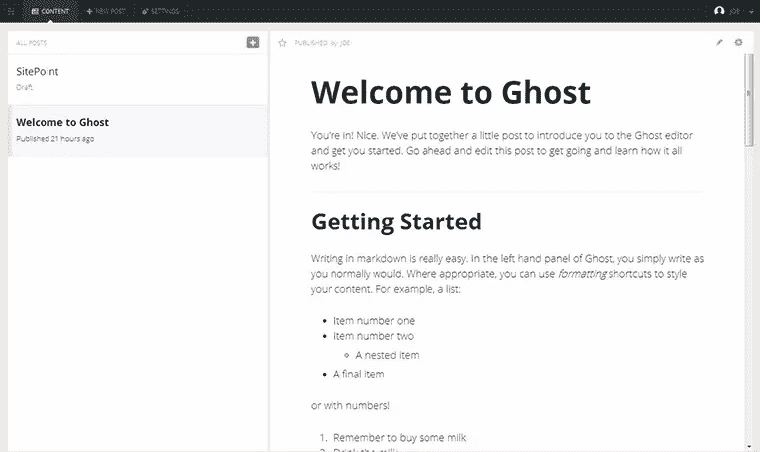
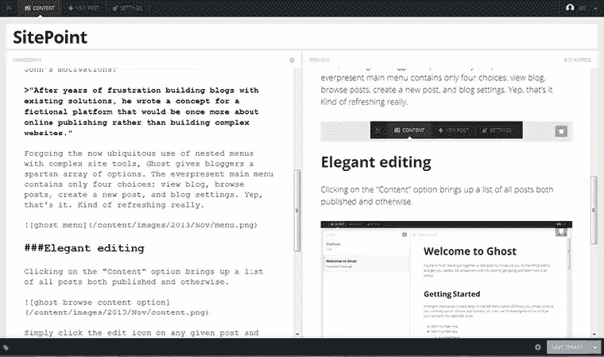
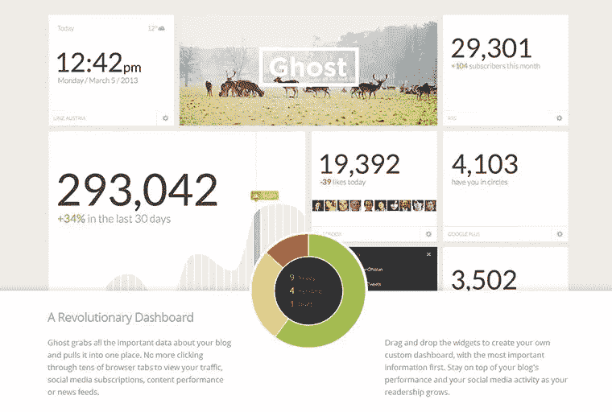

# Ghost 真的是 WordPress 黑仔吗？

> 原文：<https://www.sitepoint.com/ghost-really-wordpress-killer/>

当有人提到博客平台这个词时，你的脑海中可能会浮现出 WordPress 或者 Blogger.com。是的，不是吗？虽然这两个平台显然已经在全球博客用户中占有可观的份额，但仍有一块空白未填补。这种平台上的差距很大程度上是由博客世界本身令人难以置信的流行和增长造成的。

以 WordPress 为例，它最初是一个干净的网络发布框架，现在已经成长为一个成熟的 CMS，旨在处理整个网站。那么，对于那些仍然希望有一种简单有效的方法来编写 web 而又没有功能丰富的 CMS 的开销的人来说，又该如何呢？好吧，就在几周前(准确地说是 10 月 14 日),博客平台竞赛中出现了一个新的竞争者，它希望满足你不那么苛刻的需求。

## 专注于写作

这位新成员被冠以鬼鬼祟祟的绰号[幽灵](https://ghost.org/)。一个合适的名字，因为它毫无歉意地专注于没有虚饰的网络出版。前 WordPress UI 团队成员 John O'Nolan 的宠物项目，Ghost 是出于对当前博客建设者的不满而创建的。在讨论约翰的动机时，Ghost 自己的“关于”页面说得最好:

“在用现有解决方案构建博客多年受挫后，他为一个虚构的平台写了一个概念，这个平台将再次成为在线出版，而不是构建复杂的网站。”

Ghost 放弃了现在普遍使用的嵌套菜单和复杂的网站工具，给了博客们一系列简单的选择。everpresent 主菜单只包含四个选项:查看博客、浏览文章、创建新文章和博客设置。对，就是这样。真的很提神。


## 优雅的编辑

点击“内容”选项会显示所有已发表或未发表文章的列表。



只需点击任意一篇文章上的编辑图标，你就会被带到一个优雅稀疏的编辑视图。该视图内部是一个双窗格窗口，左边是标记，右边是实时预览。



可以在左窗格中键入标记和 HTML，右窗格会自动实时更新转换后的内容。这非常有效，让作为博客作者的你可以专注于制作高质量的内容，而不用分心去浏览菜单和页面预览。

Ghost 编辑方法的真正用处在于标记语言的灵活性。有了双窗格特性，您就基本上获得了标记的强大功能和可移植性，以及 WYSIWYG 编辑器的美感。真是两全其美。

作为无缝(且高效)结合双窗格方法的一个快速示例，要插入图像，您只需创建降价 alt 文本！[alt image text]作为一种“占位符”,然后将所需图像拖放到指定区域。图像会自动上传并放在帖子中。既简单又高效。

## 简单不代表浅薄

尽管 Ghost 的博客方式过于简单，但它仍保留了令人惊讶的可扩展性。ghost 团队从一开始就通过官方 API 提供优秀的插件支持，并通过他们自己的“ [Marketplace](http://marketplace.ghost.org/) ”提供简单的分发方法。

在市场中，用户将能够浏览和下载付费和免费的 Ghost 扩展。在目前的形式下，幽灵市场只展示带有插件的主题。还在路上的是高度吹捧的幽灵仪表板，它将拉进来，并提出有用的分析。仪表板将很容易用拖放部件来定制，以表示所需的数据。

这是官方模型:



## 在后台

对于你们中间的开发类型，Ghost 已经被开发成用 JS 编写的节点 app。这导致了比 WordPress 版本稍微复杂一点的安装，尽管大部分安装现在可以通过第三方提供的自动安装程序来完成。

默认情况下，Ghost 使用 SQLite3 作为存储内容的数据库，尽管您可以通过编辑 Ghost 安装目录中的 config.js 文件来自由选择自己的后端。

下面是一个使用 MySQL 作为数据库的例子:

```
database: { client: 'mysql', connection: {
host: 'localhost', user: 'ghostUser',
password: 'ghostPass',

database: 'ghostDB', charset: 'utf8'
}
}
```

在撰写本文时，使用 Ghost 的唯一方法是自己安装应用程序。然而，在 Ghost 网站上花上五秒钟以上的时间，您会很快发现团队为更简单和更健壮的部署所做的计划。

Ghost 自己的托管服务将在不久的将来推出。据报道，订阅该服务的用户将获得“完整体验”。根据幽灵网站自己的说法:

> “无论如何，你都需要托管你的博客，但我们的服务将是运行 Ghost 最强大的方式，也是最容易上手的。你将拥有完整的 Ghost 软件，包括所有的铃铛、哨子、主题、插件和一些只有我们才有的额外功能(如自动更新和备份)。”

## WordPress 的终结？

这确实是个愚蠢的问题，因为这两个平台并不像你想象的那么矛盾。如上所述，WordPress 开始完成更多的工作，并且有更广泛的用例。
另一方面，幽灵被创造出来作为一个简单的网络写作平台。仅此而已。

也就是说，Ghost 的发布为博客的未来带来了巨大的希望，并给了当前的博客作者充分的理由来认真审视他们自己的平台，并决定他们是否可以不做所有多余的事情。如果你决定跳槽或者只是试水，已经有一个官方的插件能够将你的 WP 帖子转移到 Ghost 的怀抱。

Ghost 是一个开源项目，免费，可以立即从 Ghost [网站](https://ghost.org/)下载。

## 分享这篇文章