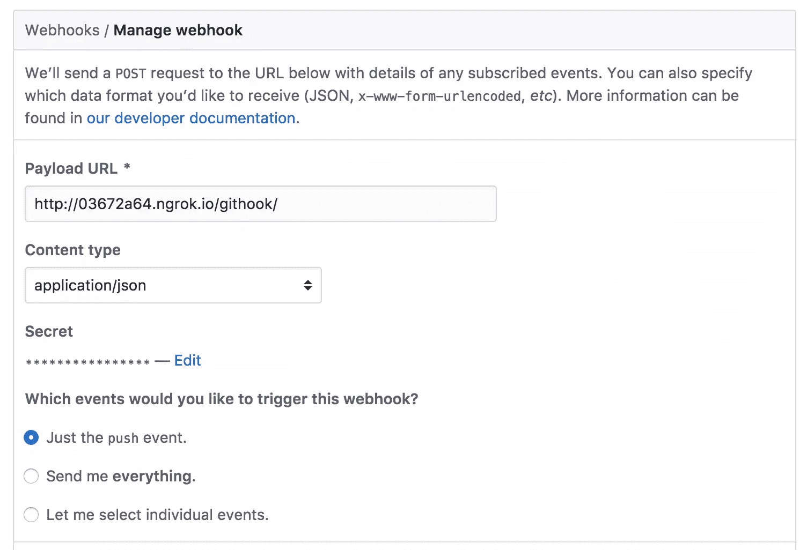
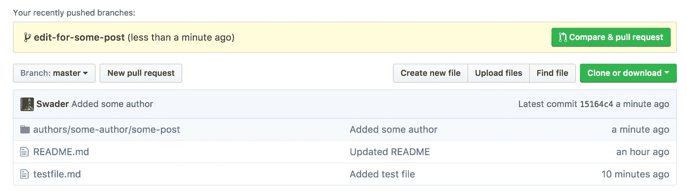
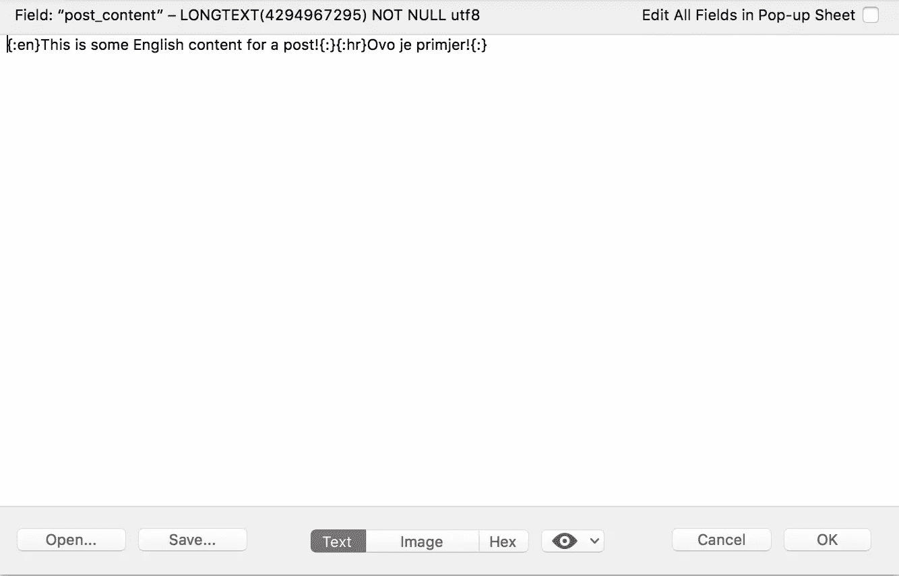
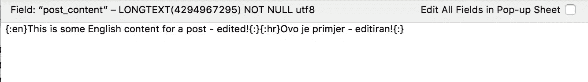

# Git 和 WordPress:如何用拉请求自动更新帖子

> 原文：<https://www.sitepoint.com/git-and-wordpress-how-to-auto-update-posts-with-pull-requests/>

在[Bitfalls.com](https://bitfalls.com)，我们现在也使用 WordPress，并使用与我们在 SitePoint 相同的内容同行评审方法。

我们决定构建一个工具，它可以自动将合并的 pull 请求中的内容提取到文章中，使我们能够从 Github 中修复打字错误和更新帖子，并查看实时网站上反映的变化。本教程将引导你创建这个工具，这样你就可以开始在你自己的 WordPress 站点上使用它，或者创建你自己的版本。

## 这个计划

第一部分是识别问题和围绕它的情况。

*   我们使用 WPGlobus 来支持多语言，这意味着内容是这样保存的:`{:en}English content{:}{:hr}Croatian content{:}`。
*   作者通过 Github 提交 PRs，PRs 经过同行评审和合并，然后(目前)通过浏览器手动导入 WP 的帖子 UI。
*   每个帖子都有相同的文件夹布局:`author_folder/post_folder/language/final.md`
*   这既慢又容易出错，有时还会漏掉错误。这也使得更新帖子变得繁琐。

解决方案如下:

*   添加一个挂钩处理器，用于检测主分支的推送(即从 PRs 合并)
*   处理器应该在提交中寻找一个元文件，该文件将包含关于在哪里保存更新内容的信息
*   处理器自动将 MD 内容转换为 HTML，合并 WPGlobus 格式的语言，并将它们保存到数据库中

## 拔靴带

如果你想跟进(强烈推荐)，请启动一个[良好的虚拟机环境](https://www.sitepoint.com/quick-tip-get-homestead-vagrant-vm-running/)，在上面安装最新版本的 WordPress，并添加 WPGlobus 插件。或者，你可以使用一个准备好的 WordPress 框，像 [VVV](https://www.sitepoint.com/wordpress-meets-vagrant-vvv/) 。此外，确保您的环境已经安装了[ngrok](https://www.sitepoint.com/use-ngrok-test-local-site/)——我们将使用它将 Github hook 触发器传输到我们的本地机器，这样我们就可以在本地测试，而不必进行部署。

## 钩住

对于这个实验，让我们创建一个新的存储库。我把我的叫做[自动推送](https://github.com/Swader/autopush)。

在这个库的设置中，我们需要添加一个[新钩子](https://github.com/Swader/autopush/settings/hooks/new)。因为我们在讨论一个临时的 Ngrok URL，所以让我们先把它旋转起来。在我的例子中，在主机上输入下面的代码就可以了:

```
ngrok http homestead.app:80 
```

我得到了链接`http://03672a64.ngrok.io`，所以这就是进入 webhook 的内容，带有一个任意的后缀，比如`githook`。我们只需要推送事件。`json`数据类型更干净，所以被选为首选，最终的 webhook 设置如下所示:



现在让我们来测试一下。

```
git clone https://github.com/swader/autopush
cd autopush
touch README.md
echo "This is a README file" >> README.md
git add -A
git commit -am "We're pushing for the first time"
git push origin master 
```

ngrok 日志屏幕应该显示如下内容:

```
POST /githook/                  404 Not Found 
```

这很好。我们还没有到达`/githook`终点。

## 处理 web 挂钩

我们将用自定义逻辑将这些新数据读入 WordPress。由于 WP 本身复杂的代码特性，用一个小的定制应用程序完全避开它更容易。首先，我们将在 WordPress 项目的根目录下创建`githook`文件夹，并在其中创建一个`index.php`文件。这使得`/githook/`路径可访问，钩子将不再返回 404，而是 200 OK。

根据[文档](https://developer.github.com/v3/activity/events/types/#pushevent)，在每次提交中，有效载荷将有一个`commits`字段和一个`modified`字段。因为我们只希望更新帖子，而不是安排或删除它们——为了安全起见，这些步骤仍然是手动的——我们将只关注那一个。让我们看看我们是否能在一次测试中抓住它。

首先，我们将把请求数据保存到一个文本文件中，用于调试目的。我们可以通过修改我们的`githook/index.php`文件来做到这一点:

```
<?php
file_put_contents('test.txt', file_get_contents('php://input')); 
```

然后，我们将创建一个新的分支，添加一个文件，并将其推送到网上。

```
git checkout -b test-branch
touch testfile.md
git add testfile.md
git commit -am "Added test file"
git push origin test-branch 
```

果然，我们的`test.json`文件现在充满了有效载荷。[这个](http://jsoneditoronline.org/?id=3d65c7107d3233d8660ebb7419bf3104)是我得到的有效载荷。您可以看到我们只有一个提交，该提交的`modified`字段为空，而`added`字段有`testfile.md`。我们也可以在`refs/heads/test-branch`上看到这种情况，因此，我们对此不感兴趣。但是如果我们用这个分支做一个 PR 然后合并会怎么样呢？

我们的有效载荷看起来[不同](http://jsoneditoronline.org/?id=78d6d3e59f0b6944cde0c8ae3ff5b023)。最值得注意的是，我们现在将`refs/heads/master`作为`ref`字段，这意味着它发生在`master`分支上，我们*必须*注意它。我们也有两次提交，而不是一次:第一次与原始 PR 中的相同，即文件的添加。第二个对应于主分支上的变化:合并本身。两者引用同一个`added`文件。

让我们做最后一个测试。我们来编辑`testfile.md`，推那个，做个 PR，合并。

```
echo "Hello" >> testfile.md
git add testfile.md
git commit -am "Added test file"
git push origin test-branch 
```

啊，[我们开始吧](http://jsoneditoronline.org/?id=78d6d3e59f0b6944cde0c8ae3ff95d1e)。我们现在在有效载荷中有一个修改过的文件。

现在让我们做一个“真实的”场景，模拟一个更新提交。首先，我们将创建一个帖子的默认文件夹，然后我们将更新到其中。

```
git checkout master
git pull
mkdir -p authors/some-author/some-post/{en_EN,hr_HR,images}
echo "English content" >> authors/some-author/some-post/en_EN/final.md
echo "Croatian content" >> authors/some-author/some-post/hr_HR/final.md
touch authors/some-author/some-poimg/.gitkeep
git add -A
git commit -am "Added some author"
git push origin master 
```

然后我们做编辑。

```
git checkout -b edit-for-some-post
echo "This is a new line" >> authors/some-author/some-post/en_EN/final.md
git add -A
git commit -am "Added an update on the English version of the post"
git push origin edit-for-some-post 
```



如果我们在 Github web UI 中将其转换为 pull 请求，并合并 PR，我们将得到[这个有效负载](http://jsoneditoronline.org/?id=34653146cd548c1d9d164ad64e727fb4)。

如果我们跟踪有效负载中修改过的文件的路径，我们可以很容易地辨别出我们正在谈论的文件夹。让我们修改之前的`index.php`文件。

```
$payload = json_decode($json, true);
$last_commit = array_pop($payload['commits']);

$modified = $last_commit['modified'];

$prefix = 'https://raw.githubusercontent.com/';
$repo = 'swader/autopush/master/';
$lvl = 2;

$folders = [];
foreach ($modified as $file) {
    $folder = explode('/', $file);
    $folder = implode('/', array_slice($folder, 0, -$lvl));
    $folders[] = $folder;
}
$folders = array_unique($folders);
var_dump($folders); 
```

我们获取有效负载中的最后一次提交，提取它的修改文件列表，并找到每个修改文件的父文件夹。父文件夹是由`$lvl`变量决定的——在我们的例子中是 2，因为文件夹是向上 2 层的:一个额外的语言变量(`en_EN`)。

这就是我们拥有的——包含需要更新的文件的文件夹的路径。现在我们要做的就是获取内容，将这些文件的 Markdown 转换成 HTML，并保存到数据库中。

## 处理降价

为了处理 MarkDown，我们可以使用 [Parsedown](https://github.com/erusev/parsedown) 包。我们将在`githooks`文件夹中安装这些依赖项，以使应用程序尽可能独立。

```
composer require erusev/parsedown 
```

Parsedown 与我们在 Bitfalls 使用的 Markdown 风格相同，是用[插入符号](http://caret.io)编辑器编写的，所以这是一个完美的匹配。

现在我们可以再次修改`index.php`。

```
$payload = json_decode($json, true);
$last_commit = array_pop($payload['commits']);

$modified = $last_commit['modified'];

$prefix = 'https://raw.githubusercontent.com/';
$repo = 'swader/autopush/';
$branch = 'master/';

$languages = [
    'en_EN' => 'en',
    'hr_HR' => 'hr'
];
$lvl = 2;

$folders = [];
foreach ($modified as $file) {
    $folder = explode('/', $file);
    $folder = implode('/', array_slice($folder, 0, -$lvl));
    $folders[] = $folder;
}
$folders = array_unique($folders);

foreach ($folders as $folder) {
    $fullFolderPath = $prefix.$repo.$branch.$folder.'/';
    $content = '';
    foreach ($languages as $langpath => $key) {
        $url = $fullFolderPath.$langpath.'/final.md';
        $content .= "{:$key}".mdToHtml(getContent($url))."{:}";
    }
    if (!empty($content)) {
        // Save to database
    }
}

function getContent(string $url): string {
    $ch = curl_init();
    curl_setopt($ch, CURLOPT_SSL_VERIFYPEER, false);
    curl_setopt($ch, CURLOPT_RETURNTRANSFER, 1);
    curl_setopt($ch, CURLOPT_URL, $url.'?nonce='.md5(microtime()));
    curl_setopt($ch, CURLOPT_FRESH_CONNECT, TRUE);
    $data = curl_exec($ch);
    $code = curl_getinfo($ch, CURLINFO_HTTP_CODE);
    if ($code != 200) {
        return '';
    }
    curl_close($ch);
    return $data;
}

function mdToHtml(string $text): string {
    $p = new Parsedown();
    $p->setUrlsLinked(true);
    return $p->parse($text);
} 
```

为了避免重复，我们做了一些非常简单的函数。我们还添加了语言文件夹(地区)到它们的 WPGlobus 键的映射，这样当遍历一个文件夹中的所有文件时，我们知道如何在文章的正文中对它们进行定界。

*注意:当更新一篇文章的所有语言版本时，我们必须更新一个版本，因为 WPGlobus 不使用额外的字段或不同的数据库行来保存另一种语言的文章——它将它们都保存在一个字段中，因此需要更新该字段的整个值。*

我们遍历获得更新的文件夹(一个 PR 中可能不止一个)，获取文件内容并将其转换为 HTML，然后将所有这些存储到一个 WPGlobus 友好的字符串中。现在是时候将它保存到数据库中了。

*注意:我们在 URL 的末尾使用了一个 nonce 来消除原始 github 内容可能存在的缓存问题。*

## 保存编辑的内容

我们不知道在哪里保存新内容。我们需要增加对元文件的支持。

首先，我们将添加一个新函数来获取这个元文件:

```
function getMeta(string $folder): ?array {
    $data = getContent(trim($folder, '/').'/meta.json');
    if (!empty($data)) {
        return json_decode($data, true);
    }
    return null;
} 
```

很简单，如果它存在，它会返回它的内容。元文件将是 JSON，所以我们需要的所有解析都已经内置在 PHP 中了。

然后，我们将在主循环中添加一个检查，以便该过程跳过任何没有元文件的文件夹。

```
foreach ($folders as $folder) {
    $fullFolderPath = $prefix.$repo.$branch.$folder.'/';

    $meta = getMeta($fullFolderPath);
    if (!$meta) {
        continue;
    }

    // ... 
```

我们将使用 [WP 命令行界面](https://developer.wordpress.org/cli/commands/post/update/)进行更新。可以使用以下命令安装 CLI:

```
curl -O https://raw.githubusercontent.com/wp-cli/builds/gh-pages/phar/wp-cli.phar
sudo mv wp-cli.phar /usr/local/bin/wp
sudo chmod +x /usr/local/bin/wp 
```

这将下载 WP-CLI 工具，将其放入服务器的路径中(因此可以从任何地方执行)，并为其添加“可执行”权限。

`post update`命令需要一个 post ID 和要更新的字段。WordPress 的帖子被保存到数据库表`wp_posts`中，我们希望更新的字段是`post_content`字段。

让我们在命令行中尝试一下，以确保它按预期工作。首先，我们将添加一个示例帖子。我给了它一个英文的示例标题“Example post”和克罗地亚文的“Primjer ”,正文`This is some English content for a post!`是英文内容，正文`Ovo je primjer!`是克罗地亚文内容。保存后，它在数据库中的外观如下:



以我为例，帖子的 ID 是 428。如果你的 WP 是新安装的，你的可能会更接近 1。

现在，让我们看看如果在命令行上执行以下命令会发生什么:

```
wp post update 428 --post_content='{:en}This is some English content for a post - edited!{:}{:hr}Ovo je primjer - editiran!{:}' 
```

果然，我们的帖子更新了。



在处理需要转义的引号时，这看起来可能会有问题。如果我们从文件中更新，让这个工具处理报价之类的东西会更好。让我们试一试。

让我们把内容`:en}This is some English 'content' for a post - edited "again"!{:}{:hr}Ovo je 'primjer' - editiran "opet"!{:}`放到一个名为`updateme.txt`的文件中。然后…

```
wp post update 428 updateme.txt 
```

是的，都很好。


好的，现在让我们把它加入到我们的工具中。

现在，我们的元文件将只有文章的 ID，所以让我们向内容 repo 添加一个这样的文件。：

```
git checkout master
git pull
echo '{"id": 428}' >> authors/some-author/some-post/meta.json
git add -A
git commit -am "Added meta file for post 428"
git push origin master 
```

*注意:更新 ID 以匹配您的 ID。*

此时，我们的内容回购应该看起来像是[这个](https://github.com/Swader/autopush/releases/tag/1)(版本另存为 release，可以随意克隆)。

将前面代码中的`// Save to database`行及其周围的行替换为:

```
 if (!empty($content) && is_numeric($meta['id'])) {
        file_put_contents('/tmp/wpupdate', $content);
        exec('wp post update '.$meta['id'].' /tmp/wpupdate', $output);
        var_dump($output);
    } 
```

我们确保要更新的文章的内容和 ID 都是有效的，然后我们将内容写入一个临时文件，然后从这个文件中将其提供给`wp cli`工具。

我们还应该在脚本的开头添加一些检查，以确保我们只执行我们想要执行的更新:

```
// ...

$payload = json_decode($json, true);

if (empty($json)) {
    header("HTTP/1.1 500 Internal Server Error");
    die('No data provided for parsing, payload invalid.');
}

if ($payload['ref'] !== 'refs/heads/master') {
    die('Ignored. Not master.');
}

$last_commit = array_pop($payload['commits']);

// ... 
```

完整的`index.php`文件现在看起来像这样:

```
<?php

require_once 'vendor/autoload.php';

$json = file_get_contents('php://input');
file_put_contents('test.json', $json);
$payload = json_decode($json, true);

if (empty($json)) {
    header("HTTP/1.1 500 Internal Server Error");
    die('No data provided for parsing, payload invalid.');
}

if ($payload['ref'] !== 'refs/heads/master') {
    die('Ignored. Not master.');
}

$last_commit = array_pop($payload['commits']);

$modified = $last_commit['modified'];

$prefix = 'https://raw.githubusercontent.com/';
$repo = 'swader/autopush/';
$branch = 'master/';

$languages = [
    'en_EN' => 'en',
    'hr_HR' => 'hr'
];
$lvl = 2;

$folders = [];
foreach ($modified as $file) {
    $folder = explode('/', $file);
    $folder = implode('/', array_slice($folder, 0, -$lvl));
    $folders[] = $folder;
}
$folders = array_unique($folders);

foreach ($folders as $folder) {
    $fullFolderPath = $prefix.$repo.$branch.$folder.'/';

    $meta = getMeta($fullFolderPath);
    if (!$meta) {
        continue;
    }

    $content = '';
    foreach ($languages as $langpath => $key) {
        $url = $fullFolderPath.$langpath.'/final.md';
        $content .= "{:$key}".mdToHtml(getContent($url))."{:}";
    }
    if (!empty($content) && is_numeric($meta['id'])) {
        file_put_contents('/tmp/wpupdate', $content);
        exec('wp post update '.$meta['id'].' /tmp/wpupdate', $output);
        var_dump($output);
    }
}

function getContent(string $url): ?string {
    $ch = curl_init();
    curl_setopt($ch, CURLOPT_SSL_VERIFYPEER, false);
    curl_setopt($ch, CURLOPT_RETURNTRANSFER, 1);
    curl_setopt($ch, CURLOPT_URL, $url.'?nonce='.md5(microtime()));
    curl_setopt($ch, CURLOPT_FRESH_CONNECT, TRUE);

    $data = curl_exec($ch);
    $code = curl_getinfo($ch, CURLINFO_HTTP_CODE);
    if ($code != 200) {
        return null;
    }
    curl_close($ch);
    return $data;
}

function mdToHtml(string $text): string {
    $p = new Parsedown();
    $p->setUrlsLinked(true);
    return $p->parse($text);
}

function getMeta(string $folder): ?array {
    $data = getContent(trim($folder, '/').'/meta.json');
    if (!empty($data)) {
        return json_decode($data, true);
    }
    return null;
} 
```

此时，我们可以测试一些东西。也是一个全新分支的绝佳机会。

```
git checkout -b post-update
echo 'Adding a new line yay!' >> authors/some-author/some-post/en_EN/final.md
git add -A; git commit -am "Edit"; git push origin post-update 
```

让我们看看我们的帖子。


它起作用了——现在部署这个脚本就像部署你的应用程序本身的 WP 代码一样简单，并为有问题的回购更新 webhook 的 URL。

## 结论

在真正的 WordPress 时尚中，我们花了不到一个下午的时间一起开发了一个工具，但是从长远来看，为我们节省了几天甚至几周的时间。该工具现已部署并正常运行。当然，还有更新的空间。如果你有灵感，试着加入以下内容:

*   修改 post 更新过程，使其使用`stdin`而不是文件，使其与 AWS、Heroku 或 Google Cloud 等不可写文件系统主机兼容。
*   定制输出类型:除了固定的`{:en}{:}{:hr}{:}`，也许其他人正在使用不同的多语言插件，或者根本不使用。这应该是可定制的。
*   图像的自动插入。现在是手动的，但是图片和语言版本一起保存在 repo 中，可以很容易地导入、自动优化和添加到帖子中。
*   staging mode——确保合并的更新在转到主版本之前先经过站点的一个临时版本，以便在发送到主版本之前可以验证更改。与其激活和停用 webhooks，为什么不把它变成可编程的呢？
*   插件接口:如果能够在 WP 用户界面中定义所有这些，而不是在代码中定义，将会非常方便。因此，围绕功能的 WP 插件抽象将是有用的。

通过本教程，我们的目的是向您展示，当您花时间去做时，优化工作流并不是一件大事，从长远来看，牺牲一些时间来实现自动化并运行的投资回报是巨大的。

关于如何优化这一点，还有其他想法或提示吗？让我们知道！

## 分享这篇文章