# 给初学者的 Git

> 原文：<https://www.sitepoint.com/git-for-beginners/>

抗拒改变是人类的普遍倾向。除非 [Git](http://git-scm.com/) 在你开始使用版本控制系统的时候就已经存在，否则你很有可能已经习惯了 [Subversion](http://subversion.apache.org/) 。经常有人说 Git 对于初学者来说太复杂了。然而，我不敢苟同！

在本教程中，我将解释如何在你的个人项目中使用 Git。我们将假设您正在从头开始创建一个项目，并希望用 Git 来管理它。在完成基本命令后，我们将看看如何使用 GitHub 将代码放入云中。

我们将在这里讨论 Git 的基础知识——如何初始化您的项目，如何管理新的和现有的文件，以及如何将您的代码存储在云中。我们将避免 Git 中相对复杂的部分，比如分支，因为本教程是面向初学者的。

## 安装 Git

Git 的官方网站有关于在 Linux、Mac 或 Windows 上安装的[详细信息。在这种情况下，我们将使用 Ubuntu 13.04 进行演示，您可以使用`apt-get`安装 Git。](http://git-scm.com/book/en/Getting-Started-Installing-Git)

```
sudo apt-get install git
```

## 初始配置

让我们创建一个目录，我们将在其中工作。或者，您可以使用 Git 来管理一个现有的项目，在这种情况下，您不需要创建如下所示的演示目录。

```
mkdir my_git_project
cd my_git_project
```

第一步是在一个目录中初始化 Git。这是使用命令`init`完成的，该命令创建一个`.git`目录，其中包含项目的所有 Git 相关信息。

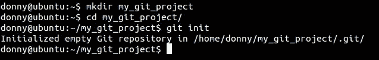

```
git init
```

接下来，我们需要配置我们的姓名和电子邮件。您可以如下操作，用您自己的姓名和电子邮件替换这些值。

```
git config --global user.name 'Shaumik'
git config --global user.email 'sd@gmail.com'
git config --global color.ui 'auto'
```

需要注意的是，如果您没有设置您的姓名和电子邮件，将使用某些默认值。在我们的例子中，用户名“donny”和电子邮件“donny@ubuntu”将是默认值。

此外，我们将 UI 颜色设置为`auto`，以便终端中 Git 命令的输出是彩色编码的。我们在命令前面加上前缀`--global`的原因是为了避免下次在系统上启动 Git 项目时输入这些配置命令。

## 提交的暂存文件

下一步是在目录中创建一些文件。您可以使用像 [Vim](http://www.vim.org/) 这样的文本编辑器。注意，如果您要将 Git 添加到一个已经存在的目录中，您不需要执行这个步骤。

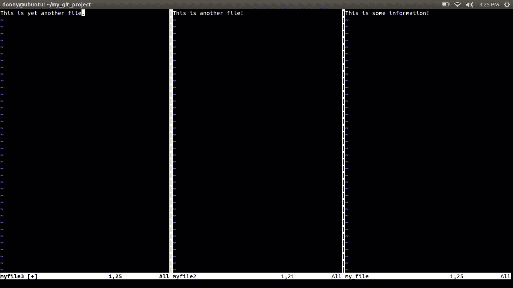

### 检查您的存储库的状态

现在我们的存储库中有了一些文件，让我们看看 Git 是如何处理它们的。为了检查您的存储库的当前状态，我们使用了`git status`命令。

```
git status
```

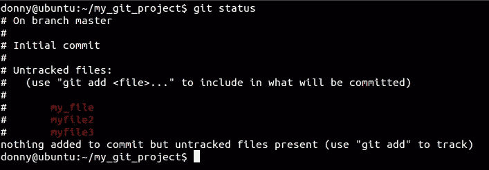

### 添加 Git 要跟踪的文件

此时，我们没有任何文件可供 Git 跟踪。我们需要专门向 Git 添加文件，以便告诉 Git 跟踪它们。我们使用`add`添加文件。

```
git add my_file
```

再次检查存储库的状态向我们显示已经添加了一个文件。

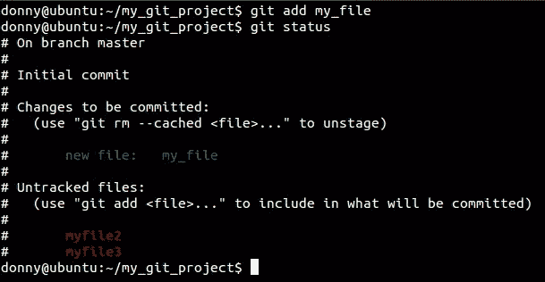

要添加多个文件，我们使用下面的代码(注意，我们添加了另一个文件用于演示目的。)

```
git add myfile2 myfile3
```

您可以递归地使用`git add`,但是要小心使用这个命令。有一些特定的文件(比如编译后的文件)通常不在 Git 存储库中。如果您递归地使用`add`，它将添加所有这样的文件，如果它们存在于您的存储库中。

### 删除文件

假设您向 Git 添加了不想让它跟踪的文件。在这种情况下，您告诉 Git 停止跟踪它们。然而，运行一个简单的`git rm`不仅会从 Git，[中删除它，还会从您的本地文件系统](http://stackoverflow.com/questions/1143796/git-remove-a-file-from-the-repository-without-deleting-it-from-the-local-filesy)中删除它！要让 Git 停止跟踪某个文件，但仍将其保留在本地系统上，请运行以下命令:

```
git rm --cached [file_name]
```

## 提交更改

一旦你上传了你的文件，你就可以把它们放到 Git 中。把提交想象成一个快照，您可以返回到那个阶段访问您的存储库。您将提交消息与每次提交相关联，这可以通过前缀`-m`来提供。

```
git commit -m "My first commit"
```

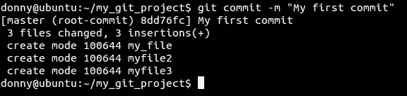

提供有用的提交消息，因为它有助于您识别在提交过程中您更改了什么。避免过于笼统的信息，如“已修复的错误”。如果您有一个问题跟踪器，您可以提供类似“已修复错误#234”的消息。将您的分支名称或特性名称作为提交消息的前缀是一个很好的做法。例如，“资产管理–增加了生成资产 pdf 的功能”就是一条有意义的信息。

Git 通过给每个提交附加一个长的十六进制数字来识别提交。通常，您不需要复制整个字符串，前 5-6 个字符足以识别您的提交。在截图中，请注意`8dd76fc`标识了我们的第一次提交。

## 进一步提交

现在，让我们在第一次提交后更改几个文件。在更改它们之后，我们通过`git status`注意到 Git 注意到了它正在跟踪的文件中的更改。

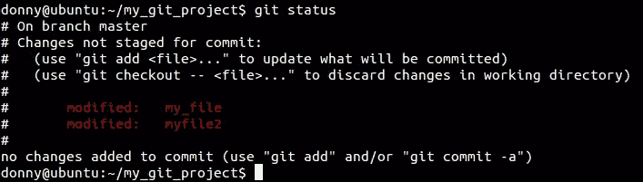

您可以通过运行`git diff`来检查自上次提交以来对被跟踪文件的更改。如果您想查看特定文件的更改，可以运行`git diff <file>`。

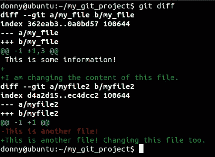

您需要再次添加这些文件，以便为下一次提交在跟踪的文件中存放更改。您可以通过运行以下命令来添加所有跟踪的文件:

```
git add -u
```

您可以通过在`-a`前面加上前缀`git commit`来避免这个命令，这样会将所有更改添加到提交的跟踪文件中。然而，这个过程是非常危险的，因为它可能是破坏性的。例如，假设你打开了一个文件，然后不小心修改了它。如果您有选择地转移它们，您会注意到每个文件中的变化。但是，如果您将`-a`添加到提交中，所有文件都将被提交，而您将无法注意到可能的错误。

一旦转移了文件，就可以继续提交。我提到过，一条消息可以与我们使用`-m`输入的每个提交相关联。但是，您可以使用命令`git commit`提供多行消息，这为您编写打开了一个交互格式！

```
git commit
```

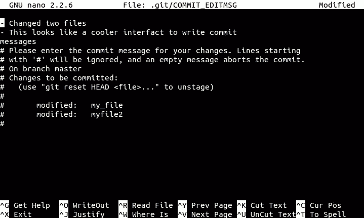

## 项目管理

若要检查项目的历史记录，可以运行以下命令。

```
git log
```

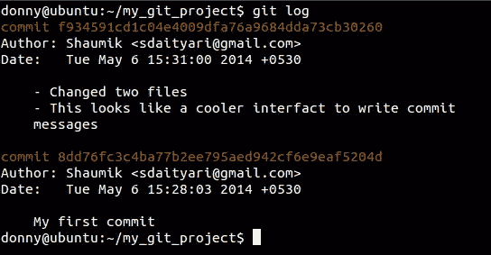

这向您展示了项目的整个历史——这是所有提交及其信息的列表。关于提交的信息包含提交散列、作者、时间和提交消息。`git log`有许多变体，一旦您理解了 Git 中的`branch`的概念，您就可以探索这些变体。要查看特定提交和已更改文件的详细信息，请运行以下命令:

```
git show <hash>
```

其中`<hash>`是与提交相关联的十六进制数。由于本教程是为初学者编写的，我们将不讨论如何及时返回到特定提交的状态，也不讨论如何管理分支。

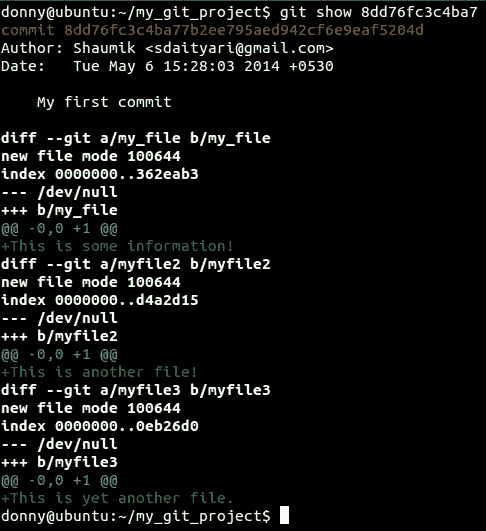

## 将您的代码放在云中

一旦你学会了如何在你的系统上管理你的代码，下一步就是把它放到云中。由于 Git 没有 Subversion 这样的中央服务器，所以您需要添加每个源来与其他源协作。这就是遥控器概念的由来。一个`remote`指的是你的存储库的一个远程版本。

如果你想把你的代码放在云中，你可以在 [GitHub](https://github.com/) 、 [GitLab](https://www.gitlab.com/) 或 [BitBucket](https://bitbucket.org/) 上创建一个项目，然后把你现有的代码推送到仓库。在这种情况下，云中的远程存储库将充当您的存储库的远程。方便的是，您可以对其进行写访问的遥控器被称为`origin`。

在您创建一个远程存储库之后，您可以添加一个远程`origin`，然后将代码推送到原点。

```
git remote add origin https://github.com/sdaityari/my_git_project.git
git push -u origin master
```

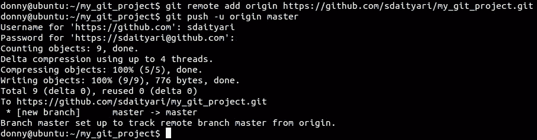

## 结论

Git 有很多特性，我们在这里只讨论了基本特性。我希望这篇文章能帮助你开始使用 Git。如果你有任何关于入门的问题，请在下面的评论中告诉我们。

## 分享这篇文章