# Git 交互式 Rebase 指南，带实例

> 原文：<https://www.sitepoint.com/git-interactive-rebase-guide/>

使用 Git 进行版本控制已经成为每个现代开发人员的工具带中的一个默认选项。像`commit`、`push`和`pull`这样的命令已经进入了我们手指的肌肉记忆。但是相对来说，很少开发人员知道 Git 中“更高级”的特性——以及它们的价值有多大！在本文中，我们将探索“交互式 rebase”，它是 Git 中最强大的工具之一。

## 为什么交互式 Rebase 应该成为每个开发人员工具箱的一部分

简而言之，毫不夸张地说，通过允许您在项目中创建一个清晰的、结构良好的提交历史，交互式 rebase 可以帮助您成为一名更好的开发人员。

为什么结构良好的提交历史很重要？想象一下相反的情况:一个难以阅读的提交历史，你不知道你的同事*实际上*对他们最近的更改做了什么。越来越多的“黑暗角落”开始出现在这样的项目中，你只了解你自己工作的小部分。

与干净且结构良好的提交历史形成对比:它有助于使项目的代码库*更易读*和*更容易理解*。这是一个健康、持久项目的基本要素！

## 交互式 Rebase 能为你做什么

交互式 Rebase 帮助您优化和清理您的提交历史。它涵盖了许多不同的使用案例，其中一些案例允许您:

*   编辑旧的提交消息
*   删除提交
*   挤压/合并多个提交
*   重新排序提交
*   修复旧的提交
*   拆分/重新打开旧提交进行编辑

## 何时使用交互式 Rebase(以及何时不使用！)

像其他 Git 工具一样，交互式 rebase“重写历史”。这意味着，当您使用交互式 rebase 操作一系列提交时，提交历史的这一部分将被*重写*:提交的 SHA-1 散列将会改变。可以说，它们是全新的提交对象。

这个事实需要一个简单但重要的规则:不要对已经在远程存储库上与同事共享的提交使用交互式 rebase(或其他重写历史的工具)。相反，在将它们合并到一个团队分支之前，使用它来清理您自己的本地提交——比如在您自己的一个特性分支中。

## 交互式 Rebase 操作的基本机制

尽管交互式 rebase 可以用于许多不同的事情，但是基本的工作流程总是相同的。一旦你牢固地理解了这个基本机制，交互式 rebase 将失去它“复杂神秘”的气息，成为你的工具带中一个有价值的、可访问的项目。

### 步骤 1:您应该从哪里开始会话？

您需要回答的第一个问题是:“我想操纵我的提交历史的哪一部分？”这将告诉您应该从哪里开始您的交互式重建基础会话。让我们举一个实际的例子，假设我们想要编辑一个旧的提交消息(这是我们稍后实际要做的)。

我们的开始情况如下图所示，我们通过交互式 rebase 编辑一个旧的提交消息。

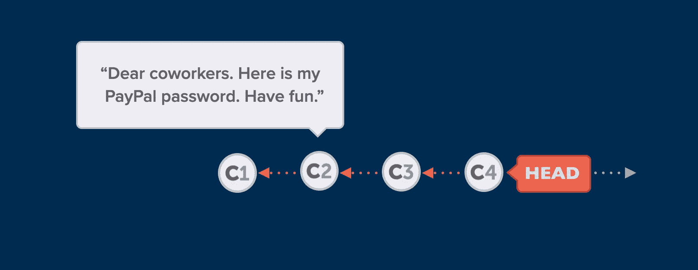

为了能够更改`C2`中的提交消息，我们必须在它的父提交处开始我们的交互式 rebase 会话(或者甚至在此之前，如果您愿意的话)。在这个例子中，我们将使用`C1`作为我们交互式 rebase 会话的起点。

### 步骤 2:开始实际的会话！

开始实际的会话非常简单:

```
$ git rebase -i HEAD~3 
```

我们使用带有`-i`标志的`git rebase`命令(表示我们确实希望它是“交互式的”)并提供基本提交(我们在上面的第一步中提出的)。在这个例子中，我使用了`HEAD~3`来指定“头提交之后 3”的提交。或者，我也可以提供一个特定的 SHA-1 散列。

### 步骤 3:告诉 Git 你想做什么

启动交互式 rebase 会话后，您将看到一个编辑器窗口，Git 在其中列出了一系列提交——从最近一次提交，一直到(但不包括)您在步骤 1 中选择作为基本提交的提交。

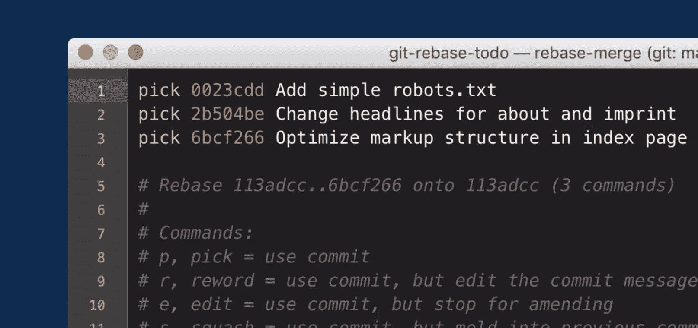

在这一步中，有两件重要的事情需要记住:

1.  **提交以相反的顺序列出！**最新的提交，我们期望它出现在列表的*顶部*，将出现在列表的*底部*。不要担心:您的 Git 存储库非常好！🥳:记住，我们正在执行一个交互式的 rebase 操作，这需要 Git 在操作结束时从最老的提交到最新的提交。
2.  不要在这个编辑器窗口中进行实际的修改！虽然您可能很想直接在这个编辑器窗口中更改提交消息(毕竟，这是我们实际想要做的…)，但是您必须表现出一些耐心。这里，我们只打算告诉 Git *我们想要做什么*——但不做实际的改变。我将很快在实践中证明这一点！

有了这个理论概述，让我们一起深入一些实际案例吧！

## 编辑旧的提交消息

交互式 rebase 的一个非常流行的用例是，您可以在事后编辑旧的提交消息。您可能知道`git commit --amend`也允许您更改提交的消息——但前提是这是*最近的*提交。对于任何超过这个时间的提交，我们必须使用交互式 rebase！

让我们来看一个具体的场景。下面是一个需要更正的错误提交消息的图像。

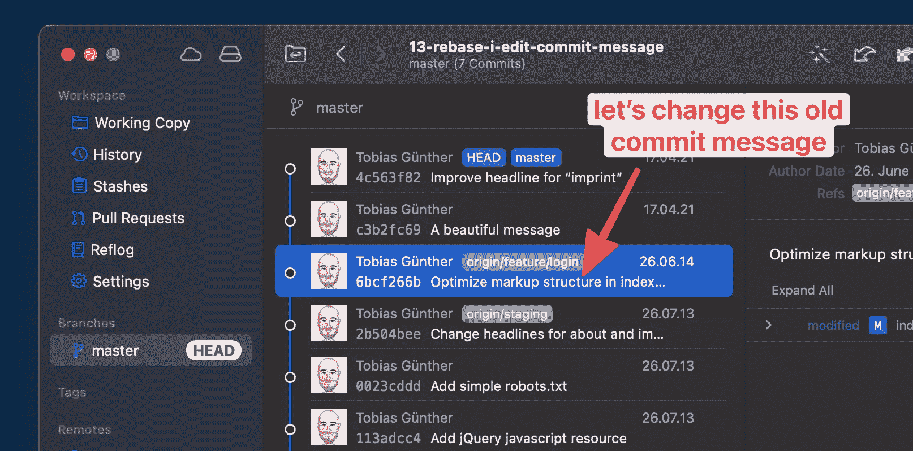

*注意:为了更好的概述和更清晰的可视化，我在我的一些截图中使用了 [Tower Git 桌面客户端](https://www.git-tower.com/?utm_source=sitepoint&utm_medium=guestpost&utm_campaign=guide-to-interactive-rebase)。在本教程中，您不需要使用 Tower。*

对于我们的例子，假设我们想要编辑当前标题为“优化索引中的标记结构”的提交消息

我们的第一步是确定开始这个交互式 rebase 会话的基础提交。因为我们必须(至少)回到“坏苹果”提交的父提交，所以我们从 HEAD~3 开始我们的会话(HEAD commit 后面的三个提交，标题是“更改标题…”):

```
$ git rebase -i HEAD~3 
```

在执行这个命令之后，您最喜欢的编辑器将打开并显示您刚刚选择的提交列表(通过提供一个基本提交)。

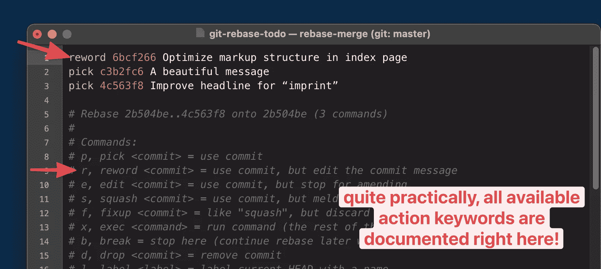

提醒一下:虽然你可能想这么做，但是我们**而不是**在这里更改提交消息。我们只*用“动作关键字”标记*各自的行。在我们的例子中，我们想要`reword`提交(这意味着我们想要改变提交消息，但是保持提交的其余部分不变)。

实际上，所有可用的动作关键字都记录在这个窗口的底部——所以没有必要记住任何东西！

一旦你用你喜欢的动作关键字替换了标准的`pick`关键字(意思是“照原样提交”)，你可以简单地保存并关闭窗口。

这样做之后，将会打开一个新的编辑器窗口，其中包含当前的提交消息。最后，我们被允许做我们一开始就要做的事情:编辑这个旧的提交消息！

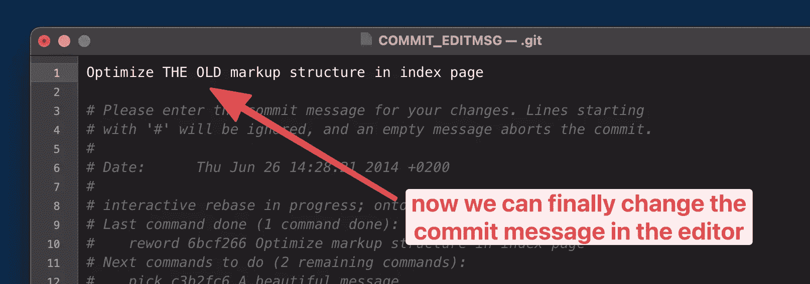

在进行更改，然后保存并关闭编辑器窗口之后，交互式 rebase 会话就完成了——我们的提交消息也更新了！🎉

## 删除不需要的提交

交互式 rebase 还允许你*从你的历史中删除*一个你不再需要(或想要)的旧提交。假设您在最近的提交中意外地包含了个人密码:在大多数情况下，像这样的敏感信息不应该包含在代码库中。

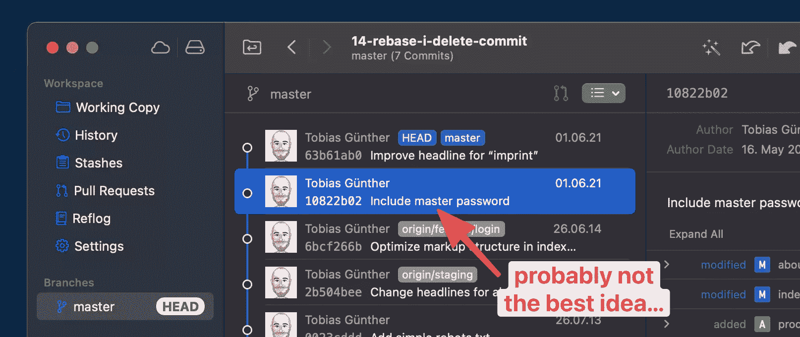

还要记住，简单地删除信息并再次提交并不能真正解决问题:这意味着密码仍然以旧提交的形式保存在存储库中。您真正想要的是干净彻底地从存储库中删除这段数据！

让我们从确定交互式 rebase 会话的基础提交开始。因为我们至少需要从错误提交的父提交开始，所以我们使用“优化标记结构…”提交作为我们的基础:

```
$ git rebase -i 6bcf266b 
```

注意，这一次，我在`git rebase -i`命令中使用了一个具体的 SHA-1 散列。当然，代替提交散列，我可以使用`HEAD~2`来处理提交。

执行这个命令后，我们再次看到一个提交列表。

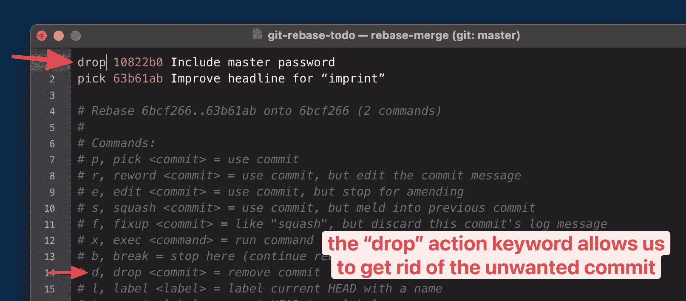

这一次，我们使用`drop` action 关键字来删除不需要的提交。或者，在这种特殊情况下，我们也可以简单地从编辑器中删除整行。如果在保存和关闭窗口时一行(代表提交)不再存在，Git 将删除相应的提交。

无论您选择如何做，在您保存并关闭编辑器窗口后，提交将从您的存储库的历史中删除！

## 将多个提交合并为一个

交互式 rebase 的另一个用例是当您想要将多个单独的提交合并成一个时。在我们深入了解*和*的工作原理之前，让我们花点时间讨论一下*何时*或*为什么*会有价值。

一般来说，在大多数情况下，使提交“更大”(通过将多个合并成一个)是*而不是*一个好策略。一般的经验法则是让提交尽可能的小，因为“小”意味着“更容易阅读和理解”。但是在某些情况下，这仍然是有意义的。这里有两个例子:

*   假设您注意到一个旧提交的问题。然后，您可以继续进行并产生一个*新的*提交来修复这个问题。在这种情况下，能够将这些提交合并成一个提交是很有意义的:毕竟，新的提交只是一个“创可贴”,用来修复一开始就不应该存在的问题。通过组合这些提交，看起来好像从一开始就没有问题！
*   另一个例子是当你注意到你把事情做得太粒度化了。做一些小的提交是很好的，但是在你的提交历史上留下许多不必要的小的*提交将意味着做过头了。*

这两个例子中的基本原理是相同的:通过合并两个(或多个)本来应该是一个的提交，您产生了一个更清晰、更易读的提交历史！

让我们一起来看一个实际的例子，把下图的情况作为我们的开始情况。

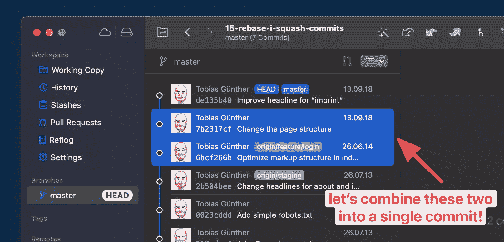

让我们说，从语义上来说，这两个提交是一个更有意义。使用交互式 rebase 的`squash`工具，我们确实可以将它们结合起来:

```
$ git rebase -i HEAD~3 
```

到目前为止，您已经习惯了接下来发生的事情:打开一个编辑器窗口，显示提交列表。

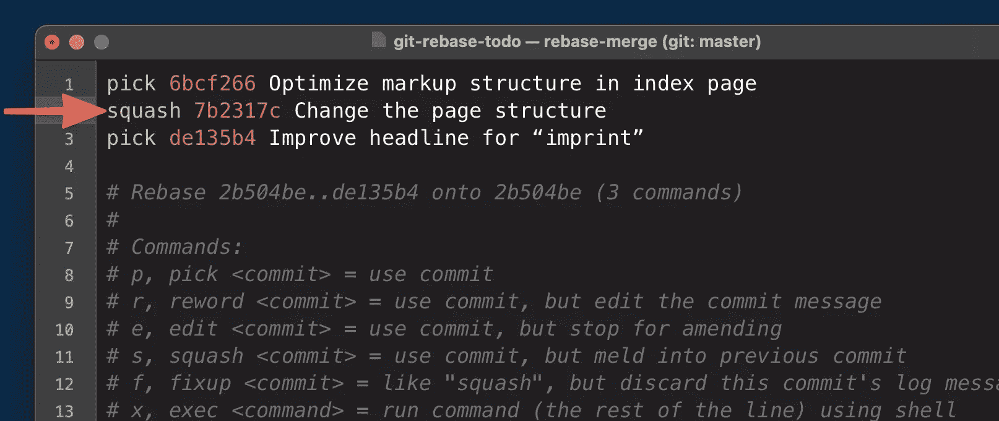

我已经提到过，在这种情况下我们将使用`squash` action 关键字。关于`squash`是如何工作的，有一件重要的事情需要知道:*你用关键字标记的那一行将会与上面的那一行结合起来！*这解释了为什么在我们的例子中我用`squash`关键字标记第 2 行。

保存并关闭此窗口后，将会打开一个新窗口。这是因为，通过合并多个提交，我们当然会创建一个新的提交。和其他提交一样，这个也需要一个提交消息！

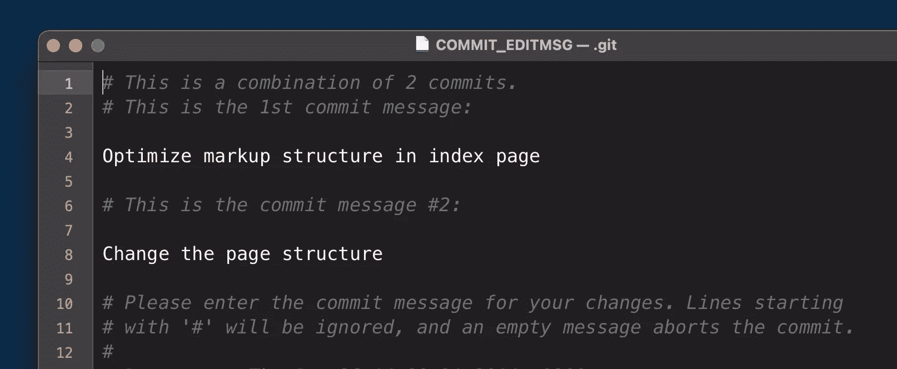

您在上面的截图中看到的是 Git 为我们准备的内容:它结合了各个原始提交的提交消息以及一些注释。你可以删除旧邮件，重新开始，或者保留它们并添加更多信息。

保存并关闭这个编辑器窗口后，我们可以自豪地说:以前是两个独立的提交现在是一个了！

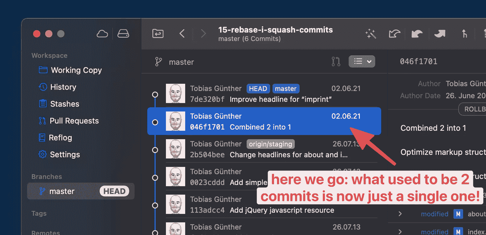

## 利用交互式 Rebase 的力量

我希望你同意 Git 的交互式 rebase 工具非常有价值！作为开发人员，争取一个干净清晰的提交历史对我们来说很重要。这是保持代码库健康和易于理解的关键因素(一段时间后，对你的队友和你自己都是如此)。

如果你想了解更多，我强烈推荐“[Git](https://www.git-tower.com/learn/git/first-aid-kit?utm_source=sitepoint&utm_medium=guestpost&utm_campaign=guide-to-interactive-rebase)急救包”。这是一个(免费的)短片集，展示了如何在 Git 中清理和撤销错误。

玩得开心！

## 分享这篇文章