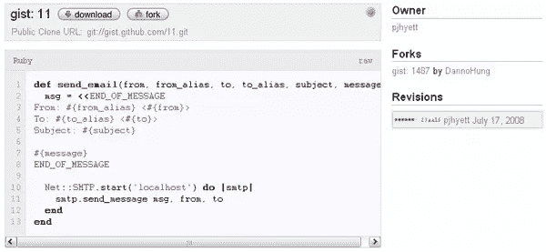

# GitHub Gist 是类固醇的派

> 原文：<https://www.sitepoint.com/github-gist-is-pastie-on-steroids/>

在短短的几个月内， [GitHub](http://www.github.com/) 已经成为编程社区，尤其是开源和 Rails 社区的一大亮点。GitHub 使用 [Git](http://git.or.cz/) 提供软件存储库服务，Git【】是由 Linus Torvalds 创建并由 Linux 内核项目使用的分散式版本控制系统。GitHub 托管了大约 10，000 个项目，经过几个月的测试期后，于今年 4 月正式推出。

使用所谓的去中心化系统来创建一个中心化的软件仓库似乎有悖常理，但是 GitHub 的特别之处在于它所提供的社交功能。Git 使得派生和合并代码变得很容易，GitHub 已经采用了这些概念，并围绕它们构建了社交网络功能，包括评论、派生、提交和其他项目相关活动的用户和项目新闻源。

本周早些时候，GitHub 将一些相同的概念应用于“粘贴”实践，并创建了他们自己的 [pastebin](http://en.wikipedia.org/wiki/Pastebin) 网站，名为 [Gist](http://gist.github.com/) 。Pastebins，例如流行的 [Pastie](http://pastie.org/) ，已经成为许多程序员的宝贵工具，尤其是那些与合作者一起工作的人，它允许开发者粘贴和共享小代码片段。

Gist 基于这一思想，为代码片段添加了版本控制，为私有粘贴添加了简单的分叉和 SSL 加密。因为每个“要点”都有自己的 Git 存储库，所以多个代码片段可以包含在一个粘贴中，并且可以使用 Git 进行推送和提取。此外，分叉的代码可以以补丁的形式推回给原作者，因此粘贴可以变得更像迷你项目。

正如 TechCrunch 指出的那样，GitHub 希望 Gist 能让人们更容易为开源项目做出贡献，而不必先熟悉 Git 的工作方式。不过，TechCrunch 也指出，Gist 缺少全文搜索。Gist 已经是一个杀手级的粘贴服务，通过一些小的改进，它可以近乎完美。

## 分享这篇文章