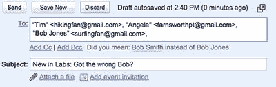

# 新的 GMail 系统有助于防止电子邮件尴尬

> 原文：<https://www.sitepoint.com/gmail-prevents-email-embarrassment/>

尽管电子邮件很方便，但它是一种危险的媒介。现在是星期五晚上 9 点。你向你的朋友抱怨工作到很晚，然后不假思索地点击发送。周一早上到了，有一个*“你是想给我发这条信息吗？”*收件箱里的电子邮件。你老板给的。哎呀！

一项新的 GMail 功能可能会对你有所帮助。“认错人了？”是谷歌实验室的一个插件，它可以分析你最常发邮件的联系人组，并识别潜在的冲突。例如，如果你经常给蒂姆、安吉拉和鲍勃·史密斯发邮件，那么给蒂姆、安吉拉和鲍勃·琼斯的新邮件会提醒你这可能是个错误:

这个系统是由谷歌工程师 Yossi Matias 设计的:

> 我经常遇到错误发送的信息，因为 Yossi 在以色列是一个常见的名字。
> 
> 一个是两个人之间的交流。他们正在谈论一位同事的未来，但不小心把他包括在了邮件里。所以我想也许我们可以提供一个可以识别这个的功能。

*“不要忘记 Bob”*是一个类似的插件，它可以分析你的发送列表，并突出显示你可能错过的收件人。要打开任一系统:

1.  登录 GMail，点击右上角的**设置**。
2.  点击**实验室**标签。
3.  向下滚动到附加组件并点击**启用**。
4.  点击**保存更改**。

这个系统能帮助你吗？你发错收件人的最尴尬的邮件是什么？

## 分享这篇文章