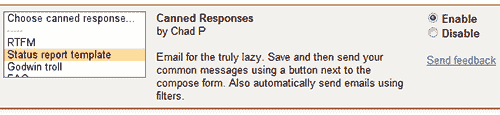
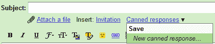
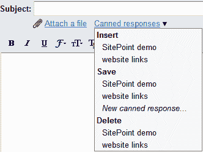
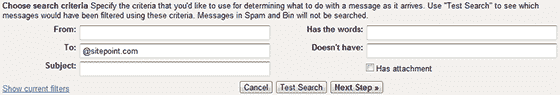
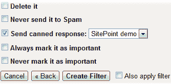

# 如何在 GMail 中使用模板和自动回复功能

> 原文：<https://www.sitepoint.com/gmail-templates-auto-responders/>

你有 GMail 账户吗？你当然知道。7GB 的空间和出色的界面让它变得显而易见。即使你只是把它作为一个垃圾邮件捕捉账户，毫无疑问 GMail 是一个私人和商业使用的伟大工具。

然而，GMail 可能有点古怪，使用的术语不同于其他电子邮件客户端。许多人依赖于预先配置的模板和自动应答器，但它们在默认界面中似乎不可用。幸运的是，他们只有几下鼠标的距离…

## 启用“预设响应”

您的第一个任务是在**设置** > **实验室**中启用“预设响应”:

点击启用，然后滚动到底部，点击**保存更改**。这是最难的部分。

## 使用电子邮件模板

要创建新模板，请撰写一封新电子邮件并输入您需要的文本。完成后，点击**预设回复**下拉菜单(在主题行下方)并选择**新预设回复…** 。

系统会提示您输入预设的响应名称。

从现在开始，可以通过点击**预设响应**下拉菜单并选择**插入**下的一项，将该文本插入光标位置:

## 创建电子邮件自动回复

自动回复功能会自动回复给您发邮件的人。在 GMail 中，它们是使用过滤器处理的，过滤器是在收到邮件时应用的规则。

要创建一个自动回复器，点击**设置** > **过滤器**，然后**创建一个新的过滤器**。

现在，您可以定义哪些邮件应该接收自动回复。它可以来自一个或多个地址、域、发送到特定地址、在主题或正文中包含或省略文本，或者有附件。点击**测试搜索**查看您账户中匹配的邮件。

对过滤器满意后，点击**下一步**:

勾选**发送预设响应**并选择您需要的响应。点击**创建过滤器**就大功告成了。

## 分享这篇文章