# 用这 9 个 Gmail 技巧来提高你的工作效率

> 原文：<https://www.sitepoint.com/gmail-tips/>

看着我的企业成长是一种奇妙的感觉。

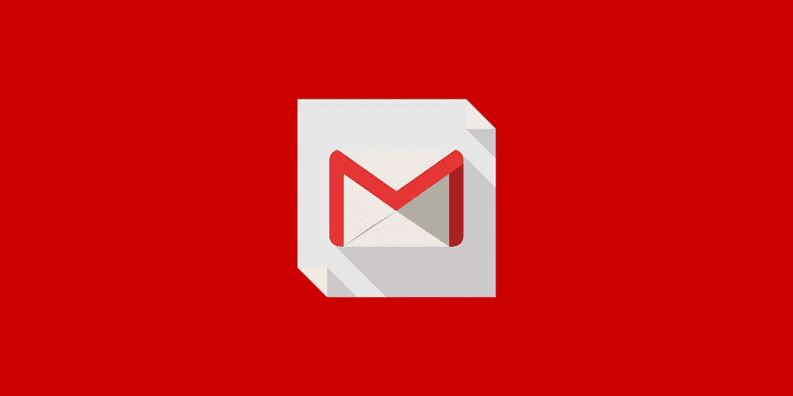

处理随之而来的管理难题**糟透了**。

推销新客户、管理现有客户、维护员工、关注账目以及电子邮件！

我的意思是，真的，人们对电子邮件失去了控制，不是吗？

我的一个朋友建议我把 Gmail 用于收发电子邮件和提高工作效率。在第一周内，我看到生产率大幅提高。

在这篇文章中，我将向你展示使用 Gmail 提高工作效率的九种方法。

## **1。用“未发送”功能收回错误。**

如果你为客户服务，我知道你能感受到我——他们可能是一种痛苦(但是如果你们正在读这篇文章，我爱你们！).

有时我会被激怒，发送“不太好”的电子邮件回复。“未发送”功能是一个天赐良机，让我可以收回电子邮件。

### **如何设置:**

*   单击右上角的齿轮图标
*   选择设置
*   找到“撤销发送”
*   单击“启用撤销发送”
*   点击屏幕底部的“保存”

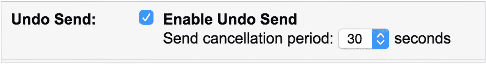

现在，你将有一段宽限期来撤回邮件。

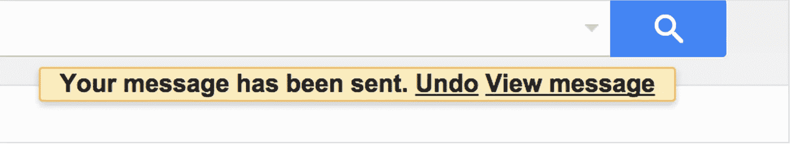

## **2。停止检查多个电子邮件帐户。**

不得不检查四个不同的电子邮件平台有多烦人？

我通过我的 Gmail 推送所有邮件，包括我的职业邮件。

你可以通过 Gmail 从你的工作邮件中**转发** ***和*** **回复。我可以登录 Gmail，从我的公司邮箱、个人工作邮箱和我的 Gmail 账户发送邮件。**

Outlook 的功能只有 Gmail 的十分之一。说真的，摆脱它。

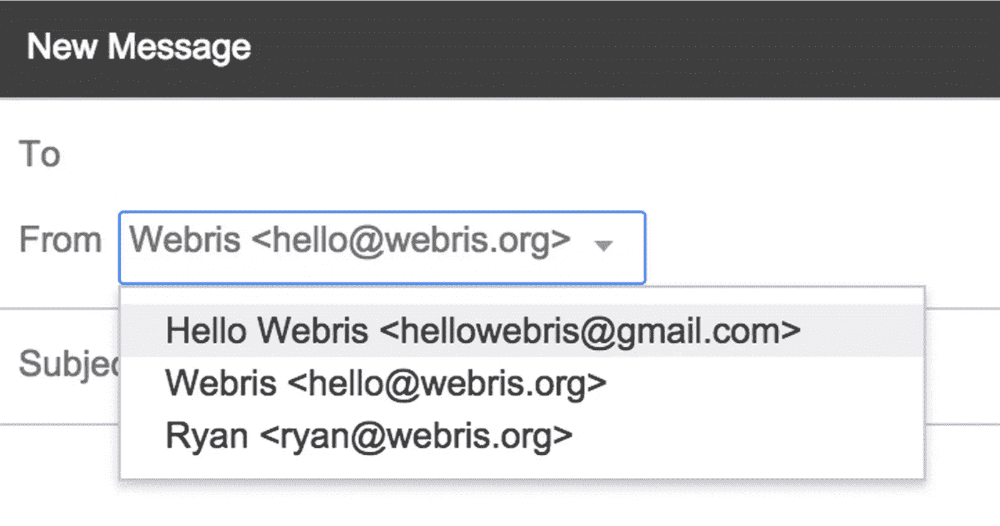

***注:请不要垃圾我！***

仅此一项就能节省大量时间，但是等等，还有更多！

我是 Mac 和 iPhone 用户，所以我经常使用苹果的日历来安排活动。你知道用 Gmail 登录苹果日历会自动同步两者吗？

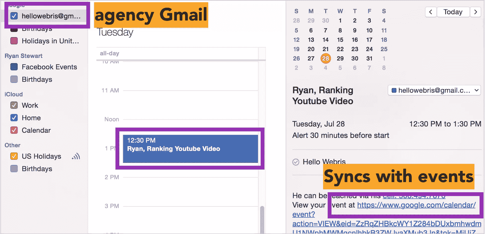

Gmail 与谷歌日历同步，谷歌日历与 iCalendar 自动同步，这意味着我所有的约会和会议都被推送到我的设备上。

我知道有很多工具可以帮你做到这一点，但是这个工具是免费的，简单的。

### **如何设置:**

我不会骗你，这是一个痛苦的设置，所以我支付了 20 美元的人帮我做。

**
**

**如果你真的手头很紧，这里有一些资源可以帮你:**

*   [如何将您所有的电子邮件地址合并到一个 Gmail 收件箱中](http://www.howtogeek.com/106034/how-to-combine-all-your-email-addresses-into-one-gmail-inbox/)
*   [谷歌支持文档](https://support.google.com/mail/answer/56283?hl=en)
*   [如何使用 Gmail 发送和接收](http://www.androidcentral.com/how-use-gmail-send-and-receive-email-your-other-accounts)

## **3。利用免费工具简化流程**

我的一个朋友经营着一个高流量的网站，每天会收到数百个询问。他向我透露了 [Streak](https://www.streak.com/) ，这是一个免费的插件，具有大量强大的功能:

**管理管道和分段邮件**。我用它来保持我的销售漏斗完好无损，并管理潜在客户从铅到关闭。

**稍后发送特写。**完全透明，当我发送建议书时，我会安排在早上 6:00 发送。这给潜在客户留下了这样的印象:我是一个每天早起的勤奋工作者。如果你想评判我，这很有效！

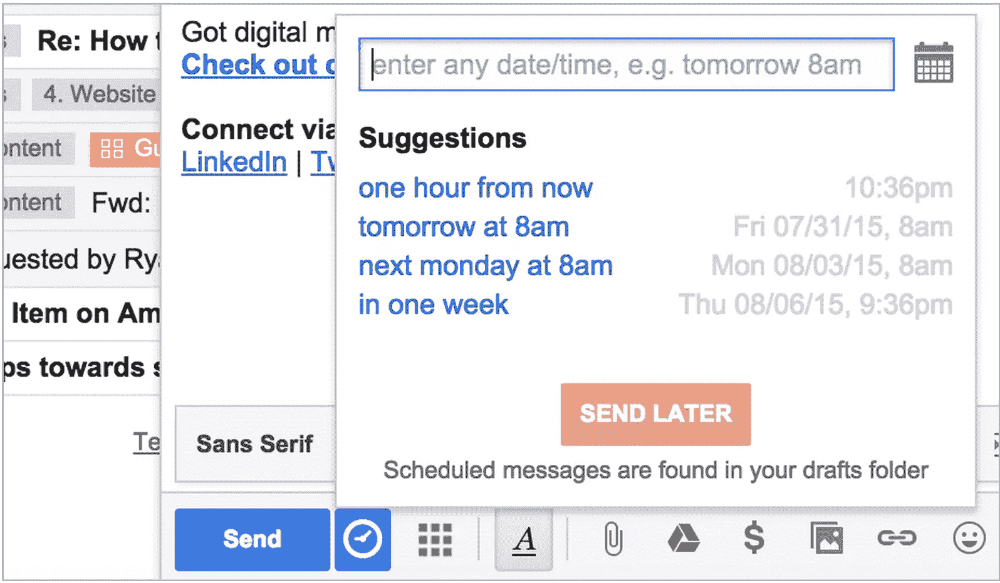

**轨迹视图和位置**。我不知道这怎么合法，但是这个插件可以跟踪你的邮件被打开的时间和地点。这是一个强大的功能来分割测试电子邮件标题，复制和设置后续序列。

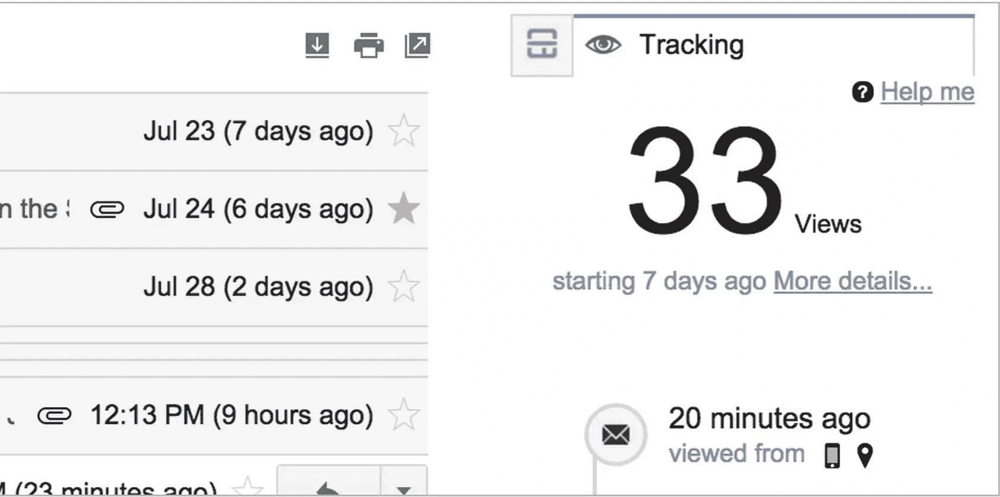

### 如何设置它

*   [阅读这篇 SitePoint 文章](https://www.sitepoint.com/managing-leads-clients-projects-with-streak/)
*   [阅读这篇 HongKiat 文章](http://www.hongkiat.com/blog/crm-gmail-streak/)

## **4。与他人分享您的电子邮件负载**

我和大约 10 名自由职业者一起为我的公司工作。他们中有一半人使用电子邮件处理日常事务:做公关宣传、推销内容和回复客户。

我喜欢从我的帐户做所有外联。通过这种方式，接受率提高了四倍，因为我们利用了我的名字和声誉。

Gmail 有一个功能，可以让你授予其他人**访问权限，而不用给他们你的密码**。

**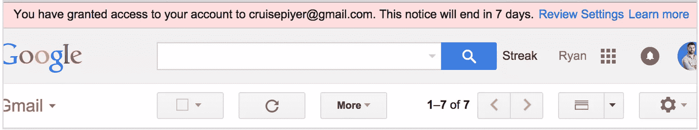
**

**注:这条建议归功于[大卫·亨特](http://noogalabs.com/)。**

### **如何设置:**

*   单击右上角的齿轮图标
*   选择设置
*   选择“帐户和导入”
*   找到“授权访问您的帐户”
*   添加他们的电子邮件
*   点击屏幕底部的“保存”

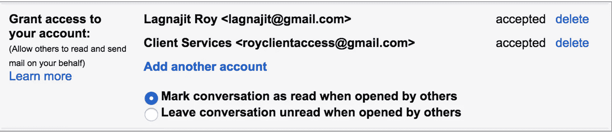

## **5。标准化你的外发邮件**

你提供的外包劳动力越多越好。

Gmail 的“预设回复”功能让我的团队可以在几分钟内发出数百封外联邮件，所有这些邮件都是基于我创建的模板。

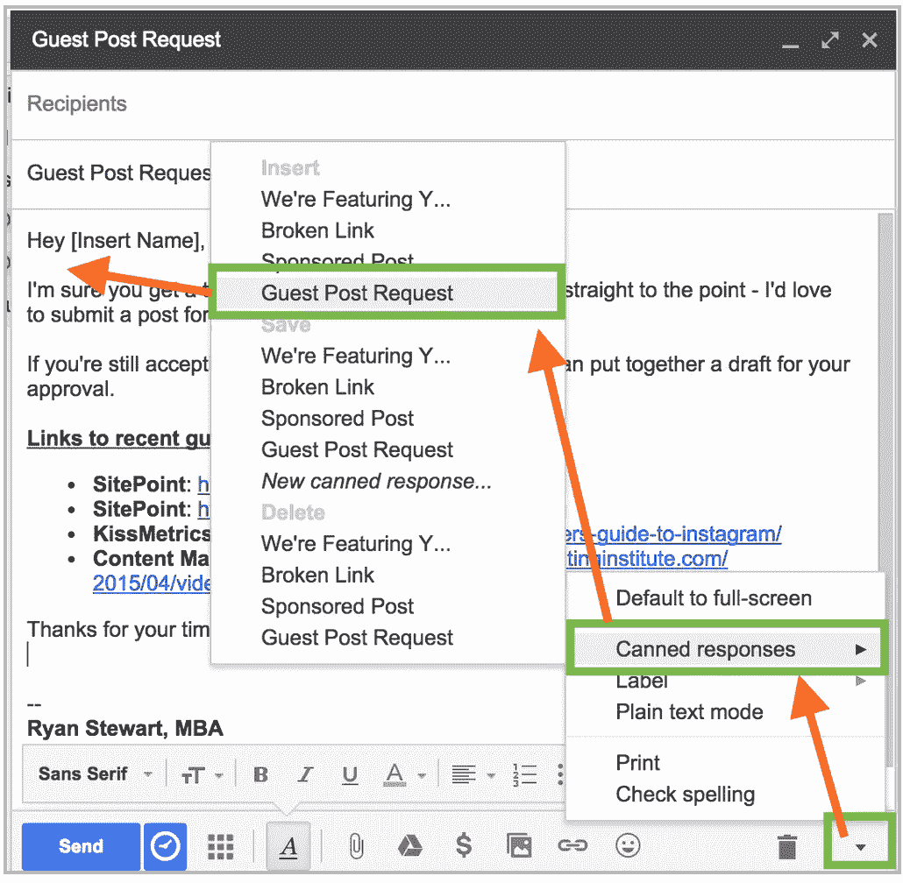

这确保没有拼写错误，正确的语法和完美的音高。

### **如何设置:**

*   单击右上角的齿轮图标
*   选择设置
*   单击“实验室”选项卡
*   找到“预设回复”，点击“启用”
*   点击屏幕底部的“保存”

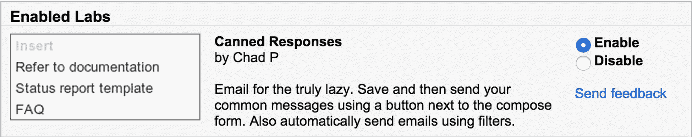

*   起草一封你想用作模板的电子邮件
*   点击邮件右下角的小三角形
*   选择“预设回复”
*   点击“保存”

## **6。永远不要忘记再次“回复所有人”**

我大学毕业后的第一份工作是在埃森哲咨询公司，我有幸为一个大混蛋工作。如果你忘记“全部回复”一封有很多收件人的邮件，他会抓狂的。

Gmail 有一个设置，将默认行为改为“回复所有人”——这样你就永远不会把重要的人物排除在邮件链之外。

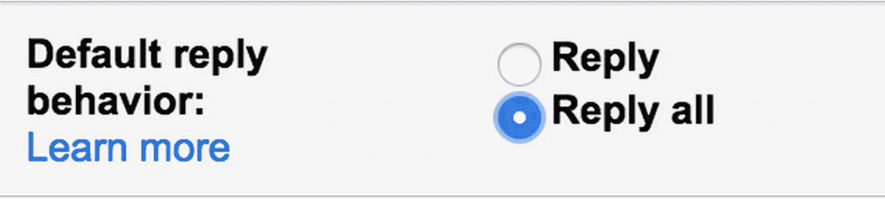

### **如何设置:**

*   单击右上角的齿轮图标
*   选择设置
*   选择“常规”
*   查找“默认回复行为”
*   选择“全部回复”
*   点击屏幕底部的“保存”

### 7 .**。通过任务列表**掌控您的游戏

这种电子邮件场景在你身上发生了多少次:

*   星期一:“嗨，Ryan，我们在[填空]方面有问题。你能帮我调查一下吗？”
*   星期五:“嗨，瑞恩，你有机会看一下吗？”

该死的。

我开始使用 Gmail 任务，这种情况少多了(嗯，反正少了)。

将电子邮件添加到任务中会创建一个待办事项列表，提醒您跟进并关注您需要做的事情。

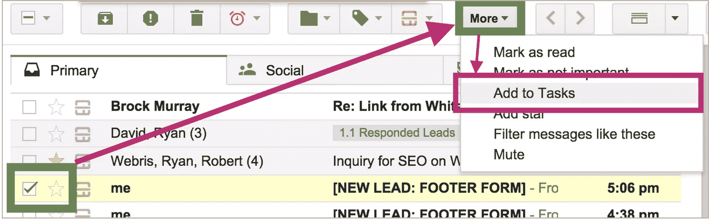

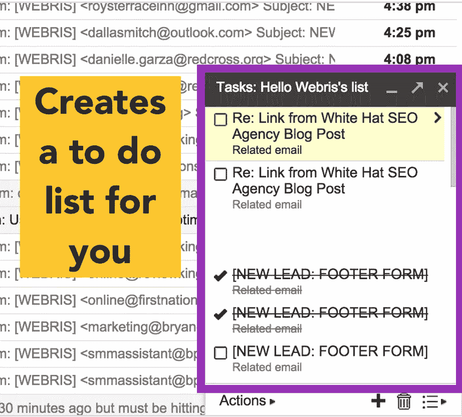

### **如何设置:**

*   选择您想要添加的电子邮件
*   选择“更多”
*   选择“添加到任务”

## **8。整理你的收件箱，保持有序**

文件夹是一个简单的功能，允许您将电子邮件分组到桶中。当你不能删除一封电子邮件，但又想清除收件箱中的杂物时，这是一个很好的功能。

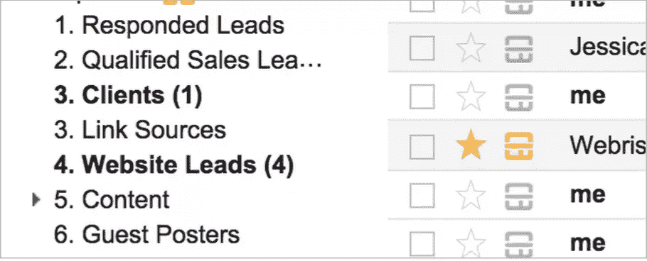

### **如何设置:**

*   点击齿轮图标并选择“设置”
*   点击“标签”
*   找到“标签”，点击“创建新标签”

你如何处理你的邮件取决于你自己，但我是这样做的:

*   在标签前使用数字——这样可以用数字组织它们。当你有一大堆文件夹时，找到你想要的就容易多了
*   使用子文件夹来进一步存储内容，并整理文件夹部分
*   只需选择电子邮件，单击文件夹图标，然后选择要将电子邮件移动到的文件夹

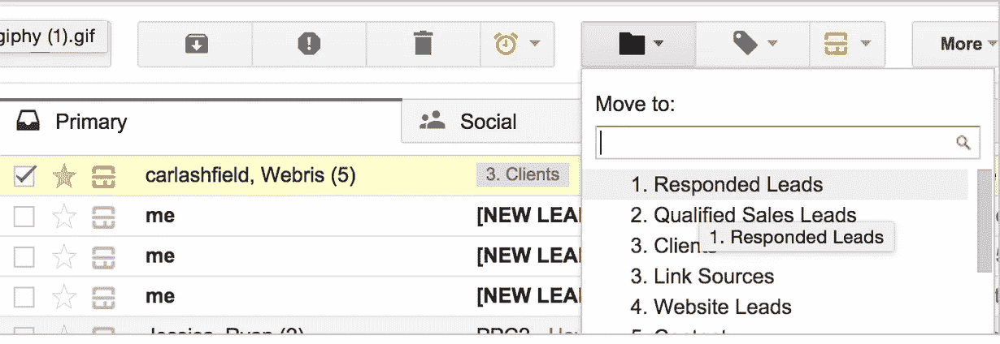

## **9。跟踪入站邮件，无需检查您的收件箱**

在任何时候，我都会在浏览器上打开 17 到 400 个标签。

当这种情况发生时，你看不到你的信箱里是否有未读邮件。

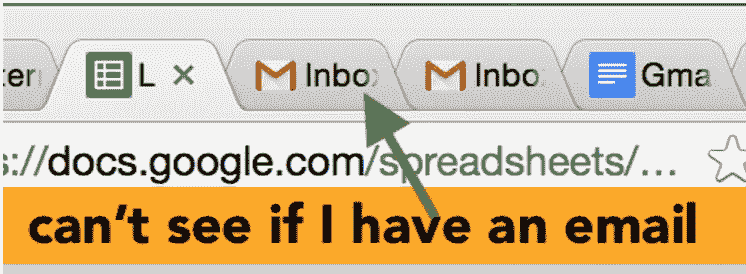

您可以启用浏览器选项卡来显示收件箱中的未读邮件。

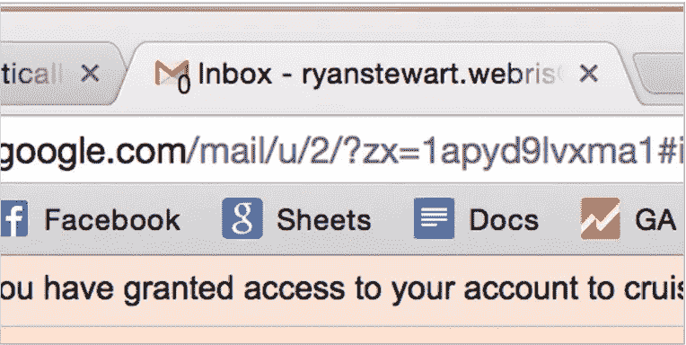

### **如何设置:**

*   单击右上角的齿轮图标
*   选择设置
*   单击“实验室”选项卡
*   找到“未读邮件图标”，点击“启用”
*   点击屏幕底部的“保存”

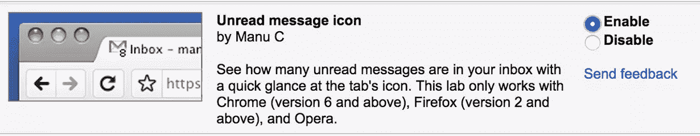

## **Gmail 可能不适合你……**

Gmail 并不是唯一拥有这些功能的电子邮件平台——雅虎在去年也取得了巨大的进步。

这非常适合我的公司，因为我们生活在其他谷歌产品中，如 Analytics、AdWords 和 Drive。

如果你对你的电子邮件提供商感到满意，看看有什么功能。他们应该有相似的方面，以帮助节省时间和头痛。

*我错过了什么吗？你最喜欢的 Gmail 黑客是什么？*

## 分享这篇文章