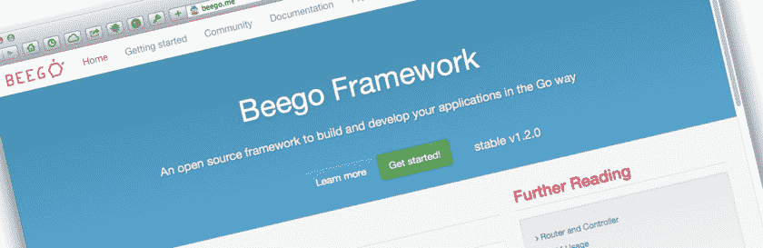
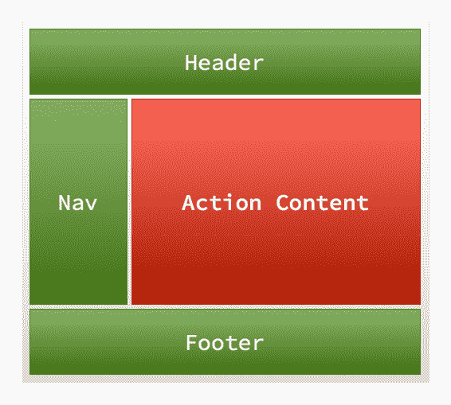

# Go:用 Beego 构建 Web 应用程序——第 2 部分

> 原文：<https://www.sitepoint.com/go-building-web-applications-beego-part-2/>



欢迎回到本系列的第 2 部分，在这里我们将快速了解用于 go 的 Beego web 开发框架。如果您错过了第 1 部分，我鼓励您阅读它，因为它为本系列奠定了基础。

在第 1 部分中，我们有了一个良好的开端，通过安装 Beego 和命令行工具 Bee 来理解和使用 Beego，创建一个基本项目，添加一个控制器动作，创建一个基本视图模板，添加一个定制路线，并最终学习了如何使用请求参数。

在第 2 部分中，我们将通过集成数据库，特别是与 SQLite3 集成，以及查看*模型*、*表单*和*验证*，来了解构建 web 应用程序的更多有趣方面。我希望你已经准备好了，因为这将是一个很好的旅程。

## 两步视图

您会注意到管理控制器中的许多功能，包括以下代码:

```
manage.Layout = "basic-layout.tpl"
manage.LayoutSections = make(map[string]string)
manage.LayoutSections["Header"] = "header.tpl"
manage.LayoutSections["Footer"] = "footer.tpl"
```

这样做的目的是建立一个[两步视图布局](http://martinfowler.com/eaaCatalog/twoStepView.html)。如果你不熟悉这个术语，它是一个总是显示的外部布局，比如*侧边栏*、*导航*、*页眉*和*页脚*以及根据正在执行的动作而变化的内部内容。



上面的图像说明了我的意思。绿色区域是外部的包装视图，红色区域是基于执行动作而变化的内容。

通过引用`Layout`和`LayoutSections`，我们能够指定外部布局视图模板、`basic-layout.tpl`和其他子模板，在我们的例子中是页眉和页脚，分别在`header.tpl`和`footer.tpl`中可用。

通过这样做，我们的动作模板生成的内容将被插入到包装视图模板中，通过指定`{{.LayoutContent}}`，页眉和页脚将分别在`{{.Header}}`和`{{.Footer}}`中可用。

## 模型

要添加数据库支持，我们需要做一些事情。首先，我们需要建立一些模型。模型基本上只是带有一些附加信息的结构。下面是模型文件，您可以在`models/models.go`中找到，我们将在应用程序的其余部分使用它。

```
package models

type Article struct {
    Id     int    `form:"-"`
    Name   string `form:"name,text,name:" valid:"MinSize(5);MaxSize(20)"`
    Client string `form:"client,text,client:"`
    Url    string `form:"url,text,url:"`
}

func (a *Article) TableName() string {
    return "articles"
}
```

你可以看到有一个模型，`Article`，它为一个非常简单的网站文章建模，包含四个属性: *Id* 、*名称*、*客户端*和 *Url* 。您会注意到，对于每个属性，都有额外的数据，提到表单的*和有效的*。

这是一种非常简单的方法，可以使用这个模型来处理表单生成和表单验证。现在让我们逐一研究这四个属性，并解释每个属性的作用。

```
Id int `form:"-"`
```

在我们的数据库中，id 是一个自动递增的字段。这很好地工作，因为如果它是一个新记录，应该为我们创建值，只有当*删除*、*更新*或*搜索*记录时才提供值。所以通过指定`form:"-"`，我们所说的是 Id 不是必需的。

```
Name   string `form:"name,text,name:" valid:"MinSize(5);MaxSize(20)"`
```

这里我们有一个稍微复杂一点的例子，所以让我们从`"name,text,name:"`开始分解它。这意味着当表单被解析时，我们很快就会看到:

*   名为`name`的表单域中的值将用
*   该字段将是一个文本字段
*   标签将被设置为“名称:”

现在我们来看看`valid:"MinSize(5);MaxSize(20)"`。这指定了两个验证规则:`MinSize`和`MaxSize`。实际上，提供的值必须至少有 5 个字符，但不能超过 20 个字符。

还有[许多其他你可以使用的验证规则](http://beego.me/docs/mvc/controller/validation.md)，包括*范围*、*电子邮件*、 *IP* 、*移动*、 *Base64* 和*电话*。

```
Client string `form:"client,text,client:"`
Url    string `form:"url,text,url:"`
```

在最后两个例子中，客户端将从表单字段`client`中取值，作为文本字段并带有标签`client:`，Url 将从表单字段`url`中取值，作为文本字段并带有标签`url:`。现在来看一下`TableName`功能。

我添加它的原因是因为文章表名与结构名不匹配。而是叫`articles`。如果这两个是一样的，那么它会被 [Beego 的 ORM](http://beego.me/docs/mvc/model/orm.md) 自动找到。

然而，我故意修改了它，因为我想显示当您的结构和表名不同时需要什么。既然我们已经讨论了表模式，我应该包括它。

```
CREATE TABLE "articles" (
    "id" integer NOT NULL PRIMARY KEY AUTOINCREMENT,
    "name" varchar(200) NOT NULL,
    "client" varchar(100),
    "url" varchar(400) DEFAULT NULL,
    "notes" text,
    UNIQUE (name)
);
```

## 将模型集成到应用程序中

既然我们已经设置和配置了模型以及附带的表单和验证信息，我们需要在应用程序中使用它。在`main.go`中，我们需要添加另外三个导入语句，如下所示。

```
"github.com/astaxie/beego/orm"
_ "github.com/mattn/go-sqlite3"
models "sitepointgoapp/models"
```

第一个导入 Beego 的 ORM 库，第二个提供对 SQLite3 的支持，这是必需的，因为我们使用的是 SQLite3 数据库。第三个导入我们刚刚创建的模型，给它们一个别名`models`。

```
func init() {
    orm.RegisterDriver("sqlite", orm.DR_Sqlite)
    orm.RegisterDataBase("default", "sqlite3", "database/orm_test.db")
    orm.RegisterModel(new(models.Article))
}
```

我们需要采取的最后一步是注册我们将在应用程序中使用的*驱动程序*、*数据库*和*模型*。我们用上面的三个语句来做这件事。我们指出我们正在使用 SQLite 驱动程序，并将其设置为默认的数据库连接，连接到位于`database/orm_test.db`中的测试数据库。

最后，我们注册将要使用的模型，在我们的例子中，只是`models.Article`。

## CRUD 操作

完成这些后，我们现在将数据库支持集成到了我们的应用程序中。让我们从两个更简单的 CRUD 操作开始，**删除**和**更新**。这两者都不使用表单，因为我想让这一节简单一些，更多地关注 orm 代码，而不是表单和验证代码。我们将在`Add`行动中解决这个问题。

### 删除记录

我们将设置一个删除操作，根据参数`id`的值，尝试从数据库中删除一篇文章。在`routers/routers.go`中，在 init 函数中添加以下路线:

```
beego.Router("/manage/delete/:id([0-9]+)", &controllers.ManageController{}, "*:Delete")
```

然后将下面的代码添加到`controllers/manage.go`中。让我们慢慢来。

```
func (manage *ManageController) Delete() {
    // convert the string value to an int
    articleId, _ := strconv.Atoi(manage.Ctx.Input.Param(":id"))
```

在这里，我们试图检索`id`参数，并使用`strconv`包中的`Atoi`方法将它从字符串转换成 int。这是一个简单的例子，所以我跳过了任何可能抛出的错误，并将解析后的值存储在`articleId`中。

```
o := orm.NewOrm()
  o.Using("default")
  article := models.Article{}
```

接下来，我们初始化一个新的 ORM 实例，并指定我们使用的是默认的数据库。我们可以设置任意数量的数据库连接，比如一个用于读取，一个用于写入等等。最后，我们创建了一个新的、空的文章模型实例。

```
// Check if the article exists first
    if exist := o.QueryTable(article.TableName()).Filter("Id", articleId).Exist(); exist {
        if num, err := o.Delete(&models.Article{Id: articleId}); err == nil {
	    beego.Info("Record Deleted. ", num)
	} else {
	    beego.Error("Record couldn't be deleted. Reason: ", err)
	}
    } else {
	beego.Info("Record Doesn't exist.")
    }
}
```

现在来看函数的核心。首先，我们查询文章表，检查 id 值与 Id 参数匹配的文章是否存在。如果是的话，我们就调用 ORM 的`Delete`方法，传入一个只设置了`Id`属性的新文章对象。

如果没有返回错误，那么文章被删除，`beego.Info`被调用[来记录使用`Info`方法删除了](http://beego.me/docs/mvc/controller/logs.md)的记录。如果它不能执行删除操作，那么我们调用`Error`，传入`err`对象，这将显示记录不能被删除的原因。

### 更新记录

那是删除一条记录，现在让我们更新一条；这一次我们将使用 flash messenger 来获得更多的效果。

```
func (manage *ManageController) Update() {
    o := orm.NewOrm()
    o.Using("default")
    flash := beego.NewFlash()
```

和以前一样，我们初始化一个 ORM 变量并指定默认数据库。然后我们获得 Beego Flash 对象的句柄，它可以跨请求存储消息。

```
// convert the string value to an int
    if articleId, err := strconv.Atoi(manage.Ctx.Input.Param(":id")); err == nil {
	article := models.Article{Id: articleId}
```

这一次我们试图检索参数`id`并初始化一个新的文章模型(如果它可用的话)。

```
if o.Read(&article) == nil {
	    article.Client = "Sitepoint"
	    article.Url = "http://www.google.com"
	    if num, err := o.Update(&article); err == nil 
            {
		flash.Notice("Record Was Updated.")
		flash.Store(&manage.Controller)
		beego.Info("Record Was Updated. ", num)
	    }
```

接下来，我们调用`Read`方法，传入 Article 对象，如果有一条记录与`Article.Id`中指定的 id 相匹配，该对象将尝试从数据库中加载剩余的文章属性。

假设它是可用的，我们在对象上设置`Client`和`Url`属性，并将其传递给`Update`方法，该方法将更新数据库中的记录。

假设没有发生错误，那么我们调用 Flash 对象上的`Notice`函数，传递一个简单的消息，然后调用 Store 来保存信息。

```
} else {
		flash.Notice("Record Was NOT Updated.")
		flash.Store(&manage.Controller)
		beego.Error("Couldn't find article matching id: ", articleId)
	    }
	} else {
		flash.Notice("Record Was NOT Updated.")
		flash.Store(&manage.Controller)
		beego.Error("Couldn't convert id from a string to a number. ", err)
	}
```

如果发生了错误，比如无法更新记录或者我们无法将 id 参数转换为整数，我们会在 flash 消息和日志消息中记录下来。

```
// redirect afterwards
	manage.Redirect("/manage/view", 302)
}
```

最后，我们调用`Redirect`方法，传入我们要重定向到的 url 和一个 HTTP 状态代码。现在发生的是，不管我们是否能够更新记录，我们都将被重定向到`/manage/view`，稍后我们将看到它的定义。

### 查看所有记录

视图功能的目的是双重的；首先，它显示文章表中的所有现有文章，并显示在更新中设置的任何即时消息。这样，我们就知道该操作是成功还是失败。

```
func (manage *ManageController) View() {
    flash := beego.ReadFromRequest(&manage.Controller)

    if ok := flash.Data["error"]; ok != "" {
	// Display error messages
	manage.Data["errors"] = ok
    }

    if ok := flash.Data["notice"]; ok != "" {
	// Display error messages
	manage.Data["notices"] = ok
    }
```

首先，我们初始化一个变量`flash`，通过读取请求并寻找两个属性:`error`和`notice`。这些与对`flash.Notice`和`flash.Error`的调用相关。如果设置了信息，我们在数据属性中设置它，这样我们就可以在模板中访问它。

```
o := orm.NewOrm()
    o.Using("default")

    var articles []*models.Article
    num, err := o.QueryTable("articles").All(&articles)

    if err != orm.ErrNoRows && num > 0 {
	manage.Data["records"] = articles
    }
}
```

与最后两个例子一样，我们然后建立一个到默认数据库的连接，并在`articles`中初始化一部分文章模型。然后，我们调用 ORM 的`QueryTable`方法，指定表名，然后对其调用`All`,传入文章片段，该片段将加载结果，如果结果可用的话。

假设没有出错，我们有可用的记录，并将它们存储在模板变量 records 中。

### 插入记录

现在让我们看看在 Add 动作中插入记录，除了 ORM 交互之外，还包括表单和验证。

```
func (manage *ManageController) Add() {
    o := orm.NewOrm()
    o.Using("default")
    article := models.Article{}
```

我将跳过这一点，因为我们已经讨论过了。

```
if err := manage.ParseForm(&article); err != nil {
	beego.Error("Couldn't parse the form. Reason: ", err)
    } else {
	manage.Data["Articles"] = article
```

这里，我们调用`ParseForm`方法，传入 article 对象。假设没有抛出错误，然后我们将 article 设置为模板变量，这将帮助我们呈现一个表单，我们很快就会看到。

```
if manage.Ctx.Input.Method() == "POST" {
	valid := validation.Validation{}
	isValid, _ := valid.Valid(article)
	if !isValid {
	    manage.Data["Errors"] = valid.ErrorsMap
	    beego.Error("Form didn't validate.")
	} else {
```

这里，我们检查使用的方法是否是 POST。如果是，那么我们实例化一个新的验证对象，并将 article 对象传递给 Valid 方法，根据模型上的规则检查 POST 数据是否有效。

如果提供的数据无效，我们会将任何验证错误(在`valid.ErrorsMap`中可用)存储在模板变量`Errors`中，并记录验证失败。否则，我们尝试插入文章。如果有或没有错误，我们就记录下来。

```
id, err := o.Insert(&article)
	if err == nil {
	    msg := fmt.Sprintf("Article inserted with id:", id)
	    beego.Debug(msg)
	} else {
	    msg := fmt.Sprintf("Couldn't insert new article. Reason: ", err)
	beego.Debug(msg)
			}
		}
	}
}
```

## 包扎

我们在 Beego 演练的最后。由于框架中有如此多的可用特性，所以没有足够的空间将所有的内容放入一个两部分的系列中。

此外，今天教程中的一些例子可能看起来有点奇怪。这样做的原因不是为了良好的编码实践，而是为了以一种半真实的方式突出功能。如果你觉得这篇作文有点奇怪，那就是原因。也就是说，我希望您喜欢这篇简短的 Beego 介绍，并尝试一下这个库。考虑到目前为止我用它的时间，我真的很喜欢它，并计划继续使用它。

如果您有任何问题，请务必查看在线文档或在帖子上添加评论。别忘了，Github 库中也有该代码的[,所以请查看、摆弄和试验它。](https://github.com/settermjd/Learning-Beego)

## 分享这篇文章