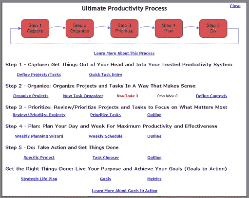
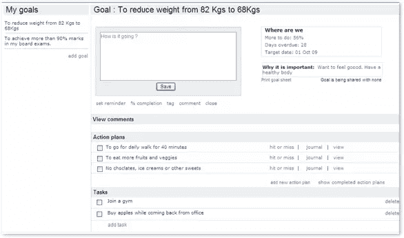
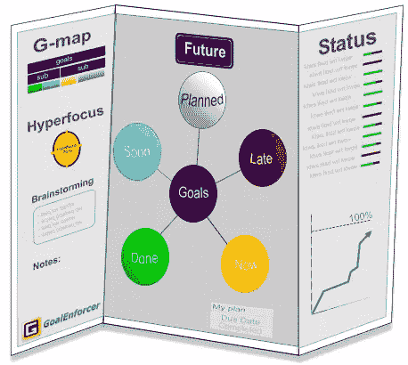
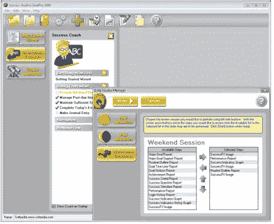
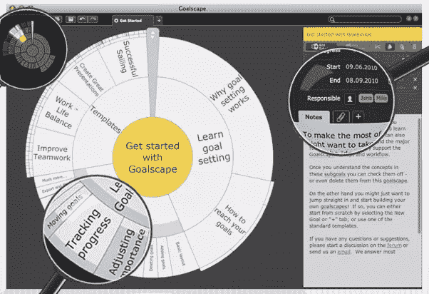
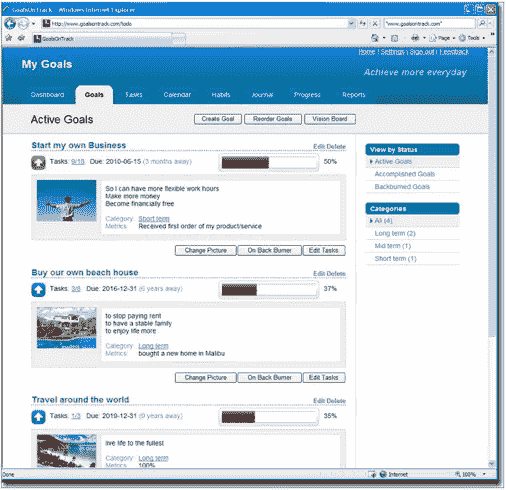
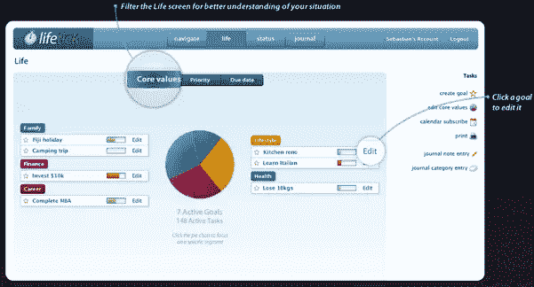
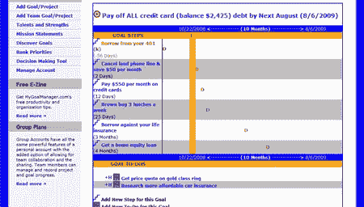

# 让你保持动力的 10 个目标设定和追踪工具

> 原文：<https://www.sitepoint.com/goal-setting-tracking-tools/>

昨天，我提供了一些进入[目标设定心态](https://www.sitepoint.com/how-to-gear-up-for-goal-setting-season/)的小技巧，包括争取支持的重要性。你的支持可以是教练、同事、朋友，甚至是目标设定和跟踪工具。如果你正在寻找一个目标跟踪工具来帮助你保持责任感，这篇文章为你提供了几个选择。

## [实现策划者](http://www.effexis.com/achieve/planner.htm)

Achieve Planner 是一款 Windows 时间管理和生活规划软件，可以帮助您变得更有条理、更专注、更好地利用时间。你可以处理多个项目和目标而不会感到不知所措，规划你的时间以获得最大的效率，当你朝着目标努力时，你会感到更加专注和富有成效。

## [宣布-它](http://www.declare-it.com/) 

声明——这是一个在线应用程序，可以帮助你轻松地创建、跟踪和实现你的目标。它专注于七个不同的成就领域，帮助你养成更好的习惯，实现你的目标。它包括一个内置的问责制度。

## [获得守门](http://www.getgoaling.com) 

 
Get Goaling 是一款帮助你设定目标、计划行动、取得进步的在线工具。使用附带的目标设定工具和跟踪选项，设定目标并跟踪其完成非常简单。

## [守门员](http://www.goalenforcer.com/)

 
GoalEnforcer 是一款可视化的目标规划软件，可以帮助你规划、集中注意力、完成目标。您可以通过拖放虚拟对象来设置和重新排列目标。它包括用于目标跟踪的颜色编码、状态报告和进度图表功能。

## [GoalPro](http://www.success.net/goalpro/)

GoalPro 是一款目标设定软件，可以让你创建、分类和简化目标。它包括行动流程、绩效跟踪、报告和每日日志，帮助您保持正轨。

## [球门景观](http://www.goalscape.com/)

Goalscape 目标设定软件提供独特的视觉显示，帮助您识别、开发和交流任何复杂挑战的关键要素，包括整体结构、相对重要性和进度跟踪。这个工具可以让你将挑战分解成可管理的部分，并跟踪你的进展。

## [目标跟踪](http://www.goalsontrack.com/)

一个在线目标设定工具，帮助您创建 SMART 目标、跟踪进度、管理以目标为导向的任务、计划日常活动、记录日志、查看报告等。

## [生命周期](http://lifetick.com/)

Lifetick 是一款基于网络的软件，通过直观且易于理解的流程将目标设定和成就结合在一起。该工具可帮助您在旅途中获得洞察力、掌控任务、衡量绩效并管理您的目标。

## [MyGoalManager.com](http://www.mygoalmanager.com/)

MyGoalManager.com 是一个目标规划和组织工具，给你一切你需要的是你最有组织性和生产力，即使在移动。该系统可以帮助你保持更好的组织，制定详细的行动计划，优先考虑等等。

## [科维社区](https://www.stephencovey.com/goal-setting.php)

Covey 社区是一个建立在 Stephen Covey 的高效人士的 7 个习惯之上的在线社区。这是一个支持系统，唯一的目的是帮助人们实现他们生活中最重要的事情。功能包括目标向导、目标设定程序、每日进度跟踪和日志。

## 分享这篇文章