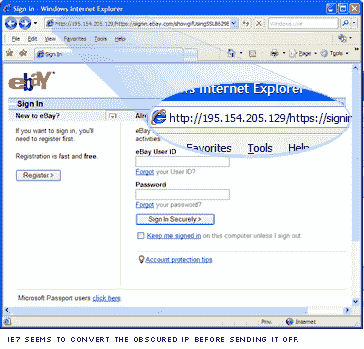
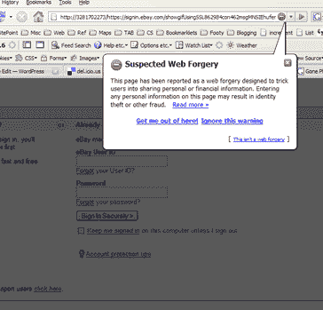

# 消失的网络钓鱼

> 原文：<https://www.sitepoint.com/gone-phishing/>

虽然这不是严格意义上的 web 开发主题，但它至少是关于域工作方式的一个有趣的怪癖，许多人可能不知道——我们当然直到今天才知道，所以它可能值得引起注意。

今天，我收到了另一个易贝钓鱼诈骗。这本身并不新鲜——就像我去年收到的几十封信一样——但这封有点不同。一般来说，嵌入在网络钓鱼邮件中的网址很明显是不可靠的，因为它们显然是以 IP 号码开头的。然而，正如你在上面看到的，这个 URL 看起来比大多数更合理。

我在这里列出了真正的 IP 地址以供参考，但我已经禁用了这些链接，因为它们显然是由可疑人物控制的，所以我们不建议你访问它们。

令我惊讶的是‘http**:**//3281702273’部分是一个可行的 IP。

我个人以前从未见过这种情况，但由于我不是 DNS 专家，所以这没什么大不了的。然而，在办公室里转了一圈之后，我发现似乎也没有其他人看到过类似的东西。

凯文做了一点试验和错误，并找出它是如何工作的。数字“3281702273”是十六进制数字“c 39 ACD 81”([试试这里](http://www.squarebox.co.uk/hcalc.html?3281702273)))的十进制转换，反过来，可以转换为 IP 地址。
C3 = 195
9a = 154
CD = 205
81 = 129

所以理论上‘http**:**//3281702273’和‘http**:**//195 . 154 . 205 . 129’是一回事。

有趣的是，对于这些模糊的 IP 地址，IE7 似乎比 Firefox 或 IE6 做得更好，在发送之前自动将其转换为正常的 IP 地址。页面显示正常，但 URL 显示的是标准 IP。

毫无疑问，大多数系统管理员现在都在发帖抱怨，但我怀疑许多相对精通技术的人(以及他们的朋友和家人)可能比大多数人更容易受到这种骗局的微妙之处的影响。

希望现在少一些。

很高兴看到，从今天早上开始，Firefox 已经明确报告该网址为“疑似网页伪造”。网络服务万岁。

## 分享这篇文章