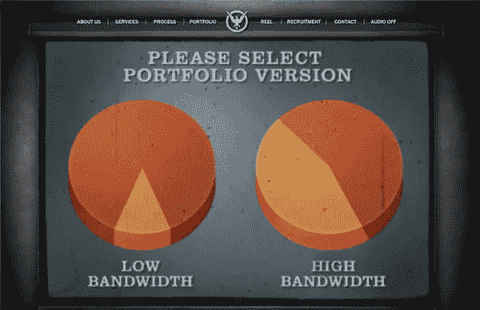
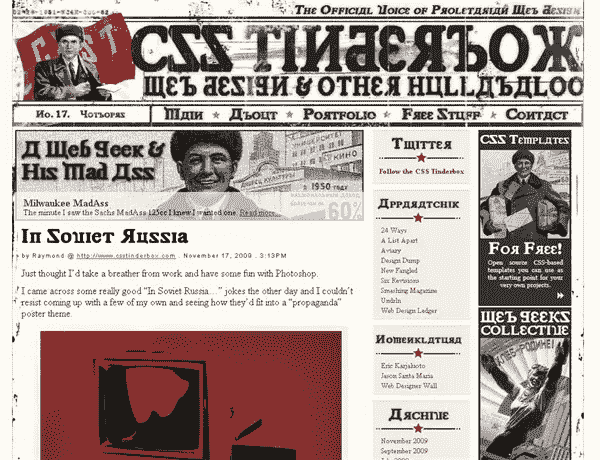
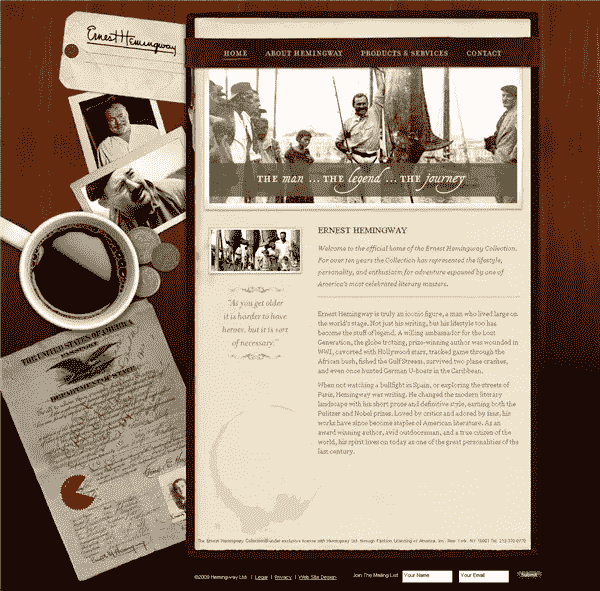
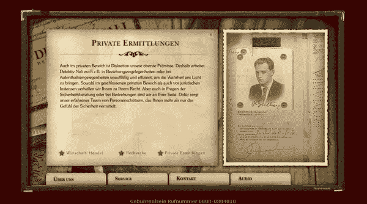
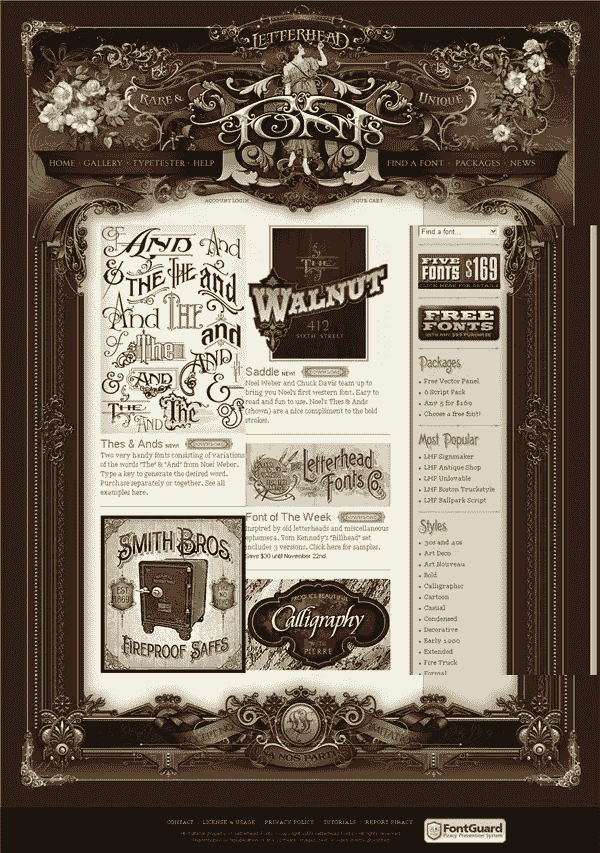
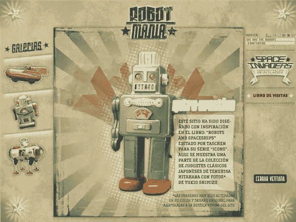
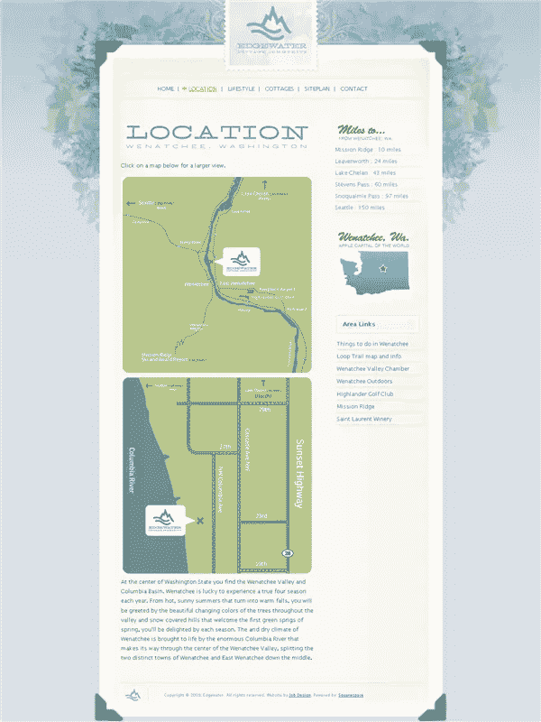
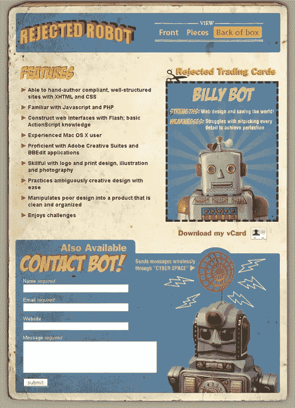
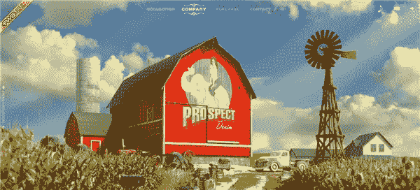
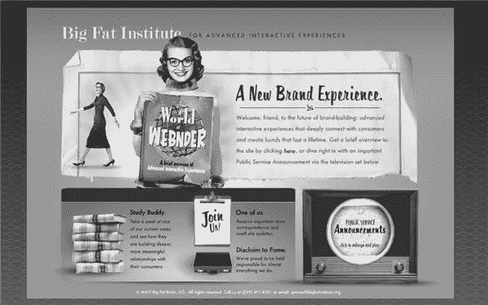

# 走向复古:10 个带着往昔气息的华丽网站

> 原文：<https://www.sitepoint.com/gone-retro-10-gorgeous-websites-with-a-touch-of-yesteryear/>

复古风格在设计的各个方面都很流行。我喜欢看着它们，看设计师如何将传达一个早已逝去的时代的外观和感觉结合在一起。看看时尚、广告、印刷品甚至汽车。设计师重温过去，掠夺好的，坏的，有时甚至是丑陋的元素，用于新的设计中。网页设计师当然也不例外，有很多精彩的网站使用复古风格。

那么是什么让一个网站变得复古呢？
属于复古类别的网站不一定代表任何一个特定时期。一个字典对复古的定义是“一种怀旧的时尚”，因此它有很大的解释空间。在网上，复古网站可以通过所使用的插图或照片类型、字体和调色板来区分。

**摄影和插图**

对于许多复古网站来说，所使用的插图对整体外观和感觉有很大的影响。看一看 CSS Tinderbox 网站(页面下方的图片),它使用独特的苏联时代风格的绘画来实现它的外观。该网站也被弄脏，使其看起来很旧。同样，欧内斯特·海明威网站上的摄影作品大多是年轻时的海明威。这些照片看起来发黄，给人一种另一个时代的感觉。

就像网页和印刷设计一样，字体的选择是传达外观和感觉的一个重要因素。对于一些网站的标志和标题中的复古排版，有一些专门从事复古排版的专业字体铸造厂。我喜欢[信笺](http://www.letterheadfonts.com/)(见下面他们的网站)[字体餐厅](http://www.Fontdiner.com)和[字体馆](http://www.fontoville.com/)，因为它们的字体很酷。

**颜色**

许多复古风格的网站都有柔和的颜色，并加入一些灰尘或垃圾来唤起年龄。颜色倾向于土色，暗示着颜色在过去可能更有活力，但现在已经过时了。在最成功的复古设计中，适当的调色板与其他元素一起工作，给人一种早期的感觉。

话不多说，这里有十个展示独特复古外观的网站。我选择了这些，因为我认为它们代表了从上到下的复古设计。这里没有网站只是有一个复古的标志，但没有其他东西将它们与另一个时代联系起来。他们始终相当一致。

世界统治设计集团巧妙地运用了老式视频、画外音和 20 世纪 40 年代的欢快曲调。

CSS 火绒箱很好地处理了苏联风格的图形和字体。

欧内斯特·海明威系列使用旧照片、纸质物品和柔和的旧纸色来传达某个时代的感觉。

李娜侦探展示了一个旧皮箱，里面有描绘亚瑟·柯南·道尔时代的古老插图、照片和印刷装饰。夏洛克·福尔摩斯似乎对这一设计产生了重大影响。

信头字体最近重新设计了他们的网站，展示了一些漂亮的字体。新设计有一种装饰艺术的感觉。

《机器人狂热》已经在网络上出现多年，并在问世时赢得了许多奖项。它有一种非常酷的复古氛围。

出售梦想。水边小屋社区有一种 20 世纪 50 年代出售现代住宅区的感觉。

被拒绝的机器人是威廉·坦普林的作品集网站，它的玩具机器人盒子设计令人喜爱。

[媒体热潮](http://www.mediaboom.com/)(本身是一个复古网站)的前景牛仔也是一个奖项的获得者，并拥有精彩的插图和 flash 作品。

最后， [Big Fat Institute](http://www.bigfatinstitute.org/bfi/index_flash.html) 最近更新了他们的网站，但这是他们旧网站的链接，这是一个辉煌的复古设计的伟大例子，使用视频和排版来创建一个真实的 50 年代的网站。

所以你有它。这种风格并不适合每一个网站，但是做得好的话会非常有效。

你觉得这些网站怎么样？你还遇到过哪些不错的复古网站？

## 分享这篇文章