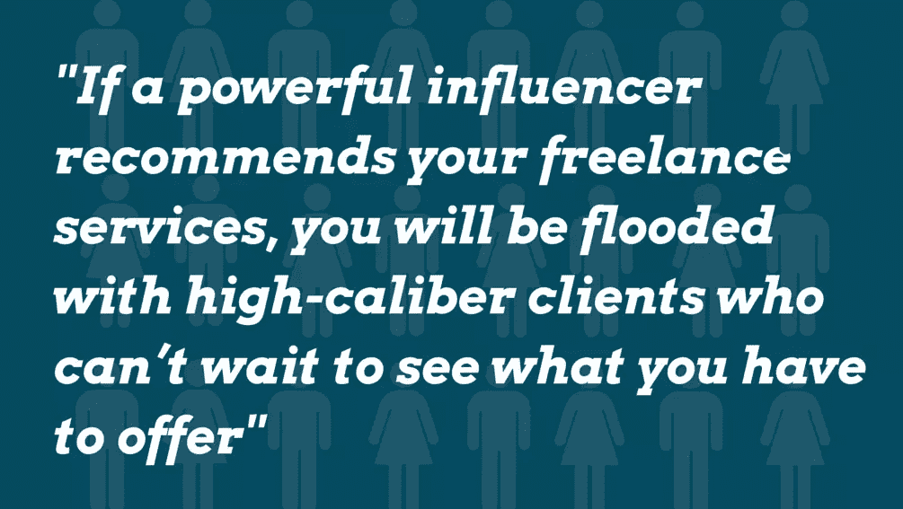
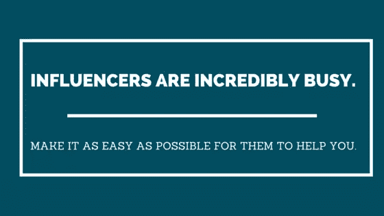

# 如何利用影响者获得好客户

> 原文：<https://www.sitepoint.com/good-clients-utilize-influencers/>

试图找到自由职业客户可能会很困难。甚至令人困惑。你在哪里找到他们的？一旦你找到了他们，你如何与其他自由职业者竞争呢？

寻找客户也很耗时。你可以很容易地花几个小时回复投标，打电话或发电子邮件，寻找残羹剩饭。一天结束时，你会把时间花在回报很低的高强度活动上。

那么，你如何找到渴望你服务的高素质客户呢？更好的是，你如何将流程设置到位，以便*他们*找到*你*而不是？

## 获得高质量客户的最有效方法

高素质的客户是那些愿意为你的服务支付高价的客户。他们一次又一次地回来，想要更多你的作品。他们告诉他们的朋友你有多棒。他们是你的冠军。

他们是[问题客户](https://www.sitepoint.com/12-signs-of-problem-clients/)的对立面，挑战你的支付结构的客户，他们坚持那些[在项目范围之外](https://www.sitepoint.com/stop-the-slippery-slope-of-scope-creep/)的额外的、耗时的变更。

这些客户让你的时间变得有价值，让你的生意蒸蒸日上。

那么如何找到这种客户呢？

实际上有点绕弯。

首先，你会发现有影响力的人，他们拥有很高的社会影响力。他们有大量值得信赖的顾问和朋友。他们拥有丰富的专业知识、知识和权威——当他们发言时，人们会倾听。他们接受了他们的建议。

有影响力的人不是你的目标客户，但你可以打赌，他们知道很多人是你的目标客户。

如果一个有影响力的人推荐你的自由职业服务，你将会被那些迫不及待想知道你能提供什么的高素质客户所淹没。

为了引起影响者的注意，你需要不断地建立令人难忘的互动。你积极培养真实的关系。一旦你表现出帮助他人的真诚愿望(以及提供卓越价值的能力)，你就能让有影响力的人尽可能容易地推荐需要你帮助的客户。

听起来吓人还是外国的？不是的。我会带你走一遍。

让我们从你如何找到有影响力的人开始，然后从那里继续。

## 如何找到能给你发送客户介绍和推荐的有影响力的人

你知道你理想中的客户是什么样的吗？如果你必须定义他们的参数，弄清楚他们到底是谁，他们做什么，他们在哪里闲逛——你能做到吗？

这是很重要的一步，因为你越明确你想和谁一起工作，你的推荐和介绍就越好。

首先，请查看这篇关于目标市场的文章。

一旦你能描述出你的理想客户，就走出去研究他们。尽可能多地了解他们在网上闲逛的地方。去那些网站，那些论坛，社交平台。听听他们在说什么。

看看他们在 Twitter 上关注谁，转发谁，喜欢谁。他们与谁互动。寻找那些被多个理想客户追随的人。这些是你想要联系的影响者。

通过与这些人联系，你将打开一个高质量线索和网络机会的新世界。更具体地说——你将为你的企业找到一条生命线。

## 如何与有影响力的人联系并引起他们的注意

与影响者联系的最佳方式是提供价值。要有用。

这将使你与那些纯粹出于自私的原因试图引起他们注意的人区别开来。

增加价值的一个好方法是在社交媒体上关注他们。如果你的影响者在 Twitter 上闲逛，[创建一个你用影响者填充的列表](https://support.twitter.com/articles/76460)(保密)。然后通过转发、添加评论和参与，在这个特定的信息流中活跃起来。

如果他们在脸书，关注他们或者喜欢他们的页面。添加吸引人的评论，而不是垃圾评论。

您也可以访问影响者博客。订阅他们的时事通讯，如果他们有的话。当你收到邮件时，点击回复，让他们知道你的想法。给出你喜欢和不喜欢的反馈。如果他们在他们的博客文章中提供建议，采取 ii。然后回来评论这个帖子(或者直接给这个人发邮件)，让他们知道你得到的结果。

这些都是创造价值和引起别人注意的神奇方法，而不会给人留下垃圾邮件、虚假或恶心的印象。

如果你在想“我不可能做到！”，听我说完。

我来分享一些个人的东西。我是一个绝对的、完全的内向者。在[圆盘评估](https://www.discprofile.com/what-is-disc/overview/)中，我在衡量自己与他人沟通能力的部分得到了 3%的分数。不开玩笑。

尽管我的个性完全缺乏天生的吸引力、说服力、沉着或热情，但我已经与那些推荐了优秀客户的大人物建立了关系。事实上，我大约 90%的自由职业都是通过影响者的推荐。

所以就算你怕你做不到，你*也能*。

慢慢开始。摒弃你可能有的任何假设——“他们会认为我是个骗子！”或者“他们不会认为我值得他们花时间”都是常见的。事实上，影响者是非常忙碌的人。他们对你的了解还不足以判断你是否是一个骗子或者是否值得他们花费时间——但是如果你尽力为他们提供一致的、真实的价值，他们会注意到的。

这将引导我们进入下一部分。

## 如何始终如一地建立难忘的互动和培养真实的关系

一旦你找到了你的最有影响力的人，并开始引起他们的注意，你就不想失去吸引力并被遗忘。

持续传递价值并保持领先的一个好方法是建立系统。以下是一些想法:

*   找到影响者可能感兴趣的文章列表。使用电子邮件插件，如 [Yesware](http://www.yesware.com/) 或 [Boomerang](http://www.boomeranggmail.com/) 来安排在几周内发送电子邮件。
*   如果一个有影响力的人有一个重要的事件即将发生，比如他们支持的一个演讲或事业，再次使用 Yesware 或 Boomerang(或者如果你喜欢 Twitter，使用 [Tweetdeck](https://tweetdeck.twitter.com/) )发送一个简短的带有热情祝愿的信息。
*   每天早上留出 30 分钟，专门用来寻找新的有影响力的人，并与你现有的名单培养关系。

通过不断地传递价值，而不是简单地立即寻求帮助，你将开始与欣赏你贡献的人建立一种真实的关系。

## 如何让有影响力的人通过介绍和推荐高素质的客户来帮助你

到目前为止，你已经花了很多时间来培养真实的关系。你付出了无数的价值。你把自己定位为一个可靠的、有知识的人，一个给予者而不是索取者。

有影响力的人非常忙。让他们尽可能容易地帮助你。

因为你已经非常具体地了解了你的理想客户，你应该能够写下一个快速的介绍来描述这个客户。

用 1-2 句话来写。例如，“我与高端餐馆老板合作，他们希望通过提供在线点餐来增加收入。我帮助他们建立后台系统，让客户能够轻松高效地在线下单”。

做完这个练习后，把它放在一边。你一会儿就会用到它。

首先，直接联系你的影响者，解释你的情况。

例如，也许你是自由职业的新手，想要你的第一个客户。或者你已经做了一段时间的自由职业者，正在寻找新的客户。问问他们是否愿意帮助你。让他们知道这不会占用他们太多时间，并且你会让他们尽可能地轻松。

一旦他们同意，把你理想的客户描述发给他们。不想马上发的原因是不想显得放肆。你想要他们的认同和好感。

如果可能的话，提前做些调查，找出那些在他们网络中的客户。特别要求介绍给那些客户。这将使你的影响者更容易帮助你。

通过尊重和感激对待这些互动(不管他们是否选择帮助你)，你将在获得高质量的客户介绍和推荐方面处于有利地位。

## 现在轮到你了

这是你的家庭作业。坐下来，真正定义你的理想客户。尽可能具体。

接下来，开始研究他们，找到他们的影响者。他们引用的人，他们关注并转发——这些影响者。

之后，通过提供一致的、有价值的互动，开始引起那些影响者的注意。

一旦你证明了自己是一个可靠的、知识渊博的给予者，就伸出手去，向他们寻求介绍或推荐。让他们尽可能容易地帮助你。

那之后呢？不断提供价值！发送有用的文章，提供反馈并参与其中。你很快就会发现，你自己已经成为了一个有影响力的人。

## 分享这篇文章