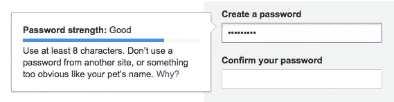
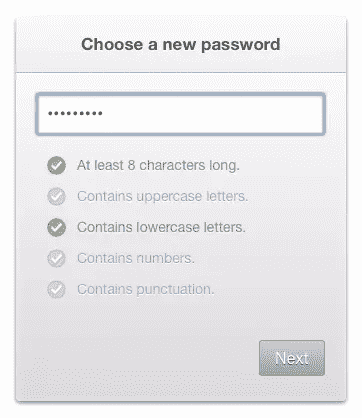

# 好用户和坏密码

> 原文：<https://www.sitepoint.com/good-users-bad-password-ux/>

注册表单验证密码的格式，然后给出密码内容或强度的视觉反馈，这种情况越来越普遍。

你可能见过[谷歌的注册表单](https://accounts.google.com/SignUp "Create your Google Account")，或者类似的东西，这实际上是一个很好的例子(稍后我会谈到原因):

你可能也见过这样的例子被[建议](http://aerotwist.com/blog/better-password-form-fields/ "Better password form fields (Aerotwist)")并在网络上使用:

设置清单的目的是通过提供关于所需格式的具体反馈来减少用户的摩擦，而不是简单地拒绝含糊或不明确的密码。

但是不管实现得多好，这仍然是一个坏主意，因为它**传播了一个关于什么是好密码**的误导性观点。

为了理解这个问题，我们需要从理解密码的强度是如何确定的开始。

## 什么是强密码？

密码的强度通常用术语<q>密码熵</q>来描述，这是对其**随机性**的一种度量。这与其说是对特定密码的度量，不如说是对所有包含相同字符范围的*可能密码*的度量(即计算机为了通过暴力破解密码而必须尝试的所有可能性)。

熵通常用比特表示:如果我们称一个密码有 *n* 比特的熵，这意味着熵值是`2`的 *n 次方*。一个小写英文字母大约有`4.7`比特的熵，因为`24.7`大约是`26`。因此，如果密码只包含小写字母，那么每个字母将增加另一个熵的`4.7`位(即两个字母的密码将有`9.4`等等)。

如果我们用其他字符替换一个或多个字母，那么范围(以及熵)将会增加。美国 ASCII 中有 94 个非音调符号的字母、数字和特殊字符，所以每个都有大约`6.55`位的熵(因为`26.55`大约是`94`)。

因此，可能包含任何这些字符的八个字母的密码将具有大约`52.4`比特的熵，而只有小写字母的相同长度的密码将具有`37.6`比特的熵。

然而，一个只有小写字母的 16 个字母的密码将有`75.2`个比特的熵。

把它放到某种背景下:一个熵值为`52.4`比特的密码可能在不到半小时内被一台台式电脑破解[，而熵值为`75.2`比特的密码可能需要几百年。密码越长，破解时间就越长，呈指数增长。](http://www.passwordstrengthcalculator.org/index.php "Password Strength Calculator")

所以一般来说，**一个只有小写字母的长密码比一个混合字符的短密码好。**

## 将理论付诸实践

这从不同的角度揭示了什么是好的密码。这意味着<q>这是我的密码</q>是一个比 <q>pA5%w*rD</q> 更强的密码，然而它也更容易记住。

尽管我们必须承认这种分析密码的方式有问题，因为它假设每个字符都是随机选择的。在实践中，这种情况很少发生，因为密码通常是由人来选择的，人们不会随意选择。

非随机选择的一个例子是心理特征——人们倾向于使用显而易见的词语、名人名字或常见的联想。密码破解软件可能会考虑这些因素来优化它的工作，并比数学上可能的更快地产生结果。但是在计算密码熵的时候真的无法量化这一点，因为这需要不容易抽象出来的知识。

虽然 Gmail 验证工具显然考虑到了其中的一些事情，因为它表明<q>这是我的密码</q>比<q>这是我的无论什么</q>更弱*，仅仅因为它包含单词<q>密码</q>。*

但这也表明 <q>pA5%w*rD</q> 比*更强*，尽管它实际上要弱得多(如我们所见)。

这就是我所看到的所有密码验证工具的问题所在——字符替换被给予了远远超出其应有的重视，而创建更长的密码则很少或根本没有重视。他们正在教用户创建密码，这些密码对人类来说很难记住，但对计算机来说很容易猜测。

## 将实践转化为最佳实践

我在一开始就说过 Gmail 工具是一个很好的例子，这是因为它评估的是*的整体密码*，而不仅仅是它的单个字符，所以它至少表明长密码比短密码更强。我还说过第二个例子是个坏主意，因为它只强调了字符替换，这远没有那么重要，而且可能适得其反。

如果我将此总结为一个通用的建议最佳实践，它将是:

1.  不要验证密码的格式，只验证其长度
2.  或者，如果您要验证格式，不要使它成为必需的

我记得有一两次被一个网站强迫选择不同的密码，仅仅是因为它没有混合字符格式。作为一名用户，我发现这非常令人沮丧；但这也具有双重讽刺意味，因为它最终会让人们使用更短、更弱的密码，或者让许多不同的网站使用同一个密码。

我建议设置两个独立的字段——一个用于输入密码，一个用于确认——下面还有一些注释，解释如何写一个强而易记的密码。这两个字段都是必需的，并且必须具有最小长度(显然必须相同)，但是密码的字符格式没有经过验证，也不是必需的。

因为最终，这取决于用户想要使用什么样的密码。作为服务提供商，维护用户帐户的安全是我们的责任。如果我们使用像[加盐和密钥拉伸](https://crackstation.net/hashing-security.htm "Secure Salted Password Hashing (CrackStation)")这样的技术来更安全地存储密码，那么*应该不会真的*在乎他们选择什么。

就我个人而言，我喜欢使用旧的电话号码和我住过的地方。例如，如果我住在纽约，我仍然记得我的电话号码，我可能会使用“纽约 219 555 4209”作为我的密码。这是非常强烈的，但也很容易让我记住。

一个更通用的方法是选择几个通常没有联系的单词，然后可视化它们之间的联系(就像 xkcd 漫画)。简单地形成视觉联想，让密码更容易记忆，尤其是对你有个人意义的时候；如果都是小写字母，你就不需要记住任何复杂的替换。

很容易想象某种电视剧的场景，夏洛克·福尔摩斯坐在我们的电脑前，试图用心理学的见解猜出我们的密码。我们是喜欢《星际迷航》，喝约克郡茶，还是听《铁娘子》？在这种情况下,“ir0n//ma1d3n”将比“铁娘子”更难猜(尽管不会太多，因为福尔摩斯对常见替换有着不可避免的了解！).

但这无论如何都不会发生，用户可能需要被教导理解这一点。拥有个人知识的人几乎从未破解过密码，他们是被电脑用蛮力破解的——对他们来说，大小就是一切！

## 分享这篇文章