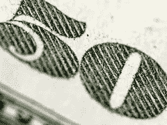
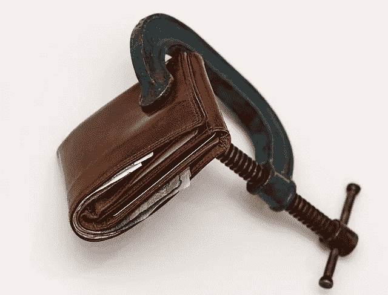
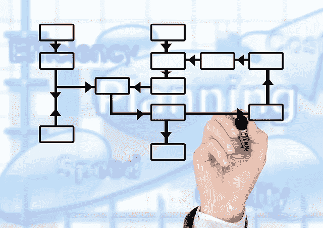
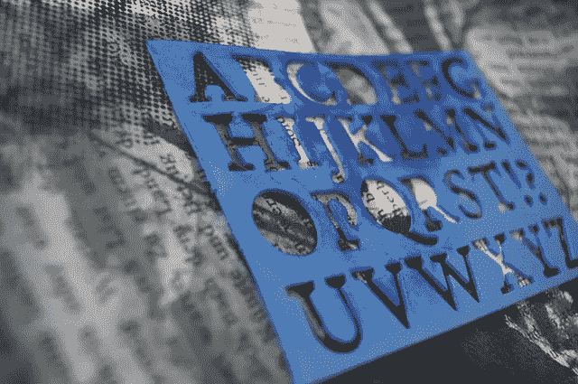

# 为什么好的网页设计不需要 50 美元

> 原文：<https://www.sitepoint.com/good-web-design-cost/>

图片来源:frankieleon

"*什么？！这对网页设计来说太多了！*

如果你已经在这个行业呆过，你可能已经听过很多次了。

你甚至可能有与浏览最便宜网站的客户互动的额外乐趣。

当面对一个声称你太贵的客户时，设计师默认有两条路可走

*   道歉并提供更低的价格——这通常是新手设计师做的，他们只是想抓住任何一个客户。
*   怒气冲冲地走开——这通常是资深的、有经验的设计师，他们知道自己带来的价值。如果他们聪明的话，他们会跳过“生气”，优雅地离开，知道客户不适合他们。

问题是，我们大多数人都在这两类人之间。我们不是渴望客户的新手，另一方面，我们也不能放弃太多的客户。我们正在寻找一条中间路线，在那里我们可以收取一个真正反映我们服务质量和我们带来的价值的好价格。

那么，如何解决这个问题呢？当客户认为你报价太高时，你会怎么做？

首先，花点时间了解客户来自哪里。当他们说你的利率太高时，通常归结为两者之一

1.  他们只是没有那样的预算。在这种情况下，除非客户有一个非常引人注目的项目或非常贴近你的心，你愿意免费工作，礼貌地拒绝。不要讨价还价。它贬低你。你也许可以提出以较低的费用完成一个项目的一小部分。尽你所能提供免费帮助，比如链接到其他资源来制作自己的网站，或者推荐一个符合他们预算的设计师。
2.  他们确实有预算，但他们觉得价格超过了你的服务价值。这意味着你没有很好地推销他们。你需要努力让潜在客户理解并欣赏与你合作的价值和好处——在你向他们报价之前。

以下是如何让潜在客户欣赏你的网页设计服务的具体步骤。

## 突出他们网站的真正目标

太多的新企业主认为网站就像一张网上名片。当他们接近设计师时，他们脑海中唯一的想法是他们需要一个网站，而不是他们想要什么的具体想法。最漂亮或最闪亮的新东西就可以了。

让他们明白网站不仅仅是看起来漂亮。

> 网站的真正目标是创收。

一个网站就是要为你的浏览者创造价值——识别他们的痛点，与他们建立联系，建立信任，然后最终利用这种联系和信任进行销售。

一个有效的网站是你最好的销售员。

任何人都可以建立一个网站，甚至是免费的。但是为对话和转换而设计是一项特殊的技能，并不便宜。

## 向他们介绍您的流程

设计一个网站并不是拉起一个模板，放入一些图形。有大量的研究进入正确的布局，图形，颜色，字体和网站的每个其他方面。

作为你推销或提议的一部分，向潜在客户解释你的过程。你是如何做研究、设计布局、选择配色方案等的？虽然你可能不想这样做，但解释这一点有助于潜在客户理解和欣赏你为创建优雅而有效的网站所付出的努力和细节。

你可以使用[这张信息图](https://www.sitepoint.com/infographic-behind-scenes-guide-creating-website-clients/)引导客户完成网站创建过程，并向他们展示幕后的真实情况。

## 表明你理解他们的观众

当经历设计过程以最终确定布局和配色方案时，许多新的企业主倾向于选择他们喜欢的颜色/布局。或者他们的配偶喜欢。

但对任何网站的真正考验是，它是否向观众提供了他们想要的东西，然后吸引他们停留足够长的时间来订阅或购买。

因此，从一开始就把重点放在他们的最终客户身上。

在你的提议中，表明你理解他们的听众，他们的梦想，他们的恐惧。当谈到吸引观众和建立信任时，你已经知道什么会受到观众的欢迎。强调你在哪里以及如何发挥你的洞察力。

## 廉价设计或模板的问题

有许多免费的模板和廉价的设计工作室可以为任何人建立一个网站。在 Fiverr 上，有人花 5-40 美元建立 WordPress 网站。如果这是你的客户想要的，那么很好，轻轻地把他们重定向到 Fiverr。你没有参加比赛。

相反，努力向你的客户展示一个好的设计的价值，以及什么是好的设计。把一本小电子书或者一些博客文章放在一起，列举好的和坏的网站设计的例子或者例子，或者免费/廉价模板最常见的问题。使用好的和坏的例子，重点放在:

*   易用性
*   视觉吸引力
*   一致性
*   权威
*   清晰的行动号召
*   图像和图形的使用

然后在发现过程中或在早期讨论中与您的客户分享。

## 不要忘记你的 USP

你可能已经为自己创造了一个不错的品牌和网站——但不要假设你的潜在客户已经“得到”了它，或者一旦他们开始与你合作，就会“得到”它。

在你推销过程的某个阶段，花几分钟时间明确地谈谈你带来的独特视角和技巧——你的 USP 是什么。展示你多年的专业知识。分享类似行业中其他快乐客户的故事。

## 记住要把重点放在优点而不是特性上

列出你将为他们的网站提供的“功能”是很有诱惑力的。正如这篇文章所阐述的，一个 5000 美元的网站的[功能和内容将与那些 25000 美元的网站有很大的不同](http://www.straightnorth.com/insights/what-difference-between-5k-and-25k-website/)。

> 设计是主观的。这是私事。

不要只是列出你将添加到他们网站的功能。不要假设他们会自动理解这些特性增加的价值。相反，要谈论好处——这些功能中的每一项都会给最终用户带来的价值。展示所有这些设计元素如何与他们的底线相结合。

## 利用你自己的网站

我知道，这是一个很长的教育潜在客户的洞察力列表。但老实说，我们只有很短的时间来真正推销客户。那么，如何传达所有这些信息呢？

有一个简单的解决办法。利用你自己的网站。发布几篇博客文章，或者一些小型电子书

*   “如何选择合适的网页设计师”
*   “网站的 10 大必备”
*   "如何确保你的网站转换！"
*   "[你的网页设计师很糟糕的 20 个迹象](http://mysiteauditor.com/blog/20-signs-your-web-designer-is-terrible/)"(当然，要确保你不属于那一类！)

提前思考并回答他们所有的问题，所有他们关心的事情，这些都在你的网站上。这给了你一个先发制人的机会，表明你已经理解了他们的担忧，并以一种对你有利的方式做出回应。

那么，你过去是如何与对价格敏感的客户打交道的？你认为你要改变的方法是什么？在下面的评论中与我们分享你的想法。

这么想吧——如果你从来没有客户告诉你你太贵了，你可能一开始就没有要价足够多！

## 分享这篇文章