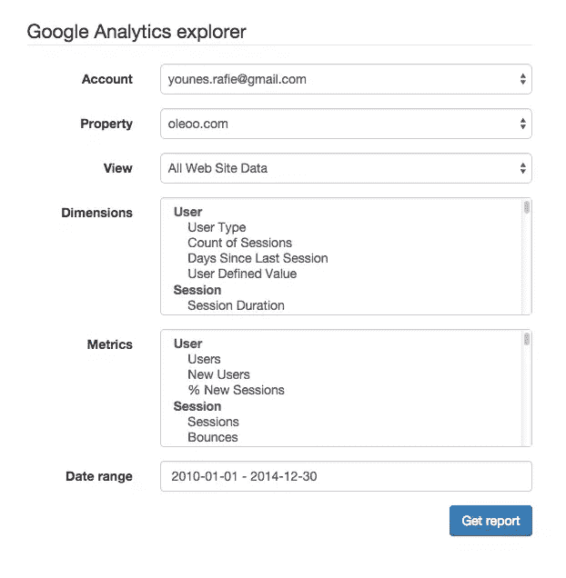
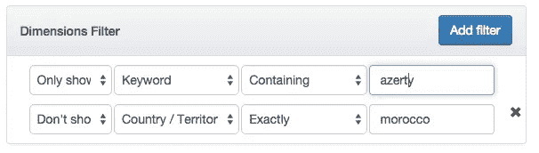
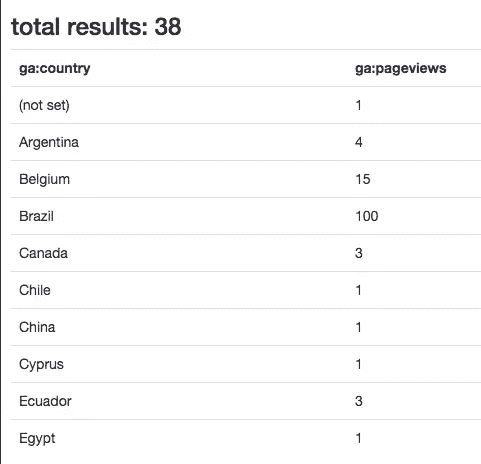
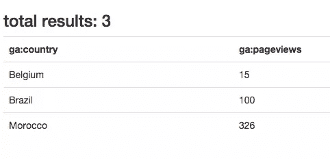
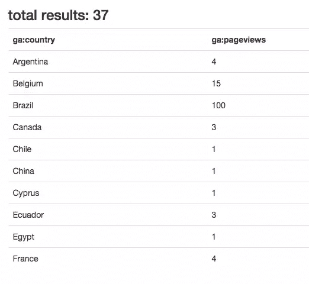
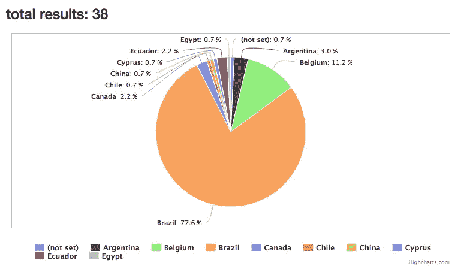

# 谷歌分析 API v3 和 PHP:过滤器和图表

> 原文：<https://www.sitepoint.com/google-analytics-api-v3-php-filters-charts/>

在之前的[部分](https://www.sitepoint.com/series/how-to-use-google-analytics-api-with-php/)中，我们讨论了如何使用 Google Analytics API，并创建了一个演示来展示一些基本功能。在这一部分，我们将展开演示。


## 新功能

我们将添加一些新功能:

*   日期范围:我们可以查询特定日期范围内的数据。
*   最大结果:在上一部分中，我们使用了 10 个结果来提高速度，现在我们将把它作为用户输入。
*   过滤器:我们可以使用一些特定的维度或指标来过滤结果。
*   Order:我们可以使用查询的维度对结果进行排序。
*   图表类型:这不是谷歌分析功能，但我们将使用 [Highcharts](http://www.highcharts.com/) 制作一些更漂亮的图表。

### 日期范围

对于日期范围选择，我们将使用[bootstrap-daterangepicker](https://github.com/dangrossman/bootstrap-daterangepicker)。
首先，我们包括 CSS 和 JS 文件以及依赖关系。

```
// views/home.blade.php
<div class="form-group">
            <label class="col-sm-3 control-label" for="">Date range</label>
            <div class="daterange col-md-9">
              <input name="daterange" class="form-control" value="2013-01-01 - 2014-12-30">
            </div>
          </div>
```

我们创建了日期范围组件。

```
// views/home.blade.php

$('input[name="daterange"]').daterangepicker({
	   format: 'YYYY-MM-DD',
	   startDate: '2013-01-01',
	   endDate: '2013-12-31'
});
```

在我们的`GA_service@report`方法中，我们使用上个月作为范围日期。

```
$now = new DateTime();
$end_date = $now->format('Y-m-d');
$start_date = $now->modify('-1 month')->format('Y-m-d');
```

相反，在我们的`HomeController@report`中检索开始和结束日期之后，我们将把它们作为参数传递给方法。

```
$daterange = explode( ' - ', Input::get('daterange') );
$start_date = $daterange[0];
$end_date = $daterange[1];

$report = $this->ga->report( $view, $start_date, $end_date, $dimensions, $metrics );
```



### 最大结果

我们的演示只取 10 个结果。我们可以使其可配置，或者将其作为用户输入。这样做的缺点是响应变得很慢，加载的时间太长，所以在使用时需要谨慎。

```
<div class="form-group">
              <label class="col-sm-3 control-label" for="">Max results</label>
              <div class="col-md-9">
                  <input name="max_results" type="text" class="form-control" value="10">
              </div>
          </div>
```

将输入添加到表单后，我们可以在`HomeController@report`方法中接收`max_results`参数，并将其传递给`GA_Service@report`方法。

```
// HomeController@report
$max_results = intval( Input::get('max_results') );
$report = $this->ga->report( $view, $start_date, $end_date, $max_results, $dimensions, $metrics );
// GA_Service@report
$options['max-results'] = $max_results;
$data = $analytics->data_ga->get( $view, $start_date, $end_date, $metrics,
				$options
			);
```

### 过滤

在本节中，我们将尝试使用所选的维度和指标来筛选响应。

示例:

`ga:country =@morocco`
(仅显示包含单词摩洛哥的国家)

#### 维度过滤器

在上一部分中，我们解释了过滤器的工作原理:

```
ga:column operator value 
```

因此，我们需要创建一个维度列表、一个操作符选择选项和一个要在过滤器中使用的值输入。



我们还添加了选择显示或不显示规则。

回到服务器端，我们需要捕捉用户输入。我们可以使用 JS 对发送到服务器的变量进行分组，但是我试图避免使用任何 JS 或 ajax 来保持服务器端的东西。

我在我们的`app/src`文件夹中创建了一个名为`GA_utils`的新文件。这是我们可以放入其他函数。

以这种方式发布表单时，请求变量应该类似于:

```
array(11) {
  ...
  ["dimension_filter_show"]=>
  array(2) {
    [0]=>
    string(4) "show"
    [1]=>
    string(5) "dshow"
  }
  ["dimension_filters"]=>
  array(2) {
    [0]=>
    string(10) "ga:keyword"
    [1]=>
    string(9) "ga:medium"
  }
  ["dimension_filter_rules"]=>
  array(2) {
    [0]=>
    string(7) "contain"
    [1]=>
    string(6) "regexp"
  }
  ["dimension_filter_values"]=>
  array(2) {
    [0]=>
    string(6) "azerty"
    [1]=>
    string(7) "morocco"
  }
}
```

为了用匹配的索引对每个索引进行分组，我们使用下面的函数。

```
// app/src/GA_utils.php

public static function groupFilters(array $show, array $filters, array $rules, array $values){
    $count = count($filters);
    $group_filters = [];

    for( $i = 0; $i < $count; $i++ ){
        // skip if no value is provided
        if( empty($values[$i]) )
            continue;

        $group_filters[] = [
            'show'      =>  $show[$i],
            'column'    => $filters[$i],
            'rule'      => $rules[$i],
            'val'       => $values[$i]
        ];
    }//for

    return $group_filters;
}//groupFilters
```

现在结果应该变成。

```
array(2) {
  [0]=>
  array(4) {
    ["show"]=>
    string(4) "show"
    ["column"]=>
    string(10) "ga:keyword"
    ["rule"]=>
    string(7) "contain"
    ["val"]=>
    string(6) "azerty"
  }
  [1]=>
  array(4) {
    ["show"]=>
    string(5) "dshow"
    ["column"]=>
    string(9) "ga:medium"
    ["rule"]=>
    string(6) "regexp"
    ["val"]=>
    string(7) "morocco"
  }
}
```

现在我们有了来自用户的清晰输入，我们可以在发送过滤器之前对其进行编码。

```
public static function encodeDimensionFilters( $filters ){
   $url = [];

   foreach ($filters as $filter) {
       $operator ="";
       if( $filter['rule'] == "contain" ){
           if( $filter['show'] == "show" )
               $operator = '=@';
           else
               $operator = '!@';
       }
       else if( $filter['rule'] == "exact" ){
           if( $filter['show'] == "show" )
               $operator = '==';
           else
           $operator = '!=';
       }
       else if( $filter['rule'] == "regexp" ){
           if( $filter['show'] == "show" )
               $operator = '=~';
           else
               $operator = '!~';
       }

       $url[] = "{$filter['column']}{$operator}{$filter['val']}";
   }//foreach

   $uri = implode( ";", $url );
   //$uri = urlencode($uri);

   return $uri;
}//encodeDimensionFilters
```

该函数将采用之前的过滤器数组，并将其编码为`ga:column operator value`。它将使用分号来分隔它们(这意味着`and`——逗号是`or`)。

此时，我们的`HomeController@report`方法将使用以前的方法。

```
$filters = [];
$group_filters = [];
$group_filters['dimensions'] = GA_Utils::groupFilters(                        	Input::get('dimension_filter_show'),                          Input::get('dimension_filters'),                       Input::get('dimension_filter_rules'),				                                                     Input::get('dimension_filter_values')
);

$filters[] = GA_Utils::encodeDimensionFilters( $group_filters['dimensions'] );
```

您可以访问[文档](https://developers.google.com/analytics/devguides/reporting/core/v3/reference#filters)获得更深入的解释。

在测试过滤器之前，我将为度量过滤器创建必要的代码，我们可以一次测试所有的东西。

#### 度量过滤器

指标过滤器与维度过滤器相同，只是列来自指标列表，运算符是数学运算符。

```
$group_filters['metrics'] = GA_Utils::groupFilters(
            Input::get('metric_filter_show'),
            Input::get('metric_filters'),
            Input::get('metric_filter_rules'),
            Input::get('metric_filter_values')
        );
        $filters[] = GA_Utils::encodeMetricFilters( $group_filters['metrics'] );

$filters = implode(';', $filters);
```

在获得并编码过滤器后，我们用分号(`and`操作符)展开维度和度量过滤器。

注意:不能使用逗号(`or`运算符)组合维度和度量过滤器。

现在，我们的过滤器应该给出这样的结果:

```
// show countries containing the word morocco and page views are greater than 100

ga:country=@morocco;ga:pageviews>100
```

我们将添加编码的过滤器，并将其作为参数传递给`GA_Service@report`。

Google Analytics API 接受编码过滤器作为选项，如`max_results`等。

```
// app/src/GA_Service@report
$options['filters'] = $filters;
```



我没有使用滤镜就得到这个结果。



在这个截图中，我使用了一个过滤器:

*   不要显示`(not set)`国家！
*   仅显示大于 10 的页面浏览量。

### 订购结果

谷歌分析为我们提供了一种很好的结果排序方式:

```
ga:country,-ga:pageviews
```

我们可以按维度或度量来排序。在我们的演示中，我将只使用一个包含所有指标和维度的选择列表。

```
// app/views/home.blade.php

<div class="col-md-7 nopadding">
	<select class="filter_columns form-control" name="orderbys[]">
        @foreach( $dimensions as $key => $group )
          <optgroup label="{{ $key }}" >
          @foreach( $group as $dimension )
            <option value="{{ $dimension->id }}">{{ $dimension->attributes->uiName }}</option>
          @endforeach
          </optgroup>
        @endforeach

        @foreach( $metrics as $key => $group )
          <optgroup label="{{ $key }}" >
          @foreach( $group as $metric )
            <option value="{{ $metric->id }}">{{ $metric->attributes->uiName }}</option>
          @endforeach
          </optgroup>
        @endforeach
    </select>
</div>

<div class="col-md-4 nopadding">
    <select class="form-control" name="orderby_rules[]">
        <option value="">ASC</option>
        <option value="-">DESC</option>
    </select>
</div>
```

提交表单后，我们需要按规则对订单列表进行分组和编码。

```
// app/src/GA_Utils.php

public static function groupOrderby(array $orderbys, array $rules){
    $count = count($orderbys);
    $group_orderbys = [];

    for( $i = 0; $i < $count; $i++ ){
        $group_orderbys[] = [
            'column'        =>  $orderbys[$i],
            'rule'          => $rules[$i]
        ];
    }//for

    return $group_orderbys;
}//groupOrderby

public static function encodeOrderby( $orderbys ){
    $res = [];

    foreach( $orderbys as $orderby ){
        $res[] = $orderby['rule'] . $orderby['column'];
    }//foreach

    return implode( ',', $res );
}//encodeOrderby
```

在我们的`HomeController@report`中，我们将通过输入对订单进行编码。

```
// app/controllers/HomeController@report

$orderbys = GA_Utils::encodeOrderby( GA_Utils::groupOrderby(Input::get('orderbys'), Input::get('orderby_rules') ) );
```

Google Analytics API 接受由编码的*订单作为选项。*

```
// app/src/GA_Service@report

$options['sort'] = $orderbys;
```



在这张截图中，我剔除了`(not set)`国家，按国家排序。你可以在[文档](https://developers.google.com/analytics/devguides/reporting/core/v3/reference#sort)中阅读更多关于排序结果的信息。

### 使用图表

这部分与 Google Analytics API 无关，但是如果你使用 Google Analytics 服务，你会注意到那些漂亮的图表。在这一部分，我将使用 [Highcharts](http://www.highcharts.com) ，我将使用他们的[演示](http://www.highcharts.com/demo/pie-basic)中的饼状图示例。

为了绘制饼图，我们需要一个`name`和一个`y`轴数组。

```
[
	{
		"name":"(not set)",
		"y":"1"
	},
	{
		"name":"Argentina",
		"y":"4"
	},
	{
		"name":"Belgium",
		"y":"15"
	},
	{
		"name":"Brazil",
		"y":"104"
	}
	...
]
```

让我们从添加一个新的选择选项列表开始，该列表包含一个饼图和表格图选项。

在我们的服务器上，我们将只创建报告数据的 JSON 表示。

```
$json_data = [];
foreach( $report['items'] as $item ){
    $json_data[] = [
        'name'  => $item[0],
        'y'     => $item[1]
    ];
}//foreach

return View::make('report', [
		'columns'       => $report['columnHeaders'],
        'items'         => $report['items'],
        'totalResults'  => $report['totalResults'],
        'report_json'   => json_encode($json_data),
        'chart_type'    => Input::get('chart_type')
]);
```

唯一剩下的部分是在我们的视图中捕捉那些值。我们测试用户想要一张桌子还是一个馅饼。

```
@if( $chart_type == 'pie' )
<div class="pie">
    <div id="pie_canvas"></div>
</div>
<script src="http://code.highcharts.com/highcharts.js"></script>
<script>
     $(function(){
         var el = $("#pie_canvas"),
             serie_data = {{ $report_json }};
      el.highcharts({
          chart: {
              plotBackgroundColor: null,
              plotBorderWidth: 1,
              plotShadow: false
          },
          title: {
              text: ''
          },
          tooltip: {
              pointFormat: '{series.name}: <b>{point.percentage:.1f}%</b>'
          },
          plotOptions: {
              pie: {
                  allowPointSelect: true,
                  cursor: 'pointer',
                  dataLabels: {
                      enabled: true,
                      format: '<b>{point.name}</b>: {point.percentage:.1f} %',
                      style: {
                          color: (Highcharts.theme && Highcharts.theme.contrastTextColor) || 'black'
                      }
                  },
                  showInLegend: true
              }
          },
          series: [{
                      type: 'pie',
                      name: '',
                      data: serie_data
                  }]
      });//highchart
 });
</script>
@else
	// print the table here
@endif
```

首先，我们包含了`highchart.js`文件，然后我们使用了他们文档中的一些配置。重要的部分是`serie_data = {{ $report_json }}`。
在我们的控制器中，我们创建了一个值数组，然后对这些值进行编码，以便在我们的 JS 中使用。

注意:选择饼图时，您只需选择一个指标和一个维度，否则您将不得不扩展演示并使用 highchart 提供的[向下钻取](http://www.highcharts.com/demo/pie-drilldown)功能。

运行前面的代码会得到这样的结果。



## 结论

在这一部分中，我们探索了更多的 Google Analytics API，展示了它的强大功能和可定制性。大多数 API 都在谷歌分析查询浏览器上使用，可以通过这种方式进行探索。让我知道你对 API 和本教程的看法，并随时检查最终的[回购](https://github.com/sitepoint-examples/laravel_google_analytics)来测试演示。

## 分享这篇文章