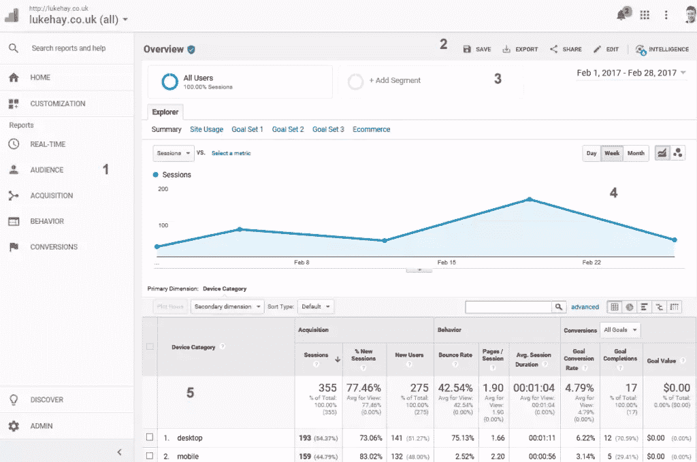
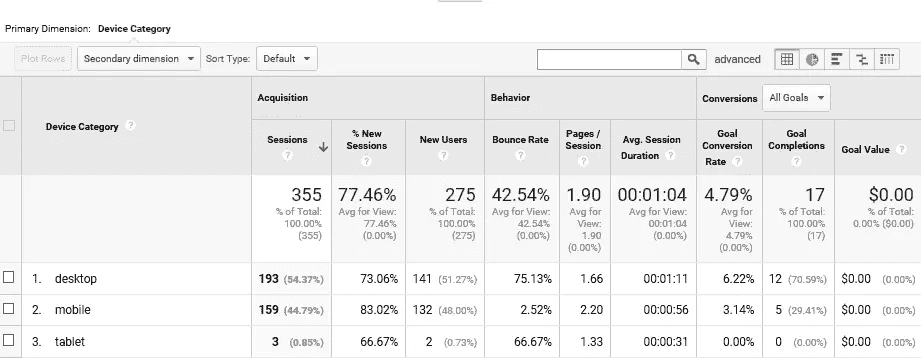
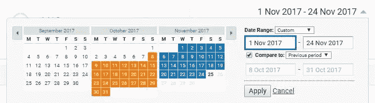
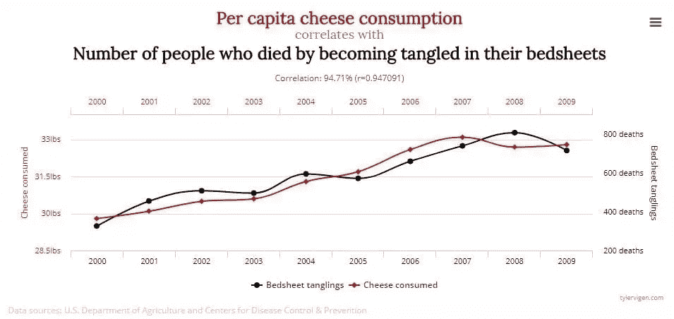

# UX 和谷歌初学者分析:基础和陷阱解释

> 原文：<https://www.sitepoint.com/google-analytics-basics-and-pitfalls/>

**[分析](https://www.sitepoint.com/ux-analytics-what-they-are-why-they-matter/)作为 UX 设计师的信息来源经常被忽视。许多设计师不考虑分析，而是仅仅根据他们对用户心理的了解来做出决定。虽然这并没有*错*，但分析让我们更深入地了解*我们的*用户，而不是一般用户。虽然数据驱动的设计一开始可能听起来令人生畏，但一旦你了解了基础知识，它实际上就非常简单了，在本文中，我们将在熟悉排名第一的网络分析工具 Google Analytics 时学习这些基础知识。**

Google Analytics 拥有超过 5000 万用户，是世界上使用最广泛的网站分析服务。也是免费的，永远免费。只需一小段 JavaScript 代码，您就可以在几分钟内设置好 Google Analytics。稍加调整，我们也可以使用目标和事件跟踪，这将帮助您跟踪非常具体的事情，如用户完成表单或到达收银台。

让我们从学习 UI 开始。

*注意:如果你需要一点帮助，先在你的网站上安装谷歌分析跟踪代码，[这里有一个快速指南](https://sridharkatakam.com/add-new-website-google-analytics/)告诉你怎么做。*

## 谷歌分析用户界面

看看下面的屏幕(注意参考数字)。

为了充分利用谷歌分析，你需要知道以下事情:

*   报告(位于主导航中)分为以下几类:
    *   *受众*(您拥有的用户)
    *   *获取*(你如何获得那些用户)
    *   *行为*(那些用户在你的网站上做了什么)
    *   *转换*(任何你想追踪的目标/事件)
*   您可以保存、导出和共享您的报告
*   您可以在报告中划分特定的用户组
*   图表出现在报告中，让您对正在发生的事情有一个总体的了解
*   您的大部分分析将发生在详细的报告中。

现在我们来讨论一下关键术语。

## 维度和指标

Google Analytics 中的大多数详细报告将采用表格的形式。为了分析这些表，理解它们的组成是很重要的。所有报告通用的关键术语是术语**维度**和**指标**。维度是对数据进行分组的一种方式，是一种分类或标识的形式。它们通常显示在您报告的第一列，如*国家*、*页面标题*和*设备类型*。另一方面，度量是与这些维度相关联的数字。指标出现在报告的其他列中，显示与第一列中的维度相关的数字。

度量标准的例子包括*跳出率*、*平均值。页面上的时间*和*目标完成*，可以帮助你更好地了解你的用户的行为。在后续文章中，我们将了解更多关于这些指标以及它们真正的含义。

## 目标

目标是 Google Analytics 默认情况下不需要跟踪的指标。目标描述了用户在你的网站上采取的一个值得注意的行动，比如查看一个特定的网页，或者提交一个特定的表单，这些都需要设置。目标应该反映你的网站的关键目标(例如，完成一个表单)。它们通常是你的网站表现如何的一个指标。

## 片段

为了分析不同类型的用户在您的网站上做什么，您可能需要使用细分来缩小报告中的数据范围。应用细分后，报告将仅显示符合细分条件的人口统计数据。常见的细分类型包括按设备(如台式机、平板电脑或手机)、按国家或语言对用户进行细分。

我们将在以后的文章中了解更多关于分段的内容。

## 趋势

如果你想从你的数据中提取最有用的信息，你需要观察一段时间内的趋势。不要盯着单个的数字，你会希望看到你的关键指标是增加还是减少，以及这是否符合你希望你的网站实现的目标。通过查看不同的日期范围来分析数据是很重要的。通过右上角的日期选择器，您可以将报告缩小到某个日期范围。您还可以比较两个不同的日期范围，这有助于比较环比或同比数据。

创建一个[衡量计划](https://www.freshegg.co.uk/blog/analytics/performance-measurement/how-to-create-a-measurement-plan-and-why-you-really-need-one)是了解你想要准确衡量的[KPI](https://link-to-davids-KPI-article)(关键绩效指标)的好方法。这将有助于你专注于网站的正确目标，并衡量真正重要的指标。

## 要避免的 5 个陷阱

以错误的方式分析数据可能比根本不考虑数据更糟糕。查看误导性信息可能会导致您做出错误的设计决策。以下是你在旅途中应该警惕的一些事情:

### 1.虚荣度量

如果你真的想改善你网站的用户体验，关注描述用户行为或人口统计的指标。把像*访客数量*这样的虚荣心指标留给营销部门去担心。

### 2.被数字吸引

如前所述，不要纠结于个别数字。相反，您会希望分析一段时间内的趋势，以更好地了解您的用户发生了什么。使用日期选择器放大适当的日期范围。

### 3.曲解数字

某些指标的增加可能是正面的，也可能是负面的。例如，如果你注意到用户在你的网站上花了更多的时间，这可能意味着他们真的参与到你的内容中，*或*这可能意味着他们正在努力寻找东西，并沮丧地离开网站。不要急于下结论；继续调查。

### 4.混淆相关性和因果关系

仅仅因为在你对网站进行修改的同时，你的分析发生了变化，并不意味着这两者有任何联系。如果你在设计变更后发现你的分析有变化，你应该更深入地研究你的报告，以确保这不是巧合。

### 5.远离分析，没有可操作的要点

虽然通过观察分析来了解用户的情况显然很好，但真正有用的见解会给你带来可操作的收获。当你在报告中发现有趣的见解时，确保你总是知道如何处理它们。例如，如果报告指出某个网页的性能有问题，您的下一步是什么？也许你想在那个页面上运行一些可用性测试来找出问题是什么？

## 结论

阅读完本文后，您现在应该对 Google Analytics 的工作原理、在哪里可以找到某些报告、关键术语的含义以及如何进行数据驱动设计有了基本的了解。如果您对 Google Analytics 的工作方式还有疑问，不要担心，我们将在下一篇文章中讨论如何使用 Google Analytics 进行用户研究，届时我们将深入了解更多细节。

如果你迫不及待，我还为 SitePoint 写了一本书，详细介绍了这个主题:[研究 UX:分析](https://www.sitepoint.com/premium/books/researching-ux-analytics)。

## 分享这篇文章