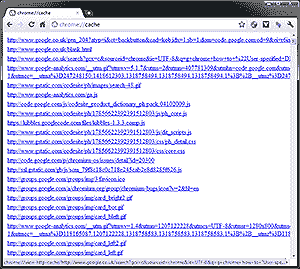
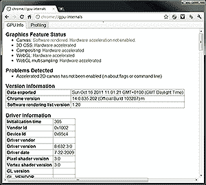

# 谷歌浏览器:超级用户选项

> 原文：<https://www.sitepoint.com/google-chrome-for-power-users/>

这里有一个给运行谷歌 Chrome 的网络开发者和高级用户的快速提示。在地址栏中输入以下 URL:

[**chrome://关于**](//about)

生成的页面列出了一些功能强大的信息和调试工具，这些通常在界面上是看不到的。有些非常古怪，只有 Chrome 开发者会感兴趣，但我们其他人也有一些选择…

## [chrome://flags](//flags)

你可能已经知道这个页面了。它允许您启用和禁用实验和电源功能，如 Native Client (NaCl)、侧标签、帧速率计数器、GPU 加速画布、第三方 cookies、HTML5 表单验证和预加载。

web 开发人员特别感兴趣的是“用户指定的 DNS 服务器地址”。这将最终允许您覆盖特定域的 IP 地址，例如 http://mydomain.com/将指向 127.0.0.1。它还没有完全实现，但是一旦有了它，就会减少编辑 hosts 文件的需要。

## [ chrome://cache](//cache)

Chrome 缓存中所有文件的列表。您可以单击任何文件，尽管它的用途有限，因为内容是以十六进制显示的。

## [chrome://app cache-internals](//appcache-internals)

脱机应用程序缓存存储的文件。该面板允许您清除现有数据。

## [chrome://quota-internals](//quota-internals)

关于磁盘使用和配额管理的信息。

## [chrome://net-internals](//net-internals)

如果你需要知道什么时候，从哪里，通过什么下载，这是要查看的面板。对于要求最苛刻的开发人员来说，有很多选择！

## [chrome://dns](//dns)

该面板显示 Chrome 启动时预获取 DNS 记录的主机名。

## [chrome://内存](//memory)

如果 Chrome 运行得不如你预期的好，这个面板会帮助你找到恶意的扩展或插件。

## [chrome://sessions](//sessions)

关于当前会话和魔法列表的信息*(不管它们是什么？我不相信这个面板是完全可操作的——或者也许 Chrome 没有报告谷歌拥有的域名？*

## [chrome://workers](//sessions)

这个面板显示了关于 [HTML5 共享 web workers](https://www.sitepoint.com/javascript-shared-web-workers-html5/) 的信息。

## [chrome://GPU-内部](//gpu-internals)

如果你正在构建高动作 HTML5 游戏，这个面板显示关于硬件加速的信息，并提供一个有用的分析应用程序。

## [chrome://plugins](//plugins)

如果你厌倦了 Flash、Quicktime、Java、Silverlight、Google Talk 或 Chrome 的更新系统，这是一个不错的选择。

## [chrome://崩溃](//crashes)

如果启用了崩溃报告，此页面将列出最近的崩溃报告。

## [chrome://版本](//version)

最后，该页面显示了一系列有用的信息，如用户代理字符串、可执行文件路径、配置文件路径以及 Chrome、webkit 和 Flash 版本号。

## 分享这篇文章