# Google Data Studio:一个漂亮的、免费的、易于使用的数据可视化工具

> 原文：<https://www.sitepoint.com/google-data-studio-a-nifty-free-easy-to-use-data-vis-tool/>

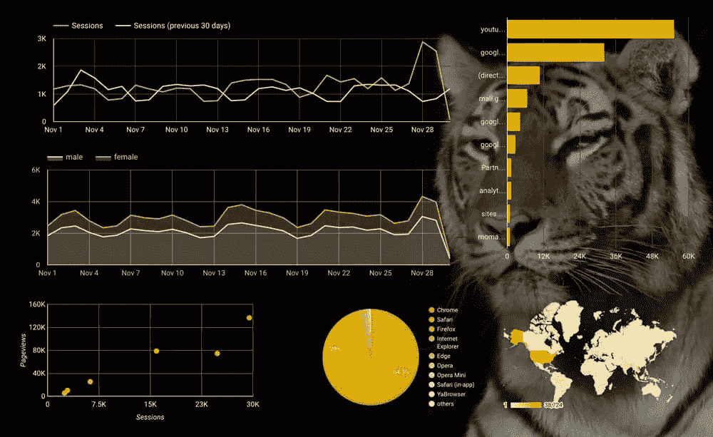

[一个谷歌数据工作室的例子](https://datastudio.google.com/u/0/#/org//reporting/0B2-rNcnRS4x5alRMcEpUdklnWXM/page/gZB)

作为一名数字营销人员，你经常会被大量的信息和数据淹没，这些信息和数据需要被分析以评估你的工作。流量、转换率、用户位置、行为和收购——仅举几个例子——都必须被检查，以确定你的数字营销活动的进展。

客户报告是数字营销人员在开展项目时面临的最大挑战之一。尽管无穷无尽的数字和统计对互联网专业人士来说可能有些意义，但一般来说，客户并不精通技术。

任何人都可以将大量信息从 Google Analytics 导出到 excel 电子表格中，但是如何以一种易于理解的方式呈现这些数据呢？答案是——数据可视化。

## 什么是数据可视化？

数据可视化是一种以一种令人愉快的、视觉上吸引人的方式表示复杂数据和统计数据的方法。视觉数据可能包括饼图和图表、地图或表格等组件，并可以不同形式呈现，如信息图、视频、插图和交互式报告。

为什么重要？答案很简单。我们的大脑更好、更快、更容易地吸收视觉信息。

### 数据可视化的优势

可视化数据的好处包括:

*   为客户提供更清晰的信息
*   使查看和分析模式和趋势变得更加容易
*   支持与数据的交互
*   允许更快地吸收更多的信息
*   更好地识别波峰和波谷。

在本帖中，我们将评估一个新工具 Google Data Studio 如何帮助我们构建漂亮的交互式报告。

## 谷歌数据工作室

谷歌数据工作室 (GDS)是谷歌的一个新工具，它可以轻松创建美丽、迷人、响应迅速、有品牌和互动的报告。它通过从谷歌的属性中提取指标来做到这一点，如谷歌分析、Adwords 和 YouTube 分析，以及电子表格和 SQL 数据库。

对于本文，我们将使用 Data Studio 来创建一个使用 Google Analytics 数据的可视化报告。要做到这一点，你首先需要有一个积极的谷歌分析属性，是正确地与网站集成。

这同样适用于其他报告。如果你想从你的 Adwords 或 YouTube Analytics 中提取数据，确保用一个拥有这些数据的合适的谷歌账户登录。

### 入门指南

以下 18 个步骤将带你完成从谷歌分析数据创建可视化报告的过程。

#### 第一步

前往 [Google Data Studio](https://datastudio.google.com) 并使用您的 Google Analytics 凭据登录:

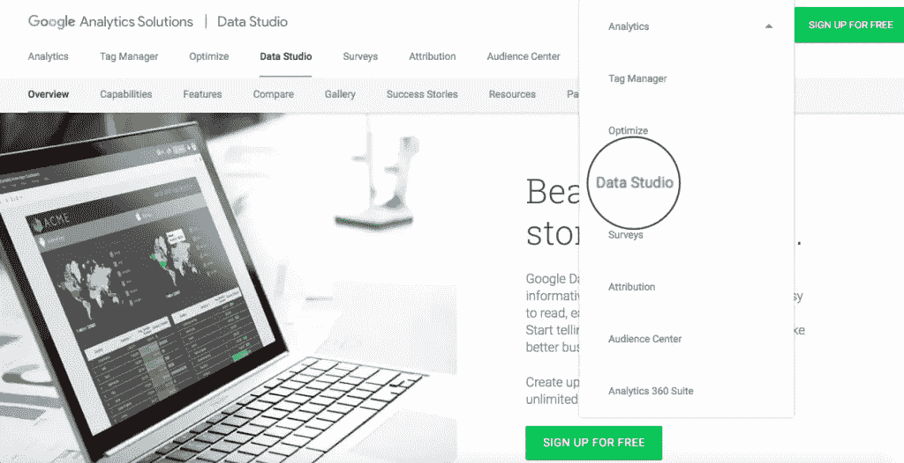

#### 第二步

登录后，您将看到以下控制面板:

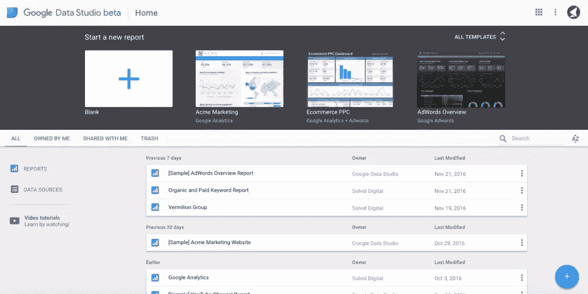

此页面是您的 GDS 项目的主控制面板。在这里，您可以选择一个预先设计的模板，从头开始创建新的报告，添加新的数据源，管理现有的项目和观看视频教程。

这里需要注意的一点是，在免费版中，您最多只能添加 5 个自定义报告。

#### 第三步

所有报表都是从添加数据源开始的。换句话说，就是让 GDS 接触到报告中要用到的信息。

让我们继续，点击仪表板左侧的**数据源**按钮，添加一个新的 Google Analytics 数据源:

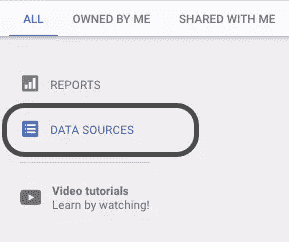

#### 第四步

然后，您将被引导到一个屏幕，其中列出了已经连接的数据源。要添加一个新的，点击蓝色的“添加”(+)按钮。

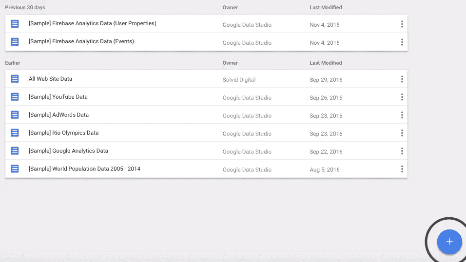

#### 第五步

在下一页上，为您的新项目添加一个唯一的名称，从连接器列表中选择“Google Analytics”，选择相关的帐户、属性，然后点击屏幕右上角的 **Connect** 按钮:

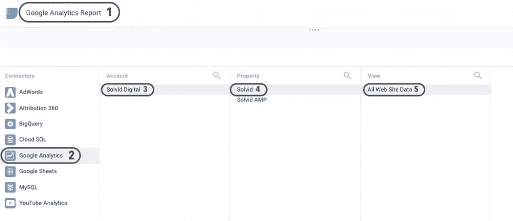

#### 第六步

接下来，您将受到以下屏幕的轰炸，乍一看，这似乎很难理解。然而，它并没有看起来那么恐怖。

简而言之，这只是报告中可用的指标和维度的列表。每个字段被分配一个唯一的类型:数字，文本，日期和时间，布尔，地理或货币。当从谷歌的属性(如谷歌分析或 Adwords)拉数据时，GDS 会自动赋值。但是，如果您使用的是从 Excel 文档中提取的自定义数据，您必须确保每个字段都被分配了适当的类型。

在这种情况下，您不需要更改任何字段，因此可以放心地点击屏幕右上角的**创建报告**。

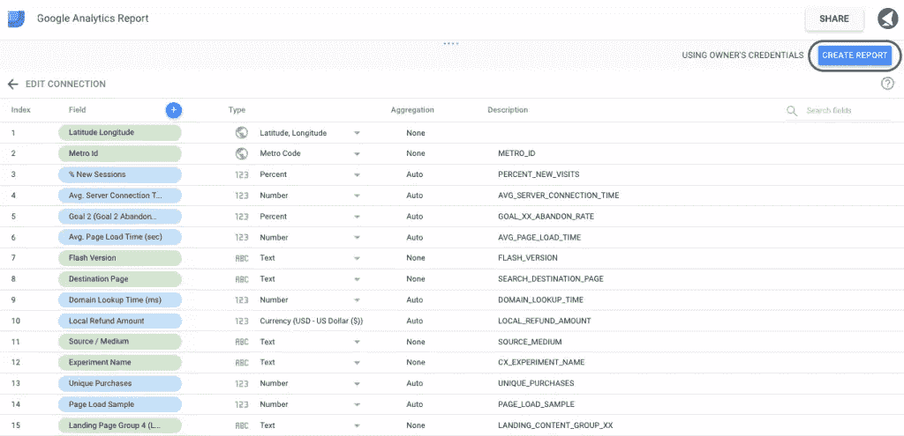

#### 第七步

接下来，您将被重定向到具有实际设计画布的屏幕。为您的报表命名，并选择我们刚刚创建的数据源:

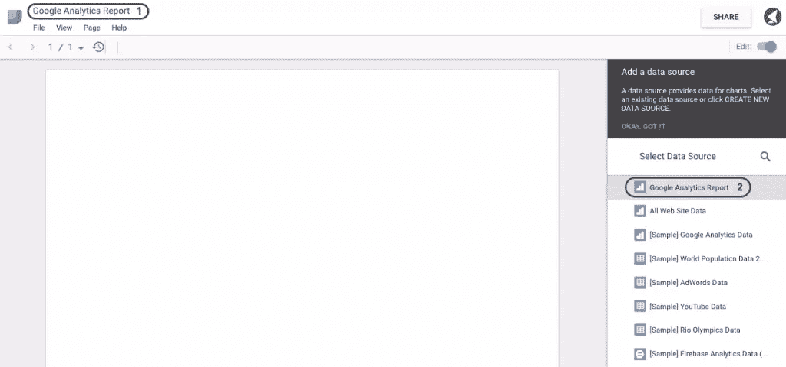

#### 第八步

一旦您将数据源与报表连接起来，您会注意到画布顶部有一个控制面板。

目前，您可以向报表中添加以下组件:时间序列、条形图、饼图、表格、地理图、记分卡、散点图、项目符号图、面积图、文本、图像、矩形、圆形、日期范围和过滤控件。

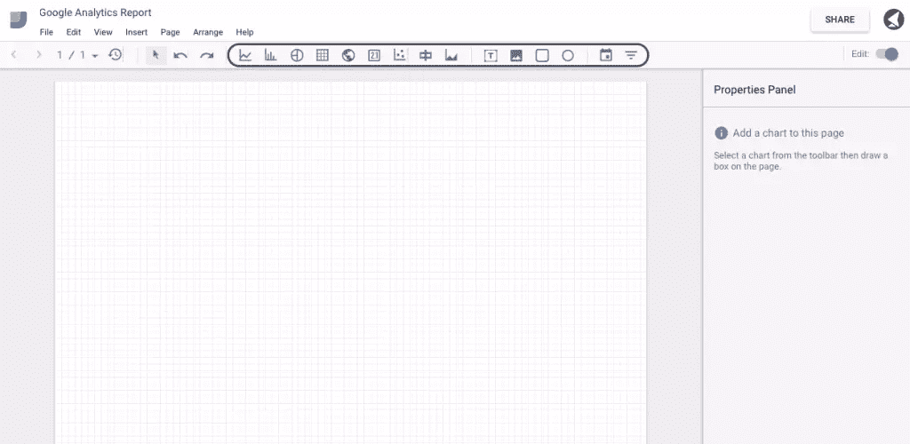

#### 第九步

您也可以将页面方向更改为横向。为此，进入**文件>报告和主题设置>布局>风景**:

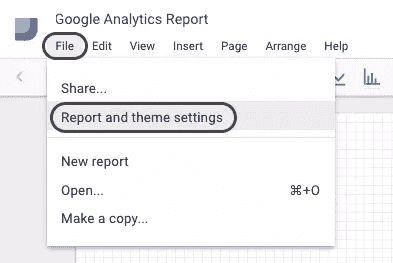

然而，在本指南中，我们将使用纵向方向。

#### 第十步

现在我们已经准备好画布，让我们继续添加一些品牌和自定义样式。

很有可能，你正在为客户创建这些报告。因此，定制品牌是使您的报告具有视觉吸引力的重要部分。

让我们使用矩形工具添加一个标题。选择您想要形状出现的区域。

在右边栏中，您会看到一些样式选项，允许您选择颜色、边框半径、不透明度、边框大小和颜色:

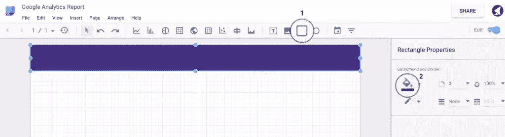

#### 步骤 11

让我们继续为我们的报告添加一个徽标。单击如下所示的图像选项卡，选择您希望徽标出现的区域。然后，点击右边栏中的**数据**标签，选择一个图像文件。

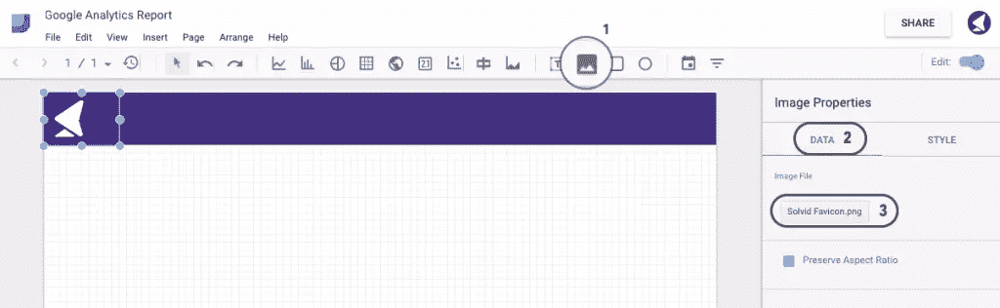

#### 步骤 12

Google Data Studio 的迷人之处在于，它允许添加交互式日期范围，该范围会根据日期范围自动更改图表数据。

要添加一个，点击**日期范围**选项卡，并选择您希望句柄出现的区域。然后，选择您的默认日期范围并定制样式:

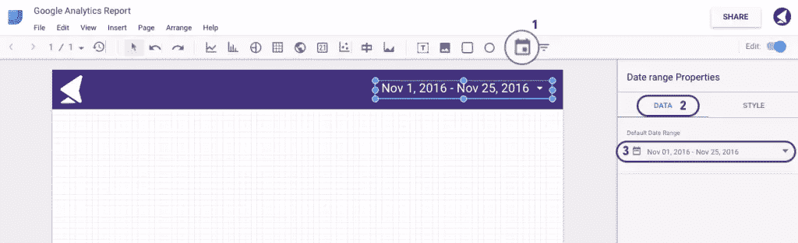

#### 第十三步

一旦我们做好了基本准备，我们就可以继续进行进一步的样式设计，并将实际数据添加到我们的报告中。让我们从一些通用记分卡开始。

记分卡是一个简单的指标，可以用来表示一些一般信息，如总访客数、总会话数、跳出率等。

我们现在将继续添加四个记分卡，代表会话，浏览量，用户和跳出率。

首先，使用选项卡添加记分卡，如下图所示。

然后，在右侧栏中，选择用于该特定记分卡的首选指标。对于我们的第一个示例，我们选择显示会话:

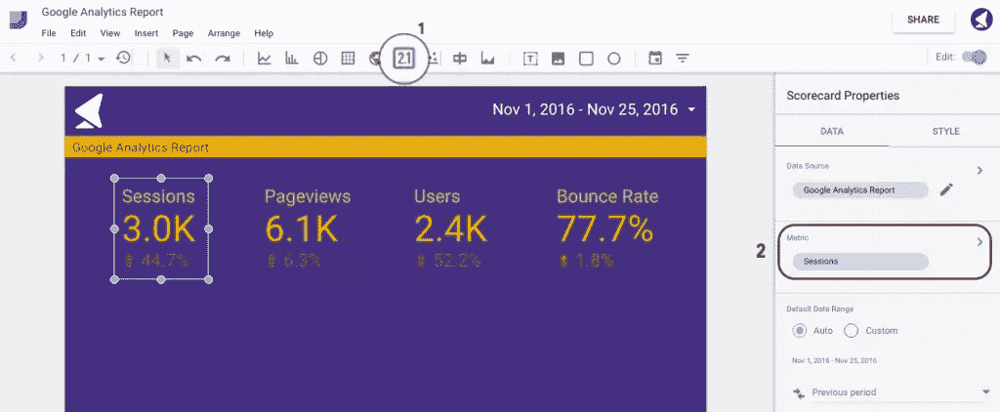

然后，您可以复制并粘贴此记分卡，更改指标来源。

#### 步骤 14

现在是时候添加第一个图表了，它将代表我们选择的日期范围内的一些会话和浏览量。

首先，点击**时间序列**选项卡，选择您希望图表出现的区域。然后，选择度量源。在这种情况下，我们将使用会话和浏览量:

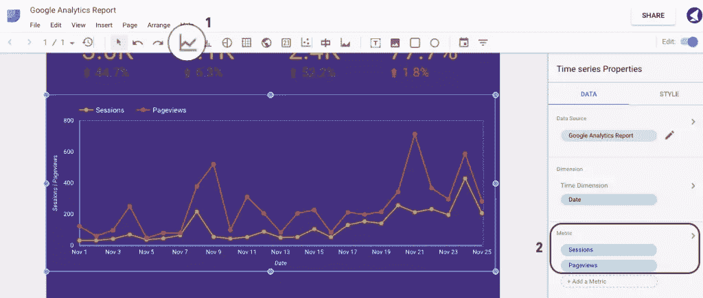

#### 第十五步

现在让我们添加一个代表会话源的条形图。

点击**条形图**并选择您希望它出现的区域。然后在**数据>尺寸**中选择**源**:

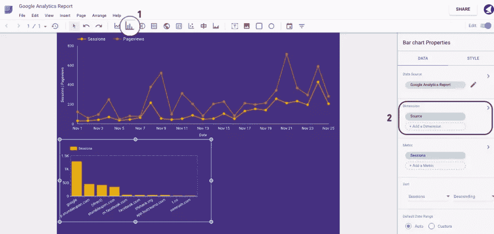

#### 第十六步

我们现在可以添加一个饼图，表示按设备(即台式机、移动设备和平板电脑)细分的会话。

为此，点击**饼图**选项卡，并在右侧边栏的尺寸部分下选择**设备类别**:

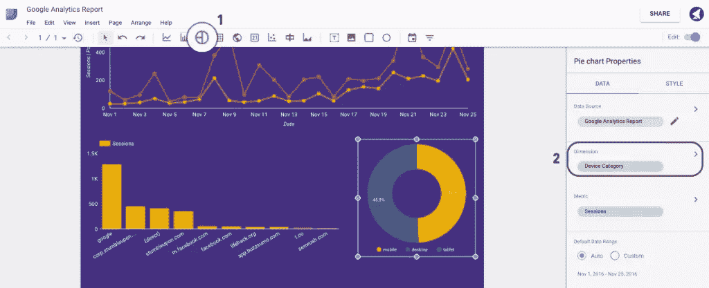

#### 步骤 17

最后，让我们添加一个地理地图和用户表。点击**地理地图**，从维度列表中选择**国家 ISO 代码**，并从指标列表中选择用户。

要添加用户排名靠前的国家/地区表，请单击**表**选项卡，并选择与地理地图相同的指标:

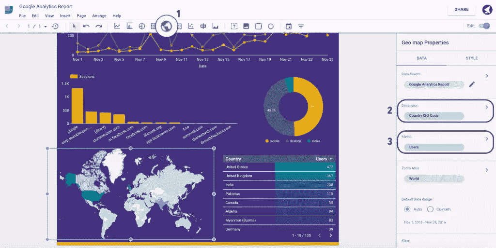

就是这样。以下是我们的最终版本:

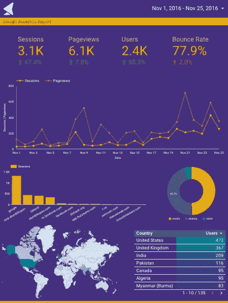

#### 步骤 18

现在我们已经做好了一切准备，是时候与我们的同事或客户分享这份报告了。

点击屏幕右上角的**分享**按钮。

您可以复制可共享链接，也可以输入您要将此报告发送给的人的电子邮件地址:

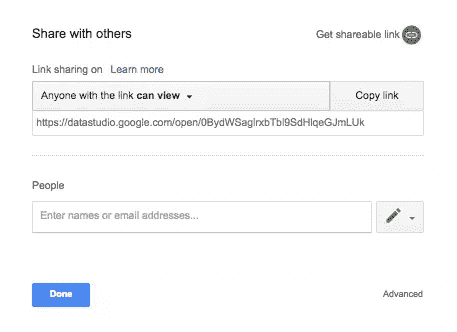

## 最后

希望在阅读完本指南后，您现在已经了解了数据可视化有多么重要和强大，以及如何整合 Google Data Studio 来为您的客户提供全面、易于理解的交互式报告。

我们很乐意倾听您的想法以及您使用该工具的任何体验。

## 分享这篇文章