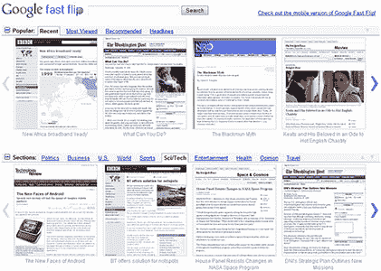
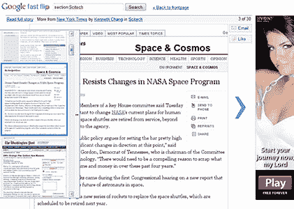
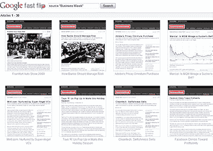

# 谷歌快速翻转:有用还是无用？

> 原文：<https://www.sitepoint.com/google-fast-flip/>

 [谷歌快速翻转](http://fastflip.googlelabs.com/)，谷歌实验室的最新产品。它得到了大量的媒体报道，但这可能并不奇怪，因为媒体公司是最大的受益者。

快速翻页是谷歌试图呈现最近的新闻、头条和流行文章，就像印刷杂志一样。你可以浏览你喜欢的出版商、作者或主题的故事截图缩略图。该系统目前拥有几十个(主要是)美国新闻公司的页面，但随着时间的推移会增加更多。

谷歌希望改善与报纸和杂志公司的关系。许多人攻击谷歌聚合非其创造的内容，但 Fast Flip 的大部分广告收入将返还给出版商。谷歌搜索副总裁玛丽莎·梅耶尔表示:

> 我不认为我们是问题的一部分。我相信我们是解决方案的一部分。
> 
> 我们试图建立平台和工具，建立一个健康、丰富的支持内容的在线生态系统。这是看待内容的一种新方式。

谷歌认为快速翻转解决了浏览速度慢的问题；它允许用户无缝浏览文章，没有不自然的延迟。这真的是个问题吗？谷歌解决了吗？

开始的屏幕显示了四个可配置的文章部分，其中多个选项卡代表主题或来源。每个部分都包含一个水平滚动的文章截图缩略图区域。我不相信缩略图是有效的；它们太小，无法阅读，很少有新闻报道包含有用或相关的照片。标题文字如下所示，但很容易被忽略*(文字取自页面的< h1 >标签；它在大多数时候都是有效的，但有些出版商比其他人更好)*:

点击缩略图可以看到更大、可读性更强的屏幕截图。我最初觉得这有点奇怪——我本以为会看到真正的文章。但是，它确实允许您阅读更多的内容，快速滚动到其他文章，或者使用拉出式导航器小部件。它还为谷歌提供了展示广告的空间:

最后，您可以浏览来自您选择的出版商或主题的一系列故事:

该界面是可用的，尽管它在高垂直分辨率的屏幕上效果最好。它在 1024 x 768 屏幕上运行的浏览器上看起来很拥挤。我怀疑谷歌会解决这个问题，尤其是当他们开始在上网本上提供 Chrome 操作系统的时候。

快速翻转可以在大多数浏览器中工作，包括 IE6 和几个移动设备(他们还没有公布官方浏览器支持列表)。JavaScript 是必需的，但创建一个纯 HTML/CSS 版本会相对容易——如果这个系统流行起来，也许 Google 会这么做？

但是快速翻转有必要吗？会有人用吗？多年来，技术人员一直在使用 RSS 聚合他们自己的话题；许多提要阅读器和个人主页提供了更快、更容易的浏览体验。然而，我承认 RSS 从未在技术社区之外被广泛采用。对于这些用户来说，快速翻转是一个可行的选择吗？

链接和相关阅读:

*   [谷歌快速翻转](http://fastflip.googlelabs.com/)
*   [谷歌 Chrome 操作系统:事实与谬误](https://www.sitepoint.com/google-chrome-operating-system/)
*   [不应发布受支持浏览器列表的 5 个理由](https://www.sitepoint.com/5-reasons-to-avoid-supported-browser-lists/)

## 分享这篇文章