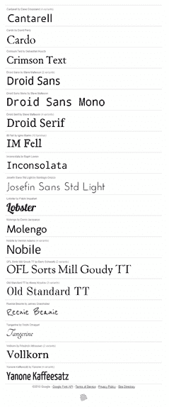

# 谷歌字体诞生了-我能得到一个哈利路亚吗！？

> 原文：<https://www.sitepoint.com/google-fonts-is-born-can-i-get-a-hallelujah/>

大约一年前发布 Typekit 时，我们在办公室里提出了一个问题。为什么大公司不买一堆字体，让每个人都可以使用——只是为了网络的整体利益？

好吧，是某个大人物干的。



谷歌字体目录

今天[谷歌在](http://googlecode.blogspot.com/2010/05/introducing-google-font-api-google-font.html) [IO 开发者大会](http://www.youtube.com/GoogleDevelopers)上宣布了谷歌字体 API 和谷歌字体目录。只需使用一行代码，您就可以合法地链接和使用一系列经过批准的字体，而无需在用户系统中安装它们。

字体嵌入代码简单而优雅。

```
<link rel="stylesheet" type="text/css" href="http://fonts.googleapis.com/css?family=Tangerine">
```

谷歌字体目录发布提供了 19 种许可字体，包括一系列美味的衬线字体、三衬线字体、手写体和固定宽度的选择。我预计该目录将随着时间的推移而增长。

那么，这是羽翼未丰的字体链接服务如 [Typekit](http://typekit.com/) 和 [Kernest](http://kernest.com/) 的丧钟吗？

不一定。我认为这对现有的服务来说是一件好事。谷歌有能力将新技术引入聚光灯下，因此毫无疑问，我们将在未来 12 个月看到一个更加“字体更大”的网络。

然而，用质量和良好的品味将自己从人群中区分出来将比以往任何时候都更重要，所以为高质量、原创类型付费将是做到这一点的方法之一。

为什么选择谷歌？

微软通过他们的 Office 产品进行字体授权有一些历史，我记得我想知道他们是否会成为这方面的领导者。或许这是推广他们云服务的一种方式？这看起来肯定是错过了至少赢得一些急需的公关印象分的机会。

另一方面，谷歌的关键口号之一是“如果人们更喜欢和使用网络，最终对谷歌有利”。[地图](http://maps.google.com)、 [Chrome](http://www.google.com/chrome) 和 [Android](http://www.android.com/) 都是将这种伦理付诸实践的好例子，所以它们成为公司的囊中之物也就不足为奇了。

不管他们的动机是什么，这确实是一个令人兴奋的发展。

谷歌万岁。

## 分享这篇文章