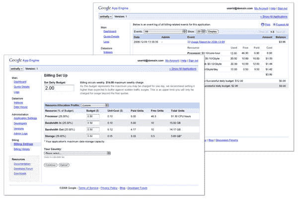

# 谷歌暗示应用引擎定价

> 原文：<https://www.sitepoint.com/google-hints-at-app-engine-pricing/>

正如我们在 10 月份写的那样，当谷歌[透露他们的云计算产品](https://www.sitepoint.com/google-reveals-app-engine-product-map/)[应用引擎](http://code.google.com/appengine/)的产品路线图时，谷歌计划在明年年初上线的东西之一是开发者购买额外资源的定价模型。在不知道 App Engine 在成本方面与其他云托管平台相比如何的情况下，开发人员很难为 App Engine 做预算。

今天，Google [在他们的博客上暗示了应用引擎定价模式](http://googleappengine.blogspot.com/2008/12/system-status-dashboard-quota-details.html)。

虽然 App Engine 的实际成本细节可能会在计费系统明年开放之前发生变化，但谷歌确实谈到了该系统的工作方式。App Engine 的计费系统将与 AdWords 的系统类似。开发人员将为他们的应用程序设定每日预算，可以在带宽、CPU 和存储之间进行精细分配。

谷歌目前免费提供这项服务，但有每日使用限额。根据谷歌今天发布的新计费管理器的测试界面截图(如下)，在谷歌明年实施计费系统后，免费配额仍将存在。只有当你的应用程序超出免费限额时，谷歌才会动用你的日常预算。

今天还发布了一个[系统状态监控站点](http://code.google.com/status/appengine)和一个配额监控仪表盘。正常运行时间监控网站是我们 10 月份报道的谷歌应用引擎 Q1 计划的一部分。路线图中还包括一项用于存储和提供大型文件的服务、用于大型数据集的数据存储导入和导出实用程序，以及对新的运行时语言的支持。

## 分享这篇文章