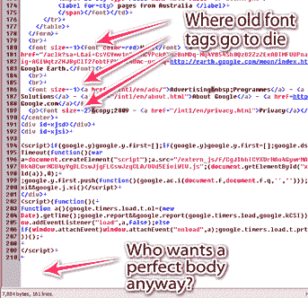

# 谷歌、HTML5 和标准

> 原文：<https://www.sitepoint.com/google-html5-and-standards/>

虽然最近 Google Wave 的发布伴随着大量的小号和大象，但他们公开承诺在 HTML5 中构建 Wave，这一点可能被忽略了。

不久之后，W3C 宣布停止 XHTML2 工作组的工作，用他们的话说，是为了“T2”增加 HTML 5 的资源。很明显，今年夏天所有酷孩子都在穿 HTML5。

可以说，这两个标准之间最大的区别是 XHTML 坚持“格式良好”——关闭 Ps 和 LIs，使用自结束 IMG 和 BR 标签。现在，正如 Jeremy Keith 指出的，选择使用 HTML5 不会阻止你关闭你的标签。

然而，它确实让关闭你的标签更像是一种风格的选择——就像得到一个舌钉或者让你的内裤露出你的牛仔裤。与 HTML 4 一样，您可以自由地让许多标签自由开放，而不用担心验证错误或其他指责。

就我个人而言，像我们中的许多人一样，我已经如此根深蒂固地喜欢编写 XHTML，以至于如果我编写了像一个未关闭的 P 标记那样多的内容，我会感到很脏。我还发现，当我可以很容易地识别标签结束的位置时，修复布局错误就更容易了。

但是显然不是每个人都这么认为——包括网络上最引人注目的公民。

可以说是网络上最著名的页面——经典的谷歌搜索页面——将自己标记为 HTML5，但却出现了 [41 个错误，2 个警告](http://validator.w3.org/check?uri=http%3A%2F%2Fwww.google.com%2F&charset=%28detect+automatically%29&doctype=Inline&ss=1&group=0&verbose=1&user-agent=W3C_Validator%2F1.654)。其中最值得注意的包括:

*   使用字体(在 HTML 4.01 中已弃用)
*   使用 NOBR(我相信从未正式成为规范的一部分)
*   使用 U(在 HTML 4.01 中已弃用)
*   使用中心(在 HTML 4.01 中已弃用)

同样有趣的是，谷歌做的一些事情看起来应该是无效的，但实际上并不在 HTML5 中。

*   没有结束正文标记
*   没有结束 HTML 标记

正如你对谷歌的期望，这不是他们的意外或疏忽。显然，去掉关闭的`html`和`body`标签可以让它们的页面加载得更快，而不会在浏览器中产生任何负面影响——无论是旧的还是新的。

当然，谷歌每小时服务数百万个页面，因此每个页面 2%的效率提升很快就会在带宽和加载时间上带来巨大的每日节省。

那么，HTML5 会标志着偏离标准和验证重要性的开始吗？

你是一个书生气十足的生活标签，还是这一切都归结于加载时间和屏幕渲染的冷酷现实？

## 分享这篇文章