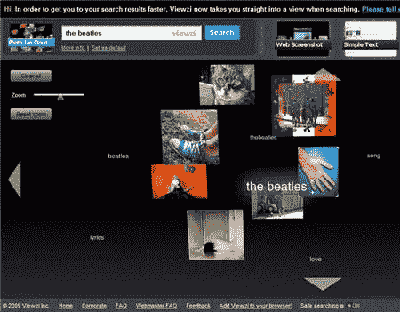
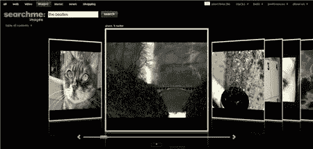
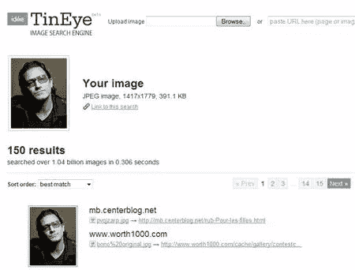
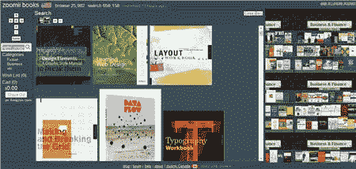
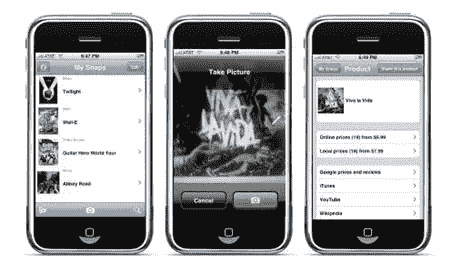

# 谷歌图片搜索的 5 个巧妙替代方案

> 原文：<https://www.sitepoint.com/google-image-search-alternatives/>

作为一名网页或平面设计师，可以公平地说，在日常生活中，你在一个非常视觉化的层面上工作和学习。对我们许多人来说，一张图片比几页解释同样事情的文字更有吸引力。

毫无疑问，你知道，[谷歌图片搜索](http://images.google.com/)提供了一种查找图片的简单方法。在搜索框中输入一些词语之前或之后，只需点击“图片”链接，然后*瞧！* —一页缩略图几乎立即出现。然而，有几个替代搜索引擎巨头，你可能会喜欢尝试。

**Viewzi.com**

Viewzi 提供了 15 种不同格式的搜索结果，包括雅虎、Live Search、Ask 和谷歌的网页缩略图。您可以在缩略图视图和以网格格式布局的文本视图之间切换。Viewzi 还以缩略图云的形式返回来自 Flickr 的结果。我特别喜欢的一个功能是你可以以报纸头版的形式查看谷歌新闻的结果，这非常酷。您可以通过点击页面底部的链接将 Viewzi 添加到您的浏览器中。

**Searchme.com**

[Searchme.com](http://www.searchme.com)是一个“多媒体搜索引擎”。它以一系列网页截图的形式返回结果，看起来类似于 iTunes Cover Flow 的外观。这个网站可能不是找到图片的最快途径，但它有一种有趣的感觉。我发现获取特定类型网站的快照很有用。

**TinEye.com**

TinEye.com“对于图像，就像谷歌对于文本一样”。这是一个反向图像搜索引擎，这意味着你可以上传自己的图像，或者将 TinEye 指向包含你感兴趣的图像的 URL，它会返回一个可以找到该图像的网站列表——非常聪明的东西。因此，如果你认为有人偷了你的一张照片，这对你的侦查工作会是一个非常有用的工具！

**Zoomii.com**

如果你对书籍封面设计感兴趣，或者只是喜欢浏览书籍，那么 Zoomii.com 之旅是必不可少的。这是你坐在电脑前浏览真实书店的最接近的体验。搜索一本书或一个主题，返回的结果会显示很大的缩略图，你可以点击它来获得关于这本书的更多信息。如果你想买一本书，你可以把它加入你的购物车，然后通过亚马逊网站结账。你也可以将书籍添加到愿望清单中——这是我用来收集我喜欢的书籍设计的东西。

**SnapTell.com**

SnapTell 是一家基于图像识别的移动营销公司。这里的想法是，你可以用 iPhone 给一本书、一个游戏封面、一张 DVD 或一张 CD 拍照，这个搜索引擎应用程序会自动查找你的商品，并显示亚马逊、巴诺书店和维基百科的链接，以及评级和价格。

您以前用过这些视觉搜索工具吗？这是一次好的经历吗？你用哪些搜索引擎让生活变得更简单？

SitePoint 上您可能感兴趣的其他帖子:

*   [Picfinder:免费股票照片和图片搜索](https://www.sitepoint.com/picfindr-free-stock-photo-and-image-search/)
*   [谷歌提供未来视频搜索的一瞥](https://www.sitepoint.com/google-offers-glimpse-at-future-video-search/)

## 分享这篇文章