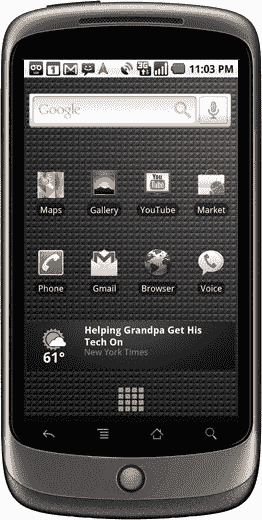

# 谷歌推出 Nexus One 智能手机

> 原文：<https://www.sitepoint.com/google-nexus-one-phone/>

谷歌保守最深的秘密之一 Nexus One 智能手机已经发布。因为它的口号是*“网络与电话相遇”，*它可能是网络开发者理解和支持的一个重要设备。细节仍在浮现，但这是我们目前所知的:

**硬件**
HTC 硬件提供高通 QSD 8250 1GHz 处理器，512MB 闪存，512MB 内存和 4GB SD 卡(最高支持 32GB)。

**显示屏**
这款设备配有一个 3.7 英寸 800 x 480 的触摸屏——像素是某款热门竞争智能手机的两倍多。

**操作系统**
Nexus One 是第一款使用 Android 移动技术平台 2.1 的手机，支持英语、法语、德语、繁体中文、简体中文、意大利语、西班牙语、葡萄牙语、韩语、日语和俄语。

由于 Android 是谷歌的操作系统，GMail、地图、YouTube 和一个类似 Chrome 的浏览器肯定会出现。谷歌地图看起来特别令人印象深刻，并提供逐路段卫星导航设施。

**媒体**
支持以下媒体格式:

*   图像:JPEG(编码和解码)，GIF，PNG，BMP
*   视频:H.263(编码和解码)、MPEG-4 SP(编码和解码)和 H.264 AVC(解码)
*   音频解码器:MP3，AAC，AMR，MIDI，Ogg Vorbis 和 WAVE
*   音频编码器:AMR-NB

相机
它提供了一个 500 万像素的相机，自动对焦，2 倍数码变焦和 LED 闪光灯。视频可以以 20fps(或更高，取决于照明条件)的速度在 720 x 480 下拍摄。

**连接**
支持 UMTS、HSDPA、GSM/EDGE、Wi-fi、蓝牙和 USB。标准的 3.5 毫米耳机插孔可用于媒体播放。

**位置**
该设备可以使用其 AGPS 接收器、手机信号发射塔和 Wi-Fi 定位找到您的位置。它具有一个数字指南针和加速度计。

**电源**
这款手机包含一个可拆卸的 1400 mAH 电池，可以通过 USB 端口或充电器充电。预计待机时间约为 250 小时，通话时间长达 10 小时(如果使用 wi-fi 或播放媒体文件，通话时间会短得多)。

**尺寸**
这款设备的尺寸为 119 毫米 x 59.8mm 毫米，深度为 11.5 毫米，重量为 130 克，不含电池为 100 克。

**可用性**
没机会了！一些幸运的美国买家将能够以 529 美元的价格获得一部无 SIM 卡的 Nexus One，但不要指望几个月后会在全球范围内广泛上市。如果你现在想尝试这些功能，谷歌在 http://www.google.com/phone 的[有在线演示](http://www.google.com/phone)

显然，谷歌正在积极瞄准已经拥有或正在考虑 iPhone 的用户。Nexus One 的规格看起来不错，这款手机的价格可能会低于苹果的产品。*(谷歌向移动运营商提供广告收入分成，而苹果坚持预付和一部分服务费)。*

然而，苹果产品易于使用，对所有技术水平的用户都有吸引力，并拥有狂热的追随者。相比之下，谷歌的产品往往让人觉得有点怪。我怀疑 Nexus One 可以与 iPhone 竞争，但它最终可能会与 Palm Pre 分享相同的市场空间。

你在考虑智能手机吗？Nexus One 能成功还是苹果已经赢了？

## 分享这篇文章