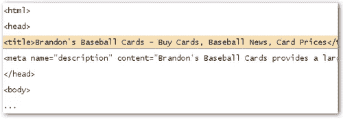
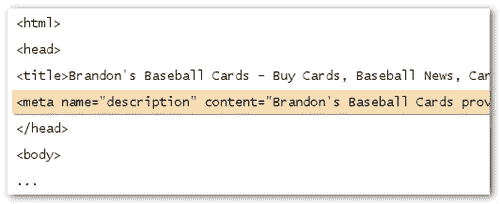
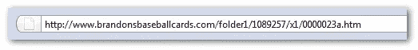

# 页面搜索引擎优化——谷歌之路

> 原文：<https://www.sitepoint.com/google-onsite-seo/>

我们已经在很多场合讨论过这样一个事实:谷歌确实关心搜索引擎优化(SEO)，优化后的网站在其搜索结果中排名更靠前。如果你还在怀疑，有一个不可否认和无可争议的证明:[谷歌的搜索引擎优化入门指南](http://www.google.com/webmasters/docs/search-engine-optimization-starter-guide.pdf ) (*。pdf)，它直接来自谷歌，为 DIY SEOs 和新手提供了 22 页的建议。

今天，我们将重点介绍本指南中描述的三种最重要的页面 SEO 技术——这些都是经验丰富的 SEO 所熟知的方面，但对于那些不太熟悉我们所说的“白帽 SEO ”(搜索引擎认可和推荐的 SEO 技术)的人来说是重要的信息。

##### 创建独特、准确的页面标题

页面标题可能是最重要的页面 SEO 方面——经常被许多站长忽略。理想情况下，网站上的每个页面都应该有一个唯一的标题，因为标题相同的页面往往会被谷歌视为“重复的”(搜索引擎只会在其结果中显示其中一个页面，将重复的页面索引为“补充结果”))

页面标题标签的最佳实践是常识:选择一个传达页面内容的标题，避免使用“无标题”或与内容无关的标题。最后，但同样重要的是:避免在你的标题标签中填充关键字，避免所有的大写标题。

另一个重要的方面:如果标题太长(通常超过 60 个字符)，就是谷歌只会在搜索结果中显示一个片段。

##### 利用“描述”元标签

这是第二个最重要的页面搜索引擎优化元素(当涉及到什么被搜索引擎索引时)。谷歌可能会在搜索结果中使用这个作为你的页面的一个片段——因为有时谷歌可能会选择使用你的页面的可见文本的一个片段，如果它更好地匹配用户的查询。或者，如果你的网站列在开放目录项目中，谷歌可能会使用那里提供的描述。如果你想阻止 Google 和其他搜索引擎显示 ODP 数据，你应该在你的页面中添加以下 meta 标签:(这样只会阻止支持 meta 标签的搜索引擎显示 ODP 数据)。

元描述应该准确地总结页面的内容，你应该避免写与页面内容无关的描述。你也应该避免使用像“这是一个网页”这样的描述，太短的描述和塞满关键词的描述。将页面可见文本的全部内容复制到 description meta 标记中也是不可取的:描述通常应该少于 160 个字符。和页面标题一样，网站每个页面的元描述也应该是唯一的。在“网站范围内”或对大量页面使用相同的元描述可能会迫使 Google 在结果中只显示一个页面，而将其余的显示在补充结果索引中。

##### 改善你的网址结构

搜索引擎友好的网址并不是“必须的”——但是推荐使用。谷歌表示，这样可以更好地进行抓取，而且对那些想链接到你的内容的人来说，它们显得“更友好”。

例如，下图中的 URL 可能会让那些很难记住或创建链接的用户感到困惑。

一些用户使用 URL 作为锚文本链接到页面(下面的例子)-如果 URL 包含相关的单词，这将比 id 或其他奇怪命名的参数更有助于搜索引擎和其他用户。

因此，一个理想的 URL 使用单词而不是数字、会话 id 等等。也不建议使用冗长的 URL，像“page1.html”这样的通用页面名称也是如此。不允许在 URL 中填充关键字。

提供一个单一版本的 URL 来访问一个文档也是非常重要的——以防止用户链接到一个 URL，而其他人链接到不同的版本(从而在 URL 之间分割内容的声誉)。最后但同样重要的是:不要在你的内部链接结构中混合 www 和非 www 版本的 URL。

##### 更多搜索引擎优化技术来自谷歌的搜索引擎优化入门指南

本指南描述了所有主要的现场技术，包括站点导航、内容、现场链接和锚文本的最佳实践、适当使用标题标签(不要与 HTML 标签或 HTTP 标题混淆)、图像优化、使用 robots.txt、如何以及何时使用 rel="nofollow "链接属性、如何以正确的方式推广您的站点等等。该指南特别重要，因为它可以为那些寻找现场 SEO“正确答案”的人节省大量时间、麻烦甚至金钱:没有秘密公式，正如你在阅读该指南时会看到的。除了指南之外，我还建议你使用谷歌的网站优化器来检查你的页面，看看什么样的页面变化会给访问者带来最好的转化率。

虽然该指南没有深入描述如何编写引人注目的页面标题，以及如何编写有销售价值的内容，但谷歌提供的提示是我喜欢称之为“永恒的 SEO”的规则，这些规则永远不会改变。我曾经把 SEO 的工作比作图书编辑:SEO 是编辑网站，优化网站，为市场做准备。

每一个关心他/她的网站内容，关心导航和网站结构，关心图片如何与文本相协调等等的网站所有者，都做这种类型的 SEO，尽管有些人不喜欢这样称呼它。不考虑术语，关于搜索引擎想从你的页面得到什么信息，没有比来源本身更好的来源了。使用这些文章中提供的简单技术，结合像你正在阅读的那种简单的参考资料，只会给你的网站带来更好的索引。就这么简单！至少对于初学者来说，这是一个很好的起点。

*页面内 SEO 漫画提供[SEO moz](http://www.seomoz.org/blog/a-collection-of-rands-searchrelated-comics)；所有其他图片由[谷歌提供。pdf SEO 指南)](http://www.google.com/webmasters/docs/search-engine-optimization-starter-guide.pdf )。*

## 分享这篇文章