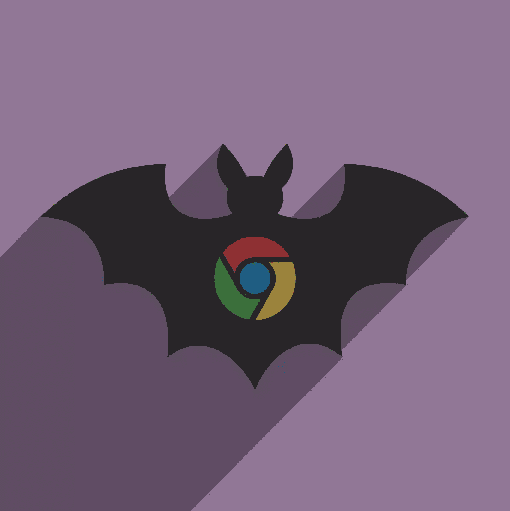
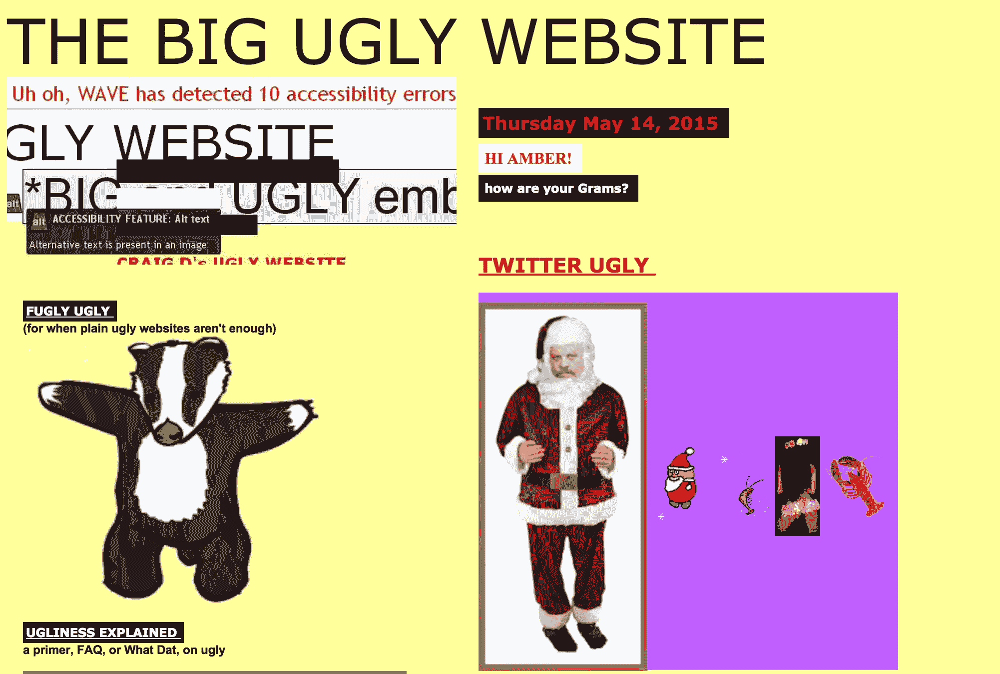
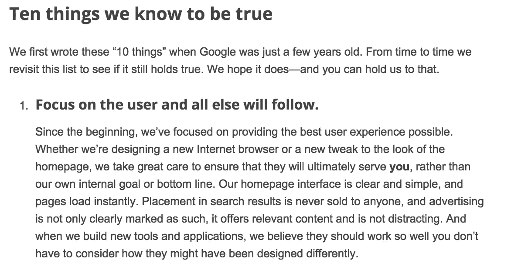

# 谷歌幻影更新的关键要点

> 原文：<https://www.sitepoint.com/google-phantom-update/>

过去一个月，当所有人都在专注于优化他们没有响应的移动网站时，谷歌悄悄推出了一项对一些网站有害的算法调整。

HubPages 是受到秘密更新负面影响的网站之一，该网站收集了超过 87 万条微博，涵盖了世界上的所有内容。

HubPages 首席执行官保罗·埃德蒙森在本周早些时候发表的一篇博客文章中说:“5 月 3 日，我们所有 HubPages 的谷歌流量与前一周相比下降了 22%。”

虽然谷歌没有确认或否认有更新，但他们确认这不是熊猫或企鹅的更新，他们一直在“推动变化”，所以这种事情是“正常的”。

Glenn Gabe 是一位数字营销老手，他管理着众多的网站，可以访问大量的数据，他在自己的博客上证实谷歌肯定会有更新。他认为这是“幻影 2”(你可以在这里阅读关于《幻影 1》[。](http://www.hmtweb.com/marketing-blog/penguin-2-google-phantom-update-may-2013/)

“4 月 29 日开始发生的任何事情都比正常的‘变化’要大，”他说。

## 这和 Mobilegeddon 无关

Gabe 说，这些变化似乎不是 Mobilegeddon 的结果，因为 Phantom 2 攻击的大多数网站都是移动友好的。更不用说，这种效应影响了桌面和移动的排名。

本周，Gabe 在他的博客上分享了他对受更新影响的网站的分析。

“我收集了许多受 4 月 29 日更新影响的域名，并开始分析谷歌有机流量的增减，”他说。“我分析了丢失的关键词、有机搜索的登陆页面、链接简介、过去几个月的链接获得或丢失等。我的希望是，我能公布一些发现，帮助那些受影响的人。”

以下是加布发现的简略版本。

## 质量胜于数量

像 Phantom 1 一样，Gabe 发现了围绕内容质量问题的趋势，发现大多数受影响的网站缺乏高质量的内容。

另一个出现在受影响网站上的关键趋势是，它们之前已经被 Panda 攻击过。

以下是 Gabe 发现的内容质量问题列表。

### 标签页烂透了

“我看到的一个最大的点击显示，在更新之前，许多标签页的竞争关键词排名都很好。这几页写得很糟糕，”他说。“像许多标签页一样，它们只是提供了一大串指向网站上其他内容的链接。当页面上有很多链接时，无限滚动被用来自动提供越来越多的链接。当我向下滚动页面时，这简直让我头晕目眩。”

这意味着用户体验很差，即用户参与度很差，如果 Phantom 像 Panda 一样，这是致命的。

他所分析的网站有 1200 万个被谷歌索引的标签页面。如果这还不够糟糕的话，该网站还会在所有登陆页面上向访问者发送弹出窗口。

### 点击诱饵，骷髅般的内容和低质量的补充内容，天啊！

然后就出现了更多的内容质量问题。

Gabe 发现许多从有机搜索中掉出的顶级登陆页面是可怕的点击诱饵文章的家园。

此外，他们揭示了只有几段的薄薄的文章。

如果这还不够糟糕的话，主要内容被无数低质量的补充内容吞没了。

[补充内容](http://www.thesempost.com/supplementary-content-google-quality-raters-guidelines/)是广告、类似/推荐文章、侧栏等内容，谷歌会衡量每一页上这些内容的水平。

你最不希望的就是你的网站提供糟糕的用户体验，而糟糕的补充内容很容易做到这一点。

还有什么扼杀了这些网站？堆叠的视频。

Gabe 写道:“带有许多堆叠视频的低质量页面会对用户体验产生强烈的负面影响。”

最后，这些网站有一个[联合问题](http://searchenginewatch.com/sew/how-to/2348110/more-panda-40-findings-syndication-user-engagement-indexation-keyword-hoarding)，这意味着它一直在自己的页面上使用第三方网站的内容，这些内容来自这些网站。

## 糟糕的设计

“首先，网站设计是 1998 年的。看完这些内容真的很难，”加布说。“字体很小，每页上有大量内容，每页上有许多链接，等等。我确信所有这些都对用户体验产生了负面影响。”

## 低质量用户生成内容(UGC)

Gabe 发现“毫无价值”的评论或者“只是旧的”评论。

“我发现多年前的评论与当前的形势毫无关系。然后你的评论根本没有提供任何价值(从一开始)，”他说。

评论确实构成了页面上的内容；因此，你肯定不希望有很多蹩脚的评论。

## 内容农场与垃圾弹出窗口和知识图答案相结合

内容农场是依赖于骨架式页面的网站，这些页面并没有真正覆盖谷歌搜索的内容。哦，他们也有广告涂在屏幕上。

如果用户体验还不够糟糕，那么当你散布糟糕的弹出窗口、低质量的补充内容、与搜索结果混合的广告以及低质量的 UGC 时，情况会变得更糟。

“当检查关键词排名下降时，我经常遇到产生知识图答案的查询……该网站有超过 10 万个页面，内容针对‘是什么’查询，”Gabe 说。许多这样的查询现在会产生知识图(KG)答案。当你将排名变化与占据 SERP 大部分的知识图结果结合起来时，你肯定会遇到一个大问题。”

## 链接到垃圾网站

他还发现，许多受影响的登录页面有大量指向文本广告的突出链接，即赞助广告，这导致了更多垃圾链接页面。

## 对幻影 2 受害者的建议

如果 Phantom 2 破坏了你的网站，你应该这么做:

1.  立即进行定性内容审核。
2.  根据你的分析，尽快写出解决这些问题的策略。
3.  确保您了解哪些查询和登录页面(过去接收大量流量)从 SERPs 中删除。

## 结论

真的，我很震惊，这么多的网站如此惊讶，如果他们正在做加布在他的帖子中描述的事情，这种事情会发生在他们身上。

虽然你不需要记住谷歌的 200 个排名因素，但你现在应该知道高质量的内容才是王道。黑帽搜索引擎优化战术已经死了，所以不要再试图游戏谷歌。

你要做的就是给搜索者提供价值。这将需要更长的时间，但这也将确保你不会在未来被谷歌流放。

#### 你会选择哪条路？

## 分享这篇文章