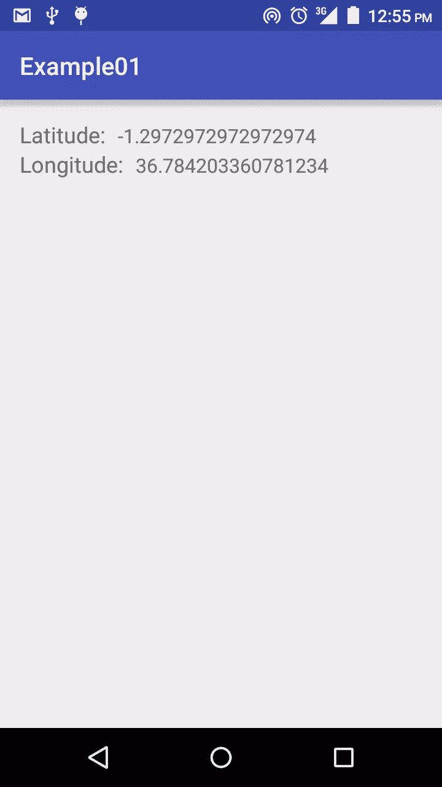
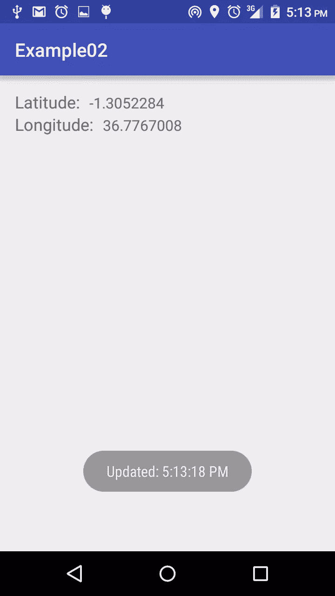
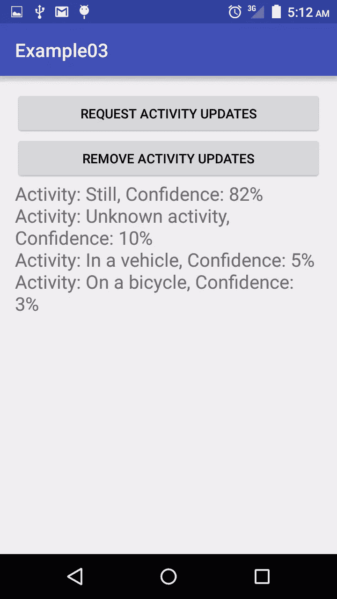

# 用于位置和活动识别的 Google Play 服务

> 原文：<https://www.sitepoint.com/google-play-services-location-activity-recognition/>

这篇文章由马克·托勒同行评审。感谢所有 SitePoint 的[同行评审](https://www.sitepoint.com/introduction-to-sitepoints-peer-review/)让 SitePoint 的内容尽可能做到最好！

* * *

人们喜欢随身携带移动设备，并经常使用它们。一些应用程序利用这一点，根据用户的位置和/或当前活动改变它们的行为，以提供更好的个性化服务。

要获得用户在 Android 上的当前位置，可以使用从 API level 1 开始就成为 Android 框架一部分的[位置 API](https://developer.android.com/guide/topics/location/index.html) ，也可以使用 Google 位置服务 API，它是 Google Play 服务的一部分。后者是访问 Android 位置的推荐方法。

Google 位置服务 API 是 Google Play 服务的一部分，它提供了一个更强大的高级框架，可以自动执行位置提供商选择和电源管理等任务。定位服务提供了框架 API 中没有的新特性，比如活动检测。

强烈建议使用框架 API 的开发人员，以及那些现在将位置感知添加到他们的应用程序中的开发人员使用位置服务 API，这就是我们将在本文中讨论的内容。我们将创建不同的应用程序，显示如何获得用户的当前位置，定期更新，并检测用户的当前活动。例如，他们是在走路、跑步、骑自行车、开车等等。

**注意**:您在本教程中用于测试的设备必须支持 Google Play 服务。你应该有一台运行 Android 2.3 或更高版本并包含谷歌 Play 商店的设备。如果您正在使用模拟器，您需要一个基于 Android 4.2.2 或更高版本的 Google APIs 平台的模拟器映像。

## 获取最后的已知位置

Google Play 服务位置 API 可以请求用户设备的最后已知位置，这相当于用户的当前位置。

要获取设备的最后已知位置，使用 [FusedLocationProviderApi](https://developers.google.com/android/reference/com/google/android/gms/location/FusedLocationProviderApi) ，它允许您指定要求，例如所需的位置精度。高精度意味着使用更多的电池电量。

创建一个新的 Android 项目，将其命名为`Example01`，将 SDK 的最低版本设置为 2.3.3 (Gingerbread)并在下一个窗口中选择*空活动*，在最后一个窗口中保留默认设置并单击 Finish。

**注意:**我假设你使用的是 Android Studio 1.4 或更高版本，其中的活动模板已经更改。以前版本中的*空白活动*模板导致了一个几乎是空白视图的应用程序，但现在它包括了一个浮动的操作按钮。对于我们的项目，我们将使用*空活动*，如果您使用的是以前的版本，那么选择*空活动*。

在 *build.gradle (Module: app)* 文件中包含以下依赖项，并同步 gradle 文件。

```
compile 'com.google.android.gms:play-services:8.1.0'
```

要使用定位服务，应用程序必须请求许可。Android 提供了两种位置权限:`ACCESS_COARSE_LOCATION`和`ACCESS_FINE_LOCATION`。您选择的权限决定了 API 返回的位置的准确性。*精*定位使用设备 GPS、蜂窝数据和 WiFi 来获得最精确的位置，但它消耗电池寿命。*粗略*定位使用设备蜂窝数据和 WiFi 来获取位置。它不会像*Fine*那样精确，但使用的电池电量要少得多，返回的位置精度相当于一个街区。

将以下权限添加到 *AndroidManifest.xml* 文件中，作为`manifest`标签的子标签。

```
<uses-permission android:name="android.permission.ACCESS_COARSE_LOCATION"/>
```

**注意**:如果你以前在应用程序中使用过 Google Play 服务，你可能习惯于将以下内容添加到清单文件中，该文件设置你的应用程序使用的 Google Play 服务的版本号。

```
<meta-data android:name="com.google.android.gms.version" android:value="@integer/google_play_services_version"/>
```

从 Google Play 服务的 7.0 版本开始，如果您使用的是 Gradle，它会自动包含在内。。

我们将使用融合定位提供商来获取设备的位置。这些信息将以一个 [Location](https://developer.android.com/reference/android/location/Location.html) 对象的形式呈现，您可以从中检索纬度、经度、时间戳和其他信息，如方位、高度和位置的速度。

我们将创建的应用程序将显示检索位置的原始纬度和经度数据。在一个真实的应用程序中，你可能会使用这些信息，例如，[获取位置地址](https://developer.android.com/training/location/display-address.html)，[在地图上标出位置](https://developers.google.com/maps/documentation/android-api/marker)，改变用户界面或发出通知。

让我们创建显示纬度和经度值的 UI。更改 *activity_main.xml* 如图所示。

```
<?xml version="1.0" encoding="utf-8"?>
<RelativeLayout
    xmlns:android="http://schemas.android.com/apk/res/android"
    xmlns:tools="http://schemas.android.com/tools"
    android:layout_width="match_parent"
    android:layout_height="match_parent"
    android:paddingLeft="@dimen/activity_horizontal_margin"
    android:paddingRight="@dimen/activity_horizontal_margin"
    android:paddingTop="@dimen/activity_vertical_margin"
    android:paddingBottom="@dimen/activity_vertical_margin"
    tools:context=".MainActivity">

    <TextView
        android:id="@+id/latitude"
        android:layout_width="wrap_content"
        android:layout_height="wrap_content"
        android:layout_alignParentLeft="true"
        android:layout_alignParentTop="true"
        android:text="Latitude:"
        android:textSize="18sp" />
    <TextView
        android:id="@+id/latitude_textview"
        android:layout_width="wrap_content"
        android:layout_height="wrap_content"
        android:layout_alignBaseline="@+id/latitude"
        android:layout_marginLeft="10dp"
        android:layout_toRightOf="@+id/latitude"
        android:textSize="16sp" />
    <TextView
        android:id="@+id/longitude"
        android:layout_width="wrap_content"
        android:layout_height="wrap_content"
        android:layout_alignParentLeft="true"
        android:layout_alignParentTop="true"
        android:text="Longitude:"
        android:layout_marginTop="24dp"
        android:textSize="18sp" />
    <TextView
        android:id="@+id/longitude_textview"
        android:layout_width="wrap_content"
        android:layout_height="wrap_content"
        android:layout_alignBaseline="@+id/longitude"
        android:layout_marginLeft="10dp"
        android:layout_toRightOf="@+id/longitude"
        android:textSize="16sp"/>

</RelativeLayout>
```

在*MainActivity.java*中增加以下内容。

```
private static final String TAG = "MainActivity";
private TextView mLatitudeTextView;
private TextView mLongitudeTextView;
```

通过在`onCreate(Bundle)`的末尾添加以下内容来实例化两个`TextView`。

```
mLatitudeTextView = (TextView) findViewById((R.id.latitude_textview));
mLongitudeTextView = (TextView) findViewById((R.id.longitude_textview));
```

当你想连接到 Google Play 服务库中提供的某个 Google APIs 时，你需要创建一个 [`GoogleApiClient`](https://developers.google.com/android/reference/com/google/android/gms/common/api/GoogleApiClient.html) 的实例。Google API 客户端提供了所有 Google Play 服务的公共入口点，并管理用户设备和每个 Google 服务之间的网络连接。

在建立连接之前，您必须始终检查兼容的 Google Play 服务 APK。为此，要么使用 [`isGooglePlayServicesAvailable()`](https://developers.google.com/android/reference/com/google/android/gms/common/GooglePlayServicesUtil.html#isGooglePlayServicesAvailable(android.content.Context)) 方法，要么将一个`GoogleApiClient.OnConnectionFailedListener`对象附加到您的客户端并实现其`onConnectionFailed()`回调方法。我们将使用后一种方法。

如果由于 Google Play APK 版本缺失或过期而导致连接失败，回调会收到一个错误代码，如 [`SERVICE_MISSING`](https://developers.google.com/android/reference/com/google/android/gms/common/ConnectionResult.html#SERVICE_MISSING) 、 [`SERVICE_VERSION_UPDATE_REQUIRED`](https://developers.google.com/android/reference/com/google/android/gms/common/ConnectionResult.html#SERVICE_VERSION_UPDATE_REQUIRED) 或 [`SERVICE_DISABLED`](https://developers.google.com/android/reference/com/google/android/gms/common/ConnectionResult.html#SERVICE_DISABLED) 。

如下所示更改类别定义。

```
public class MainActivity extends AppCompatActivity implements ConnectionCallbacks, OnConnectionFailedListener
```

添加必要的导入，并从两个接口实现以下方法。

```
@Override
public void onConnected(Bundle bundle) {

}

@Override
public void onConnectionSuspended(int i) {

}

@Override
public void onConnectionFailed(ConnectionResult connectionResult) {

}
```

`ConnectionCallbacks`接口提供了当客户端连接到服务或从服务断开时调用的回调函数(`onConnected()`和`onConnectionSuspended()`),而`OnConnectionFailedListener`接口提供了导致客户端连接到服务失败的回调函数(`onConnectionFailed()`)。

在任何操作执行之前，`GoogleApiClient`必须使用`connect()`方法进行连接。直到调用了`onConnected(Bundle)`回调，客户端才被认为是连接的。

当你的应用使用完这个客户端后，调用`disconnect()`来释放资源。

您应该在活动的`onCreate(Bundle)`方法中实例化客户端对象，然后调用`onStart()`中的`connect()`和`onStop()`中的`disconnect()`。

添加下面的类变量来保存`GoogleApiClient`和`Location`对象。

```
private GoogleApiClient mGoogleApiClient;
private Location mLocation;
```

在`onCreate()`方法的最后，使用 [`GoogleApiClient.Builder`](https://developer.android.com/reference/com/google/android/gms/common/api/GoogleApiClient.Builder.html) 创建一个 Google API 客户端的实例。使用构建器添加 [`LocationServices`](https://developer.android.com/reference/com/google/android/gms/location/LocationServices.html) API。

```
mGoogleApiClient = new GoogleApiClient.Builder(this)
            .addConnectionCallbacks(this)
            .addOnConnectionFailedListener(this)
            .addApi(LocationServices.API)
            .build();
```

如下所示，更改之前添加的回调方法。

```
@Override
public void onConnected(Bundle bundle) {
    mLocation = LocationServices.FusedLocationApi.getLastLocation(mGoogleApiClient);
    if (mLocation != null) {
        mLatitudeTextView.setText(String.valueOf(mLocation.getLatitude()));
        mLongitudeTextView.setText(String.valueOf(mLocation.getLongitude()));
    } else {
        Toast.makeText(this, "Location not Detected", Toast.LENGTH_SHORT).show();
    }
}

@Override
public void onConnectionSuspended(int i) {
    Log.i(TAG, "Connection Suspended");
    mGoogleApiClient.connect();
}

@Override
public void onConnectionFailed(ConnectionResult connectionResult) {
    Log.i(TAG, "Connection failed. Error: " + connectionResult.getErrorCode());
}
```

在`onConnected()`方法中，我们通过调用`getLastLocation()`获得`Location`对象，然后用来自该对象的纬度和经度值更新 UI。当位置不可用时，返回的位置对象在极少数情况下可能是`null`，所以我们检查这一点。

如果由于某种原因失去连接，就会调用`onConnectionSuspended()`,这里我们尝试重新建立连接。如果连接失败，调用`onConnectionFailed()`，我们只记录错误代码。您可以在这里查看可用的错误代码[。](http://developers.google.com/android/reference/com/google/android/gms/common/ConnectionResult.html)

如图所示，覆盖`onStart()`和`onStop()`方法。

```
@Override
protected void onStart() {
    super.onStart();
    mGoogleApiClient.connect();
}

@Override
protected void onStop() {
    super.onStop();
    if (mGoogleApiClient.isConnected()) {
        mGoogleApiClient.disconnect();
    }
}
```

它们会在适当的时候启动和断开与服务的连接。

运行应用程序，你应该会看到显示的纬度和经度。



你可以在这里下载完成的 Example01 项目[。](https://github.com/sitepoint-editors/Location-and-Activity-Recognition/tree/master/Example01)

## 获取定期位置更新

一些应用程序，例如健身或导航应用程序，可能需要持续跟踪位置数据。虽然您可以通过`getLastLocation()`获得设备的位置，但更直接的方法是向融合位置提供商请求定期更新。然后，API 将根据当前可用的位置提供商(如 WiFi 和 GPS)定期更新您的应用程序，以获得最佳可用位置。位置的准确性取决于提供商、您请求的位置权限以及您在位置请求中设置的选项。

使用与上一个项目相似的设置创建另一个项目，并将其命名为 *Example02* 。

将 play services 依赖项添加到 *build.gradle(Module: app)* 文件中。

```
compile 'com.google.android.gms:play-services:8.1.0'
```

向清单文件添加权限。

```
<uses-permission android:name="android.permission.ACCESS_FINE_LOCATION"/>
```

将 *activity_main.xml* 更改如下。

```
<?xml version="1.0" encoding="utf-8"?>
<RelativeLayout
    xmlns:android="http://schemas.android.com/apk/res/android"
    xmlns:tools="http://schemas.android.com/tools"
    android:layout_width="match_parent"
    android:layout_height="match_parent"
    android:paddingLeft="@dimen/activity_horizontal_margin"
    android:paddingRight="@dimen/activity_horizontal_margin"
    android:paddingTop="@dimen/activity_vertical_margin"
    android:paddingBottom="@dimen/activity_vertical_margin"
    tools:context=".MainActivity">

    <TextView
        android:id="@+id/latitude"
        android:layout_width="wrap_content"
        android:layout_height="wrap_content"
        android:layout_alignParentLeft="true"
        android:layout_alignParentTop="true"
        android:text="Latitude:"
        android:textSize="18sp" />
    <TextView
        android:id="@+id/latitude_textview"
        android:layout_width="wrap_content"
        android:layout_height="wrap_content"
        android:layout_alignBaseline="@+id/latitude"
        android:layout_marginLeft="10dp"
        android:layout_toRightOf="@+id/latitude"
        android:textSize="16sp" />
    <TextView
        android:id="@+id/longitude"
        android:layout_width="wrap_content"
        android:layout_height="wrap_content"
        android:layout_alignParentLeft="true"
        android:layout_alignParentTop="true"
        android:text="Longitude:"
        android:layout_marginTop="24dp"
        android:textSize="18sp" />
    <TextView
        android:id="@+id/longitude_textview"
        android:layout_width="wrap_content"
        android:layout_height="wrap_content"
        android:layout_alignBaseline="@+id/longitude"
        android:layout_marginLeft="10dp"
        android:layout_toRightOf="@+id/longitude"
        android:textSize="16sp"/>

</RelativeLayout>
```

更改`MainActivity`的类定义。

```
public class MainActivity extends AppCompatActivity implements ConnectionCallbacks, OnConnectionFailedListener, LocationListener
```

进行必要的进口。用于`LocationListener`导入`import com.google.android.gms.location.LocationListener`而不是其他建议的导入。

`LocationListener`用于在位置发生变化时接收来自`FusedLocationProviderApi`的通知。

从三个接口实现方法。

```
@Override
public void onConnected(Bundle bundle) {

}

@Override
public void onConnectionSuspended(int i) {

}

@Override
public void onLocationChanged(Location location) {

}

@Override
public void onConnectionFailed(ConnectionResult connectionResult) {

}
```

当位置改变时，调用`onLocationChanged()`方法。

添加以下类变量。

```
private static final String TAG = "MainActivity";
private GoogleApiClient mGoogleApiClient;
private LocationRequest mLocationRequest;
private String mLastUpdateTime;
private TextView mLatitudeTextView;
private TextView mLongitudeTextView;
```

`LocationRequest`是包含对`FusedLocationProviderApi`的请求的服务质量参数的数据对象。我们很快就会看到它的用途。

如下所示更改`onCreate()`以覆盖`onStart()`和`onPause()`方法。

```
@Override
protected void onCreate(Bundle savedInstanceState) {
    super.onCreate(savedInstanceState);
    setContentView(R.layout.activity_main);

    mLatitudeTextView = (TextView) findViewById((R.id.latitude_textview));
    mLongitudeTextView = (TextView) findViewById((R.id.longitude_textview));

    mGoogleApiClient = new GoogleApiClient.Builder(this)
            .addConnectionCallbacks(this)
            .addOnConnectionFailedListener(this)
            .addApi(LocationServices.API)
            .build();
}

@Override
protected void onStart() {
    super.onStart();
    mGoogleApiClient.connect();
}
@Override
protected void onStop() {
    super.onStop();
    if (mGoogleApiClient.isConnected()) {
        mGoogleApiClient.disconnect();
    }
}
```

这和我们上一个例子做的差不多，就不需要解释了。

如下所示更改以前实现的接口方法。

```
@Override
public void onConnected(Bundle bundle) {
    mLocationRequest = LocationRequest.create();
    mLocationRequest.setPriority(LocationRequest.PRIORITY_HIGH_ACCURACY);
    mLocationRequest.setInterval(5000);
    mLocationRequest.setFastestInterval(3000);
    LocationServices.FusedLocationApi.requestLocationUpdates(mGoogleApiClient, mLocationRequest, this);
}

@Override
public void onConnectionSuspended(int i) {
    Log.i(TAG, "Connection Suspended");
    mGoogleApiClient.connect();
}

@Override
public void onLocationChanged(Location location) {
    mLastUpdateTime = DateFormat.getTimeInstance().format(new Date());
    mLatitudeTextView.setText(String.valueOf(location.getLatitude()));
    mLongitudeTextView.setText(String.valueOf(location.getLongitude()));
    Toast.makeText(this, "Updated: " + mLastUpdateTime, Toast.LENGTH_SHORT).show();
}

@Override
public void onConnectionFailed(ConnectionResult connectionResult) {
    Log.i(TAG, "Connection failed. Error: " + connectionResult.getErrorCode());
}
```

在`onConnected()`中，我们创建了`LocationRequest`对象，它存储了对融合位置提供者的请求的参数。这些参数决定了所要求的精度水平。要了解位置请求中所有可用的选项，请参见 [LocationRequest](https://developer.android.com/reference/com/google/android/gms/location/LocationRequest.html) 类参考。在我们的示例中，我们设置了优先级、更新间隔和最快的更新间隔。

`setPriority()`设置请求的优先级，这为 Google Play 服务位置服务提供了关于使用哪些位置源的强烈提示。支持以下值:

*   `PRIORITY_BALANCED_POWER_ACCURACY`:使用此设置请求城市街区内的定位精度，精度约为 100 米。这被认为是粗略的精确度，并且可能消耗较少的功率。通过此设置，定位服务可能会使用 WiFi 和手机信号塔定位。请注意，位置提供商的选择取决于其他因素，例如哪些资源可用。
*   `PRIORITY_HIGH_ACCURACY`:使用该设置请求最精确的位置。通过此设置，定位服务更有可能使用 GPS 来确定位置。
*   `PRIORITY_LOW_POWER`:使用此设置请求城市级精度，精度约为 10 公里。这被认为是粗略的精确度，并且可能消耗较少的功率。
*   `PRIORITY_NO_POWER`:如果您需要对功耗的影响可以忽略不计，但希望接收可用的位置更新，请使用此设置。使用此设置，您的应用程序不会触发任何位置更新，但会接收由其他应用程序触发的位置。

`setInterval()`方法以毫秒为单位设置活动位置更新的期望间隔。这个间隔不准确。如果没有可用的位置源，您可能根本收不到更新，或者接收更新的速度比请求的速度慢。如果其他应用程序以更快的时间间隔请求位置，您接收更新的速度可能会快于请求的速度。

`setFastestInterval()`方法设置了活动位置更新的最快速率。这个时间间隔是精确的，您的应用程序接收更新的速度永远不会超过这个值。您需要设置此速率，因为其他应用会影响发送更新的速率。Google Play 服务位置 API 以任何应用程序使用`setInterval()`请求的最快速度发送更新。如果这个速度超过了你的应用程序可以处理的速度，你可能会遇到用户界面闪烁或数据溢出的问题。为了防止这种情况，需要设置更新速率的上限。

随着位置请求的建立，我们调用`requestLocationUpdates()`开始定期更新。

使用更新后的位置调用`onLocationChanged()`方法。这里，我们用位置信息更新 UI。我们还设置了一个显示更新时间的祝酒辞。

运行该应用程序，如果你移动足够远，读数会发生变化，你应该会看到更新的位置数据。



完成的 Example02 项目可以在这里下载[。](https://github.com/sitepoint-editors/Location-and-Activity-Recognition/tree/master/Example02)

## 活动识别

除了检测您的 Android 设备的位置，Google 定位服务 API 还可以用于检测设备以及用户可能正在进行的活动。它可以检测诸如用户正在步行、在车辆中、在自行车上或静止的活动。它没有给出明确的数据，只是给出了某项活动发生的可能性的概率。由程序员来读取这些数据并决定如何处理。

首先，创建一个名为 *Example03* 的新项目，其设置与前两个项目相同。

在 *build.gradle (Module: app)* 文件中包含依赖关系，同步 gradle 文件。

```
compile 'com.google.android.gms:play-services:8.1.0'
```

在清单文件中，包含以下活动识别权限作为`manifest`标签的子标签。

```
<uses-permission android:name="com.google.android.gms.permission.ACTIVITY_RECOGNITION" />
```

将 *activity_main.xml* 更改如下。

```
<?xml version="1.0" encoding="utf-8"?>
<LinearLayout
    xmlns:android="http://schemas.android.com/apk/res/android"
    xmlns:tools="http://schemas.android.com/tools"
    android:layout_width="match_parent"
    android:layout_height="match_parent"
    android:paddingLeft="@dimen/activity_horizontal_margin"
    android:paddingRight="@dimen/activity_horizontal_margin"
    android:paddingTop="@dimen/activity_vertical_margin"
    android:paddingBottom="@dimen/activity_vertical_margin"
    android:orientation="vertical"
    tools:context=".MainActivity">

    <Button
        android:id="@+id/request_updates_button"
        android:layout_width="match_parent"
        android:layout_height="wrap_content"
        android:onClick="requestActivityUpdates"
        android:text="Request Activity Updates" />

    <Button
        android:id="@+id/remove_updates_button"
        android:layout_width="match_parent"
        android:layout_height="wrap_content"
        android:onClick="removeActivityUpdates"
        android:text="Remove Activity Updates" />

    <TextView
        android:id="@+id/detected_activities_textview"
        android:layout_width="match_parent"
        android:layout_height="wrap_content"
        android:textSize="20sp"/>
</LinearLayout>
```

通常，利用活动识别的应用程序在后台监控活动，并在检测到特定活动时执行操作。为了做到这一点而不需要一个总是在后台运行的服务消耗资源，检测到的活动通过一个`Intent`来交付。应用程序指定了一个`PendingIntent`回调(通常是一个`IntentService`)，当检测到活动时，将有目的地调用这个回调。意向接收方可以使用[extract result(Android . content . intent)](https://developers.google.com/android/reference/com/google/android/gms/location/ActivityRecognitionResult.html#extractResult(android.content.Intent))提取[activity recognition result](https://developers.google.com/android/reference/com/google/android/gms/location/ActivityRecognitionResult.html)。

在`IntentService`类之前，创建一个名为`Constants`的类，并如图所示进行更改。它会保存一些我们稍后会用到的常量。

```
package com.echessa.example03; // Change as appropriate

/**
 * Created by echessa on 10/14/15.
 */
public class Constants {

    private Constants(){

    }

    public static final String PACKAGE_NAME = "com.echessa.activityexample"; // Change as appropriate

    public static final String STRING_ACTION = PACKAGE_NAME + ".STRING_ACTION";

    public static final String STRING_EXTRA = PACKAGE_NAME + ".STRING_EXTRA";

}
```

接下来我们创建一个`IntentService`。创建一个名为`ActivitiesIntentService`的类，并将其扩展为`IntentService`。如图所示更改内容。

```
package com.echessa.example03; // Change as appropriate

import android.app.IntentService;
import android.content.Intent;
import android.support.v4.content.LocalBroadcastManager;

import com.google.android.gms.location.ActivityRecognitionResult;
import com.google.android.gms.location.DetectedActivity;

import java.util.ArrayList;

/**
 * Created by echessa on 10/14/15.
 */
public class ActivitiesIntentService extends IntentService {

    private static final String TAG = "ActivitiesIntentService";

    public ActivitiesIntentService() {
        super(TAG);
    }

    @Override
    protected void onHandleIntent(Intent intent) {
        ActivityRecognitionResult result = ActivityRecognitionResult.extractResult(intent);
        Intent i = new Intent(Constants.STRING_ACTION);

        ArrayList<DetectedActivity> detectedActivities = (ArrayList) result.getProbableActivities();

        i.putExtra(Constants.STRING_EXTRA, detectedActivities);
        LocalBroadcastManager.getInstance(this).sendBroadcast(i);
    }
}
```

在上面的类中，构造函数是必需的。它用一个工作线程的名字调用超级`IntentService(String)`构造函数。

在`onHandleIntent()`中，我们通过使用`extractResult()`从意图中得到`ActivityRecognitionResult`。然后我们使用这个结果获得一个`DetectedActivity`对象的数组列表。每个活动都与一个置信水平相关联，置信水平是 0 到 100 之间的一个`int`。然后，我们创建一个新的意图，我们将根据它发送检测到的活动。最后，我们广播这个意图，这样它就能被接收到。

将以下内容粘贴到清单文件中，以便 Android 系统了解该服务。它应该是`application`标签的子标签。

```
<service
        android:name=".ActivitiesIntentService"
        android:exported="false" />
```

在`MainActivity`中实现`ConnectionCallbacks`和`OnConnectionFailedListener`接口。

```
public class MainActivity extends AppCompatActivity implements ConnectionCallbacks, OnConnectionFailedListener
```

进行必要的导入并实现它们的方法。

```
@Override
public void onConnected(Bundle bundle) {
    Log.i(TAG, "Connected");
}

@Override
public void onConnectionSuspended(int i) {
    Log.i(TAG, "Connection suspended");
    mGoogleApiClient.connect();
}

@Override
public void onConnectionFailed(ConnectionResult connectionResult) {
    Log.i(TAG, "Connection failed. Error: " + connectionResult.getErrorCode());
}
```

您将看到一个错误，因为我们还没有创建`mGoogleApiClient`变量。

将以下变量添加到`MainActivity`。

```
private static final String TAG = "MainActivity";
private GoogleApiClient mGoogleApiClient;
private TextView mDetectedActivityTextView;
```

在`onCreate()`的末尾粘贴以下内容。

```
mDetectedActivityTextView = (TextView) findViewById(R.id.detected_activities_textview);

mGoogleApiClient = new GoogleApiClient.Builder(this)
            .addConnectionCallbacks(this)
            .addOnConnectionFailedListener(this)
            .addApi(ActivityRecognition.API)
            .build();
```

请注意，我们在创建 Google Api 客户端时添加了`ActivityRecognition.API`,而不是像在前面的示例中那样添加位置 Api。

包括连接和断开客户端的`onStart()`和`onStop()`方法。

```
@Override
protected void onStart() {
    super.onStart();
    mGoogleApiClient.connect();
}

@Override
protected void onStop() {
    super.onStop();
    if (mGoogleApiClient.isConnected()) {
        mGoogleApiClient.disconnect();
    }
}
```

在`ActivitiesIntentService`类中，我们广播了一个包含一系列检测到的活动的意图，我们需要一个 receiver 类来接收它。在我们创建之前，在 *strings.xml* 中包含下面的`strings`。文件。

```
<string name="in_vehicle">In a vehicle</string>
<string name="on_bicycle">On a bicycle</string>
<string name="on_foot">On foot</string>
<string name="running">Running</string>
<string name="walking">Walking</string>
<string name="still">Still</string>
<string name="tilting">Tilting</string>
<string name="unknown">Unknown activity</string>
<string name="unidentifiable_activity">Unidentifiable activity: %1$d</string>
```

在`MainActivity`中，添加下面的方法，我们将在后面的`BroadcastReciever`中使用。这将获取检测到的活动类型的代码，并返回与该活动相关的相关字符串。

```
public String getDetectedActivity(int detectedActivityType) {
    Resources resources = this.getResources();
    switch(detectedActivityType) {
        case DetectedActivity.IN_VEHICLE:
            return resources.getString(R.string.in_vehicle);
        case DetectedActivity.ON_BICYCLE:
            return resources.getString(R.string.on_bicycle);
        case DetectedActivity.ON_FOOT:
            return resources.getString(R.string.on_foot);
        case DetectedActivity.RUNNING:
            return resources.getString(R.string.running);
        case DetectedActivity.WALKING:
            return resources.getString(R.string.walking);
        case DetectedActivity.STILL:
            return resources.getString(R.string.still);
        case DetectedActivity.TILTING:
            return resources.getString(R.string.tilting);
        case DetectedActivity.UNKNOWN:
            return resources.getString(R.string.unknown);
        default:
            return resources.getString(R.string.unidentifiable_activity, detectedActivityType);
    }
}
```

将以下子类添加到扩展了`BroadcastReceiver`的`MainActivity`中。

```
public class ActivityDetectionBroadcastReceiver extends BroadcastReceiver {

    @Override
    public void onReceive(Context context, Intent intent) {
        ArrayList<DetectedActivity> detectedActivities = intent.getParcelableArrayListExtra(Constants.STRING_EXTRA);
        String activityString = "";
        for(DetectedActivity activity: detectedActivities){
            activityString +=  "Activity: " + getDetectedActivity(activity.getType()) + ", Confidence: " + activity.getConfidence() + "%\n";
        }
        mDetectedActivityTextView.setText(activityString);
    }
}
```

上面，我们得到了检测到的活动的数组，并遍历它们，得到每个活动的类型和置信度。然后，我们将它附加到一个字符串中，并用该字符串更新 UI。

在`MainActivity`中添加以下变量。

```
private ActivityDetectionBroadcastReceiver mBroadcastReceiver;
```

然后在实例化`mDetectedActivityTextView`的语句后的`onCreate()`中实例化它

```
mBroadcastReceiver = new ActivityDetectionBroadcastReceiver();
```

将以下方法添加到`MainActivity`中。

```
public void requestActivityUpdates(View view) {
    if (!mGoogleApiClient.isConnected()) {
        Toast.makeText(this, "GoogleApiClient not yet connected", Toast.LENGTH_SHORT).show();
    } else {
        ActivityRecognition.ActivityRecognitionApi.requestActivityUpdates(mGoogleApiClient, 0, getActivityDetectionPendingIntent()).setResultCallback(this);
    }
}

public void removeActivityUpdates(View view) {
    ActivityRecognition.ActivityRecognitionApi.removeActivityUpdates(mGoogleApiClient, getActivityDetectionPendingIntent()).setResultCallback(this);
}

private PendingIntent getActivityDetectionPendingIntent() {
    Intent intent = new Intent(this, ActivitiesIntentService.class);

    return PendingIntent.getService(this, 0, intent, PendingIntent.FLAG_UPDATE_CURRENT);
}
```

然后更改类定义来实现`ResultCallback`，因为在上面的代码中，我们将结果回调设置为`this`。

```
public class MainActivity extends AppCompatActivity implements ConnectionCallbacks, OnConnectionFailedListener, ResultCallback<Status>
```

上面的第一种方法使用`requestActivityUpdates()`注册活动识别更新，而第二种方法取消注册。通过周期性地唤醒设备并读取传感器数据的短脉冲来检测活动。它利用低功耗传感器将功耗降至最低。可以用第二个参数来控制活动检测更新间隔。更大的值将导致更少的活动检测，同时提高电池寿命。较小的值将导致更频繁的活动检测，但是将消耗更多的功率，因为设备必须更频繁地被唤醒。如果活动检测服务需要更多样本来进行更准确的预测，则活动可能会在请求的时间间隔后几秒到达。

实现下面的`ResultCallback`方法，该方法获取状态并根据状态记录不同的消息。

```
public void onResult(Status status) {
    if (status.isSuccess()) {
        Log.e(TAG, "Successfully added activity detection.");

    } else {
        Log.e(TAG, "Error: " + status.getStatusMessage());
    }
}
```

将以下内容添加到`MainActivity`。

```
@Override
protected void onResume() {
    super.onResume();
    LocalBroadcastManager.getInstance(this).registerReceiver(mBroadcastReceiver, new IntentFilter(Constants.STRING_ACTION));
}

@Override
protected void onPause() {
    LocalBroadcastManager.getInstance(this).unregisterReceiver(mBroadcastReceiver);
    super.onPause();
}
```

这分别在活动恢复和暂停时注册和取消注册广播接收器。

运行应用程序，按下请求活动更新按钮，您应该开始获得活动更新。您可能需要等待几秒钟，更新才会开始显示。



完成的 Example03 项目可以在这里下载[。](https://github.com/sitepoint-editors/Location-and-Activity-Recognition/tree/master/Example03)

## 结论

我们还没有穷尽 Google Play 服务位置 API 的所有功能，还有一些主题我们还没有涉及，例如[地理围栏](https://developer.android.com/training/location/geofencing.html)，获取位置的地址以及在地图上绘制位置。我们将在 Google Play 服务系列的地图文章中探讨这个主题。

*如果您对*有任何问题或意见，请告诉我。

## 分享这篇文章