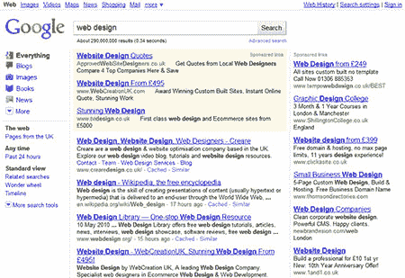
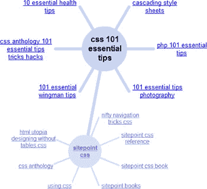

# 谷歌搜索重新设计:成功还是失败？

> 原文：<https://www.sitepoint.com/google-search-redesign/>

谷歌不经常改变他们的搜索页面——当你每天提供 1100 万次页面浏览时，你需要非常小心。然而，你可能已经注意到本周发生的一些微妙和不那么微妙的变化。

## 打火机标志

谷歌对他们的标志进行了更轻、更亮、更简单的改编。

当你把两者放在一起看时，我更喜欢新版本。然而，我不相信它在小尺寸的 Google.com 上也能很好地工作。这些颜色给了它更多的童趣，尽管我认为它改善了页脚链接的外观:

## 左侧面板

最大的变化是谷歌的新面板出现在结果页面上:

实际上，这并不是什么特别新的东西——谷歌从 2006 年就开始测试这一设计，而且它已经推出(但被隐藏了)大约一年了。该面板现在是一个永久的固定设备，它提供了对图像、视频、购物、书籍等类别的轻松访问。一旦你在一个类别中，下面的一组链接显示相关的工具，例如图像大小/颜色选项，翻译，搜索活动的时间表和相关搜索的“神奇转盘”…

## 好点了吗？

评论褒贬不一。我最初的想法是谷歌创造了一个看起来相当单调的 Bing.com 版本。左边的面板提供了许多选项，虽然它最初是折叠的，但它会让人感到有点不知所措。但这可能是因为我太习惯谷歌过于简单的结果页面了吗？

如果你不喜欢新的设计，你可以换回旧的 Google.com，但要充分利用它——旧的系统不会再用了。

你怎么想呢?新功能是增强了还是削弱了谷歌搜索？必应更好吗？请[在 SitePoint 主页](/)上投票，并在下面留下您的评论。

## 分享这篇文章