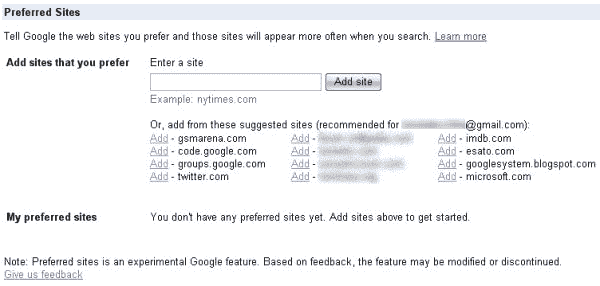

# 谷歌测试“首选网站”个性化

> 原文：<https://www.sitepoint.com/google-testing-preferred-sites-personalization/>

 [据谷歌操作系统](http://googlesystem.blogspot.com/2009/01/google-preferred-sites.html)报道，谷歌正在为精选用户测试一个新的搜索定制选项，名为谷歌首选网站。如果你有访问该服务的权限，登录后你会在你的[偏好页面](http://www.google.com/preferences)上找到该选项(我没有打开)。

“首选网站功能可以让你设置你的谷歌网络搜索偏好，这样你的搜索结果就能符合你独特的品味和需求，”谷歌在一个帮助页面上解释道。“填写您最依赖的网站，当这些网站与您的搜索查询相关时，您首选网站的结果会更频繁地出现。”

登录后，您的首选网站将在匹配的搜索查询结果中显示得更靠前。例如，如果您通常希望在搜索电影时首先显示 IMDB 结果，您可以将 IMDB 添加到您的首选列表中。或者，如果您希望 SitePoint 上的技术文章出现在相关查询中，您也可以对该站点进行同样的操作。

谷歌操作系统的 Alex Chitu 列出了谷歌首选网站的一些其他用例，包括作为书签的部分替代，以及确保模糊网站(如当地新闻媒体)在搜索中排名靠前的方法。然而，我对这个系统的潜在好处感到困惑。

搜索个性化最近一直是谷歌的热门话题。11 月，谷歌推出了名为 SearchWiki 的[功能，允许用户在登录时通过重新排序或删除搜索结果，或者在上面留下评论来编辑搜索结果。(谷歌操作系统实际上报告了 Preferred Sites 是更早的 SearchWiki 实验的扩展。)](https://www.sitepoint.com/google-to-launch-customizable-search-tonight/)

然而，我怀疑编辑搜索结果是一件好事。跟踪你最喜欢的网站是书签的工作，搜索这些书签可以通过第三方服务来完成，比如 [deliGoo](http://www.deligoo.com/) 。然而，搜索结果的虚化只会给每个用户带来不同的体验，这可能不是一件好事。个性化搜索不仅从根本上改变了搜索引擎优化的做法，它还让帮助你的同行在网上找到东西变得更加困难。当每个人的谷歌搜索结果都不一样时，“在谷歌上搜索”就行不通了。

另一方面，Chitu 的首选站点用例确实很有意义。例如，当我在谷歌上搜索一部电影时，我通常会寻找一些网站的快速链接——IMDB、维基百科、烂番茄——将这些链接添加到谷歌首选网站可以确保它们首先出现。

你怎么想呢?首选网站是好主意还是坏主意？请在评论中告诉我们。

## 分享这篇文章