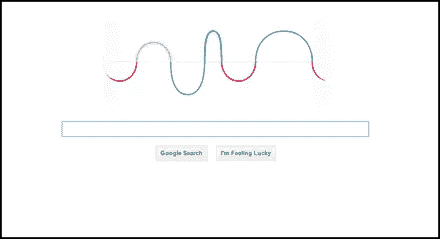

# 谷歌的涂鸦和为什么它赫兹我的大脑！

> 原文：<https://www.sitepoint.com/googles-doodle-and-why-it-hertz-my-brain/>

我们是如何爱上谷歌涂鸦的？让我们细数一下。

他们很聪明。事实上，我甚至喜欢每天起床，因为我知道在山景城的某个地方可能有人在大喊“哇哦！下周是罗伯特·海因莱茵爸爸的生日！今天我想在谷歌上做一个动画火箭！

我们都有自己喜欢的。我喜欢吃豆人致敬。[可弹奏的莱斯·保罗吉他](http://www.google.com/doodles/les-pauls-96th-birthday)。[向儒勒·凡尔纳致敬的惊人深海](http://www.google.com/doodles/jules-vernes-183rd-birthday)。这是真的，标准已经定得很高了。

[](https://www.sitepoint.com/wp-content/uploads/2012/02/doodle-22feb.png)

谷歌向海因里希·赫兹致敬——2012 年 2 月 22 日

但是当丹·莱德勒指出今天是庆祝伟大的德国物理学家 T2·海因里希·赫兹的日子时，我们都有点吃惊。

赫兹的工作以波为中心——从光到无线电——所以谷歌通过将他们著名的标志演变成一个轻轻移动的波来纪念他的 155 岁生日。

这是一个很好的想法，但让我们挠头的是他们如何让它摆动。

在这里，我们有(可以说是)这个星球上技术最娴熟的网络公司选择将 wave 制作成动画 GIF。

更准确地说，是一个 197kb，49 帧，有点不稳定的动画 GIF。眉头紧锁。

显而易见的问题是“为什么？”当然，我们都知道对动画 gif 的支持无处不在，通常简单的解决方案*是最好的解决方案。然而，对于一个如此大力支持 HTML5 的公司来说，这似乎是一个奇怪的决定。*

因此，我们没有只是抱怨——尽管我们也喜欢这样——而是快速地尝试了一些替代方案。这是目前为止的结果。

### 仅 CSS3 方法

很容易，最快的工作方法是 CSS3。我们从最简单的 HTML 开始。

注意:为了清楚起见，下面我只展示 W3C 标准，但是这个例子包含了所有需要的前缀 CSS。

```
<div id="wavelength"></div>
```

基本的 CSS 设置并不复杂。我们给出了 DIV 的宽度和高度，并将我们的 wave 图形嵌入背景中。

```
#wavelength{
width:380px;
height:223px;
margin: 100px auto;
border:1px #ddd dashed;
background: url(https://i2.sitepoint.com/examples/css3/animation/hertz.png);
position:relative;
}
```

关键帧动画代码只是将背景图像位置从默认位置(0px 0px)向左滑动 380px。

```
@keyframes hertz {
    0% {background-position:0px 0px;}
    100% {background-position:-380px 0px;}
}​
```

然后，我们只需将动画附加到#波长分区。

```
animation: hertz 4s infinite linear; /* w3c standard */
```

作为最后的润色，我使用#wavelength DIV 的 **:before** 和 **:after** 伪元素来提供你在原始 GIF 的左右两侧看到的蓬松的白色边缘。

这里是 Codepen >和[jsdild](https://jsfiddle.net/xplo69/ZxuCY/16/)的工作演示。

在 [CodePen](http://codepen.io) 上看到 Alex ( [@alexmwalker](http://codepen.io/alexmwalker) )的笔[谷歌的赫兹涂鸦](http://codepen.io/alexmwalker/pen/rWyrwv/)。