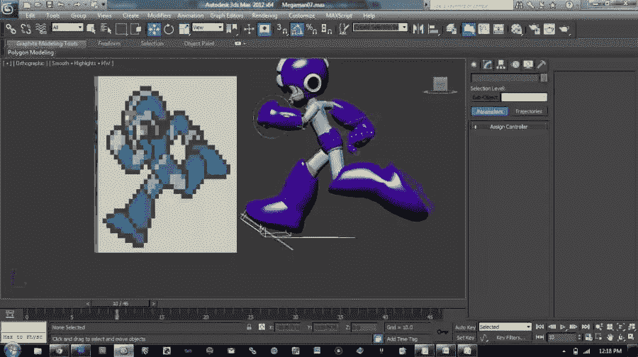
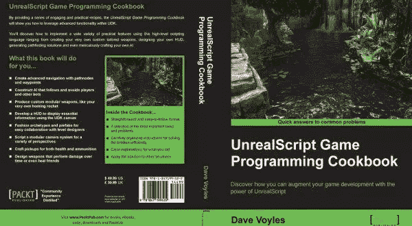
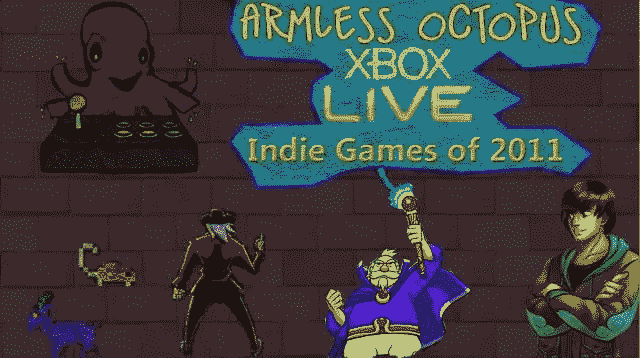

# 我是如何开始技术布道的

> 原文：<https://www.sitepoint.com/got-started-technical-evangelism/>

本文是微软网站开发系列的一部分。感谢您对使 SitePoint 成为可能的合作伙伴的支持。 

这是一个我经常被问到的问题，所以我想我应该把它写下来，这样更容易分享。我也向我的一些同行询问了他们的故事，因为他们都有独特的背景，这绝对是一个有趣的角色，有许多途径可以实现它。

我想分享我的故事，以便其他想进入这一领域的人，或者没有技术背景的人，能够明白一条道路是存在的。

## 教育

首先，我没有工程或计算机科学背景。我去了纽约州的一所小的州立学校(SUNY·奥尼昂塔)，学习传播学。2009 年毕业后，我回到纽约理工大学，开始了我的大学生涯，并完成了信息系统管理 MBA 的第一年。直到大学快结束的时候，我才发现你可以学习计算机。

当我开始攻读 MBA 时，我曾尝试学习一年的计算机科学，但作为一名研究生，我必须学习为新生设计的数学课程，而且我无法通过任何一门课程。(我高中时数学平均成绩高达 65 分)。那个梦想破灭了。与此同时，经济崩溃，没有人在招聘。我意识到现在不是上学的最好时机，我的学生贷款债务已经增长到将近 4 万美元。其中大部分来自研究生院，我从未完成。

要点:

如果你去上学，确定这是你想学的。学生贷款债务将伴随你的余生。对于你正在想的事情来说，这是一笔很大的投资:“也许我想做这个？”

## 坚持坚持

Joe Dirt 说得好:“生活是一座花园，去挖掘它吧。”我做到了。我回到建筑业，在纽约做了大约 5 年。我讨厌那份工作。时间糟糕透了，从长岛到曼哈顿的通勤简直是疯了，工作就是提不起我的兴趣。单程花了我 2 个小时——每天 4 个小时，外加至少 8 个小时的工作。我经常只是扫地或拆墙，所以直到后来，我才真正在工作中学会了任何种类的木工或项目管理技能。

我小时候一直喜欢电子游戏，但从来不知道如何进入这个行业。一天午餐时，我看到了一则 GDC 的广告，GDC 是在旧金山举行的年度游戏开发者大会，我意识到这是一个很好的起点。就这样，我在午餐期间预订了机票和酒店，并花了 350 美元买了一张世博会通行证。我很穷，住在我妈妈家，挣的钱几乎不够还我的学生贷款，但我把这看作是一个进入我感兴趣的领域的机会。直到几年后，我才意识到那次旅行会在多大程度上改变我的人生轨迹。

要点:

投资自己。这次旅行花了我大约 2000 美元，我已经很穷了，还欠了很多学生贷款，但这是我愿意为自己的未来投资的一个机会。不过，这比大学便宜多了。

## GDC 2010

不认识任何人让这个活动对我来说有点孤独。我一个人吃了所有的饭，静静地坐在会场上听了几次免费的演讲。尽管如此，我还是学到了很多，当我坐在那里听 Crytek 的 CryEngine 演示时，我意识到我一个字也不懂他们在说什么，但我认真地做了笔记，并向自己承诺，当我第二年回来时，我会知道所有这些术语的含义。纹理，材质，phong 着色器？对我来说，你就像在说克林贡语，因为我不知道发生了什么。

出门的时候，我从 GDC 的书店里拿了两本大部头的书——《掌握虚幻技术 I》和《掌握虚幻技术 II》。之后，我就迷上了。我一回到家翻阅这些书，就下载了 Epic 新发布的虚幻开发工具包(UDK)，这是他们游戏引擎的免费版本。我读了每一页(总共超过 1000 页),做了每个教程，有些不止一次。作者之一 Zak Parrish 后来继续在 Epic 工作，但他也收集了几个关于如何在引擎中进行 3D 建模和构建场景的视频，我永远感激他们的透彻。没有这些，我早就放弃了。

要点:

**学会不自在。我很孤独，在这个国家的另一边，每分钟都在学习新的东西。**

## 博客

一路走来，我开始在 WordPress 上记录我的工作，并使用他们的免费网络服务器来记录我正在构建的项目。我会在博客上记录我偶然发现的有用的教程，但也会发布我自己的关于我正在学习的东西的教程，以及正在进行的工作的图片。我自己做的第一件事是试图在 UDK 内部从《超级男人 2》中创造一个泡泡人的舞台。你可以在这里阅读相关内容。

不久之后，我开始明白，我实际上需要知道如何编程来获得角色的更多功能。我已经模拟并绘制了几乎所有的环境，但是我需要知道如何编程让我的角色拍摄并真正开始与其他角色互动。我从网上各种网站的 3DBuzz.com 和 Photoshop 教程中自学了 3DS Max。我从阅读一些其他教程开始，再次，[编写自己的](http://www.davevoyles.com/udk-title/third-person-over-the-shoulder-gow-style-camera-tutorial/)，使用 Epic 的脚本语言，Unreal Script。我不知道如何阅读代码，但我可以根据我看到的其他人做的事情，拼凑出一些片段。代码中的注释也有所帮助。这是我如此彻底地注释我的代码的主要原因——为了帮助他人。

所有这些博客都得到了回报，因为 Packt Publishing 的某人发现了它，并问我是否想写一本关于虚幻引擎游戏编程的书。我不是一个拒绝挑战的人，我说是的，并担心以后学习编码。我想我可以在路上捡回来。

要点:

**博客作品。**认真。它让我在短短的职业生涯中得到了三份工作，也开启了无数的友谊。

## 写一本书

在接下来的三个月里，也就是 2012 年的秋天，我贪婪地阅读尽可能多的资料来学习编程。在我每天往返曼哈顿的途中，我会阅读关于编程和虚幻脚本的博客。然后当我下班回家时，我会为这本书写教程。在过去的 6 周左右的时间里，我把自己锁在公共图书馆里编写代码。经过 3 个月的工作，我有了一本书。这有助于我树立信心，相信我能快速学习新事物

要点:

不要害怕挑战自己。给自己一个艰难的目标，并坚持下去。

## 写游戏

我从 GDC 回来的那个星期，我在 Joystiq(一个视频游戏博客，现在由 Engadget 拥有)粉丝脸书小组上发了一条消息，说我想开一个关于视频游戏的博客，并问其他人是否愿意加入。几个小时之内，就有了一系列的回复，我决定和最先回复的 4 个人一起工作。这就是后来的无臂章鱼(T1)，一个主要报道 Xbox Live 独立游戏(XBLIG)的博客，但后来会转向整个独立游戏。

XBLIG 角是由迈克·沃尔(Mike Wall)提供的，他现在是我最亲密的朋友之一，是博客的 EIC。在此之前，我从未听说过 XBLIG，因为它仍然相对较新，隐藏在 Xbox 360 市场的一个不起眼的角落。但是迈克是许多游戏的爱好者，并且能够发现许多珍宝。该团队创建了一个播客，并强调每周都要报道新发布的内容。这些游戏中的许多将继续在其他更大的平台上运行，但我们也发现这个利基市场实际上也是更大的商店(IGN，GameSpot，Joystiq)想要覆盖的。我们通过报道游戏和游戏背后的开发者来帮助满足这个利基市场，而更大的销售点会抓住这个机会，从而增加我们网站的流量。参与的每个人都是双赢的！

我从这次经历中学到了很多，包括如何播客，如何与其他作家互动，如何从他们的角度看问题，以及整个行业是如何运作的。然而最重要的是，我学会了接受批评。在作品上线之前，我们都会互相校对，并提出建设性的批评。迈克是一个很棒的作家，无论我想表达什么，他总能有所改进。我有限的写作能力很大一部分是拜他所赐，这在今天给我带来了回报。

要点:

**学会接受批评。**与他人合作让我能够从他们的角度看问题，也让他们能够对我的工作提出批评，这提高了我接触更多观众的能力。

## 实际上学习编程

在我到那里之前，XBLIG 已经活得很好了，有 MVP(最重要的专业人士——微软认可那些不遗余力帮助他人的人的方式),还有一个充满活力的天才开发人员的海洋。尽管如此，他们的大部分作品隐藏在店面和许多古怪荒谬的标题后面。XNA 是微软精心制作的 C#框架，允许开发人员在 Xbox 360 上发布他们的游戏，是这个社区的驱动力，我用它作为一个例子来真正学习编码。我刚刚写了那本虚幻的书，但它背后的语言只被那个工具使用。有了 C#，我可以使用多种平台。

我给自己三个月的时间来学习 C#并发布我的第一个游戏，我确实做到了。我从 2012 年 3 月开始，创建了一个 Pong 克隆，[叫做 *Piz-ong*](http://www.davevoyles.com/my-first-xblig-piz-ong-is-on-the-xbox-live-marketplace-this-morning/) ，基于伊恩·斯托克(Ian Stocker)的建议(逃离山羊名声的[魔法时间豆](https://www.google.com/url?sa=t&rct=j&q=&esrc=s&source=web&cd=1&ved=0CB4QFjAAahUKEwiEy9ntlpPIAhXEB5IKHYmOCiI&url=http%3A%2F%2Fwww.magicaltimebean.com%2F&usg=AFQjCNEhquRN_dTPaN6Hlf_chJ-tJl-5bw&sig2=g07OTjb27uJk-883bix_vg&cad=rja))从 Pong 开始，因为它非常简单，并且教会了我基础知识。一路上，许多社区成员帮助指导我，并在我遇到困难时回答论坛上的问题。特别是前 XNA MVP，现在是我们首批 ID @ Xbox MVPs 之一的 Jim Perry，他全程指导我，对我非常耐心，甚至每天晚上都检查我的构建，我们会通过电子邮件以. zip 格式来回发送。

我们有一个很棒的社区，我的第一个游戏也是在游戏机上发布的，但现在是时候让事情更上一层楼了，我想回馈给我这么多的社区。

要点:

**找个导师，然后转发。**对我来说，是吉姆·佩里，我还没见过他本人，但他牺牲了这么多个人时间来帮助像我这样的人学习编程。

## 更多的 Web 开发实践

这篇文章是微软技术倡导者的 web 开发系列的一部分，内容涉及实用的 JavaScript 学习、开源项目和互操作性最佳实践，包括[微软 Edge](http://blogs.windows.com/msedgedev/2015/05/06/a-break-from-the-past-part-2-saying-goodbye-to-activex-vbscript-attachevent/?WT.mc_id=17917-DEV-sitepoint-footer) 浏览器和新的 [EdgeHTML 渲染引擎](http://blogs.windows.com/msedgedev/2015/02/26/a-break-from-the-past-the-birth-of-microsofts-new-web-rendering-engine/?WT.mc_id=17917-DEV-sitepoint-footer)。

我们鼓励您使用 [dev.modern.IE](http://dev.modern.ie/?utm_source=SitePoint&utm_medium=footer&utm_campaign=SitePoint) 上的免费工具跨浏览器和设备进行测试，包括 Windows 10 的默认浏览器 Microsoft Edge:

*   [扫描你的网站，寻找过时的库、布局问题和可访问性](http://dev.modern.ie/tools/staticscan/?utm_source=SitePoint&utm_medium=footer&utm_campaign=SitePoint)
*   [下载适用于 Mac、Linux 和 Windows 的免费虚拟机](http://dev.modern.ie/tools/vms/windows/?utm_source=SitePoint&utm_medium=footer&utm_campaign=SitePoint)
*   [跨浏览器检查网络平台状态，包括微软 Edge 路线图](https://dev.modern.ie/platform/status/?utm_source=SitePoint&utm_medium=footer&utm_campaign=SitePoint)
*   [在您自己的设备上远程测试 Microsoft Edge](https://remote.modern.ie/?utm_source=SitePoint&utm_medium=footer&utm_campaign=SitePoint)

从我们的工程师和传道者那里获得更深入的学习:

*   [GitHub 编码实验室:跨浏览器测试和最佳实践](https://github.com/deltakosh/interoperable-web-development)
*   【2015 年微软 Edge 网络峰会(来自我们的工程团队和 JS 社区)
*   哇，我可以在 Mac 电脑上测试 Edge & IE 浏览器& Linux！(来自雷伊·班戈)
*   [在不破坏网络的情况下推进 JavaScript】(来自 Christian Heilmann)](http://channel9.msdn.com/Events/WebPlatformSummit/2015/Advancing-JavaScript-without-breaking-the-web/?WT.mc_id=17917-DEV-sitepoint-footer)
*   使网络正常工作的边缘渲染引擎(Jacob Rossi)
*   [用 WebGL 释放 3D 渲染](https://channel9.msdn.com/Events/WebPlatformSummit/2015/Unleash-3D-rendering-with-WebGL-and-Microsoft-Edge/?WT.mc_id=17917-DEV-sitepoint-footer)(来自 David Catuhe)
*   托管网络应用和网络平台创新(来自律师奶爸和基里尔·赛克谢诺夫)

我们的社区开源项目:

*   伏龙。JS (跨设备远程 JavaScript 测试)
*   [manifoldJS](http://manifoldjs.com/?WT.mc_id=17917-DEV-sitepoint-footer) (部署跨平台托管的 web 应用)
*   [babylonJS](http://babylonjs.com/?WT.mc_id=17917-DEV-sitepoint-footer) (轻松制作 3D 图形)

更多免费工具和后端 web 开发工具:

*   [适用于 Linux、MacOS 和 Windows 的 Visual Studio 代码](https://code.visualstudio.com/?WT.mc_id=17917-DEV-sitepoint-footer)
*   [用节点编码。JS](https://www.microsoftvirtualacademy.com/en-US/training-courses/building-apps-with-node-js-jump-start-8422/?WT.mc_id=17917-DEV-sitepoint-footer) 和[在 Azure 上免费试用](https://azure.microsoft.com/en-us/pricing/free-trial/?WT.mc_id=17917-DEV-sitepoint-footer)

## 分享这篇文章