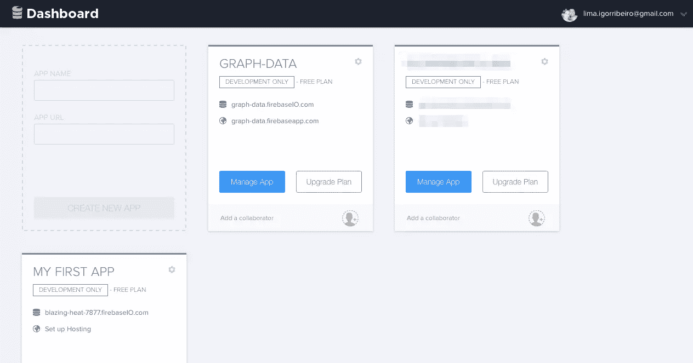
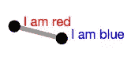
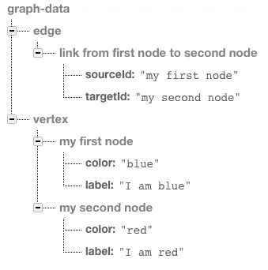
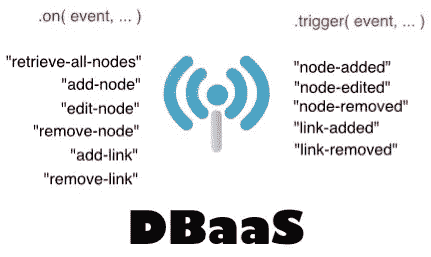
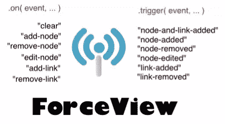
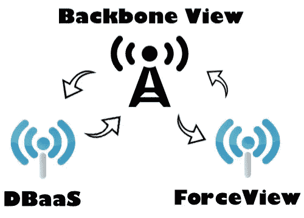
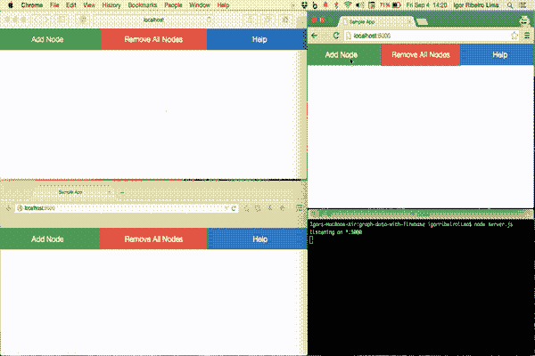

# 使用 Firebase 绘制数据图表

> 原文：<https://www.sitepoint.com/graph-data-with-firebase/>

*这篇文章由 [Thomas Greco](https://www.sitepoint.com/author/tgreco/) 和 [Edwin Reynoso](https://github.com/eorroe) 进行了同行评审。感谢 SitePoint 的所有同行评审员使 SitePoint 的内容尽可能做到最好！*

在我之前的一篇名为[“用 Backbone.js 和 Socket.io 构建 Web 应用”](https://www.sitepoint.com/build-a-web-app-with-backbone-js-and-socket-io)的文章中，我解释了如何使用 Backbone.js 和 Socket。IO 来实现异步消息传递范式以避免耦合。

该教程背后的想法是将彼此高度依赖的代码组分开，我展示的例子是一个[图形可视化工具](https://pubsub-example-with-backbone.herokuapp.com/)，其中数据在用户之间完美地同步。

在这篇文章中，我将重用我的主干例子来将现有的数据存储迁移到 [Firebase](https://www.firebase.com/) 。在深入主题之前，我们先快速了解一些 Firebase 概念，然后开始编码。

## 重火力点

Firebase 是一个用于构建移动和 web 应用程序的平台。它提供三种服务:

*   **用户认证**，这是一个只用客户端代码来认证用户的工具
*   **实时数据库**，一个用于存储和同步数据的实时 JSON 数据库
*   **静态托管**，生产级静态资产托管

这些服务负责处理复杂的事情，并为我们做后端的艰苦工作。此外，Firebase 应用程序可以直接从客户端访问。

实时数据库服务基本上是一个 NoSQL JSON 数据库，如 [MongoDB](https://www.mongodb.com/) 。它有几个特性，比如离线支持、数据验证和安全规则。我个人认为最有趣的功能是*实时数据同步*。如果数据库发生变化，数据将在所有连接的客户端之间实时同步，所有同步都在几毫秒内完成。这意味着我们正在处理一个伟大的工具，期望不可思议的低成本来创建非常响应的应用程序。

### Firebase 入门

开始使用 Firebase 的第一件事是[注册一个免费帐户](https://www.firebase.com/signup/)并创建一个新的 Firebase 应用程序。创建应用程序后，它应该有其唯一的数据库 URL，以“firebaseio.com”结尾。这是我们将用于存储和同步数据的 URL。


要安装并开始使用这个新的应用程序，在你的 HTML 文件中包含 Firebase 客户端库。通过在`<body>`部分的末尾添加一个`script`标签来实现:

```
<script src="https://cdn.firebase.com/js/client/2.3.2/firebase.js"></script>
```

要从数据库中读取和写入数据，需要创建一个对 Firebase 应用程序的引用。这是通过将 Firebase 应用程序 URL 传递到`Firebase`构造函数中创建的:

```
var myFirebaseRef = new Firebase("https://.firebaseio.com/");
```

此引用不会创建到服务器的连接或开始下载数据。Firebase 在调用读或写操作之前不会获取数据。一旦检索到它，它将一直缓存在本地，直到最后一个事件侦听器被删除。

另一件有趣的事情是，您还有机会直接访问数据中的子节点。要从现有的引用中指向任何子元素，只需使用 [`child()` API 调用](https://www.firebase.com/docs/web/api/datasnapshot/child.html):

```
var myFirebaseRef = new Firebase('https://graph-data.firebaseio.com');
var vertexRef = myFirebaseRef.child('vertex');
```

一旦创建了引用，就可以使用`set()`将任何有效的 JSON 对象写入其中。

```
var myFirebaseRef = new Firebase('https://graph-data.firebaseio.com');
var vertexRef = myFirebaseRef.child('vertex');
var firstNode = vertexRef.child('my first node');
firstNode.set({
  color: 'blue',
  label: 'I am blue'
});
```

要从该参考中读取数据，使用`on()`方法。附加一个回调并处理结果事件。

```
var myFirebaseRef = new Firebase('https://graph-data.firebaseio.com');
var vertexRef = myFirebaseRef.child('vertex');
var firstNode = vertexRef.child('my first node');
firstNode.on("value", function(snapshot) {
  console.log( snapshot.val() );
  // logs "Object {color: 'blue', label: 'I am blue'}"
});
```

## 数据建模中的图形

这一节是关于使用 Firebase 的图形建模。如果您不熟悉图的概念，这将是一个很好的机会来浏览它。另一方面，那些已经知道我在说什么的人，不会发现任何困难。

很简单，图是一种建模许多对象之间复杂关系的方法。一个图是由**个节点**(也称为*个顶点*)和**条边**(也称为*条链接*)组成的集合。一个节点仅仅是一个抽象的数据点，它可以代表任何东西，比如一个人、一台计算机、一座建筑物或一个十字路口。一条边连接两个节点，可以选择是有方向的。信息只单向流动。

下面是一个简单图表的例子:



在这种情况下，我们有两个节点(蓝色和红色)和一条连接这两个节点的边。它在代码中是什么样子的？在关系数据库中，我们可能会将图的顶点存储在一个表中，而将边存储在另一个表中。每条边的起始顶点都有一个外键，结束顶点也有一个外键。例如，要在 Firebase 这样的数据库中存储图形，我们可以将*顶点*存储在子属性值中，将*边*存储在另一个属性值中。每条边的起始顶点都有一个关键点，结束顶点也有一个关键点。

请注意，我正在分享我的数据库网址。在你学习的时候，请随意使用它。之后，使用您在 Firebase 账户页面上创建的凭证。

```
var myFirebaseRef = new Firebase('https://graph-data.firebaseio.com');
var vertexRef = myFirebaseRef.child('vertex');
var edgeRef   = myFirebaseRef.child('edge');

var firstNode = vertexRef.child('my first node');
var secondNode = vertexRef.child('my second node');
var myLink = edgeRef.child('link from first node to second node');

firstNode.set({
  color: 'blue',
  label: 'I am blue'
});

secondNode.set({
  color: 'red',
  label: 'I am red'
});

myLink.set({
  sourceId: 'my first node',
  targetId: 'my second node'
});
```

下面的数据结构显示了 Firebase 如何存储这些数据:



## 实际例子

这个例子有两个小部分。一个用于绘制有向图，另一个用于存储数据。第一部分使用了一个图形可视化工具，名为 [Force Editor](http://bl.ocks.org/rkirsling/5001347) ，这是一个图形工具，使用户能够以简单、直观和令人愉快的方式创建图形。第二部分使用 Firebase 实现 web 客户端之间的实时双向通信。

这两个小部分通过接口相互通信。每个组件都提供了一个接口，指定另一个组件可以使用哪些服务以及如何使用。这个接口是一个避免了解内部实现的签名。目标是避免依赖性。基于此，我们来看看下面的图片，看看这些界面:





有了这两个小部分，我们可以很容易地将它们聚集在一个主干视图中。该视图是 ForceView 和 DBaaS 之间的中介。现在我们已经走上了正确的道路，我们可以让这些小部件完美地结合在一起。它处理一组封装的行为，通过一个众所周知的接口来访问功能。下图展示了视图和这两个模块之间的交互。



## 运行和部署示例

Github 上有完整的代码[。您只需通过在 CLI 上运行以下命令来克隆存储库:](https://github.com/sitepoint-editors/graph-data-with-firebase)

```
git clone https://github.com/sitepoint-editors/graph-data-with-firebase.git
```

或者，您可以[下载代码](https://github.com/sitepoint-editors/graph-data-with-firebase/archive/master.zip)作为 zip 文件。

然后，您必须执行`npm install`命令来安装所有的依赖项。最后，执行`node server.js`来启动应用程序。一旦完成，前往`http://localhost:5000`到[看它在](https://graph-data.firebaseapp.com/)的行动！



我们不再担心为我们的应用程序雇佣一个虚拟主机。我们只需要一个命令来初始化应用程序，另一个命令用于发布更改，这就完成了。默认情况下，Firebase 通过安全连接托管我们的应用程序。

要将应用程序的所有静态文件(HTML、CSS、JavaScript 等)部署到 web，请通过 npm 下载 firebase-tools:

```
npm install -g firebase-tools
```

然后运行命令`firebase init`进入项目目录。通过这样做，它在根目录中创建了一个名为`firebase.json`的设置文件。一旦完成，我们就可以使用`firebase deploy`命令开始运行了。

## 结论

在本文中，我们深化了一些关于 Firebase 的主题，并快速浏览了一些主要概念。然后，我们重用了上一篇文章中解释的主干示例，将现有的数据存储迁移到 Firebase。我希望你喜欢这个教程，并发现它很有趣和有用。

如果您有任何问题或疑问，欢迎在下面的部分提问或评论。

## 分享这篇文章