# 在 Illustrator 和 Freehand 文章中创建矢量图形

> 原文：<https://www.sitepoint.com/graphics-illustrator-freehand-2/>

## 使用路径和钢笔工具

对于矢量图形新手来说，熟悉钢笔工具通常需要一段时间。与纸笔涂鸦(或者说，在典型的绘图程序中使用铅笔或画笔类型的工具)不同，在纸笔涂鸦中，手(或鼠标)引导绘制路径，钢笔工具基于一系列点及其相应的“方向线”(Illustrator 术语)或“手柄”(Freehand 术语)来创建形状。

使用铅笔或画笔工具绘制复杂的形状通常需要单击一次以开始绘制形状，然后按住鼠标按钮，拖动鼠标以跟随形状的线条。使用钢笔工具绘制相同的形状涉及一系列的单击和拖动，以设置锚点和定义曲线方向。这听起来很复杂，但是一旦你掌握了窍门，你就再也不会回头了！

选择钢笔工具，使用它:

插画师: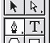

徒手: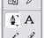

在文档上单击一次，然后移动光标并再次单击。这将创建一条连接两点的线。

通过再次单击，您可以开始创建形状:

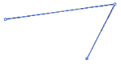

要“关闭”路径以实际制作形状，请将光标移动到原点。当光标变成带小圆圈的钢笔形状时，单击该点，该形状将被封闭。如果光标没有变化，这意味着您没有完全在原始点的顶部，因此您将最终只是创建另一个点，而没有关闭形状。

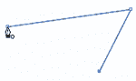

到目前为止你学到了什么:

1.  用钢笔工具点击创建*角点*。

3.  每次新的单击都会创建一条与前一个点相连的线段。

5.  将光标移回原点并点击将*关闭*路径以创建一个形状。

现在，让我们继续看曲线。

使用相同的钢笔工具，单击一次创建一个开始的“角”点。然后，再次单击，但这一次，按住鼠标并拖动。会形成一条曲线。您可以继续按住并向不同方向拖动，以查看曲线是如何受到影响的。产生的切线可以称为“方向线”或“手柄”

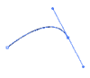

放置下一个点的位置将影响最终曲线的形状，如下例所示:

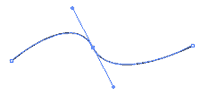

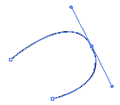

黑色箭头工具选择整个路径(以便您可以四处移动并调整其大小)。使用“白色箭头工具”(在 Illustrator 中称为直接选择工具，在 Freehand 中称为子选择工具)来调整各个点和方向线。

插画师: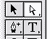

徒手: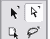

使用白色箭头工具，选择曲线上要调整的点:

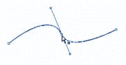

现在，抓住一个方向线手柄，然后拉。你会看到曲线调整；整条曲线移动，使方向线保持与曲线相切。将手柄向外拖得越远，您拉动的曲线侧越明显。

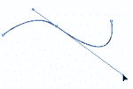

在另一个示例中，您可以看到拉出两个手柄如何使曲线“变宽”

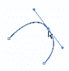

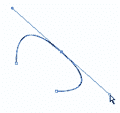

白色箭头工具也可用于移动各个点:

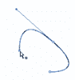

现在，您还知道如何:

1.  使用钢笔工具创建曲线点(通过单击和拖动)。

3.  使用白色箭头工具调整点和方向线。

但是你可以用更多的方式来处理路径…

## 其他路径工具的快速浏览

您可以向现有路径添加点。在 Illustrator 和 Freehand 中，首先选择要添加点的路径，然后用钢笔工具将鼠标悬停在该路径上。您会看到光标变成一个带加号(+)的笔。单击一次，将添加一个新点，方向手柄沿着现有曲线。(Illustrator 还有隐藏在钢笔工具后面的“添加锚点工具”，它可以做同样的事情，但不需要您先选择路径。)

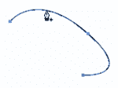

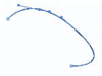

在 Illustrator 中，要删除锚点，您也可以使用钢笔工具将鼠标悬停在某个点上，直到光标变为带有减号(-)的钢笔。点击一次，锚点将被删除。同样，Illustrator 有一个单独的删除锚点工具，隐藏在钢笔工具后面。

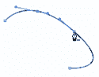

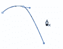

Illustrator 中的钢笔工具后面还隐藏了转换方向点工具，它看起来像一个插入符号，或者只是箭头的角度部分。

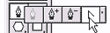

使用该工具时，点击一个曲线点**会将**转换成一个角点；单击并拖动角点会将它们转换成曲线点。在下图中，我们将一个曲线点转换成了一个角点。

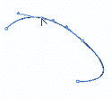

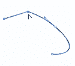

Freehand 已经将这些功能整合到钢笔工具中。在 Freehand 中，当您选择钢笔工具并将鼠标悬停在现有点上时，您会看到光标变为一只钢笔，其插入符号与 Illustrator 中用于转换方向点工具的插入符号相同。这与 Illustrator 中的工具功能相同，并且**将**曲线点转换为角点(反之亦然)。

单击点一次转换后，光标会变成带减号的笔，让您选择**完全删除**点。(与 Illustrator 的上述说明形成对比，在 Illustrator 中，您实际上为那些不同的功能选择不同的工具。Freehand 将所有这些工具合二为一。)

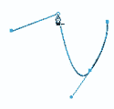

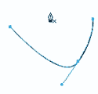

你可能想对路径做的另一件有用的事情是**剪切**它。在 Illustrator 中，剪刀和刀具工具允许您剪切路径和形状。在 Freehand 中，刀具工具结合了这两种功能。听起来很复杂？可以是…

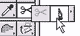

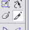

Illustrator 剪刀工具和徒手刀工具的作用相同:将路径切割成碎片。要使用其中任何一种，请选择该工具，然后单击路径上的任意位置。你会注意到看起来像是在路径上添加了一个点。有什么大不了的，对吧？如果你使用白色箭头工具移动物体，你会发现实际上你有两条线段:

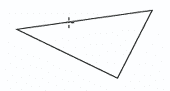

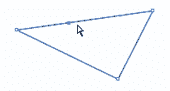

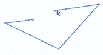

Illustrator 的刀具工具允许您将一个形状分成两个不同的形状。只需用黑色箭头工具选择形状，然后，用小刀工具，画一条分割线——直线或曲线——形状就会沿着相应的路径分成两部分！

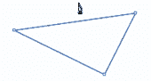

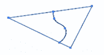

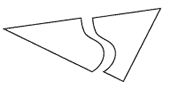

要在 Freehand 中实现相同的功能，双击刀具工具进入选项，并选中“关闭切割路径”选项。

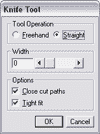

它们是操纵路径的基础。在下一节中，我们将带您一步一步地通过一个简单、实用的例子，在这个例子中，您可以应用所有的新知识…甚至在这个过程中学习更多的技巧！

## 使用路径的简易徽标

假设您为 Gateway 工作，您需要复制 Gateway 的“spotted-g”徽标:

*Gateway 和带斑点的 G Gateway 徽标是 Gateway，Inc .的商标。我们在此使用它们仅出于说明目的，无意侵犯商标。*

使用 Illustrator 或 Freehand，这将是相当容易的！

首先，使用钢笔工具创建基本形状。

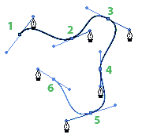

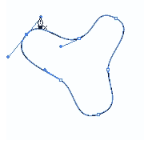

形状显然不是很完美，所以我们将使用白色箭头工具来调整线条和点…

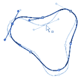

注意:完美主义者可以采取许多额外的步骤来获得完美的弯曲三角形。例如，您可以先使用多边形工具创建一个三边三角形，然后使用转换方向工具来“弯曲”这些点。在 Freehand 中，您可以通过将三角形的对象属性修改为具有弯曲的角来跳过这一步。然后，您可以使用钢笔工具(或添加锚点工具)在现在弯曲的三角形的边上再添加三个点。这些点可以手动“向内”移动，或者使用白色箭头工具仅选择这三个侧点，然后使用缩放工具将它们移向中心。也许你想尝试这个过程；出于本教育教程的目的，徒手做事——没有双关语——很好。

现在，使用椭圆工具创建一个圆。这里还有一个提示:要画一个完美的圆或正方形，在你画的时候按住 Shift 键。在大多数图形程序中，按住 shift 键通常会“限制”移动。我们还按住 Alt 键(Mac-Option 键)从中心而不是从角落画圆。

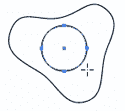

创建另一个圆，以第一个圆为中心。

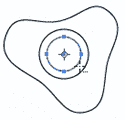

注意:有很多方法可以让你在两个圆圈之间创建一个圆圈。在 Illustrator 中，一种方法是绘制两个圆，然后单击其中一个圆的中心，并将其移动到其他圆的中心。当你足够靠近时，你会注意到上面的圆“咬合”到另一个圆的中间。此方法适用于其他具有“中心”的多边形另一种在 Illustrator 和 Freehand 中都有效的方法是选择两个圆，然后使用对齐调板对齐圆心。还有一种方法是绘制第一个圆，选择它，然后切换到缩放工具。按住 Shift 键以保持一个正圆，然后开始拖移以制作一个较小的圆。拖移时按住 Alt (PC)或 Option (Mac)键…然后放开鼠标。按住 Alt/Option 键可以复制对象，这对于其他用途来说是一个有用的技巧。

现在，使用矩形工具制作标志的长矩形部分。

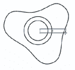

有了基本的形状，我们将首先用黑色填充弯曲的形状。在 Illustrator 中，选择形状，然后在工具调板中，单击“颜色”按钮，用颜色填充形状。

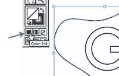

在 Freehand 中，选择形状，然后使用颜料桶颜色下拉列表为形状填充颜色。

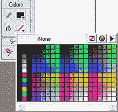

你也可以去掉轮廓(笔画)。在 Freehand 中，使用铅笔下拉菜单(油漆桶上方)选择“无颜色”选项。在 Illustrator 中，首先单击描边图标(轮廓框)，然后单击“无颜色”选项。

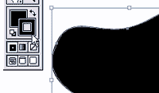

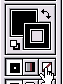

此时，通过在 Illustrator 中按 Ctrl-3 (PC)或 Command-3 (Mac)，或者在 Freehand 中转到“视图”>“隐藏选区”,隐藏曲线形状。这将使我们能够不受干扰地处理其他图形。

好了，现在是处理其他形状的时候了:使用刀具工具在矩形上下一点的位置切割圆形路径。

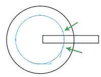

使用黑色箭头工具选择切割段并将其删除。

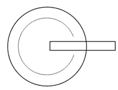

对另一个圆做同样的动作。

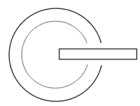

现在，使用钢笔工具连接形状的端点。

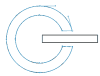

为了说明有很多方法可以实现，下面是在 Illustrator 中实现相同效果的另一种方法:

首先，用黑色填充较大的圆圈(这样你更容易看到)。

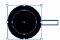

选择两个圆:使用黑色箭头工具并拖动圆的角，使两个圆都被选中。在 Illustrator 中打开 Pathfinder 调色板。选择“减正面”命令。这两个圆将组合成一个甜甜圈形状。

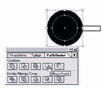

现在，使用刀具工具在矩形的上方和下方的环形上剪出两条线。

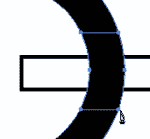

选择新的剪切块并按 Backspace 删除它。

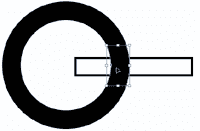

效果一样；不同的方法！

我们快到了！选择两个形状，并将填充颜色设置为白色。

最后，取消隐藏曲线形状。在 Illustrator 中，按 Ctrl-Alt-3 (PC)或 Command-Option-3 (Mac)。在 Freehand 中，转到“视图”>“显示全部”。黑色的曲线形状会重新出现，标志就完成了！

## 摘要

在这个冗长的教程中，您学习了:

1.  光栅图形和矢量图形的区别

3.  如何在 Illustrator 和 Freehand 中制作基本形状

5.  如何使用黑色箭头选择对象并拖动其角手柄来调整形状的大小

7.  如何使用钢笔工具创建角点(通过单击)

9.  每一次新的点击都会创建一条与前一点相连的线段

11.  将光标移回原点并单击会关闭路径以创建形状

13.  如何使用钢笔工具创建曲线点(通过单击和拖动)

15.  如何使用白色箭头工具来调整点和方向线

17.  如何使用钢笔工具及其衍生工具添加、删除和转换点

19.  如何使用剪刀和/或刀具

21.  如何使用 Shift 键制作完美的圆形或正方形

23.  如何对齐两个圆使它们居中

25.  如何在移动对象以复制对象时使用 Alt 键

27.  如何更改对象的填充和描边颜色

29.  如何“隐藏”和“取消隐藏”对象

这些概念中的许多可以在其他使用矢量图形的图形程序中移植。例如，您会发现 Photoshop、Freehand 和 Flash 都有与 Illustrator 和 Freehand 几乎相同的矢量/路径工具。

快乐矢量！

如果你喜欢读这篇文章，你会喜欢[可学的](https://learnable.com/)；向大师们学习新技能和技术的地方。会员可以即时访问 SitePoint 的所有电子书和互动在线课程，如[插画基础](https://learnable.com/courses/illustrator-basics-60)。

**Go to page:** [1](/graphics-illustrator-freehand) | [2](/graphics-illustrator-freehand-2/)

## 分享这篇文章