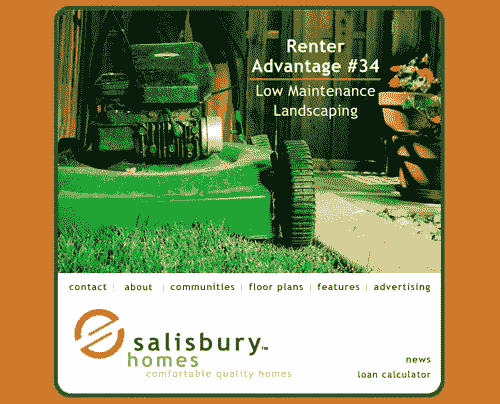
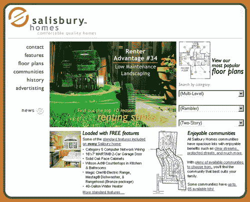

# 伟大的主页真的很烂

> 原文：<https://www.sitepoint.com/great-homepages-really-suck/>

如果没有吸尘器，我们今天会怎样？

真空是一项了不起的发明。它会吸走你家的灰尘，并把它放在你想让它去的地方——离开你的地板，放进那个小袋子里。

一个成功的主页就像一个“数字真空”——它吸引用户，远离主页，直接进入网站其他部分的重要内容。

一旦你的网站访问者出现在你的主页上，他们只面临两种选择。要么:

1.  他们通过主页点击到你网站的二级页面，或者
2.  他们点击后退按钮，离开你的网站。

你显然更希望他们点击主页。但是你如何让他们这样做呢？

##### 拉，不要推

让用户更深入地点击你的网站的最好方法是什么？通过拉，而不是推。

你可能听说过“拉技术”和“推技术”这两个术语。我们在[LearnTheNet.com](http://www.learnthenet.com)的朋友告诉我们,“拉技术”指的是允许用户主动寻找信息的技术，而“推技术”描述的是向用户传递信息的技术，通常是定期的，用户不主动寻找信息。

我用这些术语泛指主页向用户传递内容的方式。我见过太多的主页试图通过“喂”给用户一些简单的链接或非常简短的内容来将用户推向网站的其他页面。

我也见过很多很棒的主页成功的拉取而不是推送。一些较好的方法包括:

*   [1-800-Flowers.com](http://www.1800flowers.com/)
*   [Handspring.com](http://www.handspring.com)
*   [Fool.com](http://www.fool.com)
*   [EddieBauer.com](http://www.eddiebauer.com)
*   [Amazon.com](http://www.amazon.com)
*   [REI.com](http://www.rei.com)

这些主页的开发人员知道如何通过让用户从各种链接和内容中进行选择来将用户吸引到他们站点中的重要区域。他们明白，并不是所有的用户都知道他们在寻找什么，人们需要各种方式来收集信息。他们明白并非所有的用户都是一样的。

##### 两种用户

你可能会说我刚刚提到的网站有视觉上“繁忙”的主页。你可能想知道，“这不会让用户感到困惑吗？”

好问题。答案？“不一定。”

原因如下:格里·麦戈文(Gerry McGovern)在他的书《网络内容风格指南》(The Web Content Style Guide)中，报告了一项由著名的帕洛阿尔托研究中心(Palo Alto Research Center)进行的研究，该中心之前名为施乐 PARC(Xerox Japan)。研究发现，75%的网络读者处于“内容收集”模式，而只有 25%的人在搜索特定的文档。

当然，我们不能将这些发现直接应用于所有的网络用户，因为这项研究只涉及网络“读者”。但是这项研究结果的一个松散的应用显示了为什么前面提到的网站在他们的主页上有如此多的内容。是的，有些用户可能正在搜索特定的产品或信息。但是更多的人可能只是浏览内容。

这些发现与雅各布·尼尔森的观点是一致的，即有两种用户:搜索者和浏览者。

一个只有四个链接的主页肯定是容易导航的，所以它适合那些搜索的人。然而，对于那些以内容收集模式浏览的人来说，它没有任何作用。不仅如此，用户还被迫从预先分类的链接中进行选择，如产品、公司信息等。当他们甚至不知道他们在找什么的时候。

例如，看看犹他州本地房屋建筑商网站[RentStinks.com](http://www.rentstinks.com)的主页:

很容易操作，对吧？只要选择一个链接就可以了。

然而，把你自己放在访问该网站的人的位置上:假设你是第一次购房者(在这种情况下，你将是该网站的主要目标受众的一部分)。您可能处于内容收集模式。也许你正在寻找一个三居室、两层楼的房子。

但这就是你想要的吗？家的位置呢？便利设施？你知道什么是“漫步者”吗(当我们开始寻找我们的第一个家时，我不知道！)?或者，也许你只是不确定在家里找什么，甚至不知道为什么你应该选择一个房屋建筑商而不是另一个。

设身处地为用户着想，RentStinks.com 的主页就变得越来越没用了。它试图把你推向平面图、社区等等，而不是把你拉向包含 20 个令人信服的满意顾客的证明的页面，或者说 5 类网络布线是所有家庭的标准功能的页面。更糟糕的是，它在做所有这些事情的时候，几乎没有展示任何它家的照片。

##### 创建一个“糟糕”的主页

创建一个吸引用户的主页比你想象的要容易。在你自己的网站上试一试这三个想法:

***自下而上发展***

也许最难克服的障碍是改变你在精神上和身体上开发网页的方式。大多数开发人员都是从顶层开始，一步一步往下，首先为主页创建内容和设计，然后试图将用户推向网站上的其他页面。

要创建一个吸引人的主页，你需要自下而上地开发，首先为二级页面创建内容。然后决定哪些页面应该被强调，以及在你的网站主页的什么地方放置合适的链接、图片和内容。

斯蒂芬·科维的格言“从最终目标开始”非常适合自下而上的网站开发。确定访问者应该登陆的最终页面，并在你的主页上强调这些页面。

***链接措辞***

什么？你已经创建了你的主页？没问题。一个简单的解决办法是:尝试添加链接，甚至改写现有的链接。

举几个例子:

1.  不要*谈论我们*，试着:

*Find out why we’ve been in business for nearly 50 years*

5.  不要选择*产品*，而是尝试:

*Let us show you how Product X can improve your health tremendously!*

我并不是建议你删除网站上的“关于我们”或“产品”链接。我只是建议你添加其他链接，这些链接可能指向同一个页面或同一个类别的页面，但是在吸引用户方面比推用户更成功。

***别光说，秀出来！***

显而易见的是，不要让你的网站访问者厌烦无休止的文本。给他们足够的视觉享受。如果你出售房屋，在主页上展示平面图和设施。如果你提供网络开发服务，在你的主页上展示一些你的作品。你可以放心，一张图片通常比一句话更容易理解。

如果 RentStinks.com 应用这三个原则，重新设计它的主页会怎么样？结果可能是这样的:

***最后，别忘了针对性内容***

强调几个重要的二级页面，重新措辞几个链接，就足以创建一个“烂”的主页了吗？如果你的站点访问者发现主页内容完全无用怎么办？

凯马特的前网站 BlueLight.com 面临这个问题。该网站的研究团队进行的一项研究揭示了一个惊人的事实:近 50%的网站访问者在点击主页之前就离开了！尽管 BlueLight 的主页有足够的链接和内容，但这些信息对一半的访问者来说显然是没有用的。

BlueLight.com 是如何纠正这个问题的？他们创建了八个有针对性的主页，每个主页都根据访问者的喜好来显示。当访问者返回网站时，他们不仅看到各种各样的内容，而且这些内容也是有针对性的。

看看你网站的统计数据，你可能会看到和 BlueLight.com 看到的一样的东西。如果你不记得这篇文章中的其他内容，请记住这一点:永远不要认为你的访问者会点击主页。由于某种原因，他们已经到达了你的站点。现在给他们几个引人注目的选择，鼓励他们在有机会点击后退按钮之前进一步点击网站。

这篇文章是否涵盖了创建一个吸引人的主页所需要知道的一切？当然不是。但这是一个开始。尝试一下这些建议，你就可以创建一个真正“糟糕”的伟大主页了。

##### 参考书目和补充读物

在本文的编写过程中使用了以下资源:

内容一定要吸:用 Jared Spool
[拉用户进来 http://www . web review . com/2000/06 _ 09/developers/06 _ 09 _ 00 _ 2d . shtml](http://www.webreview.com/2000/06_09/developers/06_09_00_2d.shtml)

学网
[http://www.learnthenet.com](http://www.learnthenet.com)

RentStinks.com(当前网站)
[http://www.rentstinks.com](http://www.rentstinks.com)

斯坦福说服技术实验室
[http://captology.stanford.edu](http://captology.stanford.edu)

《网页内容风格指南》，格里·麦戈文
[http://www.gerrymcgovern.com/guide_design_3.htm](http://www.gerrymcgovern.com/guide_design_3.htm)

UseIt.com
[http://www.useit.com](http://www.useit.com)

用户界面工程，贾里德·斯波尔
[http://www.uie.com](http://www.uie.com)

## 分享这篇文章