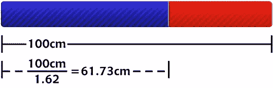
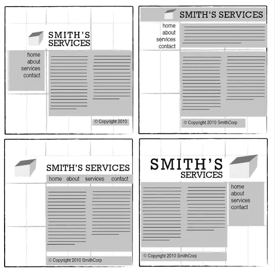
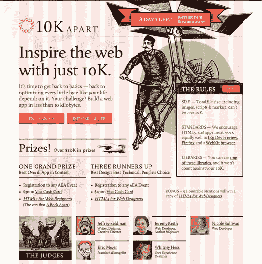

# 网格理论

> 原文：<https://www.sitepoint.com/grid-theory/>

当大多数人想到网格时，他们会想到工程和架构。然而，网格也是图形设计的重要工具，在过去的几年里，网格在网站设计中的使用越来越流行。

使用网格不仅仅是让页面上的元素呈方形并排成一行:它还与比例有关。这就是网格理论的由来。许多艺术史学家认为荷兰画家皮特·蒙德里安是平面设计之父，因为他对网格的巧妙运用。然而经典的网格理论已经影响了成功的艺术作品数千年。划分组成元素的概念可以追溯到毕达哥拉斯及其追随者建立的数学思想，他们将数字定义为比率而不是单一单位。

毕达哥拉斯学派观察到了一种在自然界中经常出现的数学模式，他们认为这是受到了神的启示。他们把这种模式称为黄金比例或黄金比例或神圣比例。基本思想如图 1.6“黄金比例”所示。

图 1.6，“黄金比例”

一条线可以用黄金分割率除以 1.62。这个神奇的 1.62 数字实际上是 1.6180339 …，一个通常用φ(读作 phi)表示的无理数。解释得出这个数字所用的数学方法对这个讨论来说有点太复杂了，而且可能对你成为一个更好的设计师没有真正的帮助，所以我就不赘述了。另外，我的数学有点生疏了。

那么这个比例和平面设计有什么关系呢？一般来说，由黄金分割比例的线条分割的作品被认为是审美愉悦的。文艺复兴时期的艺术家使用神圣的比例来设计他们的绘画、雕塑和建筑，就像今天的设计师在设计版面、海报和小册子时经常使用这个比例一样。神圣的比例并不依赖于艺术概念，而是给了我们产生吸引人的布局的逻辑指导。

这棵向日葵是自然界中黄金比例的一个例子，如图 1.7“自然界中的黄金比例”所示。向日葵中心的直径向日葵的总直径，包括花瓣，除以φ。

图 1.7。自然界的黄金比例

## 4.1.三分法

黄金比例的简化版是三分法。被黄金分割的直线被分成两段，其中一段大约是另一段的两倍大。将一篇作文分成三份是一种不用计算器就能运用神圣比例的简单方法。

对于快速布局实验，我喜欢从用铅笔和纸画一堆简单的三分法网格开始。只需画一个矩形，将其水平和垂直分成三份，然后在每条垂直线之间画一条线，以创建六列在其中工作。

有了这个简单的网格，我们就可以开始布置我们的元素了。原始的大矩形代表我们在“[网页剖析](https://www.sitepoint.com/web-page-anatomy/)中谈到的容器。当使用这种布局设计方法时，我喜欢先放置最大的块。通常，该块代表内容。在我的第一个三分规则网格中，我将内容块放在右下角布局的三分之二内。接下来，我将导航块放在左侧栏的中间三分之一处。我将标识块的文本部分放在内容的左侧，将标识的图像部分放在菜单上。最后，我挤压了内容下面的版权块，在网格的右栏中。结果是图 1.8 左上角显示的四种可能的布局安排，“遵循三分法则的网格中的四种布局”。

图 1.8。遵循三分法的四种网格布局

这些最初的草图提供了一个快速浏览什么样的总体布局方法可能适合你的网站。但是，没有必要就此打住——基于网格的设计在网络上越来越受欢迎，这激发了许多关于在网格上设计网站的优秀文章和工具。

## 4.2.960 网格系统

我最喜欢的设计网站组件的工具之一是纳森·史密斯 960 网格系统的模板和草图。受网页设计师 Khoi Vinh 和 Mark Boulton 文章的启发，960 Grid 系统主要是一个 CSS 框架。模板的宽度来自卡梅伦摩尔的一篇文章。在考虑 1024 像素宽的显示器的宽度时，Moll 选择了 960 像素，并指出这个数字可以被 3、4、5、6、8、10、12、15 和 16 整除，这是网格的理想宽度。Nathan 将这些想法结合到一个框架中，创建了三个布局基础:一个有 12 列，一个有 16 列，一个有 24 列。我个人更喜欢使用 12 列的模板，因为它们可以让我轻松地将内容分成四等份，三等份，六等份。

当您为自己的布局尝试不同的排列时，使用您选择的任何网格的列作为标识、导航、内容和页脚块的对齐参考线。将你的所有元素安排在同一个或两个区块内是很诱人的，但是要尽量避免这种情况——这在视觉上不是很有趣。相反，可以考虑将一些元素放入另一列，或者完全从网格中移除。新设计师对使用网格最大的抱怨之一就是所有的东西看起来都是封闭的、网格状的。对于那些因为这个原因而反对使用网格的人，我要说看一看像 [10K 分离](http://10k.aneventapart.com/)这样的网站，如图 1.9 所示，“10K 分离网站有 16 列网格覆盖”(在下一页)。您看到的红色列来自 16 列 960 Grid 系统模板，并不存在于实际网站中。隐藏这些列后，您可能永远不会意识到这个设计是在网格上创建的。

引用平面设计先驱 Josef Müller-Brockmann(《平面设计中的网格系统》的作者)的话:“网格系统是一种辅助，而不是保证。它允许许多可能的用途，每个设计师可以寻找一个适合他个人风格的解决方案。但是人们必须学会如何使用网格；这是一门需要练习的艺术。”

图 1.9。10K 除了网站与 16 列网格覆盖

我们对结构、网格和理想比例的渴望深深植根于人类本性。“看起来不太对劲”的布局通常可以通过在网格上移动元素和调整大小来解决。因此，如果一个布局不起作用，继续尝试。在某个时候，所有的部分会一起点击，俄罗斯方块升级的声音会在你的脑海中播放。你将获得平衡。

## 美丽网页设计的原则

这篇文章来自杰森·比厄德的 [*美丽网页设计的原则*一书](https://www.sitepoint.com/books/design2/ "SitePoint.com: The Principles of Beautiful Web Design, 2nd Edition")(第二版现已出版)。这是第一章的第四部分。

如果你更喜欢色彩，请务必在设计节上查看现有的[色彩章节的数字化版本。](https://www.sitepoint.com/design-ux/color/ "DesignFestival.com: Everything on Color")

## 分享这篇文章