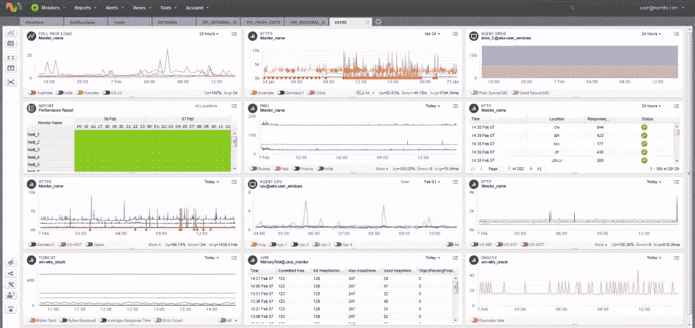

# Web 应用程序监控入门

> 原文：<https://www.sitepoint.com/guide-monitoring-web-applications/>

*本文由[莫尼蒂斯](http://www.monitis.com/?utm_source=SitePoint%20&utm_medium=Aricle&utm_campaign=SitePoint%20Article)赞助。感谢您对使 SitePoint 成为可能的赞助商的支持。*

不管是好是坏，作为开发人员，我们的工作不会随着最后一行代码、最后一次提交或点击“部署”按钮而结束。

即使设计最好的 web 应用程序也不是防弹的，最昂贵的主机环境也不是百分之百可靠的；最终，总会有出错的地方。

我们可以为失败制定计划，在出现问题时制定流程，甚至为真正的灾难制定应急计划，但在此期间，我们可以进行监控。

监控让我们能够做出反应；在出现问题时采取行动，以及积极主动；在问题出现之前采取预防措施。

在本文中，我们将了解网站或 web 应用环境中的监控。在此过程中，我们将详细了解 [Monitis](http://www.monitis.com/?utm_source=SitePoint%20&utm_medium=Aricle&utm_campaign=SitePoint%20Article) ，这是一个一体化监控平台，是该领域的领导者之一，以及它如何帮助确保一旦您启动了您的应用程序，它就能保持运行并继续执行。

## 什么会出错？

为了知道我们应该如何监控以及监控什么，了解什么可能出错是有帮助的。简短的回答可能是“嗯，很多”——因此，这是一个很难明确回答的问题。然而，与此同时，我们可以预见到一系列事情*可能*出错。

概括地说，我们可以将这些问题分为几类:

*   达到“硬”极限；例如磁盘已满、达到物理内存限制或达到最大进程数
*   网络问题；例如，站点变得不可达、高分组丢失、服务器连接中断或 DNS 故障
*   组件或服务故障；例如，您的数据库服务器可能已经关闭。
*   第三方服务的问题；您的 S3 存储桶不可达，您的邮件提供商遇到问题，或者您的 CDN 已关闭
*   您的应用程序有问题；错误和异常，数据中的不一致，甚至代码中的错误
*   保持第三方代码或操作系统组件最新；特别是检查安全补丁或服务包
*   甚至有一些愚蠢的人为错误的例子，唉，仍然发生；例如忘记更新 SSL 证书。

一旦你有了什么可能出错的想法，你就开始有了监视什么的感觉。

## 需要考虑的重要事项

虽然许多监控都涉及服务器响应时间、可用内存量或 CPU 运行水平等指标，但没有什么比用户体验更重要。来自服务器或应用程序的原始数据与用户面临的等待时间之间极有可能存在某种关联——例如，高网络延迟可能意味着响应时间慢，因此用户需要等待您的应用程序加载——通过他们的眼睛来观察您的服务总是值得的。为此，您可以使用许多工具。但是首先，让我们看看我们需要考虑的几件事情。

有一系列因素可以使网站或应用程序根据用户、他们的设备和他们的环境而表现不同。

### 他们使用的是台式机/笔记本电脑还是手机？

不言而喻，移动用户通常会面临与固定或台式机用户截然不同的体验。然而，监视性能变化的程度是值得的。

### 他们有什么样的网络连接？

就硬件和网络限制而言，手机的表现通常不如台式机，网络连接也有很大差异——例如，不是每个人都有基于高速光纤的宽带连接。

### 他们在哪里？

在项目的某个阶段，您可能需要决定服务器的物理位置。虽然一些网站或网络应用程序的目标是非常具体的地理位置，例如英国独有的在线商店、美国商业街连锁店或东京交通枢纽，但网络是全球性的，这意味着人们可以或将要从世界各地访问它。作为一个过于简单的经验法则，访问者离你的服务器越远，就需要花越长的时间来“穿越”网络。

值得看一看你的访问者的驻地——结果可能会让你大吃一惊。例如，科技博客通常在印度非常受欢迎——但你有没有考虑过，比如说，一个美国的服务器如何应对距离问题？

## 监控、数据和警报

监控有两个方面:查看历史数据(“显示过去 24 小时内的平均响应时间和 HTTP 状态代码 4xx”)或实时数据，以及警报。

例如，如果某台服务器上的可用磁盘空间量低于某个阈值，您可以选择接收电子邮件，以便在磁盘空间变满之前采取主动措施。或者，您可以设置一个警报，以便在出现问题时发出警报。例如，如果您的网站变得无法访问，您可以选择通过 Zapier 接收推送通知或警报。

决定警报的参数是一件棘手的事情。例如，你如何知道你的 CPU 负载应该达到多高才值得给你发一封电子邮件呢？

回答这个问题的一个好方法可能是交叉引用各种参数。例如，通过监控响应时间*和* CPU 负载，您可能会发现如果您的 CPU 负载超过 80%,响应时间会变得低得不可接受。

要取得平衡是很困难的。如果警报太频繁，那么很容易对它们失去敏感性。太少的话，你可能会遇到某个地方的用户变得沮丧，服务器宕机或者网站变得无法访问，而你却不知道。学会达到这种平衡本身就是一种技能。

## 介绍 Monitis

Monitis 是一种服务，用于捕获关于服务器健康状况、web 和数据库服务器性能、web 应用程序响应能力等各种数据。

它通过 web 界面(您的控制面板)提供了这些数据的实时视图，如下图所示。

此外，它允许您从用户的角度评估网站或 web 应用程序的性能，无论他们使用什么设备，也无论他们在世界的什么地方。如果出现问题，你可以设置提醒让你知道。让我们快速浏览一下选项。

## 使用 Monitis 智能代理进行服务器监控

为了用 Monitis 监控服务器的健康状况，我们需要安装代理软件。这是一个在后台作为守护进程运行的小程序，监控服务器的总体健康状况，并将数据报告给 Monitis，以便我们可以利用它。参见 [Linux](http://www.monitis.com/support/server-device-monitoring/install-linux-agent/?utm_source=SitePoint%20&utm_medium=Aricle&utm_campaign=SitePoint%20Article) 或 [Windows](http://www.monitis.com/support/server-device-monitoring/install-windows-agent/?utm_source=SitePoint%20&utm_medium=Aricle&utm_campaign=SitePoint%20Article) 文档了解如何安装它。

如果你想快速尝试一下，我建议你用数字海洋创建一个新的 Ubuntu droplet。您应该会发现它开箱即用，所有的依赖项都已经为您安装好了。或者，你也可以看看这本[厨师食谱](https://github.com/monitisexchange/monitis-chef-deployment)。

一旦代理软件安装并运行，您将需要通过 Web 上的 Monitis 仪表板设置监控。我们接下来会看到这一点。

## 应用程序监控

Monitis 还允许您监控应用程序的健康状况。
Monitis 为大多数流行语言提供 SDK——Java、Perl、Python、PHP、Ruby、c#——流行的 web 和应用服务器，如 Apache、Nginx、IIS、Tomcat 和 Node.js，各种数据库服务器，如 MySQL、Postgres、MongoDB 和 SQL Server 等等。你可以在这里找到一个全面的列表[。](http://www.monitis.com/application-monitoring?utm_source=SitePoint%20&utm_medium=Aricle&utm_campaign=SitePoint%20Article)

## 探索 Monitis 仪表板

Monitis 仪表板由一系列面板组成，根据您设置的监控和警报显示各种类型的数据。首次访问控制面板时，它会提供一些提示和一些内联帮助。设置对 CPU 负载、剩余磁盘空间、空闲内存和系统负载等数据以及警报的监控只需几分钟。

一旦你设置好了，你就可以通过拖放操作面板来排列它们，调整它们的大小或者显示和隐藏它们。使用每个面板右上角的下拉(上下文)菜单，您还可以最大化它们以获得更好的视图。
从面板的上下文菜单中，您还可以将监测数据导出为多种格式，如 PSD 或逗号分隔值(CSV ),以及打印或通过电子邮件发送。

settings 菜单项允许您调整参数，这些参数根据被监控的特定指标而变化。例如，您可以设置各种阈值来监视 CPU 级别、空闲内存级别、尝试 HTTP 请求的频率等等。

您还可以创建新的“页面”(选项卡)，允许您根据最适合您需求的标准来划分显示器。例如，您可以为每个服务器设置一个选项卡，在一个“首页”或“摘要”选项卡上显示所有服务的关键指标。

## 其他监控工具

您可以使用许多工具来进一步了解您的 web 应用程序是如何执行的，或者它可能如何对某些事件做出反应。

### 整页加载监视器

许多网络监控系统将为您提供响应时间；例如，“一个特定的 GET 请求需要多长时间？”。尽管这可能有用，但它并没有提供全部情况。

全页面加载监视器更进一步，它不仅能显示下载一个页面需要多长时间，还能显示在真正的浏览器中需要多长时间。这让您从用户的角度，而不仅仅是从 HTTP 响应时间的角度，更好地了解您的网站或应用程序是如何运行的。

为了更好地了解它是如何影响用户体验的，全页监视器通常会提供 [Apdex(应用程序性能指数)](https://en.wikipedia.org/wiki/Apdex)分数。这些不太关注硬性数字——尽管它们确实提供了 0 到 1 之间的数值——而是真实用户体验质量的定性测量——例如“满意”、“容忍”或“沮丧”。

### Web 压力测试

Web 压力测试器允许您在特定的持续时间内模拟大量可配置的请求，以查看您的 web 服务器是如何处理的。这可能有助于确定您的服务器如何处理“[Slashdot 效应](https://en.wikipedia.org/wiki/Slashdot_effect)”(您也可以称之为 Twitter 效应或 Reddit 效应)——换句话说，如果您在短时间内突然收到大量访问，您的 web 服务器会如何处理？为了让你知道你可以期待什么，你可以在这里找到一个样本报告。

### 网站安全扫描

监控安全漏洞也非常重要，在极端情况下，监控恶意软件的注入也非常重要。您将在 Tools 选项卡中找到运行漏洞扫描的选项，您将在这里找到输出示例。

## 摘要

当你遇到危机时，你需要正确的信息来解决问题。但是，即使事情进展顺利，稳定的有用数据流对于理解您的系统和基础设施可能会出什么问题以及您的开发重点应该在哪里也是必要的。

采取正确行动的唯一方法是使用相关、有用和准确的数据，为此，您需要一个像 Monitis 这样强大的监控平台。该服务可以支持大量有用的指标，用于监控您的服务器、应用程序和网络的运行状况。它允许您实时查看服务的状态，检查历史数据以帮助理解它们，并在需要采取行动时提醒您。

渴望给莫尼蒂斯一个尝试？今天就报名参加[他们 15 天的试用期](https://www.monitis.com/sign-up?adv=221246&loc=3&utm_source=SitePoint%20&utm_medium=Aricle&utm_campaign=SitePoint%20Article)。

## 分享这篇文章