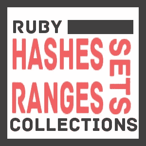

# Ruby 集合指南，II:散列、集合和范围

> 原文：<https://www.sitepoint.com/guide-ruby-collections-ii-hashes-sets-ranges/>



本系列的第一篇文章关注数组和惯用 Ruby 迭代的基础。Array 是一个非常灵活的类，但是对于特定的情况有更好的解决方案。本文涵盖了 Ruby 附带的其他一些集合类型。

## 混杂

有时您需要将一个值映射到另一个值。例如，您可能希望将一个产品 ID 映射到一个包含该产品信息的数组。如果产品 id 都是整数，那么可以用 Array 来实现，但是要冒在 id 之间浪费大量空间的风险。Ruby 哈希表的功能相当于关联数组，其中的键不限于整数。它们类似于 Python 的字典。

### 创造

像数组一样，哈希也有文字和构造函数初始化语法。

```
>> colors = {}
>> colors['red'] = 0xff0000

>> colors = Hash.new
>> colors['red'] = 0xff0000
```

和数组一样，可以用起始值创建一个散列。这就是我们看到惯用的= >(“hash rocket”)操作符的地方。

```
>> colors = {
>>   'red' => 0xff0000,
>>   'blue' => 0x0000ff
>> } 
=> {"red"=>16711680, "blue"=>255}
```

如果你试图访问一个没有值的散列键，它将返回 nil。您可以通过向构造函数传递参数来更改此默认值。

```
>> h = Hash.new
>> h[:blah]
=> nil

>> h = Hash.new(0)
>> h[:blah]
=> 0
```

请注意，访问一个不存在的键并不会创建它。

```
>> h = {}
>> h.size
=> 0
>> h[:blah]
>> h.size
=> 0
```

### 删除

如果想从散列中删除一个密钥对，可以使用`#delete`。像 Lua 表那样简单地将键的值设置为 nil 可能很诱人，但是键仍然是散列的一部分，因此包含在迭代中。

```
>> colors['red'] = nil
>> colors.size
=> 2

>> colors.delete('red')
>> colors.size 
=> 1
```

### 循环

散列像数组一样被迭代，除了传递给块的是两个值而不是一个。

```
>> hash = {"Juan" => 24, "Isidora" => 35}
>> hash.each { |name, age| puts "#{name}: #{age}" }
Juan: 24
Isidora: 35
```

上例中的块变量`name`和`age`只是占位符。它们是任意的，可以是任何东西，尽管最好是描述性的。

### 哈希火箭还是不哈希火箭

使用符号作为散列键很流行，因为它们像字符串一样具有描述性，但像整数一样快速。

```
>> farm_counts = {
>>   :cow => 8,
>>   :chicken => 23,
>>   :pig => 11,
>> }
=> {:cow=>8, :chicken=>23, :pig=>11}
```

从 Ruby 1.9 开始，键是符号的散列可以在没有散列火箭(= >)的情况下构建，看起来更像 JavaScript 或 Python。

```
>> farm_counts = {
>>   cow: 8,
>>   chicken: 23,
>>   pig: 11
>> }
=> {:cow=>8, :chicken=>23, :pig=>11}
```

这两种风格都很常见，但要记住的一点是，所有其他键类型仍然使用散列火箭，所以在代码的一部分使用冒号可能会让新手感到困惑。

### 带哈希的关键字参数

Python 提供了使用关键字参数调用函数的能力，没有必要以特定的顺序传递参数或者传递任何特定的参数。虽然 Ruby 在技术上不提供关键字参数，但是可以使用散列来模拟它们。如果散列是方法调用中的最后一个参数，则可以去掉花括号。

```
>> class Person
>>   attr_accessor :first, :last, :weight, :height

>>   def initialize(params = {})
>>     @first = params[:first]
>>     @last = params[:last]
>>     @weight = params[:weight]
>>     @height = params[:height]   
>>   end
>> end

>> p = Person.new(
>>   height: 170cm,
>>   weight: 72,
>>   last: 'Doe',
>>   first: 'John'
>> )
```

请注意，`params = {}`并不是绝对必要的，但是如果没有传递参数，它可以防止您的代码抛出`ArgumentError`,并且使预期的参数类型更加清晰。

### 带有数组字段的较小散列

有人想到了一个好主意，用数组类做一个[更简单的散列。](https://github.com/ahoward/arrayfields)

```
$ gem install arrayfields

>> require 'arrayfields'
>> h = ArrayFields.new
>> h[:lunes] = "Monday"
>> h[:martes] = "Tuesday"
>> h.fields
=> [:lunes, :martes]
>> h.values
=> ["Monday", "Tuesday"]
```

我不太熟悉 arrayfields gem，也不太了解它如何应用于不同的 Ruby 实现，但是它在 Ruby Toolbox 上非常流行，如果你要序列化大量的散列数据，它可能值得一试。

## 设置

如果您需要一个顺序无关紧要的集合，并且元素保证是惟一的，那么您可能需要一个集合。

与其他集合类型不同，您必须添加 require 语句才能使用 Set 类。

```
>> require 'set'
```

此外，与数组和哈希不同，Set 没有任何特殊的文字语法。但是，您可以将一个数组传递给`Set#new`。

```
>> s = Set.new([1,2,3])
=> #<Set: {1, 2, 3}>
```

或者，你可以使用`Array#to_set`。

```
>> [1,2,3,3].to_set
=> #<Set: {1, 2, 3}>
```

Set 像 Array 一样使用了`<<`运算符，但是使用了`#add`而不是`#push`。

```
>> s = Set.new
>> s << 1
>> s.add 2
```

要从集合中删除一个元素，使用`#delete`方法。

```
>> s.delete(1)
=> #<Set: {2}>
```

与 Array 一样，`#include?`可以用于成员测试。

```
>> s.include? 1
=> false
>> s.include? 2
=> true
```

Set 的一个有用特性是它不会添加已经包含的元素。

```
>> s = Set.new [1,2]
=> #<Set: {1, 2}> 
>> s.add 2
=> #<Set: {1, 2}>
```

前面我指出 Array 可以执行布尔运算。自然，Set 也可以做到这些。

```
>> s1 = [1,2,3].to_set
>> s2 = [2,3,4].to_set

>> s1 & s2
=> #<Set: {2, 3}>

>> s1 | s2
=> #<Set: {1, 2, 3, 4}>
```

与 Array 不同，它还可以使用`^`操作符进行异或运算。

```
>> [1,2,3] ^ [2,3,4]
=> NoMethodError: undefined method `^' for [1, 2, 3]:Array

>> s1 ^ s2
=> #<Set: {4, 1}>
```

## 范围

我在第一部分已经指出了 Range。Range 类是一种准集合。它可以像其他使用 Enumerable 的集合一样被迭代，但是它不是任意元素的容器。

```
>> r = Range.new('a', 'c')
=> 'a'..'c'
>> r.each { |i| puts i }
a
b
c
```

之前，我展示了范围可以对数组进行切片，或者为遍历数组生成索引。

```
>> letters = [:a,:b,:c,:d,:e]
>> letters[1..3]
=> [:b, :c, :d]

>> (1..3).map { |i| letters[i].upcase }
=> [:B, :C, :D]
```

除了对数组进行切片，范围还可以简化 case 语句逻辑。

```
>> def theme(year)
>>   case year
>>     when 1970..1979 then "War Bad, Black People Not Bad"
>>     when 1980..1992 then "Cocaine, Money, and The Future"
>>     when 1993..2000 then "Gillian Anderson, Sitcoms in The FriendZone, and AOL"
>>     when 2000..2013 then "RIP, Music"
>>   end
>> end

>> theme(1987)
=> "Cocaine, Money, and The Future"
```

还有[这个关于生成随机字符串的 stackoverflow 问题](http://stackoverflow.com/questions/88311/how-best-to-generate-a-random-string-in-ruby)，它得到了一些很好利用范围的答案。

```
>> (0...10).map{ ('a'..'z').to_a[rand(26)] }.join
=> "vphkjxysly"
```

## 结论

它涵盖了散列、集合和范围。在下一篇文章中，我将讨论 Enumerable、Enumerator 以及使用这些工具可以做的一些简单的事情。

## 分享这篇文章